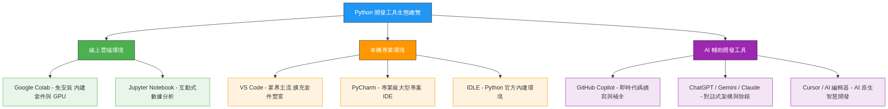
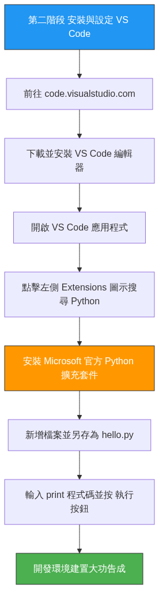

# **Ch01 導論**

## **1.1 程式語言：驅動現代世界的基礎能力**

在數位化浪潮席捲全球的今天，程式語言已不再是軟體工程師的專利，而是如同閱讀與寫作一樣，成為一種橫跨各領域的**基礎素養**與**核心能力**。它是一種教我們如何思考的工具，一種將創意具現化的力量。

> **「這個國家的每一個人都應該學習如何寫程式，因為它教你如何思考。」**
>
> — 史蒂夫·賈伯斯 (Steve Jobs), 蘋果公司聯合創辦人

學會寫程式，意味著你掌握了與機器溝通、自動化解決問題，以及創造新價值的關鍵能力。

### **1.1.1 程式碼：日常生活中的隱形架構**

我們常常忽略，程式碼早已像空氣和水一樣，滲透到生活的每個角落，支撐著現代社會的運作。這些由程式驅動的系統，在我們看不見的地方，默默地發揮作用：

* **早晨的通勤路上**：當你使用導航 App 規劃避開壅塞的路線時，背後是複雜的演算法在即時分析數萬筆交通數據，為你計算最佳路徑。你行經的智慧交通號誌，也可能正透過程式讀取車流感測器，動態調整紅綠燈的秒數，以疏導車流。

* **串流影音的夜晚**：當你在 Netflix 或 YouTube 上看完一部影片，系統立刻推薦了幾部你可能會喜歡的內容。這並非巧合，而是推薦系統演算法分析了你過去的觀看紀錄、偏好類型，甚至是你暫停、快轉的行為，從而進行的個人化預測。

* **商店的結帳櫃台**：無論是超市的自助結帳機，還是餐廳的點餐 POS 系統，都由程式碼所驅動。從掃描商品條碼、計算金額、串接信用卡支付系統，到最後更新庫存，每一個環節都是自動化程式執行的結果。

程式碼無所不在，它構成了我們日常體驗的隱形架構。理解它，就是理解我們身處的這個現代世界。


### **1.1.2 程式語言在各大領域的應用**

程式設計的價值體現在它能為各行各業賦能，解決該領域的獨特挑戰：

* **科學研究**：從物理學的粒子碰撞模擬、生物資訊學的基因序列分析，到氣象學的氣候變遷模型，研究人員利用 Python、R 等語言處理龐大實驗數據，驗證科學理論，加速研究進程。

* **商業與金融**：華爾街的量化分析師透過程式執行高頻交易、進行風險評估；行銷專家利用程式自動抓取社群數據，分析消費者行為，實現精準行銷；企業也透過程式自動化處理繁瑣的報表與流程，大幅提升營運效率。

* **藝術與設計**：程式碼成為新時代的畫筆。設計師與藝術家利用 Processing、p5.js 等工具創作互動裝置藝術與生成藝術 (Generative Art)；在動畫或遊戲產業，程式設計師與美術設計師緊密合作，打造出絢麗的視覺特效與栩栩如生的虛擬世界。

* **人文社會科學**：學者透過「數位人文 (Digital Humanities)」方法，撰寫程式來分析大量的歷史文獻、文本資料，從中挖掘新的歷史觀點或社會趨勢。例如，分析數百年的報紙典籍，找出特定詞彙的演變脈絡。

* **醫療保健**：程式在醫療領域扮演關鍵角色，從分析 X 光、MRI 等醫學影像以輔助醫生診斷，到管理龐大的電子病歷系統，甚至在藥物開發階段模擬分子交互作用，都離不開程式的應用。

### **1.1.3 AI 時代，為何程式語言更加重要？**

許多人認為，隨著 ChatGPT 這類強大 AI 的出現，似乎只要會「下指令 (Prompting)」，就不再需要寫程式了。這其實是一個誤解。在 AI 時代，程式語言的重要性不減反增，它將你從單純的 **AI 使用者**，提升為能夠駕馭 AI 的**創造者**。

> **「學習寫程式能拓展你的心智，幫助你更好地思考。它創造了一種我認為在所有領域都有幫助的思維模式。」**
>
> — 比爾·蓋茲 (Bill Gates), 微軟公司聯合創辦人

* **打造與整合 AI 應用的基礎**：所有 AI 模型，無論多麼強大，其本身都是由程式碼建構而成。要將 AI 的能力整合進網站、App 或自動化流程中，就必須透過 API (應用程式介面) 來串接，而這就需要程式設計能力。**只會下指令，你只能在 AI 提供的框架內使用它；學會程式，你才能打造一個以 AI 為核心的全新系統。**

* **實現無法被指令取代的複雜邏輯**：AI 擅長生成內容與提供建議，但對於需要精確控制、複雜運算、穩定可靠的系統邏輯，仍然需要程式碼來實現。例如，銀行的交易系統、工廠的產線控制，這些都無法單靠自然語言指令完成。

* **提升工作價值與不可替代性**：當 AI 逐漸取代重複性高的基礎工作時，能夠**利用程式駕馭 AI 來解決複雜問題**的人才，其價值將越發凸顯。懂得程式，你才能設計出更高效的工作流程，成為那個「善用 AI 的人」，而不是「被 AI 取代的人」。


## **1.2 Python 程式設計入門**

### **1.2.1 為何選擇 Python？**

Python 由吉多·范羅蘇姆 (Guido van Rossum) 於 1989 年創造。他期望打造一個兼具 ABC 語言的優雅強大，又避免其封閉性的新語言。Python 的命名靈感則來自他喜愛的 BBC 喜劇《蒙提·派森的飛行馬戲團》。

如今，Python 已成為資料科學、網站後端開發、自動化腳本等領域的首選語言之一，其主要特性如下：

  * **語法簡潔、易於學習**：語法接近自然語言，讓初學者能專注於解決問題，而非複雜的語法細節。名言 "Life is short, use Python" 正是其精神寫照。
  * **強大的開源生態系**：擁有海量的第三方套件（Library）與框架（Framework），例如用於數值計算的 NumPy、資料分析的 Pandas、機器學習的 Scikit-learn，讓開發者能站在巨人的肩膀上。
  * **跨平台與高整合性**：可在 Windows, macOS, Linux 等多種作業系統上運行，並能輕易地與其他語言（如 C/C++）協同工作。
  * **活躍的社群**：龐大的開發者社群意味著當你遇到問題時，能輕易地在網路上找到解答或獲得協助。

許多世界知名的應用程式與服務，都大量使用 Python 進行開發，例如 **Instagram、Spotify、Netflix、Dropbox** 與 **Google** 的部分後端系統。

### **1.2.2 The Zen of Python (Python 之禪)**

Python 不僅是一門語言，也蘊含著一套優雅的設計哲學，由提姆·彼特斯 (Tim Peters) 撰寫。其核心精神強調**程式碼應是優美、簡潔且易讀的**。

> 優美優於醜陋 (Beautiful is better than ugly.)
>
> 明白優於隱晦 (Explicit is better than implicit.)
>
> 簡單優於複雜 (Simple is better than complex.)
>
> ...
>
> 可讀性很重要 (Readability counts.)

這份哲學提醒我們，寫程式不僅是為了讓電腦執行，更是為了與他人（以及未來的自己）溝通。

### **1.2.3 程式設計：擴展專業領域的利器**

許多非資訊領域的學習者會問：「我是護理系的、我是美術系的，為什麼要學程式？」


學習程式設計的核心價值在於培養**運算思維 (Computational Thinking)**：一種將複雜問題拆解、模式化、並設計出解決步驟的能力。這項能力可以賦能您的專業領域，例如：

  * **護理師**可以撰寫腳本自動化整理繁瑣的病歷數據。
  * **藝術家**可以利用生成藝術創作出獨一無二的視覺作品。
  * **行銷人員**可以透過網路爬蟲分析競品動態與網路聲量。

學習新技能的過程必然伴隨陣痛，但它為您打開了一扇全新的窗，讓您能用不同的視角看待問題，並親手打造解決方案。


## **1.3 開發環境的選擇與安裝**

要開始撰寫程式，我們需要一個可以編輯並執行 Python 程式碼的環境。這就像寫作需要 Word 或 Pages 一樣。在進入實作安裝前，我們先來了解 Python 的版本歷程與現今豐富的開發工具生態系。

### **1.3.1 Python 版本演進與選擇**

Python 自 1989 年問世以來，經歷了數個重大里程碑。了解這些演進有助於你在學習與撰寫程式碼時，選擇最合適且現代的語法標準：


* **Python 2.x 與 Python 3.0 的分水嶺 (2008 年)**：
  * **不向下相容**：Python 3.0 是語言架構的重大重構，解決了歷史包袱（例如字串預設為 Unicode 解決編碼問題、`print` 成為函式需加括號等）。Python 2 已於 2020 年正式除役 (EOL)，現在所有專案皆採用 Python 3。
* **Python 3.x 時代的關鍵里程碑**：
  * **Python 3.6**：引入最廣受喜愛的 **f-string**（格式化字串字面值），寫法如 `f"Hello, {name}"`。
  * **Python 3.10**：新增 **Structural Pattern Matching (match-case)** 結構化模式匹配，並大幅優化了語法錯誤提示（SyntaxError Traceback）。
  * **Python 3.11**：官方大幅重構解譯器核心，帶來 10%～60% 的速度效能大躍進。
  * **Python 3.12 / 3.13+ (現代主流)**：進一步精簡底層架構、強化型別系統、改進 REPL 互動終端環境，並朝向實驗性多執行緒效能優化邁進。

> [!TIP]
> **版本建議**：學習本教材時，建議使用 **Python 3.10 或以上** 版本（目前官方推薦主流為 **Python 3.12 或 3.13**），以確保支援所有現代 Python 的最新語法與效能優勢。

---

### **1.3.2 現代 Python 開發工具總覽（含 AI 時代工具）**

工欲善其事，必先利其器。現代 Python 開發工具大致可分為三大類：



1. **線上雲端環境 (Cloud / Web)**：
   * **Google Colab**：Google 提供的免費雲端 Jupyter Notebook，具備「免安裝」、「開箱即用資料科學套件」、「免費 GPU 算力」及內建 Gemini AI 輔助功能，是初學者探索程式設計的最佳起點。
   * **Jupyter Notebook**：以網頁為基礎的互動式運算環境，廣泛用於數據分析與視覺化呈現。
2. **本機專業環境 (Local IDE / Editor)**：
   * **Visual Studio Code (VS Code)**：微軟開發的免費、開源跨平台編輯器。擁有強大的套件生態系、輕量迅速且高度整合終端機與除錯工具，是目前全球業界最受歡迎的 Python 首選環境。
   * **PyCharm**：JetBrains 出品的專業級 Python IDE，適合開發大型企業專案。
   * **IDLE**：Python 官方安裝包內建的極簡環境，適合剛安裝完時做最基礎的單行指令測試。
3. **AI 輔助開發工具 (AI-Powered Tools)**：
   * **GitHub Copilot**：整合於 VS Code 中的 AI 結對工程師，能根據上下文即時預測並補全程式碼。
   * **ChatGPT / Claude / Gemini**：強大的對話式 AI 助手，適合用來進行架構規劃、程式碼解釋與複雜 Bug 除錯。
   * **Cursor**：以 VS Code 為核心打造的 AI 原生（AI-First）編輯器，深度整合大型語言模型，支援全專案智慧重構與生成。

---

### **1.3.3 初學者的兩條安裝路徑**

對於初學者來說，有兩種主要的路徑可以選擇：**使用線上開發環境**或**在自己的電腦上安裝**。


#### **路徑一：線上開發環境 (Google Colab)**

如果你是第一次接觸程式設計，可以從線上環境開始。這可以讓你跳過所有繁瑣的安裝步驟，直接專注在學習程式語言本身。

* **我們推薦的工具：Google Colab**
  * **零安裝**：完全不用在自己的電腦上安裝任何軟體，避免了把電腦搞亂的風險。
  * **雲端存取**：你的程式碼儲存在 Google 雲端，可以從任何一台電腦登入並繼續工作。
  * **功能強大**：內建了所有資料分析和機器學習常用的套件，並提供免費運算資源與 AI 助理。

* **如何開始使用 Google Colab**
  1. 打開你的網頁瀏覽器 (例如 Chrome, Edge, Safari)。
  2. 在網址列輸入：`colab.research.google.com`
  3. 使用你的 Google 帳號登入。
  4. 登入後，點擊左上角的「檔案」(`File`) -> 「新增筆記本」(`New notebook`)。
  5. 現在，你就可以在出現的區塊（稱為儲存格, Cell）中輸入並執行你的第一行 Python 程式碼了！

你也可以在 [Wei 學程式就那點事](https://youtu.be/eJCXFIoOwdw?si=QNtXjrYBPJvV6eER) 觀看關於 colab 的使用教學影片。

---

#### **路徑二：在本機電腦安裝 (專業開發的必經之路)**

當你熟悉了基本語法後，建立本地開發環境是讓你成為更專業開發者的下一步。我們的推薦組合是 **Python 官方程式 + Visual Studio Code (VS Code) 編輯器**。

##### **安裝前的準備：檢查電腦是否已安裝 Python**

在我們開始安裝前，先花一分鐘檢查你的電腦是否已經安裝了 Python。許多電腦（特別是 Mac）可能已經內建了某個版本的 Python。


* **Windows 系統檢查方法 🪟**
  1. 點擊桌面左下角的「開始」按鈕，輸入 `cmd` 並打開「**命令提示字元**」。
  2. 在彈出的黑色視窗中，輸入以下指令，然後按下 `Enter` 鍵：
     ```bash
     python --version
     ```
  3. **觀察結果：**
     * 如果顯示 `Python 3.x.x` (例如 `Python 3.12.x` 或 `Python 3.13.x`)，恭喜你，你的電腦已有現代 Python。建議版本在 **3.10 以上**；若版本低於 3.10，建議依照後續步驟安裝最新版覆蓋。
     * 如果畫面**跳出 Microsoft Store 應用程式商店**，請直接關閉它。這代表你的電腦沒有真正的 Python，你需要依照後續步驟進行安裝。
     * 如果顯示 `'python' 不是內部或外部命令...` 的錯誤訊息，代表電腦中尚未安裝 Python，請依照後續步驟進行安裝。

* **macOS 系統檢查方法 🍎**
  1. 打開「應用程式」檔案夾中的「工具程式」，點擊「**終端機**」(Terminal)。
  2. 在彈出的黑色視窗中，輸入以下指令，然後按下 `Enter` 鍵：
     ```bash
     python3 --version
     ```
     *(註：在 Mac 上請優先使用 `python3` 指令，以避免呼叫到系統舊版環境)*
  3. **觀察結果：**
     * 如果顯示 `Python 3.x.x` (例如 `Python 3.12.x`)，代表你的電腦已安裝了 Python 3。若版本較舊（如系統預設的 `3.9.x` 或低於 3.10），推薦依照後續步驟安裝官方最新穩定版本。
     * 如果顯示 `command not found` 的錯誤訊息，代表電腦中沒有安裝 Python 3，請依照後續步驟進行安裝。

---

##### **第一階段：安裝或更新 Python 核心程式**

若檢查後發現需要安裝或更新，請依照以下步驟操作：


1. **Windows 系統安裝指南**：
   * **下載 Python**：前往 Python 官方網站 [https://www.python.org](https://www.python.org)，將滑鼠移到 `Downloads` 選單上，點擊 `Download for Windows` 下的 **Python [最新版本號]** 按鈕。
   * **執行安裝程式**：到「下載」資料夾，雙擊執行剛下載的 `python-[...].exe` 安裝檔。
   * **關鍵設定（極重要）**：在安裝程式的第一個畫面，**務必勾選左下角的「Add python.exe to PATH」選項！** 這個步驟能確保你在系統任何路徑下都能順利執行 Python 指令。勾選後點擊 `Install Now`。
   * **完成安裝**：等待進度條跑完，看到 "Setup was successful" 畫面即表示安裝成功。

2. **macOS 系統安裝指南**：
   * **下載 Python**：前往 Python 官方網站 [https://www.python.org](https://www.python.org)，將滑鼠移到 `Downloads` 選單上，點擊 `Download for macOS` 下的 **Python [最新版本號]** 按鈕。
   * **執行安裝程式**：到「下載項目」資料夾，雙擊執行 `python-[...].pkg` 安裝套件。
   * **依照指示安裝**：依序點擊「繼續」(`Continue`) 與「同意」(`Agree`) 許可協議，輸入電腦登入密碼後完成安裝。

---

##### **第二階段：安裝與設定 Visual Studio Code (VS Code)**

現在你的電腦已經擁有 Python 核心了，接下來我們要安裝一套現代強大的程式碼編輯器：



1. **下載並安裝 VS Code**：
   * 前往 VS Code 官方網站 [https://code.visualstudio.com](https://code.visualstudio.com)。
   * 網站會自動偵測你的作業系統，直接點擊藍色的下載按鈕。下載完成後按照預設選項完成安裝。

2. **安裝 Python 擴充套件（關鍵步驟）**：
   * 打開安裝好的 VS Code。
   * 點擊左側活動列中的「**擴充功能 (Extensions)**」圖示（四個方塊圖示，或按快捷鍵 `Ctrl+Shift+X` / `Cmd+Shift+X`）。
   * 在頂端搜尋框輸入 `Python`。
   * 找到由 **Microsoft** 發行的官方套件，點擊 `Install` 安裝。

3. **撰寫並執行你的第一支本地程式**：
   * 在 VS Code 中點擊「檔案」(`File`) -> 「新增檔案」(`New File`)。
   * 點擊「檔案」(`File`) -> 「儲存」(`Save`)，命名為 `hello.py`（**.py** 副檔名至關重要）。
   * 在編輯區輸入：`print("Hello, World!")`。
   * 點擊編輯器右上角的 **▶️ (執行)** 按鈕。
   * 下方終端機即會跳出並印出 `Hello, World!` 的結果。

恭喜你！至此，你已經成功在自己的電腦上搭建了一套現代專業的 Python 開發環境。

> [!NOTE]
> 你也可以參考 [Python 簡介、安裝、與快速開始 By 彭彭](https://youtu.be/wqRlKVRUV_k?si=BipNvpuDLTCg7dp2) 的教學影片，觀看詳細的 VS Code 本機安裝與操作步驟示範。

---

## **1.4 給學習者的建議**

學寫程式就像學任何一門技藝，正確的方法與心態至關重要。本節將分為兩部分：首先是所有程式學習者都應具備的通用心法；接著是針對當前 AI 世代，如何善用新工具的智慧學習策略。

---

### **1.4.1 通用的程式學習心法**

這些是歷久不衰的學習原則，無論科技如何演進，它們都是建立扎實程式能力的基石。

**1. 動手實作，拒絕只讀不動**
程式設計是一種技能，而非純粹的知識，如同游泳或騎自行車，無法光靠看書學會。你必須親身投入，讓肌肉和大腦形成記憶。
* **親手敲打程式碼**：不要只是複製貼上範例程式碼。親手逐字將其輸入，這個過程能幫助你熟悉語法，並在打錯字時提前學習如何修正。
* **進行「破壞性」實驗**：成功運行的範例只是起點。試著修改其中的參數、改變運算符號、刪除某一行，然後觀察結果的變化。理解程式為何會出錯，與理解它為何能成功運行同等重要。

**2. 擁抱錯誤，學習除錯 (Debug)**
新手時期，你花在修正錯誤（Debug）上的時間，往往遠超過寫新功能的時間。錯誤不是你的敵人，而是通往更深層理解的嚮導。
* **仔細閱讀錯誤訊息**：當程式崩潰時，終端機顯示的錯誤訊息是你最好的朋友。學會辨識 `SyntaxError` (語法錯誤)、`NameError` (變數名稱未定義) 等常見錯誤，並根據訊息中的行數提示，找到問題的根源。
* **學習使用除錯工具**：VS Code 等專業編輯器都內建了強大的除錯器 (Debugger)。學會設定「中斷點」(Breakpoint)，讓程式在特定位置暫停，可以讓你像偵探一樣，一步步檢視變數的狀態，找出邏輯上的漏洞。

**3. 專案導向，目標驅動**
漫無目的地學習語法，很容易感到枯燥乏味並失去方向。為自己設定一個有意義的專案目標，是維持學習動力的最佳方式。
* **選擇你熱愛的題材**：專案不需宏大，但必須是你感興趣的。例如：分析你喜愛球隊的比賽數據、製作一個追蹤影集的工具、寫一個自動整理電腦檔案的腳本。
* **拆解大問題為小任務**：一個看似複雜的專案，都可以被拆解成數個獨立的小功能。專注於一次完成一個小任務，能帶來持續的成就感，讓你穩步前進。

**4. 善用社群，尋求人際互動**
學習程式的路上你並不孤單。懂得利用社群資源，能讓你少走許多冤枉路。
* **學習閱讀他人程式碼**：GitHub 是全世界最大的開源專案寶庫。去看看專業開發者是如何組織專案、命名變數、撰寫註解的，這是快速提升視野與學習最佳實踐的捷徑。
* **學會如何提問**：當你卡關時，可以到 Stack Overflow、Discord 等開發者社群求助。在提問前，先清楚地描述你的問題、你期望的結果，以及你已經做過的嘗試，這會讓你更容易獲得有效的幫助。

---

### **1.4.2 AI 世代的智慧學習策略**

在 AI 工具普及的今天，學習方式正在發生革命性的變化。聰明的學習者不再是從零開始，而是站在 AI 的肩膀上，將精力專注於更高層次的思考。

**1. 重新定義實作：從「被動接收」到「主動探究」**
AI 工具可以瞬間生成程式碼，但真正的學習始於你對這份答案的「反思」與「探究」。
* **把 AI 當成起點，而非終點**：當 AI 給你一段可運行的程式碼時，不要就此滿足。你的任務是去理解它、質疑它。
* **向 AI 深度追問**：養成追問的習慣，例如：「為什麼你選擇用 `dictionary` 而不是 `list` 來儲存資料？」、「除了這個方法，還有沒有其他更有效率的寫法？」、「這個寫法在處理大量資料時，會有什麼潛在問題？」。你的目標是挖掘 AI 答案背後的「設計考量」。

**2. 升級除錯：讓 AI 成為你的個人化助教**
AI 徹底改變了除錯的體驗，它能針對你的程式碼提供極具上下文的解釋。
* **不再只是搜尋錯誤訊息**：過去我們只能複製錯誤訊息去 Google 搜尋。現在，你可以將**你的程式碼**和**完整的錯誤訊息**一起提供給 AI，然後提問：「我是一個 Python 初學者，這段錯誤訊息是什麼意思？請用白話文解釋，並告訴我該如何修正我的程式碼。」
* **請求程式碼重構建議**：當你的程式可以運行，但感覺很雜亂時，可以請求 AI 幫你「重構」(Refactor)。提問：「這段程式碼可以正常運作，但有沒有辦法讓它寫得更簡潔、更有效率或更容易閱讀？」

**3. 培養關鍵能力：高品質提問 (Prompt Engineering)**
在 AI 時代，你與 AI 協作的成效，直接取決於你提問的品質。
> **糟糕的提問：「我的程式碼壞了。」**
>
> **優質的提問：「我正在學習 Python，我寫了一段函式希望能計算購物車的總金額。這是我目前的程式碼 (貼上程式碼)。我期望它輸出 500，但它卻輸出了 300，而且沒有任何錯誤訊息。請問我的邏輯可能錯在哪裡？」**
一個好的提問應該包含：**背景、目標、已有的嘗試、期望與實際結果的差異**。

**4. 專注於高層次思維：問題拆解與系統設計**
當 AI 能處理越來越多底層的語法實作時，人類開發者的價值便體現在更高層次的抽象思考能力上。
* **讓 AI 成為你的規劃夥伴**：面對一個新專案感到無從下手時，可以請 AI 協助你。例如：「我想用 Python 和 Flask 框架做一個簡單的部落格網站，身為一個初學者，我應該依循哪些主要步驟？需要建立哪些檔案？」
* **你的核心任務是「設計」**：AI 可以幫你寫一個單獨的函式，但你的任務是決定需要哪些函式、它們之間如何溝通、資料該如何儲存與流動。將精力從「如何寫」轉移到「該寫什麼」和「為何這樣寫」。


## **1.5 善用線上資源，打造你的個人化學習路徑**

數位時代賦予了我們前所未有的學習自由。線上自學已不僅是一種趨勢，更是現代人提升自我、保持競爭力的核心技能。它讓我們能打破傳統教育的框架，根據自身的需求與步調來建構知識。

* **極致的學習彈性**：你不僅可以自由安排學習的時間與地點，更能實現「精通式學習」(Mastery-based learning)。遇到不懂的概念，可以反覆觀看影片、查閱資料，直到完全理解為止，而不用被固定的課程進度推著走。你也可以利用通勤、午休等零碎時間進行「微學習」(Micro-learning)，完成一個小單元或解一道練習題。

* **無盡的資源寶庫**：整個網際網路都是你的圖書館。從頂尖大學在 Coursera、edX 等平台開設的系統化公開課 (MOOCs)，到 YouTube 上無數的程式設計教學影片與直播，再到 LeetCode、Codewars 等互動式程式練習平台，你可以接觸到全世界最新、最優質的教育資源。

* **終身學習的實踐場**：科技領域的知識迭代速度極快，一個今天熱門的框架，可能在幾年後就被取代。持續學習不是一個選項，而是專業人士的日常。線上資源讓「技能更新」(Upskilling) 與「技能轉型」(Reskilling) 變得觸手可及，成為職涯發展中最強大的推進器。

* **自主管理能力的鍛鍊**：線上自學的核心是「自律」與「自主管理」。這個過程本身就在鍛鍊你設定目標、規劃進度、尋找資源、解決問題以及自我激勵的能力。這些軟技能在任何職場上，都與程式設計的硬實力同等重要。

### **1.5.1 本AI 學習助教：Smart Coding Tutor**

我們理解，純粹的線上自學有時會讓人感到孤獨與挫折，尤其是在程式卡關、求助無門的時候。為了解決這個痛點，本課程提供了一個結合「線上解題系統 (Online Judge)」與「AI 輔助」的獨特學習環境—— **Smart Coding Tutor**。


#### **什麼是「線上解題系統 (Online Judge, OJ)」？**

你可以把 OJ 想像成一位嚴格、公正且 24 小時待命的程式作業批改老師。
* **明確的目標**：系統會給你一個具體的題目要求（例如：寫一個程式來判斷某數字是否為質數）。
* **即時的回饋**：當你寫完程式碼並提交後，系統會在幾秒鐘內自動運行你的程式，並用多組測試資料來檢驗其正確性。
* **精準的判斷**：你會立刻得到結果，例如 `Accepted` (恭喜，完全正確！)、`Wrong Answer` (答案錯誤)、`Time Limit Exceeded` (程式跑太久了) 等。這提供了一個客觀、無可爭議的標準來衡量你的程式碼是否達標。

傳統 OJ 的練習模式，能有效鍛鍊你解決問題與程式碼的嚴謹性。

#### **AI 輔助：讓你的學習不再卡關**

傳統 OJ 最大的問題在於，它只告訴你「錯了」，卻不告訴你「錯在哪裡」。這常讓初學者感到無助。**Smart Coding Tutor** 的 AI 輔助功能，正是為了解決這個問題而生：

> **它不只是一位裁判，更是一位在你身邊的智慧家教。**

* **個人化的提示**：當你的程式碼提交錯誤時，AI 不會直接給你標準答案。相反地，它會分析你的程式碼邏輯，並提供個人化的提示。
    * **範例一**：如果你的迴圈少寫了遞增條件而導致無限迴圈，AI 可能會提示：「你的 `while` 迴圈似乎缺少了讓它結束的條件，檢查看看迴圈內部的變數是不是都沒有變化？」
    * **範例二**：如果你在處理陣列時索引超出範圍，AI 可能會說：「看起來你嘗試存取一個不存在的陣列位置，檢查一下你的迴圈邊界條件是否正確？」

* **觀念的補強**：AI 會根據你常犯的錯誤，推薦你回頭複習相關的基礎觀念單元，幫助你鞏固知識盲點。

* **學習路徑建議**：當你成功解鎖一道題目後，系統會根據你的表現，推薦下一道最適合你目前程度的練習題，打造一條專屬於你的、最有效率的學習路徑。

總之，**Smart Coding Tutor** 旨在結合自主學習的自由與智慧導師的引導，讓你既能享受線上學習的彈性，又能獲得即時、個人化的支持，確保你在學習的路上走得更穩、更遠。