# Python 程式設計導論

### 第一章：運算思維、環境建置與智慧學習策略

講師：Python 程式設計教學團隊

---

<!-- _class: lead -->

# **1.1 程式語言：驅動現代世界的基礎能力**

---

## 1.1 程式語言：驅動現代世界的基礎能力

* 程式語言已不再是軟體工程師的專利，而是橫跨各領域的**基礎素養**與**核心能力**。
* 它是一套**思考的工具**，也是將創意具現化的力量。

> **「這個國家的每一個人都應該學習如何寫程式，因為它教你如何思考。」**
>
> — 史蒂夫·賈伯斯 (Steve Jobs), 蘋果公司聯合創辦人

---

## 1.1.1 程式碼：日常生活中的隱形架構

程式碼如同空氣與水，默默支撐著現代社會的運作：

* 🚗 **通勤路上的導航與交通**：
  * 導航 App 即時計算避堵的最佳路徑；智慧號誌讀取感測器車流，動態調整紅綠燈秒數。
* 📺 **串流影音個人化推薦**：
  * Netflix & YouTube 演算法分析觀看紀錄與偏好，進行個人化預測。
* 🛒 **商店結帳系統與 POS**：
  * 超市自助結帳、餐廳 POS。從掃描、計價、金流到庫存更新，全由自動化程式驅動。

---

## 1.1.2 程式語言在各大領域的應用

* 🔬 **科學研究**：處理龐大數據、粒子模擬、氣候變遷模型。
* 💼 **商業與金融**：量化高頻交易、風險評估、精準行銷與流程自動化。
* 🎨 **藝術與設計**：互動裝置、生成藝術 (Generative Art)。
* 📚 **人文社會科學**：數位人文 (Digital Humanities) 文本典籍演變分析。
* 🏥 **醫療保健**：醫學影像輔助診斷、藥物開發模擬。

---

## 1.1.3 AI 時代，為何程式語言更加重要？

* **打造與整合 AI 應用的基礎**：
  - AI 本身由程式碼建構，要串接 API 打造獨立系統必須具備程式能力。
* **實現複雜系統邏輯**：
  - 金融交易、產線控制等精準邏輯無法單靠自然語言指令完成。
* **提升核心不可替代性**：
  - 從單純的 **AI 使用者** 躍升為能夠駕馭 AI 的 **創造者**。

---

<!-- _class: full-image-slide -->

<div class="centered-image">
  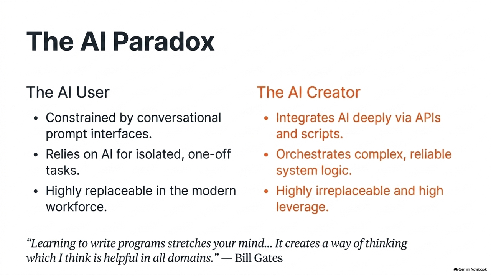
</div>

---

## 1.1.4 運算思維 (Computational Thinking)

學習寫程式，最核心的收穫是培養**運算思維**：

1. **問題拆解 (Decomposition)**：
   * 將龐大複雜問題拆解為小型、獨立的子問題。
2. **模式識別 (Pattern Recognition)**：
   * 觀察歷史資料與問題中的重複規律與趨勢。
3. **抽象化 (Abstraction)**：
   * 聚焦核心關鍵資訊，忽略非必要細節（如捷運路網圖）。
4. **演算法設計 (Algorithm Design)**：
   * 制定清晰、具備先後順序的可執行步驟清單。

---

<!-- _class: full-image-slide -->

<div class="centered-image">
  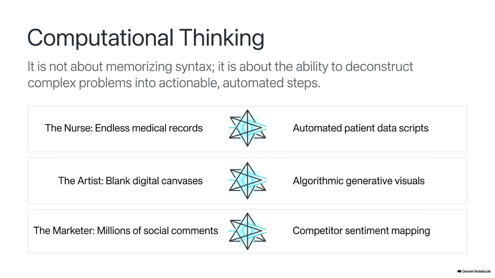
</div>

---

<!-- _class: lead -->

# **1.2 Python 程式設計入門**

---

## 1.2.1 為何選擇 Python？

* **起源**：吉多·范羅蘇姆 (Guido van Rossum) 於 1989 年創立，期望打造兼具優雅與強大的語言。
* **命名**：靈感來自 BBC 喜劇《蒙提·派森的飛行馬戲團》(Monty Python's Flying Circus)。
* **核心精神**：
  > **"Life is short, you need Python" (人生苦短，我用 Python)**
* **全球霸主**：多年蟬聯 TIOBE 與 Stack Overflow 開發者調查最受歡迎語言第一名。

---

<!-- _class: full-image-slide -->

<div class="centered-image">
  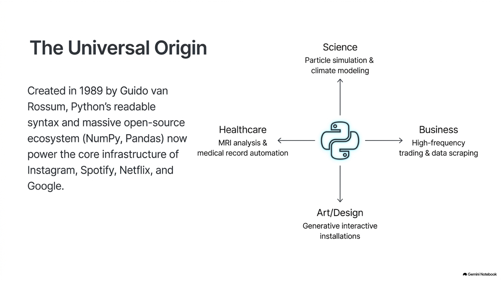
</div>

---

## 1.2.2 The Zen of Python (Python 之禪)

在 Python 終端機中輸入 `import this` 即可看見由 Tim Peters 撰寫的工程哲學：

* **優美優於醜陋** (*Beautiful is better than ugly.*)
* **明白優於隱晦** (*Explicit is better than implicit.*)
* **簡單優於複雜** (*Simple is better than complex.*)
* **可讀性很重要** (*Readability counts.*)
* **面對錯誤絕不姑息** (*Errors should never pass silently.*)

---

<!-- _class: full-image-slide -->

<div class="centered-image">
  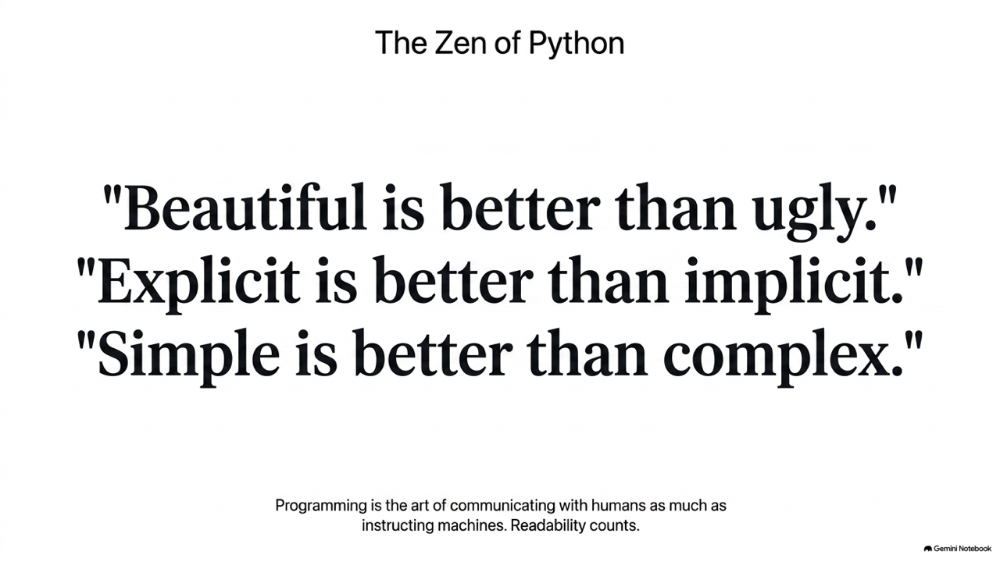
</div>

---

## 1.2.3 直譯語言 vs 編譯語言

| 比較維度 | 編譯語言 (C/C++, Rust, Go) | 直譯語言 (Python, JS) |
| :--- | :--- | :--- |
| **轉譯時機** | 執行前一次編譯成機器碼執行檔 | 執行時由直譯器 (PVM) 逐行轉譯 |
| **執行效能** | **極高**（直接與 CPU 硬體溝通） | **中等**（經由虛擬機轉譯） |
| **調錯速度** | 較慢（修改後需重編譯） | **極快**（隨改隨跑，支援 REPL） |
| **跨平台性** | 各作業系統需分別重新編譯 | **極佳**（有 Python 解譯器即可運行） |

---

## Concept Check Question (CCQ 1)

<div class="ccq-columns">
  <div class="ccq-text">

**下列關於「編譯語言 (如 C++)」與「直譯語言 (如 Python)」特性的比較敘述，何者正確？**

* **A.** 直譯語言執行前必須先產生 `.exe` 二進位檔
* **B.** 編譯語言執行效能極高但需重編譯；Python 支援逐行直譯，具備隨改隨測與跨平台彈性
* **C.** Python 直譯器可以直接讓 CPU 執行純英文字串
* **D.** 編譯語言不具備型別檢查機制，直譯語言在編譯期鎖死

  </div>
  <div class="ccq-logo">
    
  </div>
</div>

---

## CCQ 1 - 答案與解析

<div class="ccq-columns">
  <div class="ccq-text">

### **正確答案：B. 編譯語言效能高，Python 具隨改隨測與跨平台優勢**

* **解析**：
  - 編譯語言由編譯器一次性產生機器碼，效能極高。
  - Python 為直譯語言，由 Python 虛擬機 (PVM) 在執行時逐行轉譯位元組碼，提供極高開發效率與跨平台性，故選 B。

  </div>
  <div class="ccq-logo">
    
  </div>
</div>

---

<!-- _class: lead -->

# **1.3 開發環境的選擇與安裝**

---

## 1.3.1 Python 版本演進與選擇

* **2008 年 (Python 3.0 問世)**：
  - 架構重大重構，不向下相容（解決 Unicode 與歷史包袱）。Python 2 已於 2020 年除役 (EOL)。
* **3.x 關鍵里程碑**：
  * **3.6**：引入 `f-string` 格式化字串。
  * **3.10**：引入 `match-case` 模式匹配與語法錯誤提示優化。
  * **3.11**：解譯器重構，速度大躍進 10%～60%。
  * **3.12 / 3.13+**：現代主流標準版本。

> **💡 版本建議**：請使用 **Python 3.10 或以上**（推薦 **3.12 或 3.13**）。

---

<!-- _class: title-image-slide -->

## Python 版本演進歷程

<div class="image-wrapper">
  
</div>

---

## 1.3.2 現代 Python 開發工具總覽

* **1. 線上雲端環境 (Cloud / Web)**：
  * **Google Colab**：免費雲端 Jupyter Notebook，具備「零安裝」、「免摩擦起步」、「免費 GPU 算力」及 Gemini AI 輔助。
  * **Jupyter Notebook**：以網頁為基礎的互動式運算環境。
* **2. 本機專業環境 (Local IDE / Editor)**：
  * **VS Code**：微軟開發的免費開源編輯器，擁有極強的擴充生態系。
  * **PyCharm**：專業級 Python IDE，適合大型企業專案。
* **3. AI 輔助開發工具 (AI-Powered Tools)**：
  * **GitHub Copilot**：AI 程式碼即時預測補全。
  * **Cursor**：AI 原生編輯器，支援全專案重構與生成。

---

<!-- _class: full-image-slide -->

<div class="centered-image">
  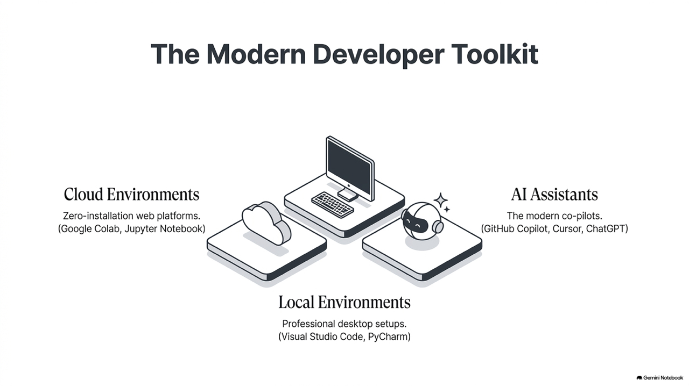
</div>

---

<!-- _class: full-image-slide -->

<div class="centered-image">
  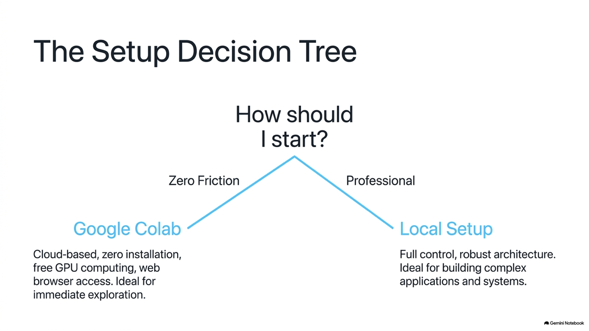
</div>

---

## 路徑一：線上開發環境 (Google Colab)

* **優點**：零摩擦、完全不用安裝任何軟體、程式碼儲存於 Google 雲端、內建常用套件與 AI 助理。
* **使用步驟**：
  1. 瀏覽器開啟 `colab.research.google.com`
  2. 登入 Google 帳號。
  3. 點擊 **檔案 -> 新增筆記本**。
  4. 開始在儲存格 (Cell) 中撰寫程式並執行！

---

## 路徑二：本機安裝架構 (Local Setup)

<!-- _class: full-image-slide -->

<div class="centered-image">
  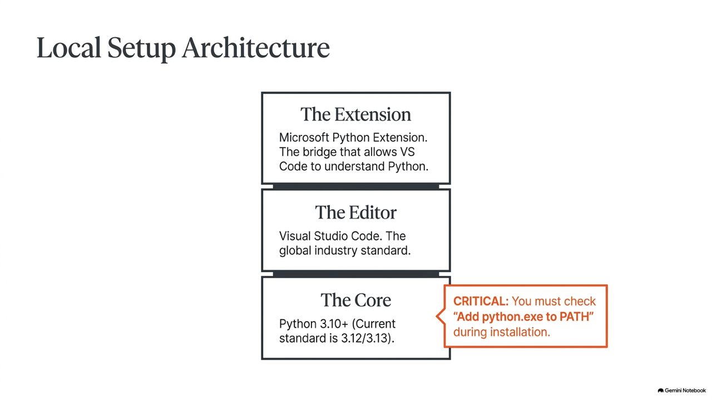
</div>

---

## 本機環境檢查步驟

* **Windows 系統 🪟**
  1. 點擊開始功能表，開啟「**命令提示字元** (cmd)」。
  2. 輸入指令並按 Enter：`python --version`
  3. 若顯示 Python 3.10+ 代表已有；若跳出 Windows 商店或提示命令未找到則需安裝。
* **macOS 系統 🍎**
  1. 開啟「**終端機** (Terminal)」。
  2. 輸入指令並按 Enter：`python3 --version`
  3. 若版本較舊或未安裝，推薦安裝官方最新穩定版。

> *Mac 請使用 `python3` 指令，避免呼叫到系統舊版環境。*

---

## 第一階段：安裝或更新 Python 核心程式

* **Windows 系統安裝指南 🪟**
  * 前往 [python.org](https://www.python.org) 下載 Windows 安裝程式。
  * **⚠️ 關鍵步驟：務必勾選左下角的「Add python.exe to PATH」！**
  * 勾選後點擊 `Install Now` 並等待完成。
* **macOS 系統安裝指南 🍎**
  * 前往 [python.org](https://www.python.org) 下載 macOS 官方 `.pkg` 安裝檔。
  * 雙擊安裝套件，依循指示「繼續」、「同意」並完成安裝。

---

## 第二階段：安裝與設定 VS Code 編輯器

1. **安裝編輯器**：
   * 前往 [code.visualstudio.com](https://code.visualstudio.com) 下載並安裝 VS Code。
2. **安裝 Python 擴充套件**：
   * 在 VS Code 左側點擊 Extensions (快捷鍵 `Ctrl+Shift+X` / `Cmd+Shift+X`)，搜尋並安裝由 **Microsoft** 發行的官方 `Python` 套件。
3. **撰寫並執行你的第一支程式**：
   * 新增檔案並存為 `hello.py` (**.py** 副檔名至關重要)。
   * 輸入程式碼：`print("Hello, World!")`
   * 點擊編輯器右上角的 **▶️ (執行)** 按鈕，在下方終端機查看結果。

---

## 1.3.4 Python 虛擬環境 (venv)

為每個專案建立獨立、互不干擾的沙盒環境，避免套件版本衝突：

```bash
# 1. 建立虛擬環境
python3 -m venv .venv

# 2. 啟用虛擬環境
source .venv/bin/activate       # macOS / Linux
.venv\Scripts\Activate.ps1       # Windows PowerShell

# 3. 安裝專案專屬套件
pip install pandas requests

# 4. 退出虛擬環境
deactivate
```

---

## Concept Check Question (CCQ 2)

<div class="ccq-columns">
  <div class="ccq-text">

**在 Windows 安裝 Python 時，若遺漏勾選「Add python.exe to PATH」，在 cmd 輸入 `python` 會發生何種情況？**

* **A.** 電腦螢幕解析度被自動調降
* **B.** 系統顯示「'python' 不是內部或外部命令...」，因為系統不知去哪個路徑尋找執行檔
* **C.** 安裝程式會自動格式化硬碟
* **D.** Python 程式碼文字全部變成亂碼

  </div>
  <div class="ccq-logo">
    
  </div>
</div>

---

## CCQ 2 - 答案與解析

<div class="ccq-columns">
  <div class="ccq-text">

### **正確答案：B. 系統顯示「'python' 不是內部或外部命令...」**

* **解析**：
  - **PATH** 是記錄可執行檔搜尋路徑的系統環境變數。
  - 勾選該選項會自動將 Python 加入 PATH；若未勾選，終端機就找不到 `python.exe` 的所在位置，故選 B。

  </div>
  <div class="ccq-logo">
    
  </div>
</div>

---

<!-- _class: lead -->

# **1.4 給學習者的建議**

---

## 1.4.1 通用的程式學習心法 (The 4 Pillars)

* **1. 動手實作 (Hands-On Coding)**：親手敲打程式碼以建立肌肉記憶，拒絕只讀不動。
* **2. 破壞性實驗 (Destructive Testing)**：刻意修改參數與運算元，觀察因果關係。
* **3. 擁抱錯誤 (Embracing Bugs)**：將錯誤訊息當成嚮導，善用中斷點除錯。
* **4. 專案導向 (Project-Driven Focus)**：設定有意義的目標，拆解大問題為小任務。

---

<!-- _class: full-image-slide -->

<div class="centered-image">
  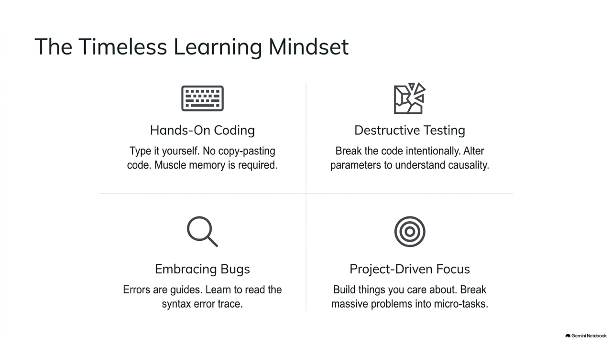
</div>

---

## 1.4.2 AI 世代的智慧學習策略

* **主動探究**：把 AI 當起點而非終點，深度追問背後的「設計考量」。
* **智慧重構**：請 AI 作為專屬助教，進行白話解釋與程式碼重構 (Refactor)。
* **提問能力 (Prompt Engineering)**：精準描述背景、目標、嘗試與期望差異。
* **高層次思維**：將精力專注於問題拆解、資料流向與整體系統設計。

---

<!-- _class: full-image-slide -->

<div class="centered-image">
  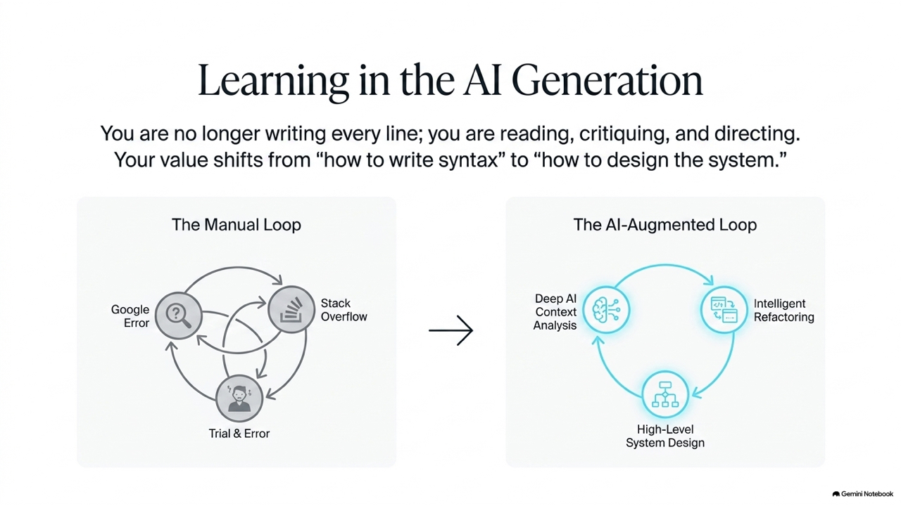
</div>

---

<!-- _class: full-image-slide -->

<div class="centered-image">
  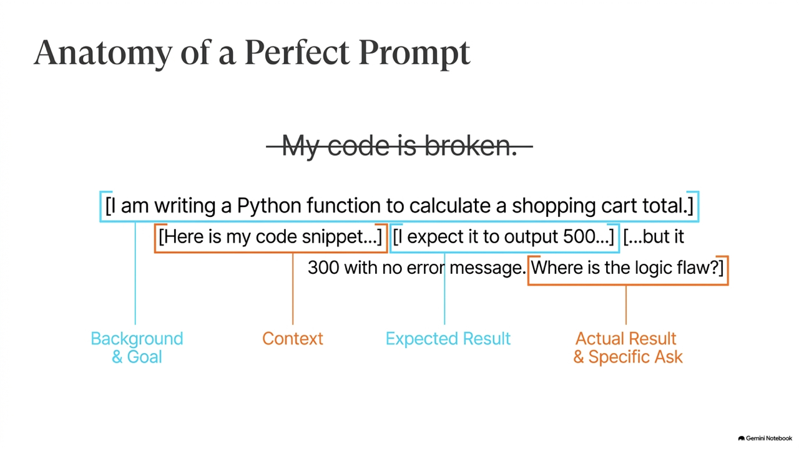
</div>

---

## 初學者的 5 大常見「撞牆」陷阱

* **1. 大小寫極度敏感**：`Print()` ❌ $\rightarrow$ `print()` ✅、`TRUE` ❌ $\rightarrow$ `True` ✅
* **2. 中英文全形/半形混淆**：中文冒號 `：`、引號 `”` 會引發 `SyntaxError`！
* **3. 縮排不一致**：Tab 與空白鍵混用會造成 `IndentationError`。
* **4. 變數未宣告先使用**：引發 `NameError`。
* **5. 檔案命名自我衝突**：切勿將檔案命名為 `math.py`, `random.py` 或 `test.py`！

---

<!-- _class: lead -->

# **1.5 善用線上資源與 Smart Coding Tutor**

---

## 1.5 智慧學習環境：Smart Coding Tutor

* **線上解題系統 (OJ)**：
  - 給予明確目標，提交後在數秒內給予客觀回饋 (`AC`, `WA`, `TLE`, `RE`)。
* **AI 智慧提示 (蘇格拉底式引導)**：
  - 遇到錯誤時不直接給答案，而是分析邏輯盲點、給予引導式提示並推薦觀念複習。

---

<!-- _class: full-image-slide -->

<div class="centered-image">
  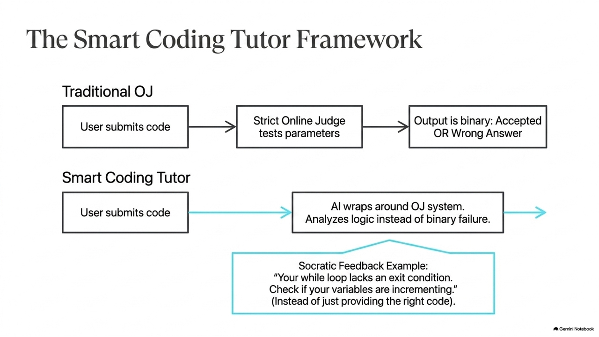
</div>

---

<!-- _class: full-image-slide -->

<div class="centered-image">
  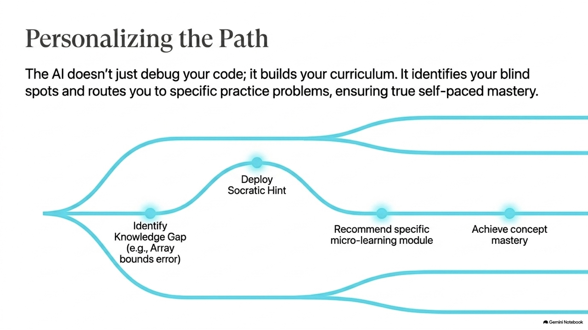
</div>

---

## Concept Check Question (CCQ 3)

<div class="ccq-columns">
  <div class="ccq-text">

**若初學者撰寫 `Print("Hello")` 導致 `NameError: name 'Print' is not defined`，最主要原因為何？**

* **A.** 電腦尚未連接網路無法下載字型
* **B.** Python 對英文大小寫極度敏感，標準輸出函式為全小寫的 `print`，大寫 `Print` 被視為未宣告變數
* **C.** 字串必須用三個雙引號包覆
* **D.** Python 不支援印出英文

  </div>
  <div class="ccq-logo">
    
  </div>
</div>

---

## CCQ 3 - 答案與解析

<div class="ccq-columns">
  <div class="ccq-text">

### **正確答案：B. Python 區分大小寫，標準函式為全小寫 `print`**

* **解析**：
  - Python 是區分大小寫的語言。
  - 內建輸出函式是小寫 `print()`。大寫 `Print` 會被視為自訂但未宣告的變數或函式，引發 `NameError`，故選 B。

  </div>
  <div class="ccq-logo">
    
  </div>
</div>

---

## 課堂討論 (Discussion)

<div class="discussion-columns">
  <div class="discussion-text">

**有了 AI 輔助工具（如 ChatGPT、Cursor 等）可以自動生成程式碼，我們是否還需要花時間手動撰寫和練習程式語法？請分享你的看法與體驗。**

  </div>
  <div class="discussion-logo">
    
  </div>
</div>

---

<!-- _class: lead -->

# **開始你的 Python 旅程吧！**

> **「Life is short, you need Python.」**

祝學習順利！
