# Python 程式設計

## 第一章：導論 (Introduction)
**Prof. Nien-Lin Hsueh**
Department of Information Engineering
Feng Chia University

---

## 本章學習重點

* **1.1 程式語言：驅動現代世界的基礎能力**
  * 程式碼作為日常生活的隱形架構
  * 程式語言在各大領域的應用
  * AI 時代下程式語言的重要性
* **1.2 Python 程式設計入門**
  * Python 的起源、主要特性與 Python 之禪
  * 程式設計與運算思維
* **1.3 開發環境的選擇與安裝**
  * Python 版本演進與現代工具總覽
  * 線上雲端環境 (Google Colab) 與本機開發環境
* **1.4 學習建議**與 **1.5 線上資源應用**

---
<!-- _class: lead -->

# **1.1 程式語言：驅動現代世界的基礎能力**

---

## 1.1 程式語言：驅動現代世界的基礎能力

* 程式語言已不再是軟體工程師的專利，而是橫跨各領域的**基礎素養**與**核心能力**。
* 它是一套**思考的工具**，也是將創意具現化的力量。

> **「這個國家的每一個人都應該學習如何寫程式，因為它教你如何思考。」**
>
> — 史蒂夫·賈伯斯 (Steve Jobs), 蘋果公司聯合創辦人

---

## 1.1.1 程式碼：日常生活中的隱形架構

程式碼如同空氣與水，默默支撐著現代社會的運作：

* 🚗 **通勤路上的導航與交通**：
  * 導航 App 即時計算避堵的最佳路徑；智慧號誌讀取感測器車流，動態調整紅綠燈秒數。
* 📺 **串流影音個人化推薦**：
  * Netflix & YouTube 演算法分析觀看紀錄與偏好，進行個人化預測。
* 🛒 **商店結帳系統與 POS**：
  * 超市自助結帳、餐廳 POS。從掃描、計價、金流到庫存更新，全由自動化程式驅動。

---
<!-- _class: full-image-slide -->

  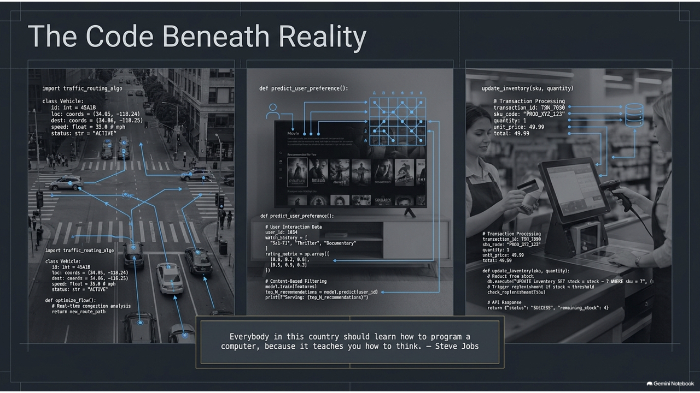

---

## 1.1.2 程式語言在各大領域的應用

* 🔬 **科學研究**：處理龐大數據、基因分析 (Python, R)、氣候變遷模型。
* 💼 **商業與金融**：量化高頻交易、風險評估、精準行銷與流程自動化。
* 🎨 **藝術與設計**：互動裝置、生成藝術 (Generative Art)。
* 📚 **人文社會科學**：數位人文 (Digital Humanities) 文本典籍演變分析。
* 🏥 **醫療保健**：醫學影像輔助診斷、藥物開發模擬。

---
<!-- _class: full-image-slide -->

  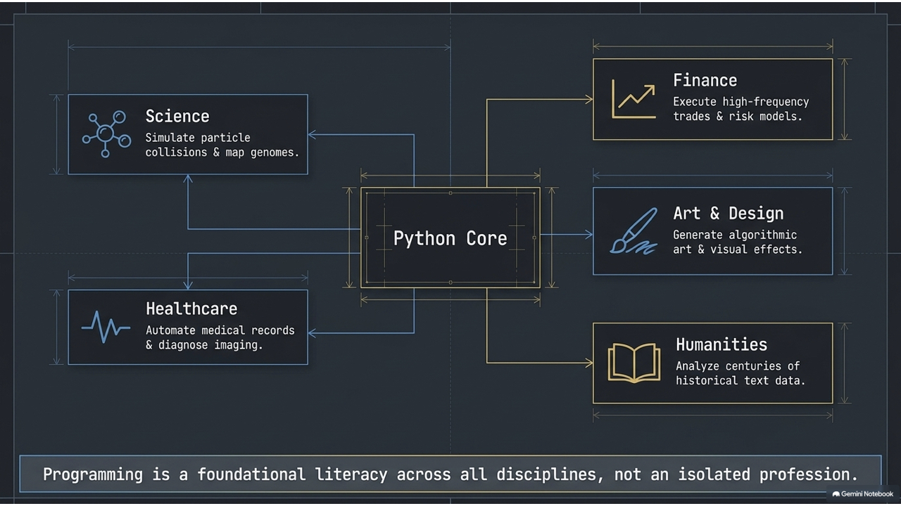

---

## 1.1.3 AI 時代，為何程式語言更加重要？

> **「學習寫程式能拓展你的心智，幫助你更好地思考。它創造了一種我認為在所有領域都有幫助的思維模式。」**
> — 比爾·蓋茲 (Bill Gates), 微軟公司聯合創辦人

* **整合 AI 應用的基礎**：AI 本身由程式碼建構，整合 AI 到實際系統中需要透過 API 程式串接。
* **實現複雜系統邏輯**：金融交易、產線控制等精確邏輯無法單靠自然指令完成。
* **提升核心不可替代性**：懂得程式才能駕馭 AI，成為 AI 創造者。

---
<!-- _class: full-image-slide -->

  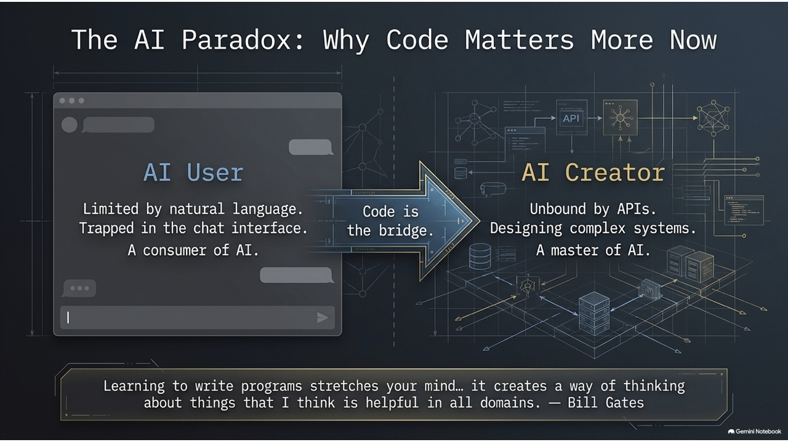

---
<!-- _class: lead -->

# **1.2 Python 程式設計入門**

---

## 1.2 Python 程式設計入門

* **起源**：吉多·范羅蘇姆 (Guido van Rossum) 於 1989 年創立，期望打造一個兼具優雅與強大，又避免封閉性的新語言。
* **命名**：靈感來自 BBC 喜劇《蒙提·派森的飛行馬戲團》(Monty Python's Flying Circus)。
* **核心精神**：
  > **"Life is short, use Python" (人生苦短，我用 Python)**

* **知名應用案例**：
  * Instagram, Spotify, Netflix, Dropbox 與 Google 的後端系統都大量使用 Python。

---

## 1.2.1 Python 的主要特性

* **語法簡潔、易於學習**：語法接近自然語言，讓初學者專注於邏輯而非複雜細節。
* **強大的開源生態系**：擁有海量第三方套件。
  * 數值計算：`NumPy`
  * 資料分析：`Pandas`
  * 機器學習與 AI：`Scikit-learn`, `TensorFlow`, `PyTorch`
* **跨平台與高整合性**：支援 Windows, macOS, Linux，並可輕易與 C/C++ 等協同工作。
* **活躍的社群**：全球開發者社群龐大，容易尋求支援。

---

## 1.2.2 The Zen of Python (Python 之禪)

由 Tim Peters 撰寫，引導開發者寫出優美、可讀的程式碼：

* **優美優於醜陋** (*Beautiful is better than ugly.*)
* **明白優於隱晦** (*Explicit is better than implicit.*)
* **簡單優於複雜** (*Simple is better than complex.*)
* **可讀性很重要** (*Readability counts.*)

---
<!-- _class: full-image-slide -->

  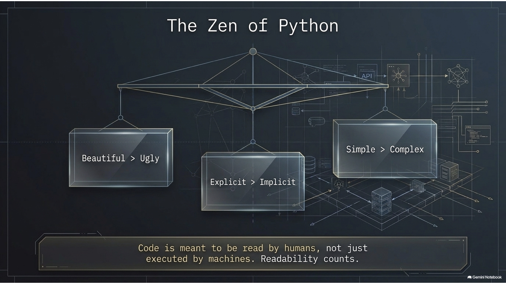

---

## 1.2.3 程式設計：擴展專業領域的利器

學習程式設計的核心在於培養**運算思維 (Computational Thinking)**：將複雜問題拆解、模式化，並設計解決步驟。

* 🩺 **護理領域**：撰寫腳本自動化整理與分析繁瑣的病歷數據。
* 🎨 **藝術領域**：利用程式創作生成藝術與互動視覺作品。
* 📈 **行銷領域**：透過網路爬蟲分析競品與社群聲量。

**運算思維是為你的專業賦能，幫助你親手打造解決方案。**

---

## Concept Check Question (CCQ 1)

  

**Python 語言是由誰在 1989 年創立，其命名靈感來自什麼？**

* **A.** Bjarne Stroustrup, 蟒蛇
* **B.** Dennis Ritchie, 飛行馬戲團
* **C.** Guido van Rossum, 飛行馬戲團
* **D.** James Gosling, 蟒蛇

  

  

    
  

---

## CCQ 1 - 答案與解析

  

### **正確答案：C. Guido van Rossum, 飛行馬戲團**

* **解析**：
  * Python 的創始人是 **Guido van Rossum**。
  * 命名靈感來自他喜愛的 BBC 喜劇《蒙提·派森的飛行馬戲團》(Monty Python's Flying Circus)。
  * 雖然 Python 在英文中是「蟒蛇」的意思，但最初的命名與蛇無關。

  

  

    
  

---
<!-- _class: lead -->

# **1.3 開發環境的選擇與安裝**

---

## 1.3.1 Python 版本演進與選擇

* **2008 年 (Python 3.0 問世)**：架構重大重構，不向下相容。為了解決 Unicode 編碼與語法包袱。Python 2 已於 2020 年正式除役 (EOL)。
* **3.x 關鍵里程碑**：
  * **3.6**：引入 `f-string` 格式化字串。
  * **3.10**：引入 `match-case` 結構化模式匹配與語法錯誤提示優化。
  * **3.11**：解譯器重構，速度效能大躍進 10%～60%。
  * **3.12 / 3.13+**：現代主流，朝向多執行緒效能優化與型別系統強化。

> **💡 版本建議**：請使用 **Python 3.10 或以上**（推薦 **3.12 或 3.13**）。

---
<!-- _class: title-image-slide -->

## Python 版本演進歷程

  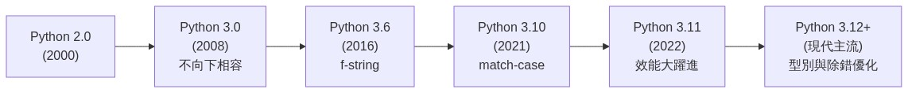

---

## 1.3.2 現代 Python 開發工具總覽

* **1. 線上雲端環境 (Cloud / Web)**：
  * **Google Colab**：免費雲端 Jupyter Notebook，具備「零安裝」、「免摩擦起步」、「免費 GPU 算力」及 Gemini AI 輔助。
  * **Jupyter Notebook**：以網頁為基礎的互動式運算與數據分析環境。
* **2. 本機專業環境 (Local IDE / Editor)**：
  * **VS Code**：微軟開發的免費開源編輯器，擁有極強的擴充生態系。
  * **PyCharm**：專業級 Python IDE，適合大型企業專案。
  * **IDLE**：Python 官方安裝包內建的極簡環境。
* **3. AI 輔助開發工具 (AI-Powered Tools)**：
  * **GitHub Copilot**：AI 程式碼補全。
  * **Cursor**：AI 原生編輯器，支援全專案重構與生成。

---
<!-- _class: title-image-slide -->

## 1.3.3 初學者的兩條安裝路徑

  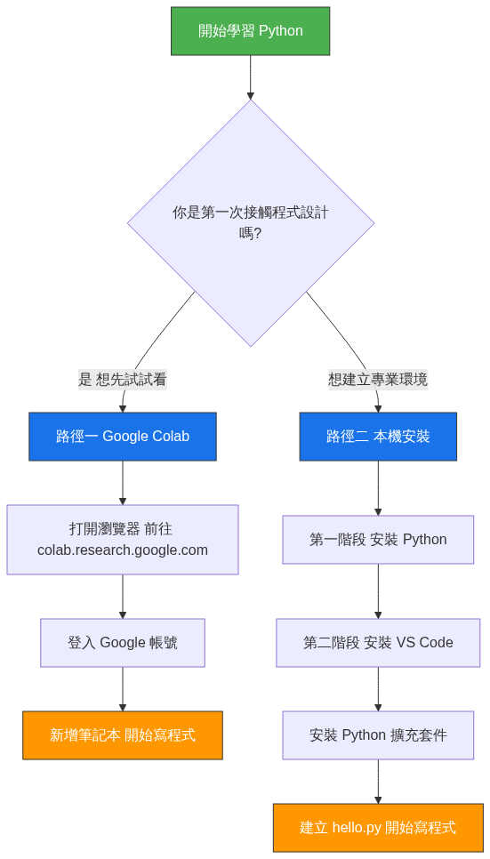

---

## 路徑一：線上開發環境 (Google Colab)

* **優點**：零摩擦、完全不用安裝任何軟體、程式碼儲存於 Google 雲端、內建常用套件與 AI 助理。
* **使用步驟**：
  1. 瀏覽器開啟 `colab.research.google.com`
  2. 登入 Google 帳號。
  3. 點擊 **檔案 -> 新增筆記本**。
  4. 開始在區塊（儲存格, Cell）中撰寫程式並執行！

---
<!-- _class: full-image-slide -->

  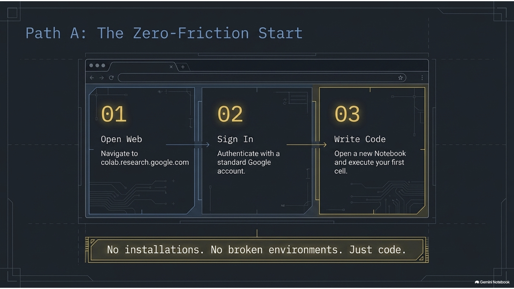

---
<!-- _class: title-image-slide -->

## 路徑二：在本機電腦安裝 Python 環境

  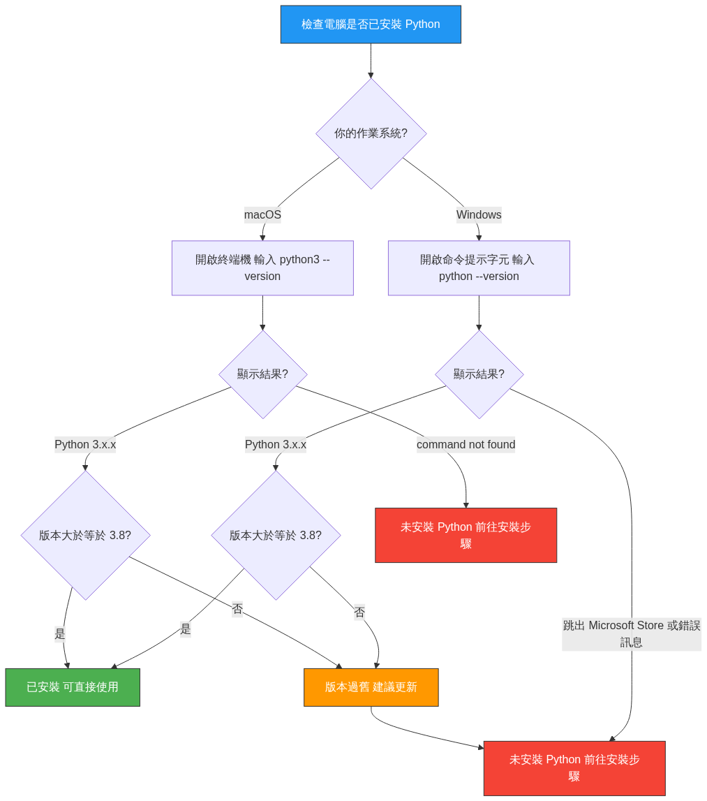

---

## 本機環境檢查步驟

* **Windows 系統 🪟**
  1. 開啟「**命令提示字元** (cmd)」。
  2. 輸入指令並按 Enter：`python --version`
  3. 若顯示 Python 3.10+ 代表已有。若跳出 Windows 商店或 command not found 則需安裝。
* **macOS 系統 🍎**
  1. 開啟「**終端機** (Terminal)」。
  2. 輸入指令並按 Enter：`python3 --version`
  3. 若版本低於 3.10，推薦安裝官方最新穩定版。

> *Mac 請使用 `python3` 指令，避免呼叫到系統舊版環境。*

---
<!-- _class: title-image-slide -->

## 第一階段：安裝或更新 Python 核心程式

  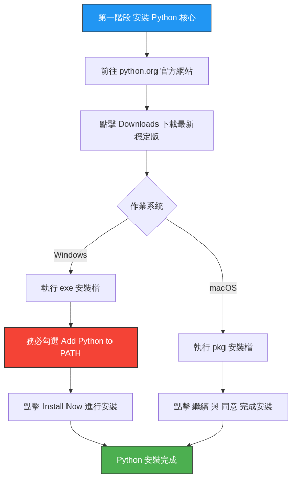

---

## 第一階段：安裝步驟細節

* **Windows 系統安裝指南 🪟**
  * 前往 [python.org](https://www.python.org) 下載 Windows 安裝程式。
  * **⚠️ 關鍵步驟：務必勾選左下角的「Add python.exe to PATH」！**
  * 勾選後點擊 `Install Now` 並等待完成。
* **macOS 系統安裝指南 🍎**
  * 前往 [python.org](https://www.python.org) 下載 macOS 官方 `.pkg` 安裝檔。
  * 雙擊安裝套件，依循指示「繼續」、「同意」並完成安裝。

---

## 第二階段：安裝與設定 VS Code 編輯器

1. **安裝編輯器**：
   * 前往 [code.visualstudio.com](https://code.visualstudio.com) 下載並安裝 VS Code。
2. **安裝 Python 擴充套件**：
   * 在 VS Code 左側點擊 Extensions (快捷鍵 `Ctrl+Shift+X` / `Cmd+Shift+X`)，搜尋並安裝由 **Microsoft** 發行的官方 `Python` 套件。
3. **撰寫並執行你的第一支程式**：
   * 新增檔案並存為 `hello.py` (**.py** 副檔名至關重要)。
   * 輸入程式碼：`print("Hello, World!")`
   * 點擊編輯器右上角的 **▶️ (執行)** 按鈕，在下方終端機查看結果。

---
<!-- _class: lead -->

# **1.4 給學習者的建議**

---

## 1.4.1 通用的程式學習心法 (The 4 Pillars)

* **1. 動手實作，拒絕只讀不動**
  * 親手敲打程式碼以熟悉語法。修改參數、改變運算元，進行「破壞性」實驗。
* **2. 擁抱錯誤，學習除錯 (Debug)**
  * 讀懂錯誤訊息 (`SyntaxError` 等)，使用 VS Code 中斷點檢視變數狀態。
* **3. 專案導向，目標驅動**
  * 規劃感興趣的小專案，拆解大問題為小任務。
* **4. 善用社群，尋求人際互動**
  * 閱讀開源碼，學會在社群提問。

---
<!-- _class: full-image-slide -->

  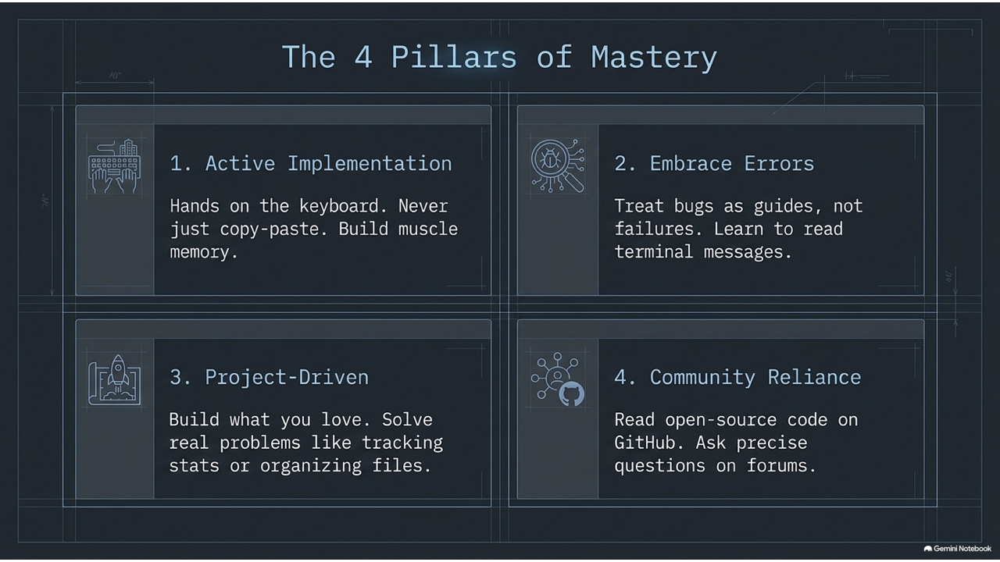

---

## 1.4.2 AI 世代的智慧學習策略

* **重新定義實作：主動探究**
  * 把 AI 程式碼當起點而非終點，向 AI 追問程式背後的「設計考量」。
* **升級除錯：個人化助教**
  * 提供程式碼與錯誤訊息請 AI 白話解釋；請求 AI 做重構 (Refactor) 建議。
* **提問能力 (Prompt Engineering)**
  * 提供背景、明確目標、已做嘗試、期望與實際結果之差異。
* **專注於高層次思維**
  * 專注於問題拆解、資料流向與系統設計。

---
<!-- _class: full-image-slide -->

  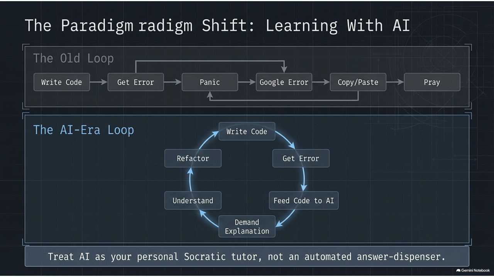

---

## 高品質提問的關鍵要素

一個優質的 AI 提問應該包含：
* **背景/情境**：我正在學習 Python...
* **明確目標**：希望撰寫一個計算購物車總額的函式。
* **已有嘗試**：這是我目前的程式碼 (附上代碼)。
* **期望與實際差異**：預期輸出 500，但實際輸出 300，且無錯誤。

> 糟糕的提問：「我的程式碼壞了，幫我改一下。」

---
<!-- _class: full-image-slide -->

  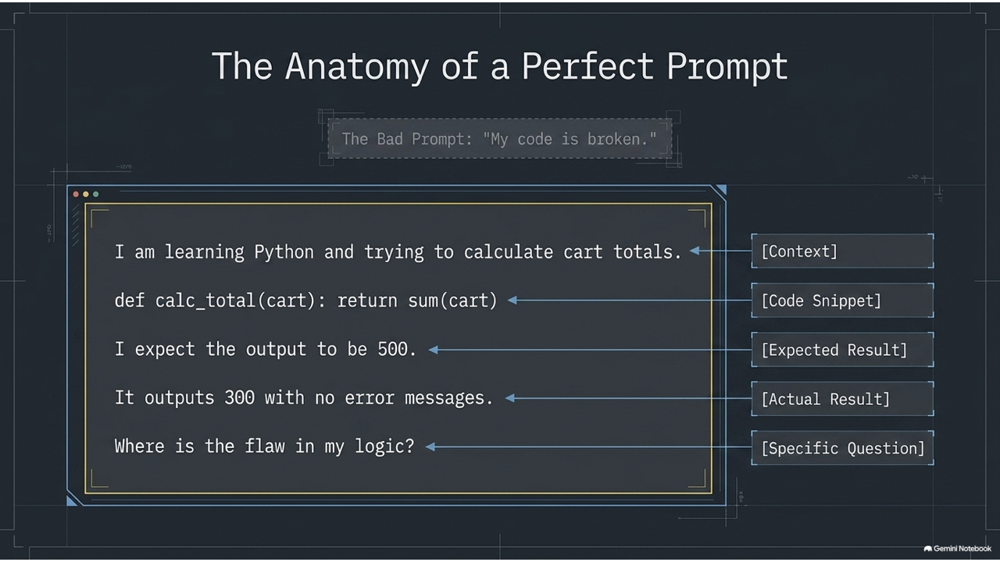

---
<!-- _class: lead -->

# **1.5 善用線上資源與 Smart Coding Tutor**

---

## 1.5 智慧學習環境：Smart Coding Tutor

我們結合了 **OJ (線上解題系統)** 與 **AI 智慧導師**，打造個人化的程式學習路徑：

* **線上解題系統 (OJ)**：
  * 給予明確目標，提交後在數秒內給予即時、客觀的回饋 (`Accepted`, `Wrong Answer` 等)。
* **AI 智慧提示 (不再卡關)**：
  * 當你提交錯誤時，AI 不會直接給出標準答案，而是分析邏輯盲點並給出提示。
  * 提供觀念補強與自適應學習路徑。

---
<!-- _class: full-image-slide -->

  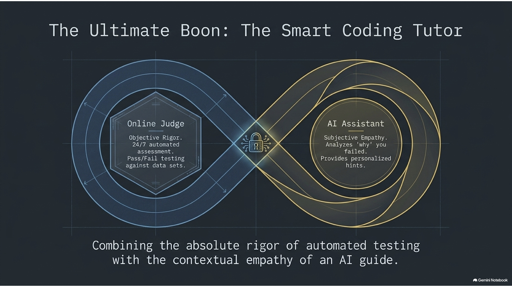

---

## 課堂討論 (Discussion)

  

**有了 AI 輔助工具（如 ChatGPT、Cursor 等）可以自動生成程式碼，我們是否還需要花時間手動撰寫和練習程式語法？請分享你的看法與體驗。**

  

  

    
  

---
<!-- _class: lead -->

# **開始你的 Python 旅程吧！**

> **「Life is short, use Python.」**

祝學習順利！
