# Python 程式設計

## 第二章：程式結構 (Program Structure)
**Prof. Nien-Lin Hsueh**
Department of Information Engineering
Feng Chia University

---

## 本章學習重點

* **2.1 程式的基本架構：輸入、處理、輸出 (IPO)**
* **2.2 變數與變數型態** (變數命名、基本型態、轉型、ASCII)
* **2.3 基本運算** (算術、字串、關係、邏輯運算)
* **2.4 輸入與輸出** (格式化輸出、排版、檔案讀寫)
* **2.5 程式錯誤** (語法、執行期、邏輯錯誤)
* **2.6 程式的註解**
* **2.7 程式練習** (OJ 實作演練)

---
<!-- _class: lead -->

# **2.1 程式的基本架構：輸入、處理、輸出**

---

## 2.1 程式的基本架構：輸入、處理、輸出

* 任何程式的核心運作邏輯都可以簡化為 **IPO 模式**：
  * **Input (輸入)**：程式接收外部資料（如鍵盤、滑鼠、檔案、網路等）。
  * **Process (處理)**：程式對輸入的資料進行運算、邏輯判斷或流程控制。
  * **Output (輸出)**：將處理後的結果呈現給使用者（如螢幕顯示、寫入檔案、網路傳輸等）。

---
<!-- _class: full-image-slide -->

<div class="centered-image">
  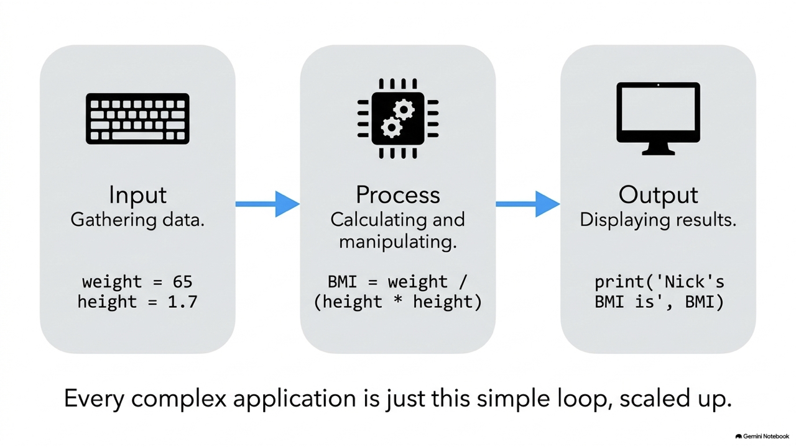
</div>

---

## 2.1 程式基本架構範例：BMI 計算

```python
# 1. Input: 取得使用者輸入的名子
name = input("What is your name: ") 
# 2. Process: 字串串接與運算
helloToYou = "Hello " + name
# 3. Output: 輸出問候字串
print (helloToYou)

# 使用變數儲存資料進行計算
name = "Nick"
weight = 65
height = 1.7
# 計算 BMI
BMI = weight / (height * height)

print (name + "'s BMI is", BMI)
```

---
<!-- _class: lead -->

# **2.2 變數與命名規則**

---

## 2.2.1 什麼是變數 (Variable)

* 用來**儲存特定資料值**的記憶體容器，以供後續程式重複調用與處理。
* 在 Python 中，**不需要事先宣告變數的型態**，變數會自動根據賦予的值決定型態（動態型態）。
* **賦值運算子 (`=`)**：將右邊的資料值指定給左邊的變數。
  ```python
  x = 100       # 宣告一個整數變數 x
  y = 200       # 宣告一個整數變數 y
  p = q = 100   # 多重宣告：將 p 和 q 都設定為 100
  name, eng, math = "Nick", 92, 88 # 同時宣告多個變數並賦值
  ```

---

## 2.2.2 變數命名規則

* 變數名稱必須是有意義的，且須符合以下語法規則：
  * 只能包含**英文字母 (a-z, A-Z)**、**數字 (0-9)** 與**底線 (`_`)**。
  * **開頭不能是數字**。 (例如：`3employee` ❌)
  * 不能包含任何**特殊字元**（如 `&`, `#`, `*`, `@`, `-` 等）。 (例如：`my-var` ❌)
  * **區分大小寫** (Case-sensitive)。 (例如：`total` 與 `Total` 代表兩個不同的變數 ⚠️)
  * 不能使用 Python 的**保留字 (Keywords)**。 (例如：`import`, `for`, `else` ❌)

---
<!-- _class: full-image-slide -->

<div class="centered-image">
  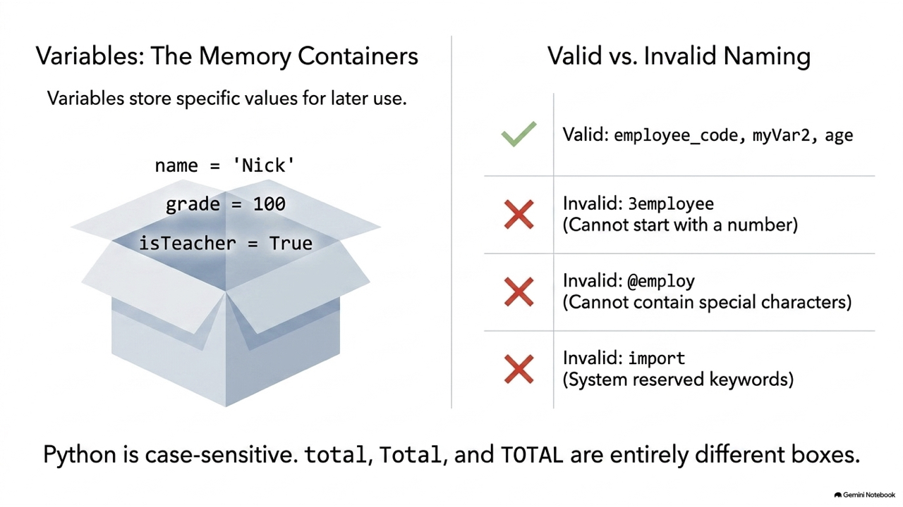
</div>

---

## 2.2.2 保留字與無效命名

* 以下為 Python 的保留字清單，切勿做為變數名稱：
  `False`, `None`, `True`, `and`, `as`, `assert`, `break`, `class`, `continue`, `def`, `del`, `elif`, `else`, `except`, `finally`, `for`, `from`, `global`, `if`, `import`, `in`, `is`, `lambda`, `nonlocal`, `not`, `or`, `pass`, `raise`, `return`, `try`, `while`, `with`, `yield`

```python
# 錯誤命名示範
and = 1     # ❌ 語法錯誤：and 是保留字
@employ = 1 # ❌ 語法錯誤：不可包含 @ 特殊字元

# 正確命名示範
grade = 100
temperature = 8.9
name = "John"
isTeacher = True
```

---

## Concept Check Question (CCQ 1)

<div class="ccq-columns">
  <div class="ccq-text">

**下列哪一個選項不能被用來當作變數名稱？**

* **A.** `age`
* **B.** `import`
* **C.** `address`
* **D.** `pi`

  </div>
  <div class="ccq-logo">
    
  </div>
</div>

---

## CCQ 1 - 答案與解析

<div class="ccq-columns">
  <div class="ccq-text">

### **正確答案：B. import**

* **解析**：
  * `import` 是 Python 的**保留字 (Reserved Keyword)**，在語言中有特殊的語法功能，因此不能被用作變數名稱。

  </div>
  <div class="ccq-logo">
    
  </div>
</div>

---
<!-- _class: lead -->

# **2.2.4 變數型態與型態轉換**

---

## 2.2.4 變數型態 (Data Types)

* 變數型態決定了電腦**如何理解**資料，以及該資料**可以進行哪些合法操作**。

| 變數型態 | 描述 | 範例 |
| :--- | :--- | :--- |
| **整數 (`int`)** | 不帶小數點的整數值 | `5`, `-10`, `1000` |
| **浮點數 (`float`)** | 帶有小數部分的實數 | `3.14`, `-0.5`, `2.0` |
| **字串 (`str`)** | 單引號或雙引號包裹的文字 | `'Hello'`, `"Python"` |
| **布林值 (`bool`)** | 代表邏輯真假 | `True`, `False` |
| **空值 (`None`)** | 表示空值或缺少值 | `None` |

---
<!-- _class: full-image-slide -->

<div class="centered-image">
  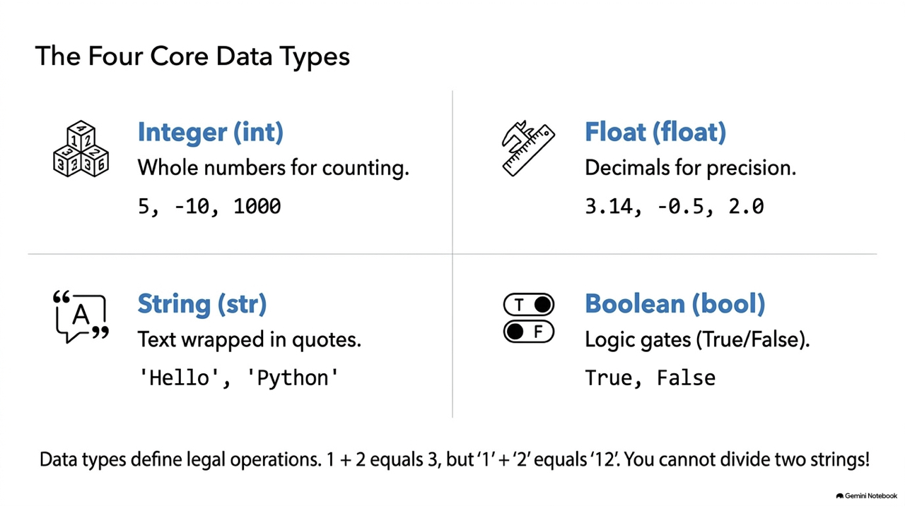
</div>

---

## 2.2.4 布林值 (Boolean, `bool`)

* 只有兩種可能：**`True`** (真) 或 **`False`** (假)，主要用於條件判斷與邏輯控制。

---
<!-- _class: full-image-slide -->

<div class="centered-image">
  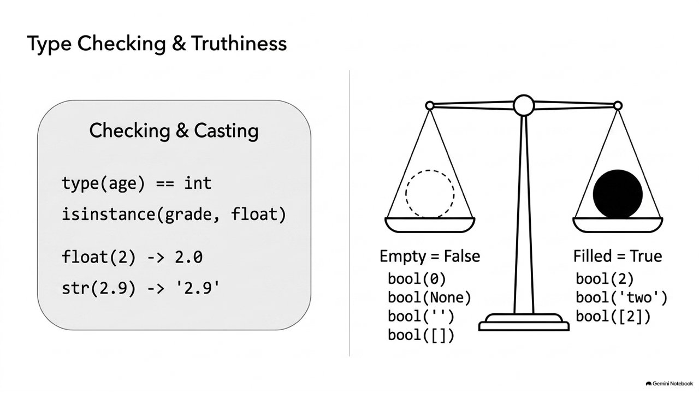
</div>

---

## 型態如何影響運算？

* 即使外觀看起來都是數字，不同型態也會導致截然不同的運算結果！

```python
# 數字型態運算
a = 1
b = 2
print (a + b)   # 輸出：3 (數學加法)

# 字串型態運算
a = '1'
b = '2'
print (a + b)   # 輸出：12 (字串串接)
# print (a / b) # ❌ 錯誤：字串型態不支援除法運算！
```

---

## 檢查型態與 isinstance

* 使用 `type()` 查詢變數型態；使用 `isinstance()` 檢驗物件是否屬於某類別。

```python
grade = 89
temperature = 32.5
isTeacher = True

print(type(grade))        # 輸出: <class 'int'>
print(type(temperature))  # 輸出: <class 'float'>

# 檢驗型態是否符合
print(type(grade) == int)      # 輸出: True 
print(isinstance(grade, float)) # 輸出: False
print(isinstance('two', str))   # 輸出: True
print(isinstance(2==2, bool))   # 輸出: True
```

---

## 型態轉換 (Type Casting)

* 將資料從一種型態強制轉換為另一種型態：

```python
float(2)   # 整數 2 轉為浮點數 2.0
int(2.9)   # 浮點數 2.9 轉為整數 2 (直接捨去小數點，不四捨五入)
str(2.9)   # 浮點數 2.9 轉為字串 '2.9'

# 布林轉換：數值零、None、空的容器(字串、串列)會被轉換為 False
bool(0)     # False
bool(None)  # False
bool('')    # False

# 非零、非空的物件都會被轉換為 True
bool(2)     # True
bool('two') # True
```

---

## 電腦的秘密語言：ASCII 與字元轉換

* 電腦底層只懂 0 與 1。為了儲存字元，必須使用「密碼本」將字元映射為數字。
* **ASCII** 是最早的密碼編譯標準（包含大、小寫英文字母、數字和常用符號）。
* 在 Python 中：
  * **`ord(char)`**：查詢字元的編碼（Unicode 序數）。
  * **`chr(code)`**：根據編碼數字反查字元。

---
<!-- _class: full-image-slide -->

<div class="centered-image">
  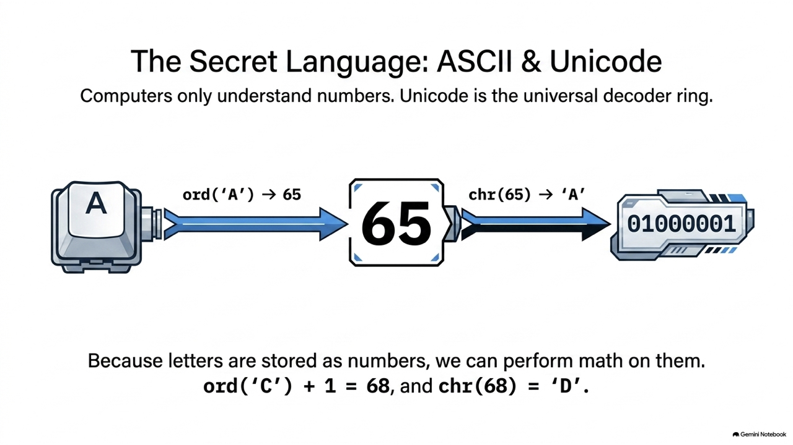
</div>

---

## 字元編碼轉換範例

```python
# 查詢字元編碼
print(ord('A'))    # 65
print(ord('嗨'))   # 21995

# 查詢編碼對應字元
print(chr(66))     # 'B'
print(chr(21996))  # '㗎'

# 實際應用：字元偏移運算 (求 C 的下一個字母)
current_char = 'C'
next_char = chr(ord(current_char) + 1)
print(next_char)   # 'D'
```

---

## 隨堂練習：印出 a-z 26 個字母

* 利用 `ord()` 取得 `'a'` 的編碼，再以迴圈將數字轉回字元印出：

```python
a_code = ord('a') # 取得 'a' 的 ASCII 碼 97
print('The ASCII code of a is', a_code)

# 遍歷 97 ~ 122，轉換並印出字元
for i in range(a_code, a_code + 26):
    print(chr(i), end=' ')

# 輸出結果：
# The ASCII code of a is 97
# a b c d e f g h i j k l m n o p q r s t u v w x y z
```

## Concept Check Question (CCQ 2)

<div class="ccq-columns">
  <div class="ccq-text">

**下列程式碼執行後，螢幕上會印出什麼結果？**
```python
print(bool(None), bool('False'))
```

* **A.** `False False`
* **B.** `False True`
* **C.** `True False`
* **D.** `True True`

  </div>
  <div class="ccq-logo">
    
  </div>
</div>

---

## CCQ 2 - 答案與解析

<div class="ccq-columns">
  <div class="ccq-text">

### **正確答案：B. False True**

* **解析**：
  * `bool(None)`：`None` 代表空值，轉換後一律為 `False`。
  * `bool('False')`：`'False'` 是一個**非空字串**。根據 Python 轉型規則，任何非空字串轉為布林值皆為 `True`。內容為何並不影響轉型結果。

  </div>
  <div class="ccq-logo">
    
  </div>
</div>

---
<!-- _class: lead -->

# **2.3 基本運算**

---

## 2.3.1 算術運算 (Arithmetic Operators)

| 運算子 | 說明 | 範例 |
| :-: | :--- | :--- |
| `+` / `-` | 加法 / 減法 | `3 + 2` -> `5` |
| `*` / `/` | 乘法 / 除法 | `8 / 2` -> `4.0` |
| **`//`** | **整數除法（只保留商的整數部分）** | `8 // 3` -> `2` |
| **`%`** | **取餘數（模數運算）** | `8 % 3` -> `2` |
| **`**`** | **指數（冪次方運算）** | `2 ** 3` -> `8` |
| `+=` / `-=` | 複合賦值運算子 | `a += 1` 相當於 `a = a + 1` |

---

## round() 銀行家捨入法 (Banker's Rounding)

* Python 採用的 `round()` 機制是 **「銀行家捨入法」**，又稱 **「四捨六入五成雙」**：
  * **小數點後 > 0.5**：向上進位（例：`round(3.51)` -> `4`）。
  * **小數點後 < 0.5**：向下捨去（例：`round(3.49)` -> `3`）。
  * **小數點後恰等於 0.5**：捨入到最接近的 **「偶數」**。
    * `round(2.5)` -> **`2`** (2 是偶數)
    * `round(3.5)` -> **`4`** (4 是最近的偶數)
    * `round(4.5)` -> **`4`** (4 是偶數)
* **設計目的**：避免累計捨入誤差在統計時系統性偏高，使大數據求和時更平準接近真實值。

---
<!-- _class: full-image-slide -->

<div class="centered-image">
  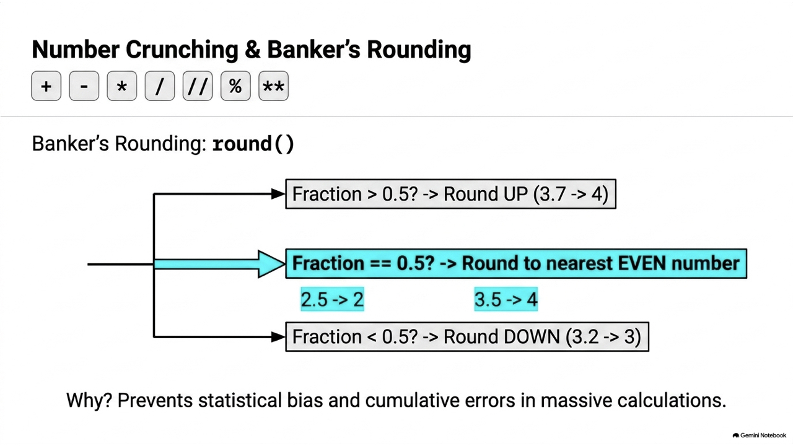
</div>

---

## 範例：天、時、分、秒換算

* 算出太空飛行共需幾天、幾小時、幾分、幾秒：

```python
dist = 384400 # 地球到月球距離
speed = 1225  # 馬赫時速
total_hours = dist / speed # 小時

# 1. 傳統除法與餘數
days = total_hours // 24
hours = total_hours % 24

# 2. 使用 divmod() 同時求商與餘數
days, hours = divmod(total_hours, 24)
xmins = 60 * (hours - int(hours))
mins, secs = divmod(xmins, 60)
secs = 60 * (secs - int(secs))

print('共需 {} 天 {} 小時 {} 分 {} 秒'.format(days, int(hours), int(xmins), int(secs)))
# 輸出：共需 13.0 天 1 小時 47 分 45 秒
```

---

## Concept Check Question (CCQ 3)

<div class="ccq-columns">
  <div class="ccq-text">

**下列程式碼執行後，其輸出結果為何？**
```python
print(10 // 4, round(3.5))
```

* **A.** `2.5 4`
* **B.** `2 3`
* **C.** `2 4`
* **D.** `2.5 3`

  </div>
  <div class="ccq-logo">
    
  </div>
</div>

---

## CCQ 3 - 答案與解析

<div class="ccq-columns">
  <div class="ccq-text">

### **正確答案：C. 2 4**

* **解析**：
  * `10 // 4`：`//` 為整數除法（取整數商），結果為 `2`。
  * `round(3.5)`：小數部分恰為 `0.5` 時，Python 採用銀行家捨入法，會捨入到最接近的**偶數**（即 4），故結果為 `4`。

  </div>
  <div class="ccq-logo">
    
  </div>
</div>

---

## 2.3.2 字串運算 (String Operators)

| 運算子 | 說明 | 範例 |
| :-: | :--- | :--- |
| `+` | 字串串接 | `"Hello, " + "world"` -> `"Hello, world"` |
| `*` | 重複字串 | `"abc" * 3` -> `"abcabcabc"` |
| `[]` | 索引取得單一字元 | `"Python"[0]` -> `"P"` |
| `[:]` | **切片取得子字串（左閉右開）** | `"Python"[1:4]` -> `"yth"` (不包含索引4) |
| `in` | 檢查是否包含子字串 | `"e" in "Hello"` -> `True` |

---
<!-- _class: full-image-slide -->

<div class="centered-image">
  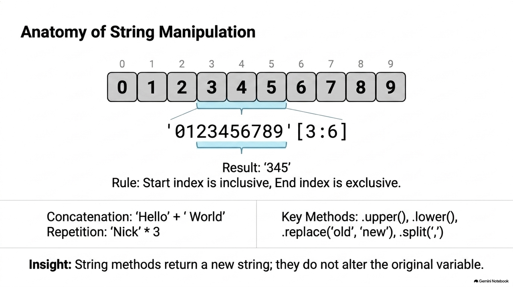
</div>

---

## 字串運算與切片範例

```python
name = "Nick"
print(name * 3)    # 輸出: NickNickNick
print('N' in name) # 輸出: True

# 字串索引與切片
s = "0123456789"
print(s[5])        # 輸出: 5 (從 0 開始數起)
print(s[3:6])      # 輸出: 345 (只取得索引 3, 4, 5 的字元)

# 字串基本函式
hello = "Hello, Nick"
print(hello.upper())                  # HELLO, NICK
print(hello.replace('Hello', 'Hi'))   # Hi, Nick
print(hello) # 注意！字串在 Python 中是不可變的，原值不變
```

---

## Concept Check Question (CCQ 4)

<div class="ccq-columns">
  <div class="ccq-text">

**給定字串 `s = "Python"`，執行 `print(s[1:4])` 會印出什麼？**

* **A.** `"yth"`
* **B.** `"pyth"`
* **C.** `"ytho"`
* **D.** `"y"`

  </div>
  <div class="ccq-logo">
    
  </div>
</div>

---

## CCQ 4 - 答案與解析

<div class="ccq-columns">
  <div class="ccq-text">

### **正確答案：A. "yth"**

* **解析**：
  * `s = "Python"` 的索引為：`P:0, y:1, t:2, h:3, o:4, n:5`。
  * 切片 `s[start:end]` 是**左閉右開**（含 start，不含 end）。
  * `s[1:4]` 提取索引 `1, 2, 3`，即 `"yth"`。

  </div>
  <div class="ccq-logo">
    
  </div>
</div>

---

## 2.3.3 關係運算與邏輯運算

* **關係運算**：用於比較兩個值，回傳 `True` 或 `False`：
  `==` (等於)、`!=` (不等於)、`<` (小於)、`>` (大於)、`<=` (小於等於)、`>=` (大於等於)
* **邏輯運算**：用於組合多個布林條件：
  * **`and`**：兩者皆為 True，結果才為 True。
  * **`or`**：兩者只要有一者為 True，結果即為 True。
  * **`not`**：邏輯反轉（True 變 False，False 變 True）。

---
<!-- _class: full-image-slide -->

<div class="centered-image">
  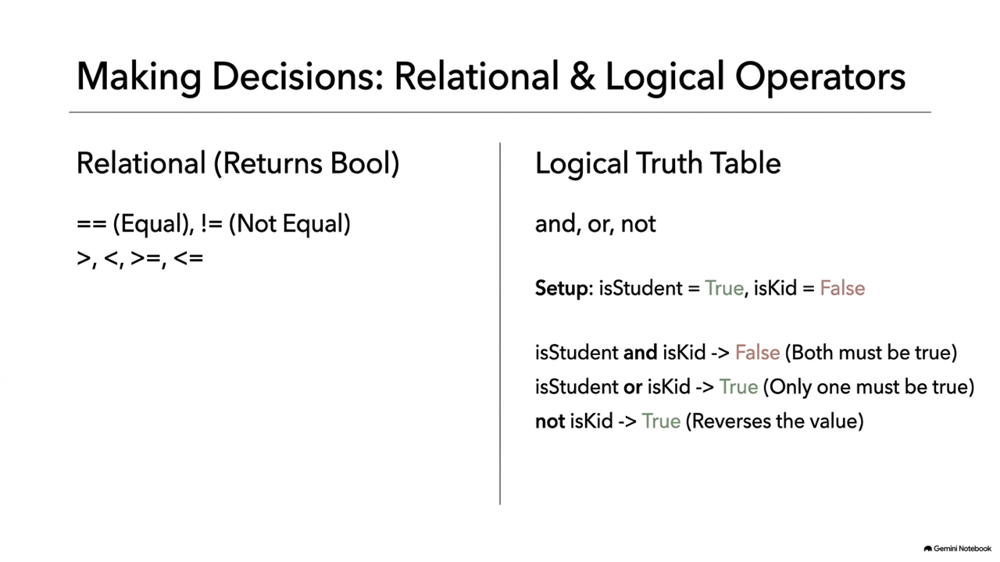
</div>

---

## 關係與邏輯運算範例

```python
# 關係運算
print(11 > 2)     # True
print(11 >= 11)   # True
print(11 != 2)    # True

# 邏輯運算
a = 11 > 2        # True
b = 1 > 9         # False

print(a and b)    # False (True and False)
print(a or b)     # True  (True or False)
print(not a)      # False (not True)
```

## Concept Check Question (CCQ 5)

<div class="ccq-columns">
  <div class="ccq-text">

**下列邏輯表達式運算後的結果為何？**
```python
is_student = True
is_kid = False
print(is_student or is_kid and not is_student)
```

* **A.** `False`
* **B.** `True`
* **C.** `None`
* **D.** `TypeError`

  </div>
  <div class="ccq-logo">
    
  </div>
</div>

---

## CCQ 5 - 答案與解析

<div class="ccq-columns">
  <div class="ccq-text">

### **正確答案：B. True**

* **解析**：
  * 優先權為：`not` > `and` > `or`。
  * `not is_student` -> `not True` -> `False`
  * `is_kid and False` -> `False and False` -> `False`
  * `is_student or False` -> `True or False` -> `True`

  </div>
  <div class="ccq-logo">
    
  </div>
</div>

---
<!-- _class: lead -->

# **2.4 輸入與輸出**

---

## 2.4.1 input 輸入與解析

* `input()` 讀入的資料**一律是字串型態**，若需進行數學運算，必須主動轉換型態。
* **多筆資料解析**：
  * **`split()`**：將讀入的字串以空白（或指定字元）切分開來。
  * **`eval()`**：直接解析與執行字串中的運算，或自動將字串解析成對應型態（如以逗號分隔的數值組）。

---
<!-- _class: full-image-slide -->

<div class="centered-image">
  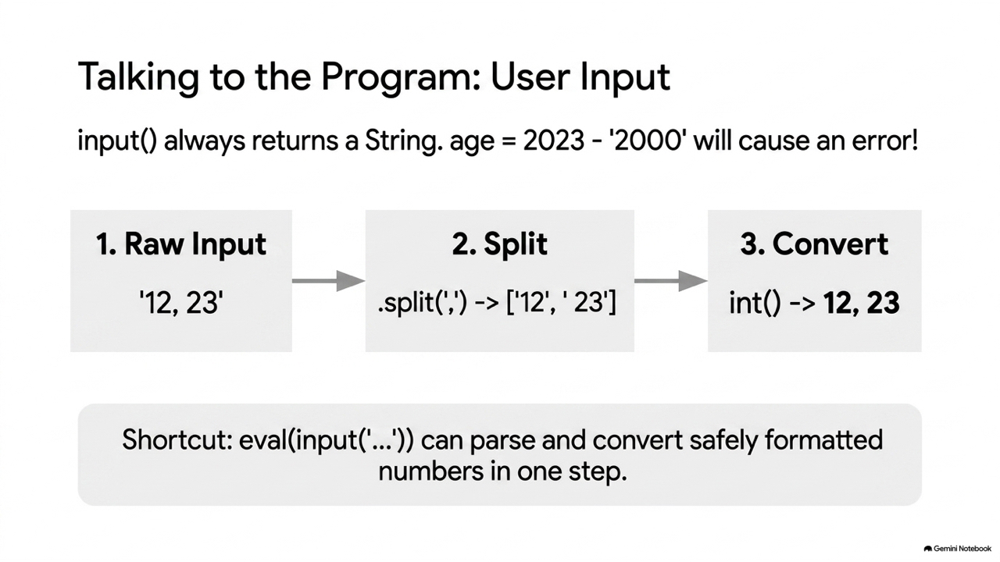
</div>

---

## 輸入解析與 eval 範例

```python
# 解析空白間隔的多個輸入
a1, a2 = input("請輸入你和你哥哥的年齡（以空白分隔）: ").split()
age_diff = int(a2) - int(a1)
print('年齡差:', age_diff)

# 使用 eval() 簡化逗號間隔的輸入與自動轉型
age1, age2 = eval(input("請輸入兩人的年齡（以逗號分隔，例如 12,23）: "))
print(age1, age2, type(age1)) # 12 23 <class 'int'>
```

---

## 2.4.2 格式化輸出 (String Formatting)

* 為了將變數內容整齊漂亮地嵌入到字串中，Python 提供三種主要方法：
  * **f-string (推薦)**：最簡潔直觀（例：`f"{name} 歲數是 {age}"`）。
  * **`.format()`**：以花括號作為預留孔（例：`"{} 歲數是 {}".format(name, age)`）。
  * **`%` 運算子**：C 語言風格（例：`"%s 歲數是 %d" % (name, age)`）。

---
<!-- _class: full-image-slide -->

<div class="centered-image">
  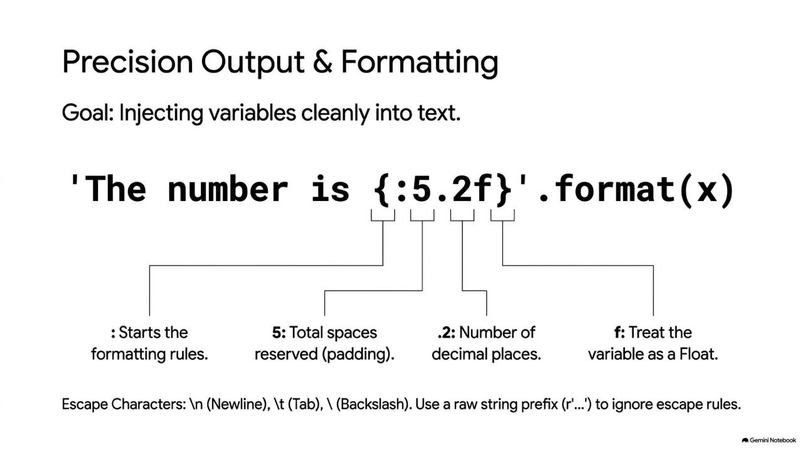
</div>

---

## 排版對齊設定 (Alignment & Padding)

* 在格式化輸出中，可控制欄位寬度、對齊方向及小數點位數：

```python
# 1. 舊式 % 排版
print("'%5d'" % 12)       # 右對齊，寬度 5 格 -> '   12'
print("'%-5d'" % 12)      # 左對齊，寬度 5 格 -> '12   '
print("'%8.2f'" % 3.1415) # 浮點數，小數 2 位，寬度 8 格 -> '    3.14'

# 2. format() 排版
print("{:>5d}".format(12)) # 右對齊，寬 5 -> '   12'
print("{:<5d}".format(12)) # 左對齊，寬 5 -> '12   '
print("{:8.2f}".format(3.1415)) # 寬 8，小數 2 位 -> '    3.14'
print("{:<10s}".format("hello")) # 字串左對齊，寬 10 -> 'hello     '
```

---

## 2.4.3 逃脫字元與字串前綴

* **逃脫字元**：以反斜線 `\` 開始，用來表示無法直接輸入的字元：
  * `\n`：換行。
  * `\t`：水平定位 (Tab) 對齊。
  * `\\`：代表反斜線本身。
* **字串前綴**：
  * **`r` (Raw String)**：不解析字串內的反斜線逃脫字元，原樣輸出。
  * **`f` (f-string)**：格式化插值字串。

```python
print("first line\nsecond line")  # 換行
print(r"raw string: first line\nsecond line") # 輸出原本的 \n
```

---

## 2.4.5 檔案讀寫 (with open)

* 使用 **`with open()`** 區塊管理開檔與關檔，當程式執行完該區塊時，**不論是否出錯，都會安全且自動地關閉檔案**。
* **寫入模式 (`'w'`)**：
  * `print(..., file=f)`：將 print 的內容直接寫入檔案，取代標準螢幕輸出。
* **讀取模式 (`'r'`)**：
  * `f.readline()`：一次讀取檔案的一行資料（會連帶讀入換行符號 `\n`）。

---
<!-- _class: full-image-slide -->

<div class="centered-image">
  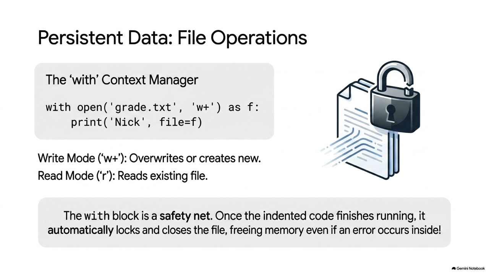
</div>

---

## 檔案讀寫實務範例

```python
# 1. 寫入學生成績檔
with open("grade.txt", "w", encoding="utf-8") as f:
    print('張三', file=f)
    print('100, 20, 40', file=f)
    print('李四', file=f)
    print('90, 50, 100', file=f)

# 2. 讀取學生成績並計算平均
with open("grade.txt", "r", encoding="utf-8") as f2:
    st1 = f2.readline().replace('\n', '')  # 讀取 '張三'
    st1a, st1b, st1c = eval(f2.readline()) # 讀取三科成績
    st1d = (st1a + st1b + st1c) / 3
    print("{} 的平均成績為: {:5.1f}".format(st1, st1d))
    
    st2 = f2.readline().replace('\n', '')  # 讀取 '李四'
    st2a, st2b, st2c = eval(f2.readline()) # 讀取三科成績
    st2d = (st2a + st2b + st2c) / 3
    print("{} 的平均成績為: {:5.1f}".format(st2, st2d))
```

## Concept Check Question (CCQ 6)

<div class="ccq-columns">
  <div class="ccq-text">

**在 Python 中進行檔案讀寫時，使用 `with open(...)` 的主要優點是什麼？**

* **A.** 檔案的寫入速度會比傳統 `open()` 快速很多。
* **B.** 能自動將寫入的資料進行壓縮，節省硬碟空間。
* **C.** 無論程式是否正常結束或發生異常，都會自動關閉檔案。
* **D.** 能夠自動修正程式碼中的語法錯誤。

  </div>
  <div class="ccq-logo">
    
  </div>
</div>

---

## CCQ 6 - 答案與解析

<div class="ccq-columns">
  <div class="ccq-text">

### **正確答案：C. 無論程式是否正常結束或發生異常，都會自動關閉檔案。**

* **解析**：
  * `with` 作為**上下文管理器**，保證在結束區塊時（不論是否中途崩潰），都會自動呼叫 `close()` 釋放資源。

  </div>
  <div class="ccq-logo">
    
  </div>
</div>

---
<!-- _class: lead -->

# **2.5 程式錯誤與最佳實踐**

---

## 2.5 程式錯誤的三種類型

* **語法錯誤 (Syntax Error)**：程式碼不符合語法規則，直譯器無法解譯執行。（例：少括號、少冒號）
* **執行期錯誤 (Runtime Error)**：語法完全正確，但在特定條件或輸入下因為無效操作崩潰。（例：除以零、轉型失敗）
* **邏輯錯誤 (Logic Error)**：程式能順利執行到底，但運算公式寫錯，導致輸出結果並非預期。（例：加寫成乘）

---
<!-- _class: full-image-slide -->

<div class="centered-image">
  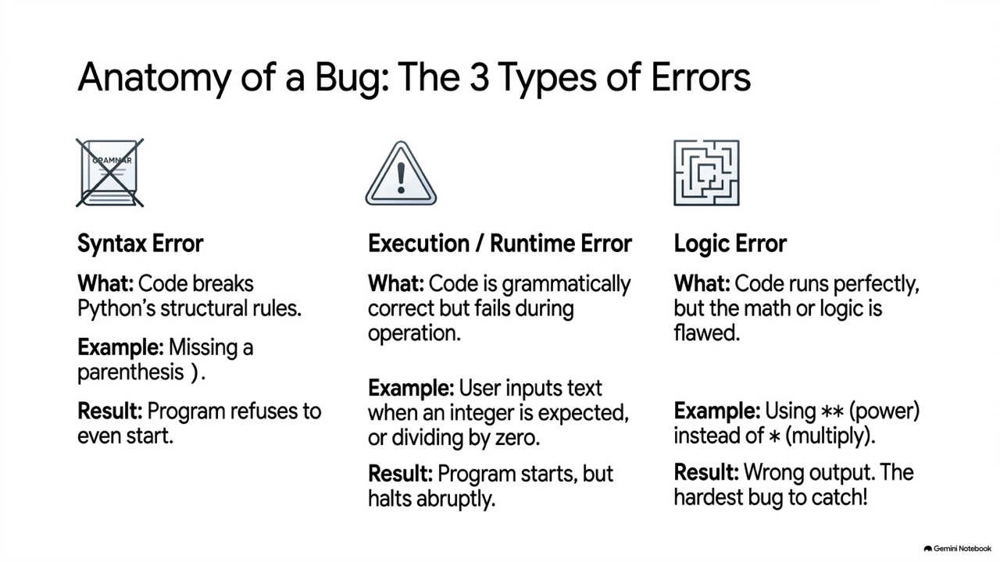
</div>

---

## 程式錯誤範例與修正

```python
# 1. 語法錯誤 (Syntax Error)
radius = int(input("The radius? ") # ❌ 括號不匹配，會直接報 SyntaxError
```

```python
# 2. 執行期錯誤 (Runtime Error)
radius = int(input("The radius? ")) # 如果使用者輸入 "1.1"，整數轉型失敗崩潰
# 修正為：
radius = float(input("The radius? "))
```

```python
# 3. 邏輯錯誤 (Logic Error)
area = radius ** radius * 3.14 # ❌ 錯誤公式（** 代表次方，應為 radius * radius）
```

```python
# 4. 最佳實踐：使用命名常數 ( PI ) 提高可維護性
PI = 3.14159
radius = float(input("The radius? "))
area = radius * radius * PI # 易讀且易於日後修改 PI 的精確度
```

---
<!-- _class: lead -->

# **2.6 程式的註解 (Comments)**

---

## 2.6 程式的註解

* 註解是程式中被直譯器忽略的說明文字，用來幫助人類理解程式碼的邏輯、意圖與結構。
* **三種常用註解方式**：
  * **單行註解**：在程式碼行上方，以 `#` 開頭。
  * **行內註解**：在程式碼尾端，以 `#` 標示。
  * **多行/區塊註解**：以三個單引號 `'''` 或雙引號 `"""` 包裹。

---
<!-- _class: full-image-slide -->

<div class="centered-image">
  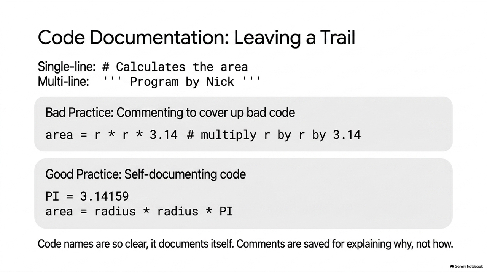
</div>

---

## 氣泡排序 (Bubble Sort) 的註解範例

```python
'''
本程式用來排序一群資料
這群資料是隨機產生的
透過氣泡排序法來排序

by Nick Hsueh
'''
import random
a = []

# 單行註解：隨機的產生10個數字
for i in range(10):
    a.append(random.randint(1,100))
print(a)     # 行內註解：印出原始資料

s = len(a); r = s-1
for i in range(1, r+1):
    for j in range(0, s-i):
        # 將 a[j] 與 a[j+1] 的資料對調
        if a[j] > a[j+1]:
            temp = a[j]
            a[j] = a[j+1]
            a[j+1] = temp
print("排序後結果:", a)
```

---
<!-- _class: lead -->

# **2.7 程式練習 (OJ Exercises)**

---
<!-- _class: full-image-slide -->

<div class="centered-image">
  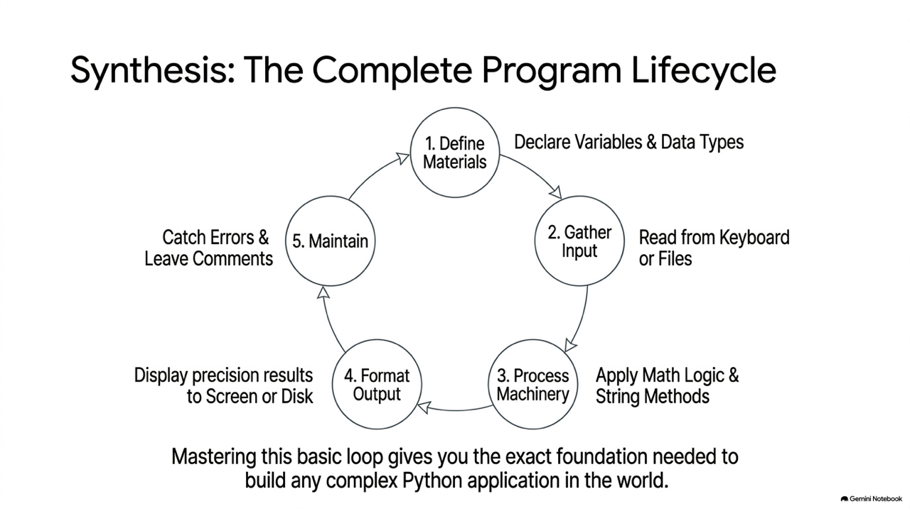
</div>

---

## 練習 1：OJ 面積與周長

* **描述**：輸入直徑，計算出圓形面積與周長，並輸出至小數點下兩位（PI 請用 3.14 計算）。
* **OJ 程式框架**：
  ```python
  d = int(input('')) # d 為直徑，此行勿改
  
  r = d / 2          # 計算半徑
  a = round(r * r * 3.14, 2) # 面積
  p = round(d * 3.14, 2)     # 周長
  
  print(a)           # 此行勿改
  print(p)           # 此行勿改
  ```

---

## 練習 2：OJ 星期幾

* **描述**：已知某月的一號是星期 1，輸入該月的日期，回答該天是星期幾。若為星期日則回傳 7（即答案落在 1 到 7 之間）。
* **OJ 程式框架**：
  ```python
  day = int(input(''))
  
  # 1號是星期1，(day - 1) % 7 結果為 0~6，再 +1 即為 1~7
  ans = (day - 1) % 7 + 1
  
  print(ans)
  ```

---

## 練習 3：OJ 溫度轉換

* **描述**：輸入攝氏溫度，輸出華氏溫度至小數點下兩位。
  公式：`華氏 = 攝氏 * ( 9 / 5 ) + 32`。
* **OJ 程式框架**：
  ```python
  c = int(input('')) # c 為攝氏，此行勿改
  
  f = round(c * (9 / 5) + 32, 2)
  
  print (f) # f 為華氏，此行勿改
  ```

---

## 練習 4：OJ 計算距離

* **描述**：輸入兩個座標 $(x_1, y_1)$ 與 $(x_2, y_2)$，求出這兩點的歐式距離（開根號可使用 `** 0.5`）。
* **OJ 程式框架**：
  ```python
  x1, y1 = eval(input('')) # 第一個座標
  x2, y2 = eval(input('')) # 第二個座標
  
  # 計算兩點距離公式
  d = ((x1 - x2) ** 2 + (y1 - y2) ** 2) ** 0.5
  
  print(d)
  ```
