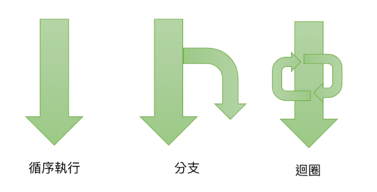
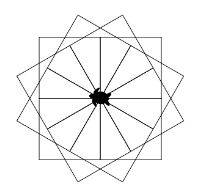
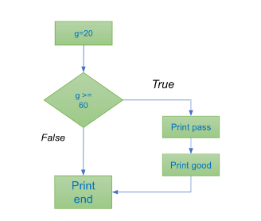
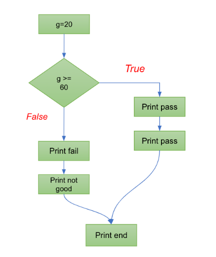
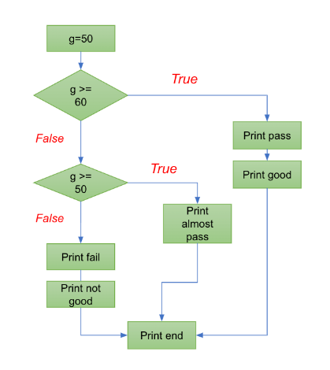
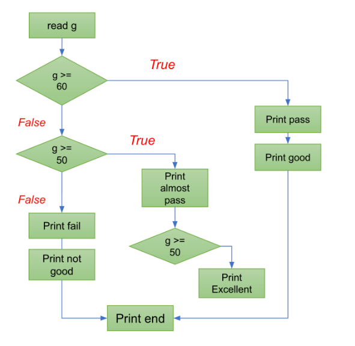
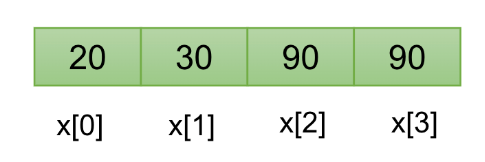
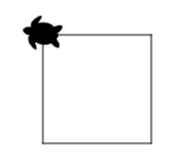
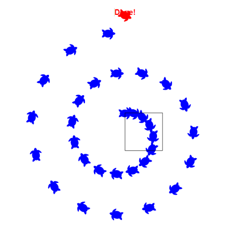

Ch03 Logic and control
===

我們常常說程式能力好的人具備邏輯的觀念，指的就是這個章節**邏輯運算**。此章節我們分為四個單元來做解說。首先是程式的執行流程，分為三個部分，循序的執行、分支以及迴圈。在上一個章節中，我們已經講解過所謂循序的執行，在這個章節我們會把重點放在分支跟迴圈。




什麼是分支呢？舉個例子，今天`如果`我中了樂透大獎，我就買買輛車犒賞自己慶祝一下，`否則` 就買輛假踏車代步。這就是分支的一個涵義。我本來有一個既定的路徑要執行，但是因為`滿足了某一個條件`，所以走了另外一條路徑。這就會講到所謂的 `if else` 的語法。

3.2 跟大家介紹所謂的"迴圈"。迴圈就是程式會不斷重複的執行一段相同的程式碼 -- 這個是電腦的強項之一！它能不斷的執行相同的程式碼也不會覺得厭倦，跟我們人類是不一樣的。這個是電腦的程式能夠處理大型的資料的第一步，以前我們循序執行的時候，資料沒有辦法被重複地讀進來、處理，再輸出，可是因為有了迴圈，大資料我們也不害怕了。

3.4 介紹三個範例，第一個範例是 `忙碌的小烏龜`，這個是在 python 裡頭的一個套件叫做 turtle，我們應用它來畫一些幾何的圖形。各位看這個幾何的圖好像是一朵很複雜的花，其實這一個程式碼行數大概只有三到五行，因為我們如果把這個問題拆解成畫很多個正方形，每一次只是稍微轉一個角度這樣子而已。所以如果學會怎麼樣把一個問題拆解成重複性類似的工作，就可以大大降低工作的 Effort。第二個範例是`韓信點兵`，相信大家以前學數學的時候都解過這一個題目，那現在我們換一個角度來解這一個題目，你會發現換個角度思考解法就會有所不同，甚至用程式的方式來解答更是容易。第三個範例是猜數字，我們讓電腦隨機的產生一個數字讓你猜猜看，輸入數字後電腦會提示你太高還是太低，最後你就能把答案猜出來。這個就會應用到迴圈還有判斷數字的一個功能。




本章內容非常的重要，學習完了這個章節你就會了解電腦的邏輯運算的概念，然後你將具備依照不同的條件，做不同的處理的能力，所以你的程式就會開始變得非常有彈性。


## 3.1 分支




### 3.1.1 if

if 判斷句
```python
g = 20

if g >= 60: 
    # code block
    # 當 g >= 60 成立後才會執行以下的程式
    print ("pass")
    print ("good")
print ("end") # 不論如何都會執行的程式
```

第四行到第七行程式碼內縮，形成一個區塊，表示當條件滿足時才會執行。

> [!WARNING]
> 同一個區塊，內縮的空格數必須相同；上述程式碼都是內縮四格。

> [!WARNING]
> `if` 最後面要記得加上 `:`

這段程式碼設定一個變數 `g` 的值為 20，然後進行一個條件判斷：

1. 如果 `g` 大於等於 60，則執行以下程式碼塊中的兩行：
   - 印出 "pass"
   - 印出 "good"
2. 不論如何，最後都會執行一行程式碼：
   - 印出 "end"

根據目前的 `g` 值為 20，條件 `g >= 60` 不成立，所以只會執行最後的印出 "end"。

> [!WARNING]
> 區塊的重要性：如果程式碼沒有放進區塊內，其含義完全不同。下面的程式雖然語法正確，但語意產生錯誤。

```python
if g >= 60:
    print ("pass")
print ("good") # 應該放在區塊內
print ("end")
```

### 3.1.2 else



表示沒有滿足 if 時會執行的程式區塊。

```python
if g >= 60:
    print ("pass")
    print ("good")
else:
    print ("fail")    
    print ("not good")
print ("end")
```
    
> [!WARNING]
> 注意 `else` 一定要和 `if` 一起出現，單獨出現是錯誤的語法。

### 3.1.3 elif 




elif 表示 else if, 也就是在 else 之後還有更多的判斷。

```python
g = 50
if g >= 60:
    print ("pass")
    print ("good")
elif g >=50: # else if
    print ("almost pass")    
else:
    print ("fail")    
    print ("not good")    
print ("end")
```

這段程式碼中，變數 `g` 的值被設定為 50，然後進行一個條件判斷：

1. 如果 `g` 大於等於 60，則執行以下程式碼塊中的兩行：
   - 印出 "pass"
   - 印出 "good"
2. 否則，如果 `g` 大於等於 50（但小於 60），則執行以下程式碼塊中的一行：
   - 印出 "almost pass"
3. 如果以上兩個條件都不成立，則執行以下程式碼塊中的兩行：
   - 印出 "fail"
   - 印出 "not good"
最後，無論哪個條件成立，都會執行一行程式碼：
- 印出 "end"

根據目前的 `g` 值為 50，第二個條件 `g >= 50` 成立，所以只會執行印出 "almost pass" 以及最後的印出 "end"。


#### 巢狀的判斷句

if 內還有 if

```python
g = 70
if g >= 60:
    print ("pass")
    print ("good")
    if (g >= 90):
        print ("excellent")
elif g >=50:
    print ("almost pass")    
else:
    print ("fail")    
    print ("not good")    
print ("end")
```

### 3.1.4 邏輯盲點



> [!WARNING]
> **判斷句永遠無法成真的邏輯錯誤：**
以下程式碼雖然可以執行，但程式是有問題的

```python
g = 70
if g >= 60:
    print ("pass")
    print ("good")
elif g >=50:
    print ("almost pass")    
    if (g >= 90): 
        print ("excellent")    
else:
    print ("fail")    
    print ("not good")    
print ("end of report")
```
這段程式碼存在邏輯上的錯誤是因為第三個條件 `if (g >= 90)` 永遠不會成立，因為它位於第二個條件 `elif g >= 50` 的內部，而進入此條件表示他不滿足第一個條件 `g >= 60`，一個數不可能同時小於 60 又大於 90。

### 3.1.5 命名

```python
# 變數命名：有意義的變數，避免複雜難懂的邏輯
gender = 'F'; age = 20

# dirty code
if ( (age >= 12 and age <= 20) and gender == 'M'): 
    print ("boy")    

# better code
young = (age >= 12 and age <= 20)
male = (gender == 'M')

if (young and male): 
    print ("boy")    
```

這個程式碼示範了良好的變數命名對於程式碼的可讀性和維護性的重要性：

1. **Dirty Code（不良的程式碼）：**
   在這個版本的程式碼中，條件判斷式 `( (age >= 12 and age <= 20) and gender == 'M')` 難以一眼看出其意義。這樣的條件式不利於其他人閱讀和理解程式碼，也不容易進行維護和修改。
2. **Better Code（較佳的程式碼）：**
   在這個版本的程式碼中，新增了邏輯變數。使用 `young` 和 `male` 這樣有意義的變數名稱，明確表達了它們的用途。這樣的變數命名讓程式碼更易讀，人們可以立即理解 `young` 是否表示年輕，`male` 是否表示男性。同時，條件判斷式 `(young and male)` 也變得簡潔明了，讓程式碼更容易理解和維護。

良好的變數命名是程式碼可讀性和可維護性的關鍵因素之一，它使程式碼更容易理解，降低了出錯的風險，並促進了團隊合作。

### 3.1.5 小範例

一個小範例計算成績各等級的數量:

```python
math = 67
eng = 78
phy = 90
A = 0 # 得 A 的數量
B = 0 # 得 B 的數量
C = 0 # 得 C 的數量

if (math >=90):
    print ("math good")
    A = A+1
elif (math >= 80):
    B = B + 1
else:   
    C = C + 1
    
if (eng >=90):
    print ("eng good")
    A = A+1
elif (eng >= 80):
    B = B + 1    
else:    
    C = C + 1
    
if (phy >=90):
    print ("phy good")
    A = A+1
elif (phy >= 80):
    B = B + 1    
else:    
    C = C + 1
    
print ('獲得 A 的數量：', A)    
print ('獲得 B 的數量：', B)    
print ('獲得 C 的數量：', C)    
```


## 3.2 迴圈
### 3.2.1 while 迴圈

如果我們要累加 1..5:
```python
# 第一種寫法
sum = 1+2+3+4+5
print (sum)
```
這種方式不好，手打到酸。試想如果題目改成 1 加到 100?

來看第二種寫法

```python
sum = 0
x = 1

sum = sum + x 
x = x + 1 
sum = sum + x 
x = x + 1 
sum = sum + x 
x = x + 1 
sum = sum + x 
x = x + 1 
sum = sum + x 
print (sum)
```
透過變數來做累加，我們只要不斷地複製 line4-line5 就可以完成累加。當然這也是很糟糕的做法。

上述的方法都不好，但有沒有發現"規則性"？

第三種寫法：使用 loop：

```python
sum = 0; x = 1
while x <= 100:
    sum = sum + x
    x = x + 1
print (sum)    
```
這段程式碼計算從 1 到 100 的所有整數的總和，並將結果印出。以下是程式碼的執行過程：

1. `sum` 變數初始化為 0，`x` 變數初始化為 1。
2. 進入 `while` 迴圈，檢查 `x` 是否小於等於 100。由於 `x` 初始值為 1，這個條件成立。
3. 在迴圈內部，將 `x` 的值加到 `sum` 上，然後將 `x` 增加 1。
4. 回到迴圈的開頭，再次檢查 `x` 是否小於等於 100。如果是，則重複步驟 3。
5. 重複進行步驟 3 和步驟 4，直到 `x` 大於 100。
6. 當 `x` 大於 100 時，退出迴圈。
7. 印出 `sum` 的值，即 1 到 100 的所有整數的總和。

最後，這段程式碼會印出總和值，該值是 1 到 100 的所有整數的總和，即 5050。


> [!WARNING]
> **注意無窮迴圈**
> 若少了 `x = x + 1`，則 `x <= 5` 永遠成真，程式會在迴圈裡面一直執行，導致程式當掉。

> [!WARNING]
> 造成無窮迴圈的程式
> ```python
> sum = 0; x = 1
> while x <= 100:
>     sum = sum + x
> print (sum)    
> ```

#### 小範例

* 輸入成績，一直到輸入為 -999
* 輸出成績總和

```python
sum = 0; grade = 0 # 設定初始值

while (grade != -999):
    grade = int (input("input your grade: "))
    sum += grade 
print ("total is", sum)        
```

這段程式碼的目標是計算連續輸入的成績總和，直到使用者輸入 -999 為止。以下是程式碼的執行過程：

1. `sum` 和 `grade` 變數都被初始化為 0，用於追蹤總和和接收用戶輸入的成績。
2. 進入 `while` 迴圈，檢查 `grade` 是否不等於 -999。由於 `grade` 初始化為 0，條件成立，所以進入迴圈內部。
3. 在迴圈內部，程式會請求使用者輸入一個成績，然後將該成績轉換為整數並將其加到 `sum` 上。
4. 再次檢查 `grade` 是否不等於 -999。如果使用者輸入的仍然不是 -999，則重複步驟 3。
5. 重複進行步驟 3 和步驟 4，直到使用者輸入 -999 為止。
6. 當使用者輸入 -999 時，退出迴圈。
7. 印出 `sum` 的值，即所有輸入的成績的總和。

這段程式碼的邏輯錯誤在於它計算了使用者輸入的 -999 這個值，並將它加入到總和中。這意味著無論使用者輸入了多少個有效的成績，-999 都會被計入總和，從而導致計算出錯誤的總和。為了修正這個問題，應該在判斷 `grade` 是否等於 -999 之前，先檢查它是否等於 -999，如果是，就不應該將它加到總和中。這可以通過在迴圈內部的條件判斷之前添加一個額外的條件來實現。以下是修正後的程式碼：

```python
sum = 0
grade = 0

while True:
    grade = int(input("input your grade: "))
    if grade == -999:
        break
    sum += grade

print("total is", sum)
```

這樣，只有有效的成績會被加到總和中，-999 不會被計算在內。

或是另一個做法:

```python
sum = 0
grade = 0

while grade != -999:
    grade = int(input("input your grade: "))
    if grade != -999:  # 確保不將 -999 加入總和
        sum += grade

print("total is", sum)
```


### 3.2.2 for … in list

雖然 list 在下一章節會正式介紹，但 list 與 for 常常會合用，我們先看一下。

#### list 簡介



如果有一群資料記錄著一些分數，沒有用 list，會很麻煩，我們必須為每一筆資料取一個變數：

```python
sum = 0
x1=20; x2=30; x3=90; x4=90
sum = x1 + x2 + x3 + x4
print ('總和為：', sum)    
```

用 list 方便多了

```python
sum = i = 0
x = [20, 30, 90, 90] 
while i < len(x):
    sum = sum + x[i]
    i += 1
print ('使用 while 迴圈的總和為', sum)    
```

這段程式碼演示了如何使用 `while` 迴圈來計算一個列表（List）中所有元素的總和。以下是對程式碼的解釋：

1. `sum` 和 `i` 變數都被初始化為 0，`x` 是一個包含整數的列表。
2. 進入 `while` 迴圈，它的條件是 `i` 小於列表 `x` 的長度（即 `len(x)`）。這個條件確保在列表的範圍內進行迴圈運算。
3. 在迴圈內部，程式將 `x[i]`（即列表 `x` 中的元素）的值加到 `sum` 變數中，然後將 `i` 的值增加 1，以便處理下一個元素。
4. 再次檢查 `i` 是否小於列表 `x` 的長度。如果是，則重複步驟 3，繼續處理下一個元素。
5. 重複進行步驟 3 和步驟 4，直到 `i` 大於或等於列表 `x` 的長度。
6. 當 `i` 大於或等於列表 `x` 的長度時，退出迴圈。
7. 印出 `sum` 的值，即列表 `x` 中所有元素的總和。

這段程式碼展示了如何使用 `while` 迴圈和索引 `i` 來迭代處理列表 `x` 中的每個元素，然後計算它們的總和。


請注意，Python 中有更簡潔的方式來實現這一目標，例如使用 `for` 迴圈：

```python
sum = 0
x = [20, 30, 90, 90] 
for g in x:
    sum = sum + g
print (sum)    
```

這段程式碼使用 `for` 迴圈計算列表 `x` 中所有元素的總和。以下是對程式碼的解釋：

1. `sum` 變數被初始化為 0，`x` 是一個包含整數的列表。
2. 進入 `for` 迴圈，它會遍歷列表 `x` 中的每個元素，並將當前元素的值賦給變數 `g`。
3. 在迴圈內部，程式將當前元素的值 `g` 加到 `sum` 變數中，這樣就不斷累積了所有元素的值。
4. 迴圈會繼續遍歷列表 `x` 中的下一個元素，直到所有元素都被處理完畢。
5. 當迴圈處理完所有元素後，程式會印出 `sum` 的值，即列表 `x` 中所有元素的總和。

這種使用 `for` 迴圈的方法更簡潔且易讀，Python 中的 `for` 迴圈可以直接遍歷容器（如列表）中的元素，不需要手動管理索引，因此更加方便。在這個例子中，程式碼一行就實現了對列表中所有元素的總和計算。

> [!NOTE]
> :football: Exercise
> 有兩個變數 names, grades 分別紀錄一群人的姓名與成績，請分行列出每個的名字與成績，如下：
> > The grade of xxx is ooo

<details>
<summary>點擊查看解答 (Solution)</summary>

```python
names = ['John', 'Nick', 'Albert', 'Jie'] 
i = 0
grades = [20, 100, 98, 86]
for n in names:
    print ('The grade of', n, 'is', grades[i])
    i += 1
```

**輸出結果：**
```
The grade of John is 20
The grade of Nick is 100
The grade of Albert is 98
The grade of Jie is 86
```

</details>

### 3.2.3 for range 迴圈

for ... range 迴圈

```python
# 注意 i 是從 0 開始
for i in range(4):
    # 利用 end='' 來避免換行
    print (str(i), end ='')
 
for i in range(4):
    for j in range(i+1):
        print ("*", end='')
    print ()    

for i in range(4):
    for j in range(i+1):
        print (str(i), end='')
    print ()    
```    


range (a, b, c) 三個參數

```python
sum = 0
for i in range(11):
    sum += i
print (sum)    
 

sum = 0
for i in range(1, 11, 2):
    print (i)
    sum += i
print (sum)    
```

注意：range(10, 1, 1) 會回傳一個空的資料集，因為沒有辦法用 1 來做遞減。


### 3.2.4 迴圈的中斷

```python
sum = 0
for i in range(100):
    sum += i
    if i == 10:
        break
print (sum, i)
```

`i in range(100)` 本來會是一個迴圈從 0 跑到 99 共100 次，但因為第三行判斷 `i==10` 就 break 跳出迴圈，所以最後只有 0+1+2...10，最後輸出為 55。

#### prime 範例

```python
# 沒有用 break 的版本
import time
x = 2000000
isPrime = True
count=0
t1 = time.time()
for i in range(2, x):
   if x % i == 0:
       # 能整除就不是質數
       isPrime = False 
       count += 1
print (x, 'is prime?', isPrime)
t2 = time.time()
print ('Computing time:', round(t2-t1, 3), 'sec')    
print ('isPrime=False 共執行了{}次'.format(count))
```
執行結果如下：可以看到 isPrime=False 共執行了54次，只要一次就可以說明 x 是質數了，多花了很多的時間。
```
2000000 is prime? False
Computing time: 0.243 sec
isPrime=False 共執行了54次
```

使用 break 少了許多不必要的計算：

```python
# 用 break 的版本
import time
x = 2000000
isPrime = True
count=0
t1 = time.time()
for i in range(2, x):
   if x % i == 0:
       # 能整除就不是質數
       isPrime = False 
       count += 1
       break            # 加上 break
print (x, 'is prime?', isPrime)
t2 = time.time()
print ('Computing time:', round(t2-t1, 3), 'sec')    
print ('isPrime=False 共執行了{}次'.format(count))
```

結果如下：
```
2000000 is prime? False
Computing time: 0.002 sec
isPrime=False 共執行了1次
```

#### for break else

我們再來看 `for break else` 這樣的子句。下面的範例我們要印出所有小於 n 的質數。

```python
n = 100
# 印出所以小於 n 的質數
print ('The prime numbers below {} are:'.format(n))
for x in range(2, n+1):
  for d in range(2, x):
    if x%d == 0:
      break
  else: 
    print (x, end=' ')
```

注意這個 else 子句與內部的 for 迴圈相關聯。如果內部的 for 迴圈正常完成（即沒有被 break 中斷），則執行 else 子句中的程式碼。

輸出為：
```
The prime numbers below 100 are:
2 3 5 7 11 13 17 19 23 29 31 37 41 43 47 53 59 61 67 71 73 79 83 89 97 
```

#### continue

```python
for i in range(4):
    if i == 2:
        continue
    print (i)
```

Result:
```
0
1
3
```

## 3.3 應用

### 3.3.1 韓信點兵

韓信點兵的數學問題，也稱為韓信點兵的數學謎題，是一個古代數學問題，與中國戰國時期的韓信有關。這個問題可以用來展示數學問題的解決方法以及數學的應用。問題描述如下：

> 今有物不知其數，三三數之剩二，五五數之剩三，七七數之剩二，問物幾何？

將它翻譯成白話：這裡有一堆東西，不知道有幾個；三個三個去數它們，剩餘二個；五個五個去數它們，剩餘三個；七個七個去數它們，剩餘二個；問這堆東西有幾個？精簡一點來說：有一個數，用 3 除之餘 2；用 5 除之餘 3；用 7 除之餘 2；試求此數。

數學的解法請參考[這裡](http://episte.math.ntu.edu.tw/articles/sm/sm_29_09_1/index.html)。這裡我們用程式的解法：（更簡單容易了解）

```python
n = 2

while True:
    c1 = (n % 3) == 2
    c2 = (n % 5) == 3
    c3 = (n % 7) == 2
    
    if (c1 and c2 and c3):
        print(n)
        break
    n = n + 1
```
其中 c1 表示三三數之剩二，c2 表示 五五數之剩三，c3 表示 七七數之剩二。我們讓 n 從 2 開始跑起，如果任一條件不滿足，則 n 的加一繼續跑，直到滿足後 break。

第一個滿足的數是 23, 是不是很方便呢？

### 3.3.2 用 turtle 套件繪圖





#### 利用 turtle 套件來畫圖

```python
'''
劃一個正方形
'''
import turtle
tina = turtle.Turtle()
tina.shape('turtle')

tina.forward(100)
tina.right(90)
tina.forward(100)
tina.right(90)
tina.forward(100)
tina.right(90)
tina.forward(100)
tina.right(90)
```

#### 畫一個星星

```python
import turtle as tu

tu.color('red', 'yellow')
tu.begin_fill()
while True:
    tu.forward(200)
    tu.left(170)
    if abs(tu.pos()) < 1:
        break
tu.end_fill()
tu.done()
```


### 用烏龜畫一個螺旋



```python
import turtle
myStamp = turtle.Turtle(visible=False)
myStamp.shape("turtle")
myStamp.color("blue")
# myStamp.speed(8)
myStamp.penup() # Do not draw the path
stepLen = 20
for i in range(31):
  myStamp.stamp() # Leave an impression on the canvas
  stepLen = stepLen + 3 # Increase the step length on every iteration
  myStamp.forward(stepLen) # Move along
  myStamp.right(24) # and turn
myStamp.penup() # Do not draw the path
myStamp.goto(0, 260) # Move
myStamp.color('red')
myStamp.write('Done!', align='center', font=('Arial', 20, 'bold'))
```

### 3.3.3 猜數字遊戲

#### 猜數字範例 v1

猜數字是一個很經典的遊戲，電腦會先亂數的取一個 1-100 的數字要我們猜，我們若猜高了，電腦會提示我們直到猜對。
我們共做了三個版本，漸進式的講解，大家也可以看看哪裡錯了。

```python
import random
x = random.randint(1, 100) # 從 1 到 100 隨機產生一個整數

guess = input("Guess a number between 1 and 100")

while not isinstance(guess, int):
    guess = input("Wrong input, Please input a number")

guess = int(guess)
while guess >100 or guess < 1:
    guess = input("The number must between 1-100")

if(x == guess):
    print("Correct!!")
elif(x > guess):
    print("Guess a larger number")
else: 
    print("Guess a smaller number")
```

6-7 行的部分，我們想要檢查輸入的內容是不是一個數字，如果不是的話，就透過 isinstance 來檢查是不是整數。但這樣的觀念是錯的，使用者即使輸入 123, 其型態還是字串 str, 所以會造成離不開 while 的無窮迴圈。


#### 猜數字範例 v2

我們可以用 isdigit() 來檢查一個字串的內容是否為數字
* `'123'.isdigit()` ==> `True`
* `'abc'.isdigit()` ==> `False`

程式改為如下：

'''
```python
import random
x = random.randint(1, 100)

guess = input("Guess a number between 1 and 100: ")

while not guess.isdigit():
    guess = input("Wrong input, Please input a number: ")

guess = int(guess)
while guess > 100 or guess < 1:
    guess = input("The number must between 1-100: ")

    if(x == guess):
        print("Correct!!")
    elif(x > guess):
        print("Guess a larger number")
    else: 
        print("Guess a smaller number")
```

雖然看起來有一個 while 不斷的進行處理，但第11 行的 guess 卻沒有轉型態，所以一直都是 str-- 除了第九行那一次以外。所以 while 迴圈一直無法再進入。

#### 猜數字範例 v3

```python
import random
x = random.randint(1, 100)

correct = False    
while not correct:
     guess = input("Guess a number between 1 and 100: ")
     if not guess.isdigit():
         print("Must be a number")
         continue
     guess = int(guess)
     if not (guess >= 1 and guess <= 100):
         print("Must between 1..100")
         continue
     if(x == guess):
         print("Correct!!")
         correct = True
     elif(x > guess):
         print("Guess a larger number")
     else: 
         print("Guess a smaller number")
```

這個版本我們把輸入、檢查是否是數字、是否介於 1-100 之間都放在 while 內; 如果不符合就會進行 continue -- 忽略下方的程式碼直接進入到下一個迴圈要求使用者重新輸入。

## 自我測驗

> [!NOTE]
> **第 1 題**
> ```python
>  g = 98
>  if g > 90:
>      print ("Class A", end=' ') 
>  print ("Good job", end=' ')
>  elif (g > 80):
>      print ("Class B", end=' ') 
> ```
> 以下何者正確（複選）
> - [ ] 因為內縮問題，程式錯誤 
> - [ ] 第 1 行若改為 g=70, 一樣會印出: Class A Good Job
> - [ ] 印出 Good job Class B
> - [ ] 印出 Class B
> - [ ] elif 錯誤，應該為 else if

<details>
<summary>點擊查看答案與解析</summary>

* **正確答案**：`因為內縮問題，程式錯誤`
* **詳細解析**：在 `if` 區塊與 `elif` 之間，插入了一行非內縮的 `print ("Good job", end=' ')`。這導致 Python 直譯器認為 `if` 區塊已經結束，後續的 `elif` 找不到對應的 `if`，因而引發語法錯誤（`SyntaxError: invalid syntax`）。

</details>

---

> [!NOTE]
> **第 2 題**
> 針對以下程式：
> ```python
> if g >= 60:
>     print ("pass", end="; ")
>     print ("good", end="; ")
> elif g >= 50:
>     print ("almost pass", end="; ")    
>     if (g >= 90):
>         print ("excellent", end="; ")    
> else:
>     print ("fail", end="; ")    
>     print ("not good", end="; ")    
> print ("end of report")
> ```
> 以下何者正確？（複選）
> - [ ] 當 g 為 0 時，會印出 fail; not good; end of report
> - [ ] 當 g 為 60 時，會印出 pass; good
> - [ ] 當 g 為 90 時，會印出 excellent; end of report
> - [ ] 當 g 為 51 時，會印出 almost pass; end of report
> - [ ] 當 g 為 90 時，會印出 pass; good; excellent; end of report

<details>
<summary>點擊查看答案與解析</summary>

* **正確答案**：
  * `當 g 為 0 時，會印出 fail; not good; end of report`
  * `當 g 為 51 時，會印出 almost pass; end of report`
* **詳細解析**：
  * 當 `g = 0` 時，不滿足 `g >= 60` 與 `g >= 50`，進入 `else` 印出 `fail; not good; `，最後執行外部的 `end of report`。
  * 當 `g = 51` 時，進入 `elif g >= 50`，印出 `almost pass; `；內部巢狀 `if (g >= 90)` 不成立不執行，最後印出 `end of report`。
  * 當 `g = 60` 或 `90` 時，都會進入第一個 `if`，並在最後印出 `end of report`。

</details>

---

> [!NOTE]
> **第 3 題**
> 針對以下程式：
> ```python
> sum = 0
> for i in range (1, 10):
>     sum += i
> print(sum)
> ```
> 請問上述程式碼輸出結果為何?  
> - [ ] 45
> - [ ] 44
> - [ ] 55
> - [ ] 54

<details>
<summary>點擊查看答案與解析</summary>

* **正確答案**：`45`
* **詳細解析**：`range(1, 10)` 產生的數列為 $1, 2, 3, 4, 5, 6, 7, 8, 9$（不包含結束值 10）。加總 $1 + 2 + \dots + 9 = 45$。

</details>

---

> [!NOTE]
> **第 4 題**
> 針對以下的程式：
> ```python
> sum = 0
> for i in range (2, 10, 2):
>     sum += i
> print(sum)
> ```
> 請問上述程式碼輸出結果為何?  
> - [ ] 30
> - [ ] 45
> - [ ] 20
> - [ ] 55
> - [ ] 25

<details>
<summary>點擊查看答案與解析</summary>

* **正確答案**：`20`
* **詳細解析**：`range(2, 10, 2)` 從 2 開始，每次遞增 2，不包含 10，因此產生的數值為 $2, 4, 6, 8$。加總 $2 + 4 + 6 + 8 = 20$。

</details>

---

> [!NOTE]
> **第 5 題**
> 針對以下的程式：
> ```python
> for i in range(4):
>     for j in range(i):
>         print (str(i), end='')
>     print (end='-')    
> ```
> 會印出什麼？
> - [ ] -1-22-333-
> - [ ] 1-22-333-4444
> - [ ] 1-2-3-4
> - [ ] -1-2-3-

<details>
<summary>點擊查看答案與解析</summary>

* **正確答案**：`-1-22-333-`
* **詳細解析**：
  * $i=0$：`range(0)` 內層不執行，印出 `-`
  * $i=1$：`range(1)` 印出 `1`，接著印出 `-` $\rightarrow$ `-1-`
  * $i=2$：`range(2)` 印出 `22`，接著印出 `-` $\rightarrow$ `-1-22-`
  * $i=3$：`range(3)` 印出 `333`，接著印出 `-` $\rightarrow$ `-1-22-333-`

</details>

---

> [!NOTE]
> **第 6 題**
> 針對以下的程式：
> ```python
> g = 98
> if g > 90:
>    print ("Class A")
> print ("Good job")
> elif (g > 80):
>    print ("Class B")
> ```
> 以下何者正確？
> - [ ] 程式錯誤
> - [ ] 第一行若改為 g=70, 一樣會印出Class A Good job
> - [ ] 印出 Class B
> - [ ] 印出Good job Class B

<details>
<summary>點擊查看答案與解析</summary>

* **正確答案**：`程式錯誤`
* **詳細解析**：`if` 與 `elif` 之間不能插入與其同層級的其他敘述句（`print("Good job")`），這會中斷條件判斷結構，造成 `SyntaxError`。

</details>

---

> [!NOTE]
> **第 7 題**
> 針對以下的程式：
> ```python
> for v in range(2, 11):
>     for i in range (2, v):
>         if v % i == 0:
>             print (v, '不是質數')
>             break	
>     else:
>         print (v, '是質數')
> ```
> 何者正確（複選）
> - [ ] 印出會包含 11是質數
> - [ ] 編譯錯誤，else 應與 if 對齊
> - [ ] break 會跳出迴圈，所以程式只會印出 2不是質數
> - [ ] break 會跳出迴圈，所以程式只會印出 4不是質數
> - [ ] 印出包含 7是質數
> - [ ] 印出包含 6不是質數

<details>
<summary>點擊查看答案與解析</summary>

* **正確答案**：
  * `印出包含 7是質數`
  * `印出包含 6不是質數`
* **詳細解析**：
  * `for ... else` 是 Python 特有的合法語法，當迴圈**正常結束（未被 break 中斷）**時會執行 `else` 區塊。
  * `range(2, 11)` 範圍為 2 到 10，不包含 11。
  * 當 $v=7$ 時，內層迴圈沒有任何數能整除 7，正常結束進入 `else`，印出 `7 是質數`。
  * 當 $v=6$ 時，$6 \% 2 == 0$，印出 `6 不是質數` 並 `break` 跳出內層。

</details>

---

> [!NOTE]
> **第 8 題**
> 執行後 `sum` 的值為何？
> ```python
> sum = 0
> for i in range(1, 10, 2):
>     if i == 5:
>         break
>     sum = sum + i
> print (sum)
> ```

<details>
<summary>點擊查看答案與解析</summary>

* **正確答案**：`4`
* **詳細解析**：`range(1, 10, 2)` 產生的序列為 $1, 3, 5, 7, 9$。
  * $i=1$：$sum = 0 + 1 = 1$
  * $i=3$：$sum = 1 + 3 = 4$
  * $i=5$：觸發 `break` 跳出迴圈。
  * 因此最後印出的 `sum` 值為 `4`。

</details>

---

> [!NOTE]
> **第 9 題**
> 關於執行時設定中斷點 (breakpoint)，以下何者正確（複選）
> - [ ] 通常用來幫助除錯
> - [ ] 用來跳出迴圈
> - [ ] 可以暫時中斷程式的執行，便於觀察變數的變化
> - [ ] 可以更有效率的提升程式執行的效率

<details>
<summary>點擊查看答案與解析</summary>

* **正確答案**：
  * `通常用來幫助除錯`
  * `可以暫時中斷程式的執行，便於觀察變數的變化`
* **詳細解析**：中斷點是偵錯工具（Debugger）的功能，讓程式在指定行暫停執行，供開發者檢視當前變數的值與記憶體狀態，它並不能用來加速程式執行或替代迴圈控制指令。

</details>

---

> [!NOTE]
> **第 10 題**
> 以下程式會印出多少個 `*`？
> ```python
> n = 1
> while True:
>     print ('*')
>     n += 2
>     if n == 100:
>         break
> ```
> - [ ] 0
> - [ ] 無窮迴圈
> - [ ] 100
> - [ ] 101
> - [ ] 50

<details>
<summary>點擊查看答案與解析</summary>

* **正確答案**：`無窮迴圈`
* **詳細解析**：$n$ 從 1 開始每次加 2，其值序列為 $1, 3, 5, \dots, 99, 101, \dots$，全為奇數，永遠不會等於 100。因此 `if n == 100` 條件永遠不會成立，形成無窮迴圈（Infinite Loop）。

</details>

---

> [!NOTE]
> **第 11 題**
> 針對以下的程式：
> ```python
> sum = 0; grade = 0
> while (grade != -999):
>     grade = int (input("input your grade: "))
>     sum += grade
> print (sum)     
> ```
> 上述的程式執行中，我們依序輸入 100, 98, -999，請問最後印出 `sum` 的值為何？ 

<details>
<summary>點擊查看答案與解析</summary>

* **正確答案**：`-801`
* **詳細解析**：
  * 第 1 次輸入 100：$sum = 0 + 100 = 100$
  * 第 2 次輸入 98：$sum = 100 + 98 = 198$
  * 第 3 次輸入 -999：$sum = 198 + (-999) = -801$
  * 迴圈回到開頭判斷 `grade != -999` 為 False 才跳出，因此旗標值 `-999` 已經被累加進 `sum` 了。

</details>

---

> [!NOTE]
> **第 12 題**
> 針對以下的程式：
> ```python
> x = [20, 30, 90, 90] 
> for i in x:
>     print (i, end = " ")
> ```
> 印出結果為？
> - [ ] 20 30 90 90
> - [ ] 0 1 2 3
> - [ ] 1 2 3 4
> - [ ] False False False False

<details>
<summary>點擊查看答案與解析</summary>

* **正確答案**：`20 30 90 90`
* **詳細解析**：Python 的 `for i in x:` 會直接遍歷串列（list）中的每一個**元素值**，而非索引（index）。因此迴圈會依序取出 `20`, `30`, `90`, `90` 並印出。

</details>

---

> [!NOTE]
> **第 13 題**
> 針對以下的程式：
> ```python
> import random
> x = random.randint(4, 50)
> ```
> `x` 的值可能為何？（複選）
> - [ ] 4
> - [ ] 10
> - [ ] 50
> - [ ] 100
> - [ ] 0

<details>
<summary>點擊查看答案與解析</summary>

* **正確答案**：
  * `4`
  * `10`
  * `50`
* **詳細解析**：Python 的 `random.randint(a, b)` 會回傳一個介於 $a$ 與 $b$ 之間的整數，且**包含兩端點**（即 $4 \le x \le 50$）。因此 4、10、50 都在可能產生的範圍內。

</details>