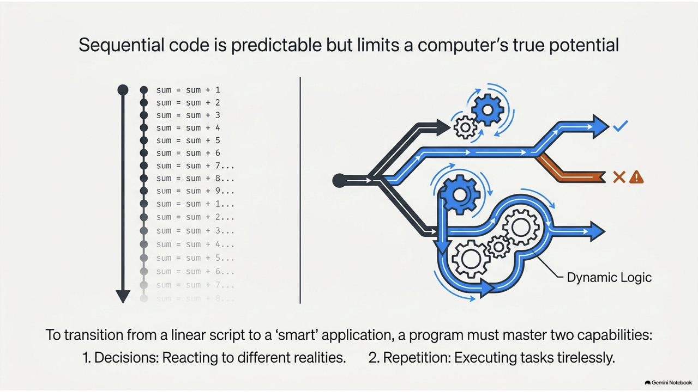
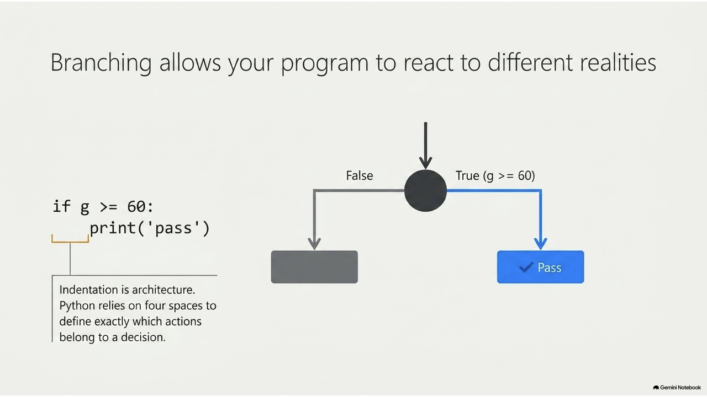
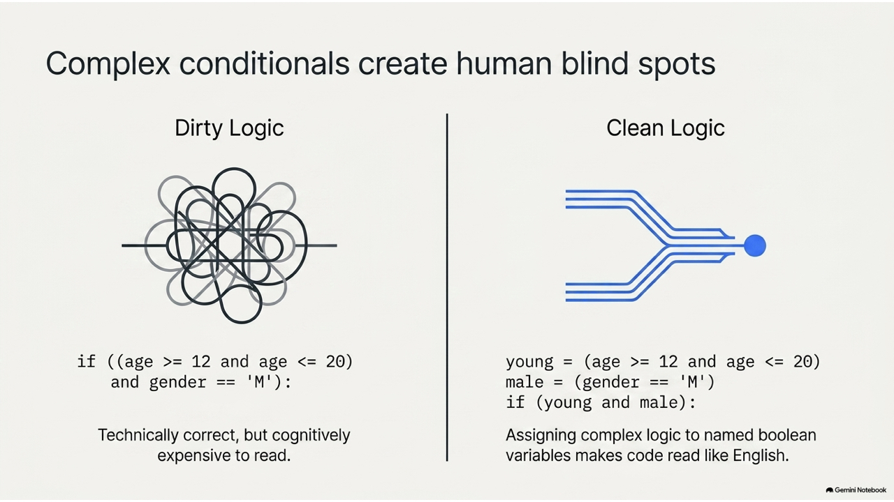
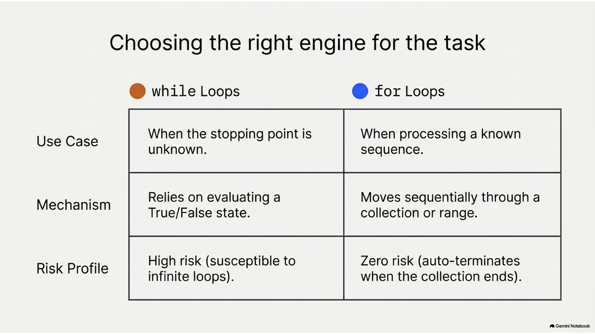
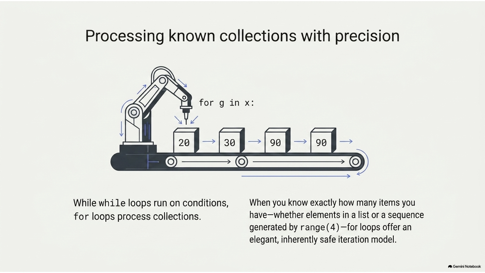
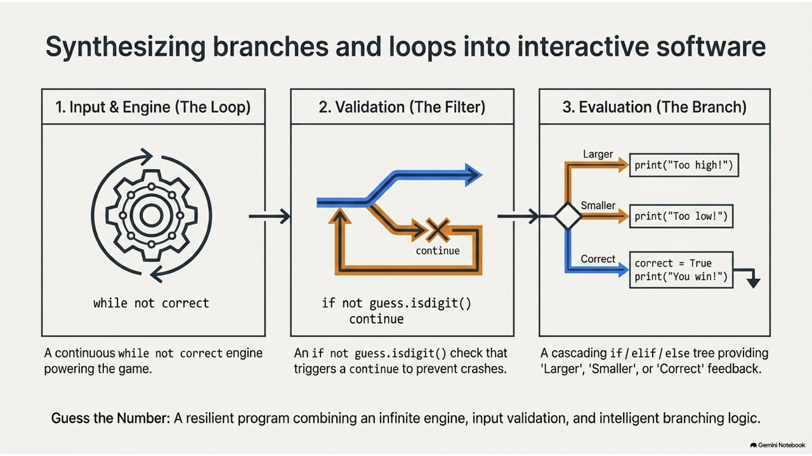
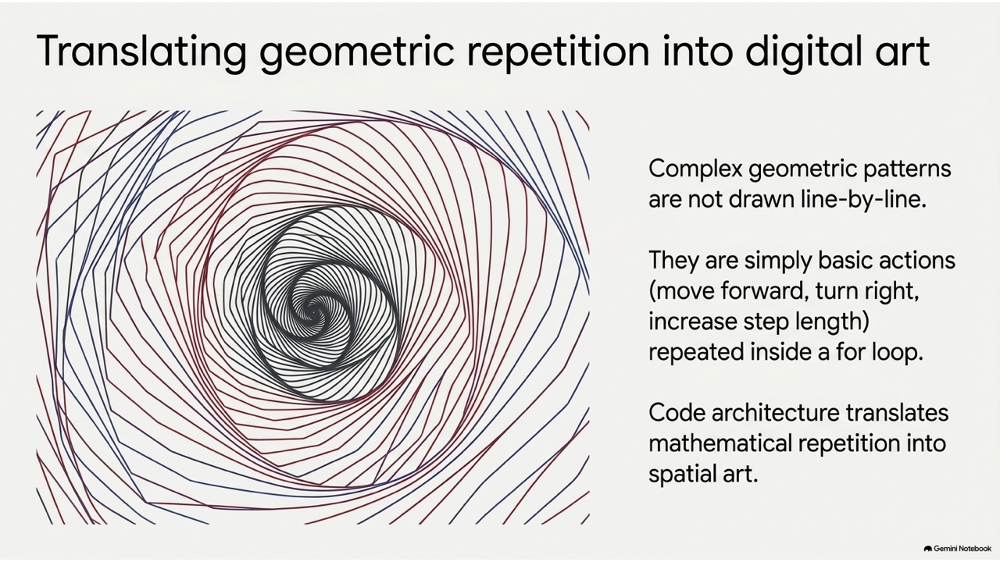
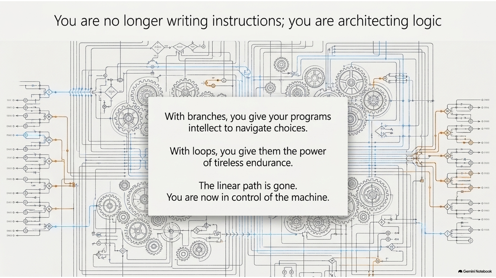

# Python 程式設計

## 第三章：邏輯與控制 (Logic & Control)
**Prof. Nien-Lin Hsueh**
Department of Information Engineering
Feng Chia University

---

## 本章學習重點

* **3.1 分支控制結構 (Branching)**
  * `if`, `else`, `elif` 條件判斷與區塊縮排
  * 巢狀判斷與邏輯運算子複合條件
* **3.2 迴圈控制結構 (Loops)**
  * `while` 迴圈與無窮迴圈防範
  * `for ... in list` 串列走訪
  * `for ... in range()` 迴圈與參數設定
  * 巢狀迴圈、`break` 與 `continue`、`for ... else` 語法
* **3.3 綜合範例** (韓信點兵、turtle 繪圖、猜數字遊戲)
* **3.4 自我測驗** (13 題觀念詳析)

---
<!-- _class: full-image-slide -->

<div class="centered-image">
  
</div>

---
<!-- _class: full-image-slide -->

<div class="centered-image">
  
</div>

---
<!-- _class: full-image-slide -->

<div class="centered-image">
  
</div>

---
<!-- _class: lead -->

# **3.1 分支 (Branching)**

---
<!-- _class: full-image-slide -->

<div class="centered-image">
  
</div>

---
<!-- _class: full-image-slide -->

<div class="centered-image">
  
</div>

---

## 3.1.1 if 單向分支與縮排區塊

* `if` 表達條件，滿足時執行對應**縮排區塊**：

```python
g = 20
if g >= 60:
    print ("pass")
    print ("good")
print ("end") # 不論如何都會執行的程式 (無縮排)
```

> [!WARNING]
> **語法與邏輯要點：**
> * `if` 後方條件表達式結束處必須加上冒號 `:`。
> * 同一區塊內的所有程式碼，**內縮的空格數必須完全相同**。
> * 縮排錯誤會引發 `IndentationError` 或邏輯上的語意錯誤。

---
<!-- _class: full-image-slide -->

<div class="centered-image">
  
</div>

---

## 3.1.2 else 雙向分支

* 當 `if` 條件**不滿足**時，會執行 `else` 區塊：

```python
g = 50
if g >= 60:
    print ("pass")
    print ("good")
else:
    print ("fail")    
    print ("not good")
print ("end")
```

> [!WARNING]
> * `else` 絕對不能單獨出現，它必須緊跟在 `if` 或 `elif` 結構之後。
> * `else` 後面也必須加上冒號 `:` 且不帶任何條件判斷。

---
<!-- _class: full-image-slide -->

<div class="centered-image">
  
</div>

---

## 3.1.3 elif 多重分支

* 用於排他的多重條件篩選（`elif` 等同於 `else if`）：

```python
g = 50
if g >= 60:
    print ("pass")
    print ("good")
elif g >= 50:
    print ("almost pass")    
else:
    print ("fail")    
    print ("not good")
print ("end")
```

* 程式會由上而下依序檢查條件，一旦某個條件成立，執行完該區塊後即跳出整個 `if-elif-else` 結構，不再檢查後續條件。

---
<!-- _class: full-image-slide -->

<div class="centered-image">
  
</div>

---

## 3.1.4 邏輯盲點：永遠無法成真的判斷

* 錯誤的條件順序會導致邏輯覆蓋，使部分程式碼永遠無法執行：

```python
g = 70
if g >= 60:
    print ("pass") # 70 符合 >=60，執行此區塊後直接跳出！
    print ("good")
elif g >= 50:
    print ("almost pass")    
    if (g >= 90): # ⚠️ 永遠無法執行！因為 >=90 的數值早已在第一個 if 區塊被攔截
        print ("excellent")    
else:
    print ("fail")    
```

* **修正方式**：應將範圍較小或較嚴格的條件（如 `g >= 90`）放在前面，或者妥善使用邏輯運算子。

---

## 3.1.5 巢狀判斷與邏輯運算子

* 為了篩選複雜條件，可以使用**巢狀判斷**或**邏輯運算子** (`and`, `or`, `not`)：

```python
gender = 'F'; age = 20

# 巢狀判斷 (層層縮排)
if gender == 'M':
    if age >= 12 and age <= 20:
        print("Young male")

# 邏輯運算子組合 (更直觀易讀)
is_young_male = (gender == 'M') and (12 <= age <= 20)
if is_young_male:
    print("Young male")
```

---
<!-- _class: full-image-slide -->

<div class="centered-image">
  
</div>

---
<!-- _class: lead -->

# **3.2 迴圈 (Loops)**

---
<!-- _class: full-image-slide -->

<div class="centered-image">
  
</div>

---

## 3.2.1 while 迴圈

* 當條件成立時，重複執行區塊；條件不滿足時退出：

```python
sum = 0
x = 1
while x <= 100:
    sum = sum + x
    x = x + 1 # ⚠️ 迴圈控制變數遞增，確保條件最終能不成立
print("1到100的總和為:", sum) # 5050
```

> [!WARNING]
> **防範無窮迴圈 (Infinite Loop)：**
> 若遺漏了 `x = x + 1`，`x` 的值會永遠保持 `1`，使得 `x <= 100` 永遠為 `True`，程式將無限執行導致當機。

---

## while 迴圈應用：持續讀取輸入

* 利用 `while` 持續要求使用者輸入成績，直到輸入指定旗標值（如 `-999`）結束：

```python
sum = 0
grade = 0
while grade != -999:
    grade = int(input("input grade (enter -999 to exit): "))
    if grade != -999:
        sum += grade
print("總和為:", sum)
```

---

## 3.2.2 for ... in list 串列走訪

* **List (串列)** 是一種可以儲存多個元素的有序容器。
* `for ... in` 可以依序走訪串列中的每個元素：

---
<!-- _class: full-image-slide -->

<div class="centered-image">
  
</div>

---

## for ... in list 程式範例

```python
# 未使用 list：變數零散，難以擴充與維護
x1, x2, x3, x4 = 20, 30, 90, 90
sum = x1 + x2 + x3 + x4

# 使用 list 與 for 迴圈走訪：程式碼極具彈性
grades = [20, 30, 90, 90]
sum = 0
for g in grades:
    sum += g # g 會依序取得 list 中的 20, 30, 90, 90
print('總和為:', sum)
```

---

## 3.2.3 for ... in range() 迴圈

* **`range()`** 用於生成一序列的整數。

```python
range(stop)         # 生成 0 到 stop-1 (共 stop 個數字)
range(start, stop)   # 生成 start 到 stop-1
range(start, stop, step) # 生成 start 到 stop-1，每次遞增 step
```

```python
# 1. 計算 1 到 100 的總和
sum = 0
for i in range(1, 101):
    sum += i
print(sum) # 5050

# 2. 遞減數列走訪
for i in range(10, 0, -2):
    print(i, end=' ') # 輸出: 10 8 6 4 2
```

---
<!-- _class: full-image-slide -->

<div class="centered-image">
  
</div>

---

## 3.2.4 巢狀迴圈 (Nested Loops)

* 迴圈內部包含另一個迴圈，常用於處理二維資料或矩陣：

```python
# 九九乘法表範例
for i in range(1, 10):
    for j in range(1, 10):
        print(f"{i}*{j}={i*j:2d}", end="  ")
    print() # 換行

# 星號直角三角形
for i in range(1, 6):
    for j in range(i):
        print('*', end='')
    print()
```

---

## 3.2.5 break 與 continue 控制

* **`break`**：直接跳出當前所在的迴圈。
* **`continue`**：跳過本次迴圈剩餘的程式碼，直接進入下一次迭代。

```python
# 1. 尋找第一個可以整除 7 的數字後退出
for i in range(1, 100):
    if i % 7 == 0:
        print("Found:", i)
        break # 跳出整個 for 迴圈

# 2. 僅加總奇數，遇到偶數跳過
sum = 0
for i in range(1, 10):
    if i % 2 == 0:
        continue # 跳過下方的累加，進入下一個 i
    sum += i
```

---
<!-- _class: full-image-slide -->

<div class="centered-image">
  
</div>

---

## 3.2.5 特殊語法：for ... else 結構

* 當 `for` 迴圈**正常結束**（即**沒有**被 `break` 提前中斷）時，會執行 `else` 區塊：

```python
# 檢查數值是否為質數
v = 7
for i in range(2, v):
    if v % i == 0:
        print(v, "不是質數")
        break
else:
    # 只有當迴圈完整跑完 2 到 v-1，都沒有觸發 break 時才會執行
    print(v, "是質數")
```

---
<!-- _class: lead -->

# **3.3 綜合範例實作**

---

## 3.3.1 韓信點兵

> 「兵不知其數，三三數之剩二，五五數之剩三，七七數之剩二，問兵幾何？」

* **程式解法**：讓數字 `n` 從 1 開始遞增，利用迴圈配合餘數運算 `%` 尋找符合三個條件的最小值：

```python
n = 1
while True:
    c1 = (n % 3 == 2)
    c2 = (n % 5 == 3)
    c3 = (n % 7 == 2)
    if c1 and c2 and c3:
        print("兵數最少為:", n)
        break # 找到符合的最小值，退出
    n += 1
# 輸出: 兵數最少為: 23
```

---

## 3.3.2 用 turtle 套件繪圖

* Python 內建的圖形繪製套件，能以簡單的迴圈繪製複雜幾何圖案。

---
<!-- _class: full-image-slide -->

<div class="centered-image">
  
</div>

---
<!-- _class: full-image-slide -->

<div class="centered-image">
  
</div>

---

## 小烏龜繪圖程式範例

```python
import turtle
t = turtle.Turtle()
t.shape('turtle')

# 1. 畫一個正方形
for i in range(4):
    t.forward(100)
    t.right(90)

# 2. 轉圈畫出正方形花朵
for i in range(36):
    for j in range(4):
        t.forward(100)
        t.right(90)
    t.right(10) # 每次畫完正方形偏轉 10 度
```

---
<!-- _class: full-image-slide -->

<div class="centered-image">
  
</div>

---

## 小烏龜蓋章螺旋範例

```python
import turtle
myStamp = turtle.Turtle(visible=False)
myStamp.shape("turtle")
myStamp.color("blue")
myStamp.penup() # 不畫線，只留印章

stepLen = 20
for i in range(31):
    myStamp.stamp()           # 蓋下烏龜印章
    stepLen = stepLen + 3     # 每次前進長度遞增
    myStamp.forward(stepLen)
    myStamp.right(24)         # 偏轉 24 度
turtle.done()
```

---

## 3.3.3 猜數字遊戲實作

* 結合 `random` 亂數生成、`while` 持續輸入以及 `continue` 錯誤防護：

```python
import random
target = random.randint(1, 100)
correct = False

while not correct:
    guess = input("請輸入 1-100 之間的數字: ")
    if not guess.isdigit():
        print("⚠️ 格式錯誤：請輸入純數字！")
        continue
    guess = int(guess)
    if not (1 <= guess <= 100):
        print("⚠️ 範圍錯誤：必須介於 1 到 100 之間！")
        continue
    if guess == target:
        print("🎉 恭喜答對了！")
        correct = True
    elif guess < target:
        print("👉 太小了，請猜大一點")
    else:
        print("👉 太大了，請猜小一點")
```

---
<!-- _class: full-image-slide -->

<div class="centered-image">
  
</div>

---
<!-- _class: lead -->

# **3.4 自我測驗 (CCQ)**

---

## Concept Check Question (CCQ 1)

<div class="ccq-columns">
  <div class="ccq-text">

**下列程式執行後，何者正確？**
```python
g = 98
if g > 90:
   print ("Class A", end=' ') 
print ("Good job", end=' ')
elif (g > 80):
   print ("Class B", end=' ') 
```

* **A.** 因為內縮與語法結構問題，會引發語法錯誤。
* **B.** 當 `g` 改為 70 時，會印出 `Class A Good Job`。
* **C.** 當 `g` 為 98 時，印出 `Class B`。
* **D.** 當 `g` 為 98 時，印出 `Good job Class B`。

  </div>
  <div class="ccq-logo">
    
  </div>
</div>

---

## CCQ 1 - 答案與解析

<div class="ccq-columns">
  <div class="ccq-text">

### **正確答案：A. 因為內縮與語法結構問題，會引發語法錯誤。**

* **解析**：
  * 在 `if` 區塊與緊接的 `elif` 之間，插入了一行與 `if` 對齊（無縮排）的獨立語句 `print ("Good job", end=' ')`。
  * 這會讓直譯器判定 `if` 條件結構已在此結束，後續的 `elif` 就會因為找不到對應的 `if` 而拋出 `SyntaxError` 崩潰。

  </div>
  <div class="ccq-logo">
    
  </div>
</div>

---

## Concept Check Question (CCQ 2)

<div class="ccq-columns">
  <div class="ccq-text">

**針對以下程式，哪兩個選項正確？**
```python
if g >= 60:
    print ("pass", end="; ")
    print ("good", end="; ")
elif g >= 50:
    print ("almost pass", end="; ")    
    if (g >= 90):
        print ("excellent", end="; ")    
else:
    print ("fail", end="; ")    
    print ("not good", end="; ")    
print ("end of report")
```
* **A.** 當 `g` 為 0 時，印出 `fail; not good; end of report`。
* **B.** 當 `g` 為 60 時，僅印出 `pass; good;`。
* **C.** 當 `g` 為 90 時，會印出 `excellent; end of report`。
* **D.** 當 `g` 為 51 時，印出 `almost pass; end of report`。

  </div>
  <div class="ccq-logo">
    
  </div>
</div>

---

## CCQ 2 - 答案與解析

<div class="ccq-columns">
  <div class="ccq-text">

### **正確答案：A 和 D**

* **解析**：
  * 當 `g = 0`：不符前兩者，進入 `else` 印出 `fail; not good; `，最後執行外部 `end of report` (選項 A 正確)。
  * 當 `g = 51`：進入 `elif` 區塊印出 `almost pass; `，內層 `g >= 90` 不成立，最後執行外部 `end of report` (選項 D 正確)。
  * 當 `g = 90`：在最上層 `g >= 60` 即被攔截，印出 `pass; good; end of report`，根本不會進入 `elif` 的 `excellent`。

  </div>
  <div class="ccq-logo">
    
  </div>
</div>

---

## Concept Check Question (CCQ 3)

<div class="ccq-columns">
  <div class="ccq-text">

**下列程式碼的輸出結果為何？**
```python
sum = 0
for i in range(1, 10):
    sum += i
print(sum)
```

* **A.** `55`
* **B.** `45`
* **C.** `44`
* **D.** `54`

  </div>
  <div class="ccq-logo">
    
  </div>
</div>

---

## CCQ 3 - 答案與解析

<div class="ccq-columns">
  <div class="ccq-text">

### **正確答案：B. 45**

* **解析**：
  * `range(1, 10)` 會生成包含開始值 `1`，但不包含結束值 `10` 的連續整數序列，即 `[1, 2, 3, 4, 5, 6, 7, 8, 9]`。
  * 對此序列的所有整數進行加總：
    $$1 + 2 + 3 + 4 + 5 + 6 + 7 + 8 + 9 = 45$$
  * 故最終結果為 `45`。

  </div>
  <div class="ccq-logo">
    
  </div>
</div>

---

## Concept Check Question (CCQ 4)

<div class="ccq-columns">
  <div class="ccq-text">

**下列程式碼的輸出結果為何？**
```python
sum = 0
for i in range(2, 10, 2):
    sum += i
print(sum)
```

* **A.** `30`
* **B.** `45`
* **C.** `20`
* **D.** `25`

  </div>
  <div class="ccq-logo">
    
  </div>
</div>

---

## CCQ 4 - 答案與解析

<div class="ccq-columns">
  <div class="ccq-text">

### **正確答案：C. 20**

* **解析**：
  * `range(2, 10, 2)` 從 `2` 開始，每次增加步長 `2`，並不包含結束邊界 `10`。
  * 產生的序列數值為 `2, 4, 6, 8`。
  * 將這些數字相加累計：
    $$2 + 4 + 6 + 8 = 20$$
  * 故結果為 `20`。

  </div>
  <div class="ccq-logo">
    
  </div>
</div>

---

## Concept Check Question (CCQ 5)

<div class="ccq-columns">
  <div class="ccq-text">

**下列巢狀迴圈程式執行後的輸出為何？**
```python
for i in range(4):
    for j in range(i):
        print(str(i), end='')
    print(end='-')    
```

* **A.** `1-22-333-4444`
* **B.** `-1-22-333-`
* **C.** `1-2-3-4`
* **D.** `-1-2-3-`

  </div>
  <div class="ccq-logo">
    
  </div>
</div>

---

## CCQ 5 - 答案與解析

<div class="ccq-columns">
  <div class="ccq-text">

### **正確答案：B. -1-22-333-**

* **解析**：
  * $i=0$：內層 `range(0)` 不執行，外層印出 `-`。
  * $i=1$：內層 `range(1)` 印出 `1` 一次，外層印出 `-` $\rightarrow$ `-1-`。
  * $i=2$：內層 `range(2)` 印出 `2` 兩次，外層印出 `-` $\rightarrow$ `-1-22-`。
  * $i=3$：內層 `range(3)` 印出 `3` 三次，外層印出 `-` $\rightarrow$ `-1-22-333-`。

  </div>
  <div class="ccq-logo">
    
  </div>
</div>

---

## Concept Check Question (CCQ 6)

<div class="ccq-columns">
  <div class="ccq-text">

**下列程式執行後，何者正確？**
```python
g = 98
if g > 90:
   print ("Class A")
print ("Good job")
elif (g > 80):
   print ("Class B")
```

* **A.** 印出 `Good job Class B`。
* **B.** 第一行若改為 `g=70`，一樣會印出 `Class A`。
* **C.** 引發語法錯誤，無法執行。
* **D.** 印出 `Class B`。

  </div>
  <div class="ccq-logo">
    
  </div>
</div>

---

## CCQ 6 - 答案與解析

<div class="ccq-columns">
  <div class="ccq-text">

### **正確答案：C. 引發語法錯誤，無法執行。**

* **解析**：
  * `elif` 不能脫離 `if` 獨立存在。
  * 本題中 `if` 區塊因無縮排的 `print ("Good job")` 而被直譯器判定結束。
  * 後面的 `elif` 因為沒有與任何開啟的 `if` 條件配對，引發 `SyntaxError` 語法錯誤。

  </div>
  <div class="ccq-logo">
    
  </div>
</div>

---

## Concept Check Question (CCQ 7)

<div class="ccq-columns">
  <div class="ccq-text">

**關於下列尋找質數的程式，哪兩個選項正確？**
```python
for v in range(2, 11):
    for i in range (2, v):
        if v % i == 0:
            print (v, '不是質數')
            break	
    else:
        print (v, '是質數')
```
* **A.** 執行輸出中會包含 `11是質數`。
* **B.** 會因為 `else` 縮排不合文法而編譯錯誤。
* **C.** 輸出包含 `7是質數`。
* **D.** 輸出包含 `6不是質數`。

  </div>
  <div class="ccq-logo">
    
  </div>
</div>

---

## CCQ 7 - 答案與解析

<div class="ccq-columns">
  <div class="ccq-text">

### **正確答案：C 和 D**

* **解析**：
  * 這是 Python 合法的 `for-else` 語法。當內層 `for` 迴圈跑完且**未被 break 中斷**時，執行 `else`。
  * `range(2, 11)` 生成數字 2 至 10 (不含 11)，故不可能印出 11。
  * 當 $v=7$，內層無法整除，正常跑完執行 `else` 印出 `7 是質數` (C 正確)。
  * 當 $v=6$，$6\%2==0$ 觸發 `break`，印出 `6 不是質數` (D 正確)。

  </div>
  <div class="ccq-logo">
    
  </div>
</div>

---

## Concept Check Question (CCQ 8)

<div class="ccq-columns">
  <div class="ccq-text">

**下列程式執行後，`sum` 的值為何？**
```python
sum = 0
for i in range(1, 10, 2):
    if i == 5:
        break
    sum = sum + i
print(sum)
```

* **A.** `9`
* **B.** `4`
* **C.** `1`
* **D.** `16`

  </div>
  <div class="ccq-logo">
    
  </div>
</div>

---

## CCQ 8 - 答案與解析

<div class="ccq-columns">
  <div class="ccq-text">

### **正確答案：B. 4**

* **解析**：
  * `range(1, 10, 2)` 生成序列為 `[1, 3, 5, 7, 9]`。
  * $i=1$：`sum = 0 + 1 = 1`。
  * $i=3$：`sum = 1 + 3 = 4`。
  * $i=5$：觸發 `if i == 5`，執行 `break`，直接跳出整個 `for` 迴圈。
  * 因此，迴圈中斷，未執行後續的 7 與 9，印出結果為 `4`。

  </div>
  <div class="ccq-logo">
    
  </div>
</div>

---

## Concept Check Question (CCQ 9)

<div class="ccq-columns">
  <div class="ccq-text">

**關於在編輯器或 IDE 中設定中斷點 (breakpoint)，哪兩個選項正確？**

* **A.** 設定中斷點通常用來幫助程式碼除錯 (debug)。
* **B.** 中斷點可以用來在滿足特定條件時跳出迴圈。
* **C.** 可以暫時中斷程式執行，以便開發者觀察變數的變化。
* **D.** 可以優化程式底層邏輯，有效提升程式執行速度。

  </div>
  <div class="ccq-logo">
    
  </div>
</div>

---

## CCQ 9 - 答案與解析

<div class="ccq-columns">
  <div class="ccq-text">

### **正確答案：A 和 C**

* **解析**：
  * 中斷點是開發工具偵錯（Debugger）的一種機制，讓程式執行到該行時暫停，方便工程師檢視當前變數的值、記憶體與呼叫堆疊以找出問題所在 (A, C 正確)。
  * 中斷點不是 Python 的語法指令，因此無法用來跳出迴圈，也不會改變程式的執行效率。

  </div>
  <div class="ccq-logo">
    
  </div>
</div>

---

## Concept Check Question (CCQ 10)

<div class="ccq-columns">
  <div class="ccq-text">

**下列程式執行後，螢幕會印出多少個 `*`？**
```python
n = 1
while True:
    print ('*')
    n += 2
    if n == 100:
        break
```

* **A.** `50`
* **B.** `100`
* **C.** `0`
* **D.** 無窮迴圈（無限印出）

  </div>
  <div class="ccq-logo">
    
  </div>
</div>

---

## CCQ 10 - 答案與解析

<div class="ccq-columns">
  <div class="ccq-text">

### **正確答案：D. 無窮迴圈（無限印出）**

* **解析**：
  * `n` 的初始值為 `1`，每次迴圈遞增 `2`。
  * `n` 的值序列為 `1, 3, 5, 7, ..., 97, 99, 101, ...`。
  * 因為 `n` 永遠是奇數，所以 `n == 100` 的判斷條件永遠不會成立，`break` 不會被觸發，造成無窮迴圈。

  </div>
  <div class="ccq-logo">
    
  </div>
</div>

---

## Concept Check Question (CCQ 11)

<div class="ccq-columns">
  <div class="ccq-text">

**依序輸入 100, 98, -999，下列程式印出的 `sum` 總和值為何？**
```python
sum = 0; grade = 0
while (grade != -999):
    grade = int (input("input your grade: "))
    sum += grade
print (sum)     
```

* **A.** `198`
* **B.** `-801`
* **C.** `-999`
* **D.** `98`

  </div>
  <div class="ccq-logo">
    
  </div>
</div>

---

## CCQ 11 - 答案與解析

<div class="ccq-columns">
  <div class="ccq-text">

### **正確答案：B. -801**

* **解析**：
  * 第一次迴圈讀入 `100`，`sum = 0 + 100 = 100`。
  * 第二次迴圈讀入 `98`，`sum = 100 + 98 = 198`。
  * 第三次迴圈讀入 `-999`，`sum = 198 + (-999) = -801`。
  * 這時 `grade` 為 `-999`，回到 `while` 條件判斷成立，跳出迴圈。
  * 由於在判斷跳出前，`-999` 已經被加入了 `sum`，故結果為 `-801`。

  </div>
  <div class="ccq-logo">
    
  </div>
</div>

---

## Concept Check Question (CCQ 12)

<div class="ccq-columns">
  <div class="ccq-text">

**下列程式執行後的輸出為何？**
```python
x = [20, 30, 90, 90] 
for i in x:
    print (i, end = " ")
```

* **A.** `0 1 2 3`
* **B.** `20 30 90 90`
* **C.** `1 2 3 4`
* **D.** `False False False False`

  </div>
  <div class="ccq-logo">
    
  </div>
</div>

---

## CCQ 12 - 答案與解析

<div class="ccq-columns">
  <div class="ccq-text">

### **正確答案：B. 20 30 90 90**

* **解析**：
  * Python 的 `for i in x:` 語法中，遞迴變數 `i` 取得的是串列 `x` 中的**元素數值本身**，而非索引值。
  * 迴圈走訪過程：依序取出 `20`, `30`, `90`, `90` 並印出，元素之間以空格隔開。

  </div>
  <div class="ccq-logo">
    
  </div>
</div>

---

## Concept Check Question (CCQ 13)

<div class="ccq-columns">
  <div class="ccq-text">

**執行 `x = random.randint(4, 50)`，哪三個選項是 `x` 可能的值？**

* **A.** `4`
* **B.** `10`
* **C.** `50`
* **D.** `100`
* **E.** `0`

  </div>
  <div class="ccq-logo">
    
  </div>
</div>

---

## CCQ 13 - 答案與解析

<div class="ccq-columns">
  <div class="ccq-text">

### **正確答案：A, B 和 C**

* **解析**：
  * Python 的 `random.randint(a, b)` 會回傳一個在 `[a, b]` 閉區間內的隨機整數。
  * 這個範圍是**包含端點 a 和 b** 的（即 $a \le x \le b$）。
  * 範圍是 $4 \le x \le 50$，因此 4、10 和 50 都是合法可能的值。

  </div>
  <div class="ccq-logo">
    
  </div>
</div>
