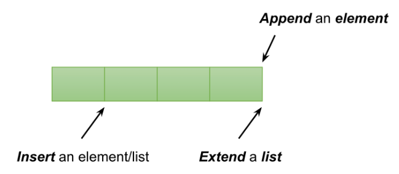
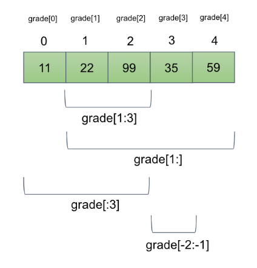
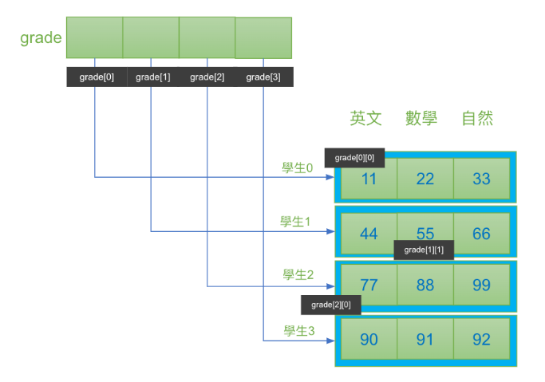
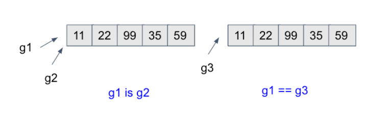
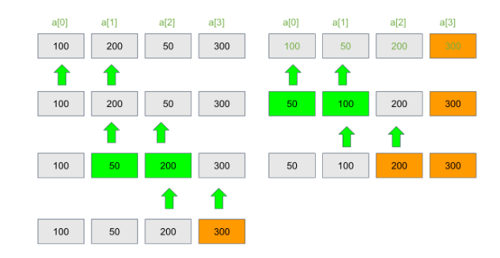
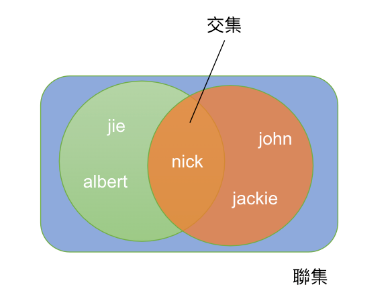
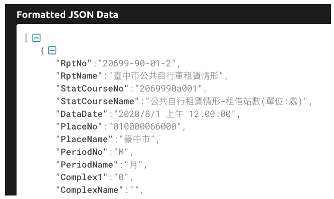

Ch04 Collection Object
===


集合物件
===

這個章節要跟大家介紹集合物件，在前面四個小節會分別介紹4個不同的集合物件，最後一個小節，會介紹一個 ibike 資料應用的範例。

4.1 我們用 list 這個資料結構跟大家解說集合資料的必要性。
假設今天要去處理三個學生的成績，那我們很簡單的就用三個變數去儲存他們的成績，然後做一些加減乘除的運算，但是如果這個資料膨脹到50筆或者是一萬筆，那我們就沒辦法取一萬個變數去處理這些資料，所以這時候就要引入另外一個新的觀念--`索引值`。當變數加上索引值的時候，它的變化就會非常的豐富，我們就可以很方便的去存取任何我所想要的資料。

4.2-4.4 分別講述其他的集合型資料結構，像 tuple、set、dictionary 等等。雖然他們都可以儲存一群資料，但特性都不太一樣，取決於這個資料在集合文件裡面，它是不是可以重複、是否有順序性、是否可以修改，以及是否可以放不同的資料型態的資料。他們索引的方法都有所不同。

當大家在處理這些集合資料時，處理的方式大體上有四種：新增、刪除、修改跟查詢。而它的指令會有點不太一樣，在觀念呢也有一些差異，所以大家在學習的時候要特別注意一下。

4.5 我們用一個台中 ibike 開放資料的例子跟大家做一個 Demo。ibike 非常的方便，也可以說是台灣之光的交通建設。ibike 的站點資料有開放在網路上讓大家去下載及應用。我們也可以做很多有趣的運算，這個小節會教大家怎麼樣去下載這個資料，並且做資料的處理。

學習完這一章以後，大家就可以具備處理群體資料的能力，再配合上一章所講的 if else 還有 for 的迴圈，在資料處理方面的能力就會大幅的提升。
也可以依據不同的需求採取不同的資料結構，讓你程式的運算變得更順利。

## List 集合物件

List 是最常被使用的集合物件，其特色是
- 有順序性; 
- 資料也可以重複;
- 可以瀏覽也可以修改;
- 可以放各種不同型態的資料。

例如我們在這個地方看到第二行 students，裡面有三筆資料，nick albert 跟 jie，在 List 中，我們是用一個**中括號**來代表它是一個List的資料型態，裡面我們可以放字串(line 2)，或在下面的例子裡面(line 5)，我們放入一群人的年齡，全部都是整數的型態。

在第三個 List中(line 8)，第一筆資料是一個字串，第二筆資料也是一個字串，第三筆資料則是一個List的型態，所以我們說 List 它是可以放各種不同資料型態的。這筆資料它的意義是什麼？我們必須在程式設計的時候賦予它這樣子的意義，例如，第0筆資料是學生的姓名，第1筆代表的是他的學號，接下來是他一群成績的資料，這個在我們規劃的時候必須要去做很明確的定義。

```python
# 放一群人的姓名，型態都是字串
students = ['nick', 'albert', 'jie']

# 放一群人的年齡，型態都是數字
age =[12, 56, 40, 22, 59]

# 某學生的資料與成績
nick_grade = ['nick', 'S9201201', [90, 72, 100]]
albert_grade = ['albert', 'S9201202', [99, 68, 90]]

# list 中有 list
grades = [nick_grade, albert_grade]

# 建立空的 list
empty_list = []
empty_list = list()
```
- 新增（`.append()`）：我們可以使用 append，append後面會加上我們所要新增的資料內容。
- remove 則可以刪除一筆資料。
- 刪除（`.remove()`）：使用
- 修改：直接指定要修改資料的索引值，例如 `aList[0]=100`，本來 0 的位置所放的資料是1，修改後，它就會變成是 100。
- 資料擷取：直接給定一個索引值就可以得到這一筆資料，或者用`：`來做資料切片，例如我們寫上 `1:`，代表從 1 到它最後的資料，所以就會回傳 `[2,'a','b']`。

```python
aList = [1,2,'a','b']

# 新增    
aList.append('d')       # [1, 2, 'a', 'b', 'd'] 

# 刪除    
aList.remove('a')       # [1, 2, 'b', 'd']

# 修改    
aList[0]=100            # [100, 2, 'b', 'd']

# 查詢    
aList[2]                # 'a'   
aList[1:]               # [2, 'b', 'd']
```

以下各節詳細解說。

### 資料的新增

在資料的新增方面，我們通常會用到的三個函式是 append、extend 和 insert。



- `append(d)`: 把 d 加到 list 後面。
- `extend(d)`: d 應該也是一個 list; 擴充 list 使之涵蓋 d 的元素。
- `insert(i, d)`: 將 d 插入到 list 位置 i 的地方。

```python
students = ['01-nick', '02-albert', '03-jie']
print ('Original data: ', students)
st = ['04-jason', '05-allen']

students.append('06-lisa')                    # 後加
print ('after append 06-lisa: ', students)
students = ['01-nick', '02-albert', '03-jie'] # reset the data

students.extend(st)                           # 擴充
print ('after extend st: ', students)
students = ['01-nick', '02-albert', '03-jie'] # reset the data

students.append(st)                           # 擴充
print ('after append st: ', students)
students = ['01-nick', '02-albert', '03-jie'] # reset the data

students.insert(0, '07-maggie')                  # 插入位置 0，原資料後移
print ('after insert maggie at loc 0: ', students)
students = ['01-nick', '02-albert', '03-jie'] # reset the data

students.insert(1, st)                        # 也可以插入 list
print ('after insert st at loc 1: ', students)
```

結果如下：
```
Original data:  ['01-nick', '02-albert', '03-jie']
after append 06-lisa:  ['01-nick', '02-albert', '03-jie', '06-lisa']
after extend st:  ['01-nick', '02-albert', '03-jie', '04-jason', '05-allen']
after append st:  ['01-nick', '02-albert', '03-jie', ['04-jason', '05-allen']]
after insert maggie at loc 0:  ['07-maggie', '01-nick', '02-albert', '03-jie']
after insert st at loc 1:  ['01-nick', ['04-jason', '05-allen'], '02-albert', '03-jie']
```

展示了對 list 的各種新增方法。 請注意我們每次新增完都會重新設定 students 的資料，方便大家檢視差異差異。每個姓名前面我們加上編號也只是讓大家比較好閱讀比較輸出。輸出的 2,3 行差異可以看出 append 是新增一筆資料，而 extend 是一群資料（因為 st 是 list）。程式第 23行我們 append(st) 是將 st 當成一筆資料來看，students 變成一個內含字串與list 的資料了。輸出第4 我們看到這個結果，和輸出第3 行明顯的不同。

`insert()` 可以指定要把資料放到哪個位置，例如程式第 17 行將 maggie 放到位置 `0`，結果就呈現 `['07- maggie ', '01-nick ', '02- albert ', '03-jie']`了。


### 資料的刪除

刪除 list 元素

- `remove(e)`: 移除第一個 `e`; 若沒有 `e` 則會產生例外;
- `r = pop()`: 回傳並移除最後一個;
- `r = pop(index)`: 回傳並移除 `index` 的元素

```python
# 刪
students = ['nick', 'albert', 'jie']
print ('original data: ', students)

st_copy = students.copy()
students.remove('nick')     # 移除第一個名為 nick 的元素
print ('after remove nick: ', students)

students = st_copy.copy()   # rest data
st = students.pop()         # pop 預設是取出最後的元素
print ('after pop, the result and list are: ', st, ",", students)

students = st_copy.copy()   # reset data
st = students.pop(0)        # 取出第一個元素
print ('after pop 0, the result and list are: ', st, ",", students)
```

執行結果：

```
original data:  ['nick', 'albert', 'jie']
after remove nick:  ['albert', 'jie']
after pop, the result and list are:  jie , ['nick', 'albert']
after pop 0, the result and list are:  nick , ['albert', 'jie']
```

我們通常會使用 `remove` 跟 `pop`，其中比較大的差別是，`remove` 移除了就移除了，至於 `pop`，它會把移除的這筆資料做一個回傳的動作。

`remove` 後面帶的這個元素(e)，它會移除第一個元素(e)，在這個範例中，我們要移除 `nick`，它就會從這一組資料裡面找到第一個 `nick` 的資料並把它做移除。

`pop`: 如果我們沒有給它一個參數的話，它就會把最後一筆資料抓出來回傳給我們，來做一些後續的應用，我們可以在 `pop` 後面加上一個索引值，意思就是要把那個索引值的元素移除並且回傳，那後面的資料就會往前遞補。

### 資料的排序

```python
d = [1,4,5,2,9,8,7,7,2,6]
dc = d.copy()
print ('original data d=\t', d)

d.sort()
print ('after sort d=\t\t', d)

d = dc.copy()
d.sort(reverse = True)
print ('after sort (reverse) d=\t', d)

d = dc.copy()
r = sorted(d)
print ('after sorted, d=\t', d)
print ('after sorted, r=\t', r)
```

輸出：

```
original data d=	 [1, 4, 5, 2, 9, 8, 7, 7, 2, 6]
after sort d=		 [1, 2, 2, 4, 5, 6, 7, 7, 8, 9]
after sort (reverse) d=	 [9, 8, 7, 7, 6, 5, 4, 2, 2, 1]
after sorted, d=	 [1, 4, 5, 2, 9, 8, 7, 7, 2, 6]
after sorted, r=	 [1, 2, 2, 4, 5, 6, 7, 7, 8, 9]
```

排序是我們經常會使用到的一種資料修改，語法很簡單，我們只要用 `data.sort` 就可以把資料作由小到大的做排序。如果今天是想要由大到小的排序的話們可以加上一個參數，`reverse=True`。

另一個函式 `sorted(d)` 並**不會**改變 `d` 的內部資料排序，它會產生另一個 list 來儲存排序後的結果。如上述程式中的 r。

### 資料的擷取

這一節我們來介紹 list 的查詢和資料的擷取。List 的擷取相當的直覺，我們可以用 `[i]` 來取得位置 i 的值。請注意要從 `0` 開始數起。如下圖，一筆成績資料 `11,22,99,35,59`; 11 的資料是在 `grade[0]`, 而非 `grade[1]`。

如果是要取其中一段資料（稱之為切片），可以用 `起始:結束` 來進行。例如我們要擷取 22 跟 99，它的位置是在 1 跟 2，所以我們就可以用 `grade[1:3]`。 注意第二個參數代表的是你所要擷取的終點的下一個，所以你要擷取到 2 的話，這一個參數必須要寫 3 而非 2。

資料切片時也可以不寫第二個參數，代表從這個位置抓到資料的最後一筆，如果第一個參數沒有寫的話，就代表要從最前面開始抓取資料。也可以用 - 的方式來代表倒數的觀念，例如呢我們要從倒數第 2 個抓取到倒數第1個，我就可以寫 `[-2:-1]`，`-1` 代表的就是 59，也就是倒數第一個的資料，`-2`就是 35 的這筆資料。



```python
grade = [11, 22, 99, 35, 59]
print ('original grade: ', grade)

print ('grade[0] ', grade[0])     # 第 0 個元素
print ('grade[1] ', grade[1])     # 第 1 個元素
print ('grade[-1] ', grade[-1])   # 第 -1 個元素
print ('grade[1:3] ', grade[1:3]) # 第 1-2 個元素
print ('grade[1:] ', grade[1:])   # 第 1 個之後的所有元素
print ('grade[:3] ', grade[:3])   # 第 3 個以前的元素
print ('grade[-1:] ', grade[-1:]) # 最後一個元素
print ('grade[-2:] ', grade[-2:]) # 最後兩個元素
print ('grade[-2:-1] ', grade[-2:-1])
```

輸出：
```
original grade:  [11, 22, 99, 35, 59]
grade[0]  11
grade[1]  22
grade[-1]  59
grade[1:3]  [22, 99]
grade[1:]  [22, 99, 35, 59]
grade[:3]  [11, 22, 99]
grade[-1:]  [59]
grade[-2:]  [35, 59]
grade[-2:-1]  [35]
```


## List 與迴圈

### 資料的走訪

`for list` 是我們常用的一個技巧，用來走訪整個資料，這是因為 list 的資料型態是屬於可以瀏覽的，所以我們就可以使用這樣子的子句。

舉個例子來說，`students=['nick','albert','jie']` 這三個人，我們如果要印出所有學生的名字，我們只要寫 `for st in student`，進入到迴圈以後，每一次去抓取這個 `st`，代表這個 list 中的每一個元素，第一次進到這個迴圈，`st` 指的是第 0 個值 `'nick'`，第2次再進到迴圈就是 `'albert'`，以此類推第 3 次就是 `'jie'`，這個對於我們在做整體資料的運算十分方便，

```python
students = ['nick', 'albert', 'jie']

# for list
for st in students:   # 印出所有學生姓名
    print (st)
```

結果如下：
```
nick
albert
jie
```

例如我們現在要加總 `grade` 這個 `list` 裡面的所有成績的平均等於多少，就可以用 `for loop` 來走訪所有的成績，透過 `sum` 做加總，加總完了以後，再去除以這個資料它的個數就可以得到平均值，而前面我們這個地方看到一個 `len`，可以回傳 List 裡面有多少個元素。

```python
# 整體資料的運算
grade = [11, 22, 99, 35, 59]
total = 0
for g in grade: 
    total += g
print ('成績資料：', grade)
print ('共有{}筆'.format(len(grade)))
print ('平均分數：', total//len(grade))	
```

輸出：
```
成績資料： [11, 22, 99, 35, 59]
共有5筆
平均分數： 45
```

上述的程式中，可以發現它並沒有索引值 `i`，但有時候還是需要這個索引值，這時候我們就可以用 `enumerate` 這個函式，在 list 前面加上一個 `enumerate` 就會回傳索引值以及這個元素，所以我們進入迴圈以後，每一次去抓取 `i` 跟元素的時候就會依序地印出它的索引值，以及這一個索引值所對應到的資料。以下程式中的 `grade` 紀錄一群成績，我們想要把低於 60 分的調整為 60 分。


```python
grade = [11, 22, 99, 35, 59, 78]
print ('original grade = ', grade)
for i, g in enumerate(grade):
    if g < 60:
        grade[i] = 60
print ('after update = ', grade)
```

輸出結果如下。注意 `enumerate(grade)` 會回傳一個索引值其所對應的值。也就是說迴圈中 `i`, `g` 的值的變化如下：

```
0, 11
1, 22
2, 99
3, 35
4, 59
5, 78
```

最終執行結果如下：
```
original grade =  [11, 22, 99, 35, 59, 78]
after update =  [60, 60, 99, 60, 60, 78]
```

### List 函式


list 內有許多的函式可以來幫助我們做一些查詢，例如我們可以使用 `count(e)` 來找出這一組資料裡面有多少個元素它的值是 `e`，使用 `index(e)` 可以回傳第一個 `e` 的索引值。例如 `count('nick')`，就是要計算有多少個同學的名字是 `nick`，所以回傳是 `2`。 `index('albert')` 第一個名字為 `albert` 的，它的位置會回傳為 `1`。

```python
students = ['nick', 'albert', 'jie']
age =[12, 56, 40]

# list 相關函式
a = len(age) # 元素個數
b = max(age) # 取得最大的元素值
c = min(age) # 取得最小的元素值
print ('資料 {} 筆數、最大值、最小值分別為 {}, {}, {}'.format(age, a, b, c))

# list method
c = students.count('nick')      # 符合的元素數量
idx = students.index('albert')  # 所在位置（0 開始）
print ('資料 {} 中包含 nick 的筆數有 {} 筆'.format(students, c))
print ('albert 在 資料 {} 中的位置是 {}'.format(students, idx))
```

輸出：

```
資料 [12, 56, 40] 筆數、最大值、最小值分別為 3, 56, 12
資料 ['nick', 'albert', 'jie'] 中包含 nick 的筆數有 1 筆
albert 在 資料 ['nick', 'albert', 'jie'] 中的位置是 1
```

### 二維的 List



二維的 list 指的就是 list 中的元素的資料本身也是一個 list。例如我們想要紀錄一群學生的一群成績，這時候我們就可能會使用到二維的 list。上圖資料中，`grade` 本身是 一個 list，但是這個 list裡面的元素又是一個 list，第一組資料就代表著 `學生0` 的三個成績，假設我們賦予它的意義是`英文`、`數學`及`自`然，那就代表這三科的成績。第 1 筆資料又是一個 list，代表的就是 `學生1` 這三科成績，以此類推。所以當我們今天想要獲取`學生2`的成績時，我們就可以用 `grade[2]`，這時候回傳的會是一個 list，`[77,88,99]` 這一筆資料。

如果要進一步的獲取 `學生2` 的英文成績的話，我們就可以用 `grade[2][0]` 就可以抓取到 `77` 的這個成績。在 `grade` 內部的結構中，`grade` 可以視為一維陣列，只不過它裡面儲存的是一個位置的參考，這個位置的參考會指向另外一個 list。

```python
# List of List
grade = [[11, 22, 33], [44, 55, 66], 
         [77, 88, 99], [90, 91, 92]]

print (grade[2])      # [77, 88, 99]
print (grade[2][0])   # 77
```

```
[77, 88, 99]
77
```
如果我們想要走訪整個資料的話，就可以用一個**雙重迴圈**，`for row in grade`，進到迴圈了以後，每一個 `row` 代表著就是一個學生的所有成績，這時候再去執行一個 `for element in row`，進來以後，每一個 `element` 就代表某一個人某一個科目的成績，所以第一次的 `element` 是 `11`，接下來依次是 `22`、`33`等等，等到這一個迴圈走完，我們印出一個換行的鍵再進到下一筆資料，所以第二筆資料，`row` 就代表的是`學生1` 的這群資料。


```python
# 透過兩個迴圈把二維 list 哪的元素都印出來
grade = [[11, 22, 33], [44, 55, 66], 
         [77, 88, 99], [90, 91, 92]]
for row in grade:          
    for element in row:                  
      print (element, end=' ')
    print ()                            
```

輸出為：

```
11 22 33 
44 55 66 
77 88 99 
90 91 92 
```

```python
for i, row in enumerate(grade):
    for j, element in enumerate(row):
        print ('grade[{}][{}]={}'.format(i,j,element), end='; ')
    print ()  
```

```
grade[0][0]=11; grade[0][1]=22; grade[0][2]=33; 
grade[1][0]=44; grade[1][1]=55; grade[1][2]=66; 
grade[2][0]=77; grade[2][1]=88; grade[2][2]=99; 
grade[3][0]=90; grade[3][1]=91; grade[3][2]=92; 
```


接著來看二維list 的運算的方法，假設我們想要加總每一個學生的成績，並且把它儲存在一個一維陣列裡，我們一開始可以宣告，一個**一維陣列**，叫做 `st_sum`，接下來用一個 `for迴圈` 去走訪每一個學生的成績，所以 `for st in grade`，進到這個迴圈以後，`st` 代表的是一個學生的所有科目的list，在前面加上一個 `sum`，就可以把他的所有的成績加總起來，加總後把它儲存在 `st_sum`，index 為 `i`，在第一次時，這個 `i` 的值是為 `0`，所以第一個學生的成績就會儲存在 0 的位置，接下來把`i+1`，進到下一個迴圈，去加總第二個學生的成績，並儲存在 `i` 為 `1` 的這一個位置，以此類推。

如果要去計算每一個科目總合，就會稍微複雜一點，因為變成縱向的方式做加總。首先，我們先宣告一個一維陣列，`subj_sum`，然後走訪這整個陣列，`for st in grade`，進來 `st` 代表的是一個學生的成績，透過 `enumerate` 獲取它的索引值 `i` 跟 `g`，`i` 代表的是目前的索引，第一次的時候是為 `0`，所以這個 `subj_sum[0] += g`， `g` 就是第一次的成績 11，下一個迴圈再進來的時候是 `22`，這時候的 `i` 值已經變成 `1` 了，所以它就會把 `11` 儲存在這裡，`22` 儲存在 `i=1` 的位置; `33` 則儲存在 `i=2` 的位置。

下一個迴圈，在外部迴圈進來的時候，`st` 代表的是第二筆資料，也就是 `[44,55,66]` 的這筆資料，這時候它會跟上面的地方做加總，也就是 `44` 會加上 `11`；等到在進到第三筆資料的時候，`77` 會被抓取出來，接著是第四筆的 `90`。


```python
# 計算每個學生的各科總和，儲存在 st_sum 中    
st_sum = [0,0,0,0];
i = 0
for st in grade:
   st_sum[i] = sum(st)
   i += 1
print ('四個學生的各科總分分別為：', st_sum)   
```

輸出：
```
四個學生的各科總分分別為： [66, 165, 264, 273]
```

我們也可以只算科目的總和：

```python
# 計算每科目的總和
subj_sum = [0,0,0]
for st in grade:
    for i, g in enumerate(st):
        subj_sum[i] += g
print ('每個科目的總和分別為：', subj_sum)
```

輸出：

```
每個科目的總和分別為： [222, 256, 290]
```


## List 應用
### 列表推導式

List Comprehension 翻譯為 列表推導式，在`中括號`內放的不是資料，而是一個運算，通過這個運算來代表資料本身。下列程式中的 `a` 是由一個 `for range` 的列表推導式所產生的，程式碼相當的簡潔。如果不用推導式也可以用一般的 `append` 來建構，如 `b` 的產生方法。

```python
a = [i for i in range(10)]        # 用列表推導式
print (a)

b = []                            # 用一般的方式
for i in range(10):
  b.append(i)
print (b)  

c = [i for i in range(0, 10, 2)]  # 用列表推導式
print (c)
```

輸出：
```
[0, 1, 2, 3, 4, 5, 6, 7, 8, 9]
[0, 1, 2, 3, 4, 5, 6, 7, 8, 9]
[0, 2, 4, 6, 8]
```

### 多元排序

當我們對一個二維陣列做排序，會依據每一個的`第一個元素`來做排序。例如在下列的程式中，會依據 `11, 90, 77, 44` 來排序。

```python
grade = [[11, 22, 33], [90, 91, 92], 
         [77, 88, 99], [44, 55, 66]]

g1 = sorted(grade)
print (g1)
# Result: [[11, 22, 33], [44, 55, 66], [77, 88, 99], [90, 91, 92]]
```

如果我們想用分數的總合來排序呢？這時候可以用 lambda 的運算：

```python
# 依據每一個人的成績加總排序
grade = [[11, 22, 33], [90, 91, 92], 
         [77, 88, 99], [44, 55, 66]]

g2 = sorted(grade, key=lambda x: sum(x))
print (g2)
```

結果如下：

```
[[11, 22, 33], [44, 55, 66], [77, 88, 99], [90, 91, 92]]
```

lambda 表示一個簡潔的運算，其指定的 `sum()` 會把陣列內的元素加總，所以分別是 `66 (11+22+33)`,  `273(90+91+92)`, `264(77+88+99)`, `165(44+55+66)`，所代表的索引值為 `0,1,2,3`，但依據總和後的排序應該是 `0,3,2,1`。


又或者我們想依據最後一筆資料來排序，可以用 `x[-1]` 來做排序，結果如下：

```python
# 依據物理成績（最後一科) 排序
g3 = sorted(grade, key=lambda x: x[-1])
print (g3)
```

Result: 
```
[[11, 22, 33], [44, 55, 66], [90, 91, 92], [77, 88, 99]]
```

### 資料的比較




`is` 和 `==` 的差別
- 透過 is 比較兩個 list 是否 **參考** 相同。
- 透過 == 比較兩個 list 是否 **內容** 相同。

```python
grade = [11, 22, 99, 35, 59]
g  = grade          # 相同參考; g 和 grade 都指到同樣的資料
gc = grade.copy()   # 複製一份給 gc; g 和 gc 指到不同的資料，只是內容一樣

print ('grade == g: ', grade == g)  # == 是比較內容有沒有一樣
print ('grade is g: ', grade is g)  # is 是確認是否指到相同空間

print ('grade == gc: ', grade == gc)
print ('grade is gc: ', grade is gc)

grade[0] = 12
print ('--- modify grade[0] ---')

print ('grade == g: ', grade == g)
print ('grade is g: ', grade is g)

print ('grade == gc: ', grade == gc)
print ('grade is gc: ', grade is gc)
```

輸出：
```
grade == g:  True
grade is g:  True
grade == gc:  True
grade is gc:  False
--- modify grade[0] ---
grade == g:  True
grade is g:  True
grade == gc:  False
grade is gc:  False    
```

### 氣泡排序法



> `sort()` 會改變本身的資料; `sorted()` 不會，但會回傳一個已排序的。

以下我們自己寫一個氣泡排序法，藉此更認識 List 的應用。

```python
"""
Bubble Sort
"""

import random

# 隨機建立一個100 元素的列表，裡面的數介於1-100之間。
a = []
for i in range(100):
    a.append(random.randint(1,100))
print(a)

s = len(a)   # 資料大小
r = s-1      # 回合

for i in range(1, r+1):
    print('Round', i)
    for j in range(0, s-i):
        if a[j] > a[j+1]:
            temp = a[j]
            a[j] = a[j+1]
            a[j+1] = temp
    print(a)
```

### json.loads()

`json.loads()` 可以讀入一個「list 字串」，將之轉為 list 來處理。

```python
gStr = "[60, 78, 100]" # list 字串

import json
gList = json.loads(gStr)

print (gList)
print (type(gList))
```

由下方的執行結果看得出 `gList` 的型態為 list。
```
[60, 78, 100]
<class 'list'>
```

### split 與 join

`split` 可以把字串依據所指定的拆解，`join` 則可以做連結。

```python
city = "Taichung Taipei Kaoshiung"
cityList = city.split()

cityString1 = '-'.join(cityList)
cityString2 = ' * '.join(cityList)
print (cityString1)
print (cityString2)
```

印出的結果為：
```
Taichung-Taipei-Kaoshiung
Taichung * Taipei * Kaoshiung
```

### **4.1.1 隨堂測驗 (CCQ 1)**

**問題**

給定兩個串列 `a = [1, 2]` 與 `b = [3, 4]`。請問執行 `a.append(b)` 與 `a.extend(b)` 兩者運作的結果有何不同？

A) 兩者結果皆為 `[1, 2, 3, 4]`。
B) 兩者結果皆為 `[1, 2, [3, 4]]`。
C) `a.append(b)` 結果為 `[1, 2, [3, 4]]`，而 `a.extend(b)` 結果為 `[1, 2, 3, 4]`。
D) `a.append(b)` 結果為 `[1, 2, 3, 4]`，而 `a.extend(b)` 結果為 `[1, 2, [3, 4]]`。

<details>
<summary>點擊查看【隨堂測驗】答案與解析</summary>

**正確答案：C) `a.append(b)` 結果為 `[1, 2, [3, 4]]`，而 `a.extend(b)` 結果為 `[1, 2, 3, 4]`。**

* **解析**：
  * `append(x)` 會把傳入的物件 `x` **原封不動地當成單一元素**加到串列尾端。因為 `b` 是一個串列，所以 `a.append(b)` 會將整個 `[3, 4]` 當作一個元素塞進 `a`，得到二維/巢狀串列 `[1, 2, [3, 4]]`。
  * `extend(iterable)` 會**迭代**傳入的容器，將其中的**所有元素拆開**、依序加到串列尾端。所以 `a.extend([3, 4])` 會分別將 `3` 與 `4` 加入，得到扁平串列 `[1, 2, 3, 4]`。

</details>

### **4.1.2 隨堂測驗 (CCQ 2)**

**問題**

下列程式碼執行後，螢幕上會印出什麼結果？
```python
x = [1, 2, 3, 4, 5]
x[1:3] = [9, 9]
print(x)
```

A) `[1, 9, 9, 4, 5]`
B) `[1, 9, 9, 3, 4, 5]`
C) `[1, 2, 9, 9, 5]`
D) `[1, 9, 9, 9, 5]`

<details>
<summary>點擊查看【隨堂測驗】答案與解析</summary>

**正確答案：A) `[1, 9, 9, 4, 5]`**

* **解析**：
  * 切片 `x[1:3]` 取出的是索引值為 1 和 2 的子串列（左閉右開，不包含索引 3），即 `[2, 3]`。
  * 賦值操作 `x[1:3] = [9, 9]` 會將被切片選中的 `[2, 3]` 替換為新指定的元素 `[9, 9]`。
  * 因此，原位置的 `2` 與 `3` 被替換成 `9` 與 `9`，結果為 `[1, 9, 9, 4, 5]`。

</details>

## Tuple集合物件

這一節將介紹 `Tuple`。`Tuple` 跟上一節的 `List` 很像，只差在它的**資料是不能夠修改的**。它的優點是比起 List 更省空間，速度也比較快；因為不能修改，所以可以避免一些程式上面的失誤，也可以做 Dict 型態的的 key。至於 Dict ，會在後面的章節跟各位做介紹。

- 不能修改;
- 可以不同型態;
- 有順序;
- 元素可以重複。

### 定義與存取

如何宣告一個 `Tuple`？ List 是用一個 `[中括號]` 框起我們的元素，而 `Tuple` 則是用 **(小括號)** 來做表示。

```python
# 建立 tuple
tup1 = ('Nick', 'FCU', 172, 75)
tup2 = (1, 2, 3, 4, 5 )
tup3 = "a", "b", "c", "d"
tup4 = tuple([1, 2, 3, 4, 5])  # 由 List 中建立
tup2[0] = 100                  # ERROR! 
tup2.append(12)                # ERROR!
```

`Tuple` 資料的切片與取得和 `list` 完全一樣：
```python
t = ('a', 'b', 'c', 'd', 'e', 'f')
print (t[0])        # 'a'
print (t(1:4))      # ERROR, 要用中括號
print (t[1:4])      # ('b','c','d')
print (t[-1])       # 'f'
```

一些 `Tuple` 常用的函式和 `list` 也一樣：

- `.count(x)`: x 在 tuple 中出現的次數;
- `.index(x)`: x 在 tuple 中出現的位置;
- `len()`: 計算 tuple 的長度

```python
dices = (5, 6, 1, 1, 2, 4, 3, 2)
dices.count(1)
# return 2 (2 出現兩次)
dices.index(2)
# return: 4 (第一次2出現的位置是 4）
len(dices)
# return: 8 （共有 8 個元素)
```

### Tuple的效能

`Tuple` 比較省空間，我們就實際的來執行一下，首先 `import sys`，然後透過它的一個函式 `getsizeof` 去獲得 `li_grade` 跟 `tu_grade` 的大小。

Tuple 比較省
```python
li_grade = [11, 22, 99, 35, 59] # list
tu_grade = (11, 22, 99, 35, 59) # tuple

import sys
print ('list size: ', sys.getsizeof(li_grade))
print ('tuple size: ', sys.getsizeof(tu_grade))
```
結果如下，可以看得出來同樣的資料 tuple 較省空間。
```
list size:  96
tuple size:  80
```

再來，`Tuple` 的執行會比較快，這裡又引用了另外一個模組叫做 `timeit`，它可以重複的執行某一個敘述句多次，`stmt` 是它要執行的動作，`number` 是它要執行幾次。這裡我們故意用一個很大的數據來檢驗它執行需要多少的時間。執行過後可以看到，時間的差距很大，相差了六倍之多。

```python
import timeit
do_list = timeit.timeit(stmt = '[1,2,3,4,5]',
                        number = 10000000)
do_tupl = timeit.timeit(stmt = '(1,2,3,4,5)',
                        number = 10000000)
print ('time for doing list: ', do_list)
print ('time for doing tuple: ', do_tupl)
```

結果如下，可以看得出 tuple 的速度快很多：
```
time for doing list:  0.46548879001056775
time for doing tuple:  0.07525055899168365
```


### 打包與開箱

`Tuple` 的一個常用技巧，是把一些資料打包成一個資料，方便傳遞與理解。例如我們把 person 定義為 sex, age 與 name，變數的應用上更方便。

```python
# Tuple unpacking
person = ('male', 10, 'nick')   # 打包 (pack)
(sex, age, name) = person       # 開箱 (unpack)
sex, age, name = person         # 同上，另一個寫法
sex, age = person               # 錯誤！數量不同
```

#### 現代結構化模式匹配 `match` - `case` (Python 3.10+)

在 Python 3.10 之後，引入了 `match` 與 `case` 語法，類似其他語言的 `switch-case`，但功能更強大，特別適合用來**解構與匹配群集（如 List 或 Tuple）的結構與內容**。

```python
def process_command(cmd):
    match cmd:
        # 匹配剛好有兩個元素的 list/tuple，且第一個元素是 "move"
        case ["move", direction]:
            print(f"移動到方向：{direction}")
        # 匹配有三個元素，第一個是 "jump"，並將後兩個值解構給 x, y
        case ["jump", x, y]:
            print(f"跳躍至座標：({x}, {y})")
        # 匹配第一個元素是 "attack"，後面不限元素個數（用 *rest 收集）
        case ["attack", *targets]:
            print(f"發動攻擊，目標有：{targets}")
        # 匹配任何其他不符合上述結構的輸入
        case _:
            print("無法識別的指令！")

process_command(["move", "North"])   # 輸出: 移動到方向：North
process_command(["jump", 10, 20])    # 輸出: 跳躍至座標：(10, 20)
process_command(["attack", "orc1", "orc2"]) # 輸出: 發動攻擊，目標有：['orc1', 'orc2']
process_command(["sleep"])            # 輸出: 無法識別的指令！
```

這項功能在處理結構複雜、長度不一的指令或 API 封包資料時非常方便，避免了大量繁雜的 `if-elif` 配合長度判斷。

### **4.2.1 隨堂測驗 (CCQ 3)**

**問題**

Tuple 內部的元素是否絕對不可變動？下列程式碼執行後的輸出結果為何？
```python
t = (1, 2, [3, 4])
t[2].append(5)
print(t)
```

A) `TypeError: 'tuple' object does not support item assignment`
B) `(1, 2, [3, 4, 5])`
C) `(1, 2, [3, 4], 5)`
D) `(1, 2, [3, 4])`

<details>
<summary>點擊查看【隨堂測驗】答案與解析</summary>

**正確答案：B) `(1, 2, [3, 4, 5])`**

* **解析**：
  * Tuple 唯讀/不可變的本質指的是：**Tuple 內部每個位置所存放的「參照位址」是不可改變的**。也就是說，不允許直接修改 Tuple 元素的值（如 `t[2] = [3, 4, 5]` 或 `t[0] = 9` 會報 `TypeError`）。
  * 然而，在本題中，`t[2]` 指向的是一個可變的 **List 串列物件**。當我們呼叫 `t[2].append(5)` 時，只是修改了該串列的內部元素，並沒有改變該串列在 Tuple 中的參照位址。因此，此操作在 Python 中是完全合法的，輸出結果為 `(1, 2, [3, 4, 5])`。

</details>

## Set 集合物件



和數學上的集合相仿，Set 的特點：
- 資料不能重複;
- 資料沒有順序性;
- 資料可以新增、刪除但不能修改;
- 可以做數學上集合的運算，包含聯集、交集、差集等。 

在某些時候 Set 很好用，例如我們有三筆 `list` 分別紀錄棒球社和鋼琴社的人，還有成績高於 `90` 分的人：
```python
baseball = ['Nick', 'Albert', 'Jie']
piano = ['Nick', 'Doris']
highGrade = ['Nick', 'Doris', 'Anna']
```

注意有些人是 `同時參加許多社團，而且同時獲得高分`。如果我們要用 list 來運算出「參加社團的有多少人（去除重複的）」，那們程式必須不斷的檢查是否有重複的姓名。如果用 set 就簡單多了：

- 聯集：|
- 交集：&
- 差集：-

```python
baseballSet = set(baseball)
pianoSet = set(piano)
community = baseballSet | pianoSet                 # 聯集
communityAndHighGrade = community & set(highGrade) # 交集

print (communityAndHighGrade)
```

```
{'Nick', 'Doris'}
```

高分但沒有參加社團者：
```python
print (set(highGrade) - community) # 差集
# Result: {'Anna'}
```

### Set 的 增修刪查

```python
# 增
basketball.add('Alex')  
basketball.add('Alex')  # 重複=>不會再新增，不會有錯誤訊息

# 刪除
basketball.remove('Nick')
basketball.remove('Jonathan')   # 失敗，會產生錯誤
basketball.discard('Peter')     # 失敗，不會產生錯誤
basketball.clear()              # remove all elements

# 查
print('nick' in basketball)
for player in basketball:
    print(player)
```

### **4.3.1 隨堂測驗 (CCQ 4)**

**問題**

下列布林運算表達式執行後的結果為何？
```python
print(set([1, 2, 2, 3]) == set([3, 2, 1]))
```

A) `True`
B) `False`
C) `TypeError`
D) `None`

<details>
<summary>點擊查看【隨堂測驗】答案與解析</summary>

**正確答案：A) `True`**

* **解析**：
  * 集合（Set）具備**元素不重複**的特性，因此 `set([1, 2, 2, 3])` 在建立時會自動去重，轉換成 `{1, 2, 3}`。
  * 集合同時具備**無順序性**的特性，表示集合間的比較與元素排列順序無關。因此，集合 `{1, 2, 3}` 和 `{3, 2, 1}` 包含完全相同的成員，兩者相等比較為 `True`。

</details>

## Dict集合物件

這一節將跟各位介紹第四種群體的物件- 字典（Dictionary, 簡稱 dict)。

- `dict` 的表達的方式跟 `set` 一樣，都是由大括號 (`{}`) 所構成的; 
- `dict` 和 `set` 特性一樣：裡面的元素是不可以重複的，而且也沒有順序性;
- `dict` 具備了一些 list 的特性 -- 可以從索引值來取得它的值; 但索引值是我們可以自己定義的，又叫做 `key`。`dict` 是由 `key` 跟 `value` 所形成的一個集合，其中這一個 `key` 的值必須是唯一的。

`dict` 是由 `(key, value)` 所構成的，給定一個 `key` 就可以找到相對應的 `value`-- 就像字典查字一樣。如果我們宣告一個簡易字典如下：

```python
simpleDict = {'book': '書籍', 'pen': '筆'}
eng = input('Please input the English word: ')
print ('{} 的中文是：{}'.format(eng, simpleDict[eng]))
```

結果如下：
```
Please input the English word: book
book 的中文是：書籍
```

我們再看以下幾個例子，例如我們要表達學生的成績，就可以用學號來當成我們的 `key`，成績來當成的`value`，例如 `std_grade` 中1號學生成績是12分，2號同學是100分，3號同學是90分等等。也可以用字串來當成我的 key 值，比如下例中 `name_grade` 中的 `Nick` `90` 分，`Jack` `50` 分等等。

`key` 也可能是一個複雜的型態，例如 `tuple`。`class_avg` 中我們用班級加上科目來代表 key 值，它的值表示該班在該科目下的平均分數。

```python
std_grade = {1: 12, 2:100, 3:90}
name_grade = {"Nick":90, "Jack":50}
class_avg = {('A', 'Math'):23, ('B', 'eng'):89 }
```

### dict 建立與設定
宣告空的 dict: 使用 `{}` 或是`dict()` 都可以。如下述的 2, 3 行。

```python
# create an empty dictionary
empty_dict = {}
empty_dict = dict()

# create a dictionary 
family = {'dad':'Jack'}     # {key:value}

family = {'dad':'Jack', 
          'mom':'LiLi', 
          'size':2}    
```

也可以一開始就放一些值：如上述的 family 一開始設定 'dad' 的值是 Jack。後面再次修改 family 裡面有三個 key: dad, mon 與 size。


### dict 新增刪改

#### 新增資料
透過 data[key]=value 的方式就可以為 data 這個 dict 新增一筆 (key, value)的資料。例如下面的程式，我們新增了一筆 4 號的成績 30 分。

```python
grade = {1:12, 2:100, 3:90}  # 學號, 成績
grade[4] = 30  # 新增一筆 {4: 30}
print (grade)
```

#### 刪除資料
透過 `del data[key]` 的方式可以刪除一筆資料; 透過 `data.pop(key)` 的方式會回傳該筆資料的值，並且刪除該資料。

```python
grade = {1:12, 2:100, 3:90, 4:50}

del grade[3]      # 移除 {3:} 這一筆
print ('After del: grade =', grade)

g = grade.pop(4)  # 移除並回傳 (50)
print ('After pop: grade =', grade)
print ('Return value g =', g)
```

輸出為：
```
After pop: grade = {1: 12, 2: 100}
Return value g = 50
```

#### 修改資料

和新增的方法是一樣的：`data[key]=value`。因為 `dict` 的 `key` 不能重複，所以當 `key` 相對應的值有改變時，他會覆蓋原有的。

```python
grade = {1:12, 2:100, 3:90, 4:50}

grade[3] = 100
print ('After modify: grade =', grade)
print ('grade[3] =', grade[3])
```

輸出為：
```
After modify: grade = {1: 12, 2: 100, 3: 100, 4: 50}
grade[3] = 100
```

#### 現代字典合併方法：`|` 與 `|=` 運算子 (Python 3.9+)

在 Python 3.9 之前，如果要合併兩個字典，需要使用 `update()` 方法（會改變原字典）或者解構語法 `{**dict1, **dict2}`。
從 Python 3.9 開始，引入了更簡潔直觀的**聯集運算子** `|` 與 `|=`：

1. **合併運算子 `|` (產生新字典，不修改原字典)**：
   ```python
   dict1 = {'apple': 10, 'banana': 20}
   dict2 = {'banana': 30, 'cherry': 40}
   
   # 合併兩個字典，若 key 重複，則以後者 (dict2) 的值為準
   merged = dict1 | dict2
   print("merged:", merged) # {'apple': 10, 'banana': 30, 'cherry': 40}
   print("dict1:", dict1)   # {'apple': 10, 'banana': 20} (原字典未被修改)
   ```

2. **更新運算子 `|=` (就地更新原字典)**：
   ```python
   dict1 = {'apple': 10, 'banana': 20}
   dict2 = {'banana': 30, 'cherry': 40}
   
   dict1 |= dict2
   print("dict1:", dict1)   # {'apple': 10, 'banana': 30, 'cherry': 40} (dict1 被修改了)
   ```


### dict 資料的查詢

`dict` 有幾個必須要知道的函示：
- `.keys()` 回傳所有的 key
- `.values()` 回傳所有的 value
- `.items()` 回傳所有的 (key, value)
- `len()` 回傳該 dict 的長度（數量）

例如針對一筆資料 `simpleDict` 的內容如下，
```python
simpleDict = {'book': '書籍', 'pen': '筆'}
print (simpleDict.keys())
print (simpleDict.values())
print (simpleDict.items())
print (len(simpleDict, '筆資料')
```

結果如下：
```
dict_keys(['book', 'pen'])
dict_values(['書籍', '筆'])
dict_items([('book', '書籍'), ('pen', '筆')])
2 筆資料
```

我們可以透過 `list()` 來轉型，如此就可以應用在許多的查詢上：

```python
eng = input('Please input the English word: ')
if (eng in list(simpleDict.keys())):
   print ("{} --> {}".format(eng, simpleDict(eng)))
else:
   print ("Cant find this word")
```

上述的判斷句寫法可以更簡單些：
```python
if (eng in simpleDict):
```

會檢查 `eng` 是否在 `key` 的集合中-- 注意不是 `values` 喔！

如果我們要走訪整個字典，做一些排版輸出：

```python
for (eng,ch) in simpleDict.items():
   print ("{} --> {}".format(eng, ch))
```

請注意我們是用一個 tuple (eng, ch) 來接 .items() 的回傳。執行結果如下：

```
book --> 書籍
pen --> 筆
```

### 字典推導式

和 list comprehension 一樣，字典也有 dictionary comprehension，其作用是用簡短的語法來建立一個 dict。舉例來說，我們想要建立一個 dict, 來記錄每個單字的長度-- 其中 `key` 是單字，`value` 是長度。我們可以如此寫：

```python
words = ['development', 'engineer', 'python']
word_len = {}
for w in words:
   word_len[w] = len(w)
print (word_len)   
```
輸出如下：
```
{'development': 11, 'engineer': 8, 'python': 6}
```

但這樣一句用推導式來寫，只需要一行：

```python
word_len = {w: len(w) for w in words}
```

是不是簡潔有力呢？

如果我們有兩個 `list`, 現在想把他們對應的組成一個 `dict`，可以用一個方便的技巧-- 先壓縮在轉型：

```python
# zip
std = ['nick','john','mac']
grade = [100, 90, 80]
std_grade = dict(zip(std, grade))
print(std_grade)
# result: {'nick': 100, 'john': 90, 'mac': 80}
```

`zip` 後會產出的結構為 `('nick', 100) ('john', 90) ('mac', 80)`, 再透過 `dict` 後會以第一個元素作為索引。

#### 補充：安全壓縮 `zip(..., strict=True)` (Python 3.10+)

在 Python 3.10 之前，如果傳入 `zip()` 的兩個群集長度不同，它會**靜默地（Silent）以較短的群集長度為準**截斷資料，這常常導致程式邏輯錯誤而不易察覺。
例如：
```python
std = ['nick', 'john', 'mac', 'alice'] # 4 個元素
grade = [100, 90, 80]                  # 3 個元素
std_grade = dict(zip(std, grade))      # 'alice' 會被無預警丟棄！
```

為了解決這個問題，現代 Python (3.10+) 引入了 `strict=True` 參數：
```python
std = ['nick', 'john', 'mac', 'alice']
grade = [100, 90, 80]
# 這會直接引發 ValueError: zip() argument 2 is shorter than argument 1
std_grade = dict(zip(std, grade, strict=True)) 
```
> [!TIP]
> 在處理重要數據（如成績、帳號比對）時，強烈建議加上 `strict=True`，能幫我們在開發階段立刻抓出資料長度不對等的 Bug。

我們也可以先用 list 轉型，再透過解析式來組合：
```python
std = ['nick','john','mac']
grade = [100, 90, 80]
std_grade = {k:v for (k,v) in list(zip(std, grade))}
```
效果是一樣的。

### json.loads and dumps

`json.loads()` 可以讀入一個 dict string，將之轉為 `dict` 來處理。

```python
gStr = '{"eng": 60, "math": 78, "phy": 100}'

import json
gDict = json.loads(gStr)
print (gDict)
# [60, 78, 100]
```

不過使用上有限制，key 必須是字串，而且需用雙引號`（"）`括起來。

`json.dumps()` 則可以把一個 `dict` 輸出為字串。

```python
g = {'eng': 60, 'math': 78, 'phy': 100}

import json
gStr = json.dumps(g)
print (gStr)
#  {"eng": 60, "math": 78, "phy": 100}
```

### **4.4.1 隨堂測驗 (CCQ 5)**

**問題**

在 Python 的字典（Dict）物件中，下列哪一種資料型態**不能**被用來當作字典的鍵（Key）？

A) 整數 (如 `123`)
B) 字串 (如 `"name"`)
C) 元組 (如 `(1, 2)`)
D) 串列 (如 `[1, 2]`)

<details>
<summary>點擊查看【隨堂測驗】答案與解析</summary>

**正確答案：D) 串列 (如 `[1, 2]`)**

* **解析**：
  * 字典的鍵（Key）必須是**可雜湊的 (Hashable)**，即該物件在其生命週期內其內容必須是不變（Immutable）的。
  * 整數、字串以及元組（前提是元組內部沒有包含可變物件）都是不可變的，因此能安全作為字典的鍵。
  * 串列（List）是**可變的 (Mutable)**，其內容隨時可以新增修改，其雜湊值會隨之變動，因此為非雜湊物件，若將其作為字典鍵會引發 `TypeError: unhashable type: 'list'`。

</details>

## 應用 (台中 iBike)

網路上有很多的開放資料，在這一小節當中，我們就到網路上找一些開放資料，透過我們所教的集合物件來做一些的分析，我們選用的這個例子是台中市政府的開放資料平臺 ([https://opendata.taichung.gov.tw/](https://opendata.taichung.gov.tw/))。進到系統後會看到關於資料集的描述，包含有交通、休閒的、公共的、出生的、婚姻的、老年的等等。



其中我們比較有興趣的是 iBike，可以在搜尋框打上 ibike 就可以找到。進入後會看到下面有一些的說明，例如解釋它是提供哪一種格式：JSON、XML, CSV 等等。JSON 的格式它就跟我們本章所講的 dictionary (dict) 是完全吻合的，所以我們就選用這一筆資料來做分析。再點進來，它有一些更詳細的說明，其實最重要的就是主要欄位的說明，因為它這裡有包含了每個欄位、站點的代號還有它的中文的名稱、總停車格等等，這些資料我們來做交互比對，而下面還有一些它的meta data，點擊這個 json 的檔案可以一鍵下載。可以看到，它是一個一大筆資料，用一個大括號框起來，有一個 `key` 和一個 `value`，包含逢甲大學、秋紅谷等等的。

一般的編輯器並不合適觀看 json 檔案，排版比較凌亂。我們可以到 google 打一下 `json online formatter`，找到 [https://jsonformatter.curiousconcept.com](https://jsonformatter.curiousconcept.com/)， 點擊進來了以後，把這個資料貼上來。可以看到一個比較結構性的資料，可以透過資料縮合和展開來閱讀資料。以下是這些資料欄位的意義：

```
sno: 站點代號
sna: 場站名稱(中文)
tot: 場站總停車格
sbi: 場站目前車輛數量
sarea: 場站區域(中文)
mday: 資料更新時間
lat: 緯度
lng: 經度
ar: 地址(中文)
sareaen: 場站區域(英文)
snaen: 場站名稱(英文)
aren: 地址(英文)
bemp: 可還空位數
act: 場站是否暫停營運
```

透過這些資料我們可以做出許多應用，在這裡列出了幾個題目：

- 由北到南印出所有的車站，位置，緯度;
- 每個區域 iBike station 的數量;
- 當時車站被借出率最高的前三名（空位數/總停車格）;
- 哪些車站暫停營業，或是無車可借，或是無位可停。

接下來我們來看看程式的處理：

### 資料的讀入

透過 `json.loads()` 把資料讀入。記得要先將下載的檔案放在程式碼目錄下的 `data` 下。我們透過 `pprint()` 印出資料來看看是否正確。

```python
import json
from pprint import pprint

with open('data/ibike.json') as file:
    data = file.read()

jdata = json.loads(data)

pprint(jdata)
```

透過 `json` 讀入檔案，再透過 `pprint` 將之印出。

ps. `pprint` 是一個 pretty print; 印出格式會比較好看; 使用前要記得 import。

### 選擇欄位與排序 

因為欄位很多，我們挑選站名，位址，緯度就好。之後進行排序，排序的依據是第三個欄位，也就是 `line11` 的 `x[2]`。

```python
station=[]
for st in d:
    # 站名，位址，緯度
    name, addr, lat = st['sna'], st['ar'], st['lat']
    item = (name, addr, lat)
    station.append(item)

pprint(station)    

# 排序
station.sort(key=lambda x: x[2], reverse=True)    
pprint(station)
with open('data/ibikeSorted.txt', 'w') as f:
    for i in station:
        f.write(str(i)+'\n')
```

#### 計算每個區域的數量 

我們來計算一下每個區域的 iBike 數量，並且排序。我們宣告一個 `area` 的 `dict` 型態，其中 `key` 是區域的代碼 (sareaen)，我們透過 `if` 判斷新讀出來的資料是否已經有在 `dict` 中，如果有就 `+1`, 否則就設定一個初始值 `1`。程式碼如下：

```python
# 每個區域 iBike station 的數量
area = {} # {area_name: count}
for st in d:
    ar = st['sareaen'] # area name
    if ar in list(area.keys()):
        area[ar] = area[ar] + 1
    else:
        area[ar] = 1
pprint(area)        

sortedArea = sorted(area.items(), key=lambda d: d[1])
pprint(sortedArea)    
```

最後我們再透過數量來排序，並且印出。

以下是完整的程式碼：

```python
import json
from pprint import pprint

with open('data/ibike.json') as file:
    data = file.read()

jdata = json.loads(data)

pprint(jdata)

d = jdata['retVal'].values()

# 挑選部分的欄位
station=[]
for st in d:
    # 站名，位址，緯度
    name, addr, lat = st['sna'], st['ar'], st['lat']
    item = (name, addr, lat)
    station.append(item)

pprint(station)    

# 排序
station.sort(key=lambda x: x[2], reverse=True)    
pprint(station)
with open('data/ibikeSorted.txt', 'w') as f:
    for i in station:
        f.write(str(i)+'\n')

# 每個區域 iBike station 的數量
area = {} # {area_name: count}
for st in d:
    ar = st['sareaen'] # area name
    if ar in list(area.keys()):
        area[ar] = area[ar] + 1
    else:
        area[ar] = 1
pprint(area)        

sortedArea = sorted(area.items(), key=lambda d: d[1])
pprint(sortedArea)    
```
