# Python 程式設計

## 第四章：集合物件 (Collection Objects)
**Prof. Nien-Lin Hsueh**
Department of Information Engineering
Feng Chia University

---

## 本章學習重點

* **4.1 List 集合物件 (List)**
  - List 建立與概念、新增刪改與排序、擷取與切片 (Slicing)
  - 列表推導式、多元排序、值比較 vs 參考比較 (== vs is)、氣泡排序法
* **4.2 Tuple 集合物件 (Tuple)**
  - 定義、存取、效能優勢、打包與開箱 (Unpacking)、模式匹配 (Match-Case)
* **4.3 Set 集合物件 (Set)**
  - 去重特性、集合數學運算（交集、聯集、差集）、Set 的 CRUD
* **4.4 Dict 集合物件 (Dict)**
  - Key-Value 對應、鍵的唯讀限制、現代字典合併 (`|`, `|=`)、字典推導式、`zip(..., strict=True)`
* **4.5 綜合應用 (iBike Analysis)**
  - 讀入台中市政府 iBike 開放資料 JSON 格式並進行統計分析

---
<!-- _class: lead -->

# **4.1 List 集合物件 (List)**

---

## 4.1.1 List 的基本概念與定義

* 列表（List）是 Python 中最常用的集合物件，用中括號 `[]` 包裹：
* 成員可以是**不同型態**的資料，甚至可以是另一個 List (巢狀結構)。

```python
# 建立一個巢狀成績 List
nick_grade = ['nick', 'S9201201', [90, 72, 100]]
albert_grade = ['albert', 'S9201202', [99, 68, 90]]

# 將多個學生的成績包裝在一個大 List 中
grades = [nick_grade, albert_grade]

# 建立空 List 
empty_list_1 = []
empty_list_2 = list()
```

---
<!-- _class: full-image-slide -->

<div class="centered-image">
  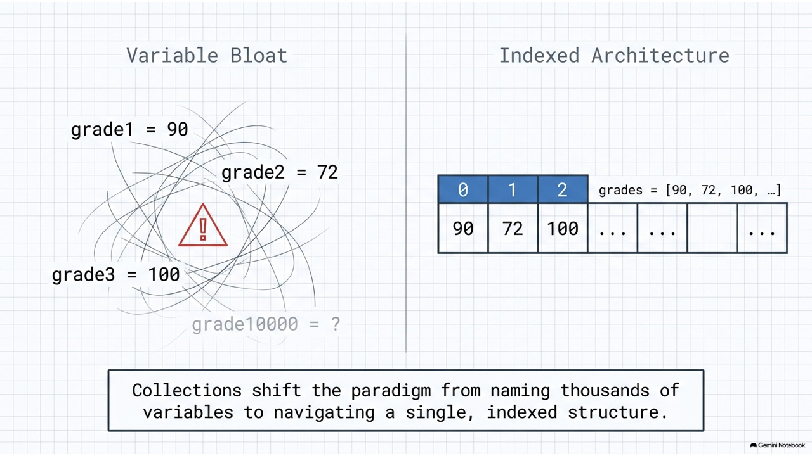
</div>

---
<!-- _class: full-image-slide -->

<div class="centered-image">
  
</div>

---

## 4.1.2 資料的新增 (append, extend, insert)

* **`append`**：將引數作為**單一元素**加到最尾端。
* **`extend`**：將另一個 List 拆解並**合併**到尾端。
* **`insert`**：在指定的索引位置插入元素。

```python
students = ['01-nick', '02-albert', '03-jie']
st = ['04-jason', '05-allen']

students.append('06-lisa')  # 尾端新增單一元素
students.extend(st)         # 合併 list st
students.insert(0, '07-maggie') # 在最前面位置 0 插入元素
```

---

## 4.1.3 資料的刪除 (remove, pop, clear)

* **`remove`**：依據**元素的值**進行刪除（若值不存在會報錯）。
* **`pop`**：依據**索引位置**取出並移除元素（預設為最後一個）。
* **`clear`**：清空 List 中的所有元素。

```python
students = ['nick', 'albert', 'jie']

students.remove('nick')  # 刪除 'nick'

popped = students.pop()  # 移除並回傳最後一個元素 ('jie')
print(popped)

popped_first = students.pop(0) # 移除第一個元素

students.clear()         # 刪除所有內容
```

---

## 4.1.4 資料的排序 (sort, sorted)

* **`sort()` 方法**：直接修改原本的 List 內容（原地排序 / in-place）。
* **`sorted()` 內建函式**：不改變原 List，排序後傳回一個**新的** List 物件。

```python
grades = [90, 72, 100, 60]

# 1. 使用 sorted (原 grades 不變)
new_grades = sorted(grades)
print(grades)      # [90, 72, 100, 60]
print(new_grades)  # [60, 72, 90, 100]

# 2. 使用 sort (直接修改原 grades)
grades.sort()
print(grades)      # [60, 72, 90, 100]
```

---
<!-- _class: full-image-slide -->

<div class="centered-image">
  
</div>

---

## 4.1.5 資料的擷取與切片 (Slicing)

* 切片語法為 `list[start:end]`，範圍包含 `start` 但**不包含 `end`**。
* 索引值可以使用負數，`-1` 代表最後一個元素。

```python
grade = [11, 22, 99, 35, 59]

print(grade[0])    # 11
print(grade[-1])   # 59
print(grade[1:3])  # 索引 1 到 2 -> [22, 99]
print(grade[1:])   # 索引 1 之後的所有元素 -> [22, 99, 35, 59]
print(grade[:3])   # 索引 3 之前的所有元素 -> [11, 22, 99]
```

---

## 4.1.6 資料的走訪與遍歷

* 利用 `for` 迴圈可以直接遍歷元素。
* 若需要同時取得「索引值」與「元素值」，可搭配 **`enumerate`** 函式：

```python
grade = [11, 22, 99, 35, 59]

# 1. 遍歷求加總與平均
total = 0
for g in grade:
    total += g
print("平均分數:", total // len(grade))

# 2. 調分練習：不及格者一律調整為 60 分
for i, g in enumerate(grade):
    if g < 60:
        grade[i] = 60
```

---
<!-- _class: full-image-slide -->

<div class="centered-image">
  
</div>

---
<!-- _class: full-image-slide -->

<div class="centered-image">
  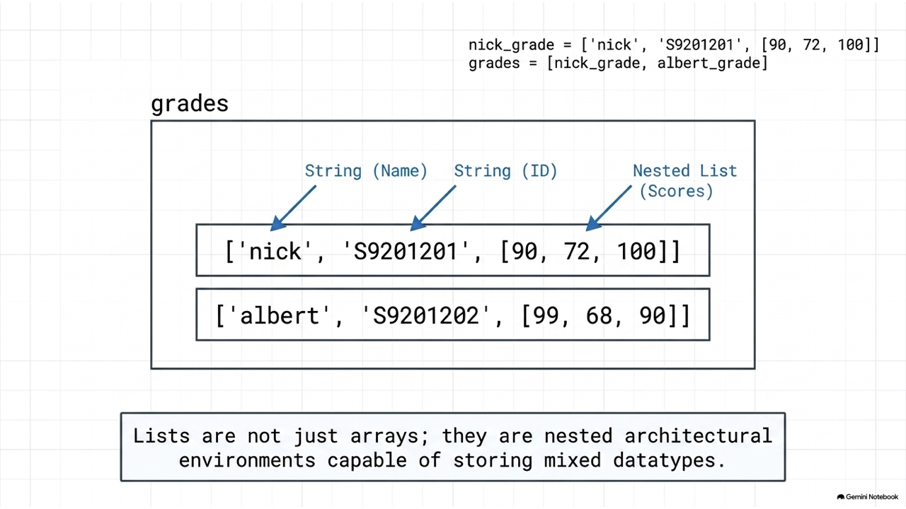
</div>

---

## 4.1.7 二維/巢狀 List 的加總計算

* 二維 List 可以使用雙重迴圈遍歷，並分別計算橫向與縱向的總和：

```python
# 4 位學生，每人 3 科的成績矩陣
grade_matrix = [[11, 22, 33], [44, 55, 66], [77, 88, 99], [90, 91, 92]]

# 橫向加總 (每個學生的總成績)
st_sum = [0, 0, 0, 0]
for idx, st in enumerate(grade_matrix):
    st_sum[idx] = sum(st)

# 縱向加總 (每個科目的總和)
subj_sum = [0, 0, 0]
for st in grade_matrix:
    for i, g in enumerate(st):
        subj_sum[i] += g
```

---

## 4.1.8 列表推導式 (List Comprehension)

* 提供極度簡潔且直覺的方式來建立 List：
* 語法：`[expression for item in iterable if condition]`

```python
# 1. 傳統 append 寫法
a = []
for i in range(10):
    a.append(i)

# 2. 列表推導式寫法 (等價於上方)
b = [i for i in range(10)]

# 3. 取得 0 到 9 之間的偶數
evens = [i for i in range(10) if i % 2 == 0] # [0, 2, 4, 6, 8]
```

---

## 4.1.9 多元排序與 Lambda 應用

* 使用 `sorted()` 時，可搭配 `key` 參數與 `lambda` 匿名函式指定客製化的排序指標。

```python
# 欄位為: [英文, 數學, 物理]
grade_data = [[11, 22, 33], [90, 91, 92], [77, 88, 99], [44, 55, 66]]

# 預設排序 (依據第一個元素排序)
print(sorted(grade_data)) # [[11,22,33], [44,55,66], [77,88,99], [90,91,92]]

# 依據各科總分排序 (比較各子 list 的總和)
g_sum = sorted(grade_data, key=lambda x: sum(x))

# 依據最後一科 (物理) 排序
g_last = sorted(grade_data, key=lambda x: x[-1])
```

---
<!-- _class: full-image-slide -->

<div class="centered-image">
  
</div>

---
<!-- _class: full-image-slide -->

<div class="centered-image">
  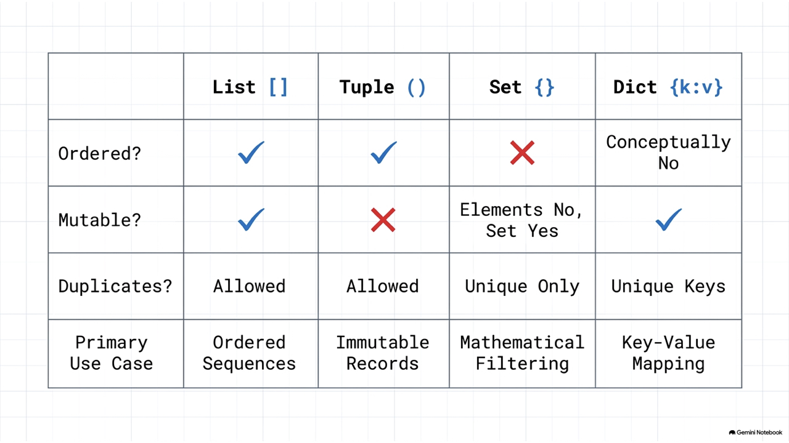
</div>

---

## 4.1.10 == 與 is 的差別 (Equality vs Identity)

* **`==` 運算子**：用來比較兩個物件的**「值 (Value)」是否相等**。
* **`is` 運算子**：用來比較兩個變數是否指向**「同一個記憶體位址 (Identity / Reference)」**。

```python
grade = [11, 22, 99, 35, 59]
g = grade
gc = grade.copy() # 建立一個複本，值相同但位址不同

print(grade == g)  # True (值相等)
print(grade is g)  # True (同一參考)

print(grade == gc) # True (值相等)
print(grade is gc) # False (不同位址)
```

---
<!-- _class: full-image-slide -->

<div class="centered-image">
  
</div>

---
<!-- _class: full-image-slide -->

<div class="centered-image">
  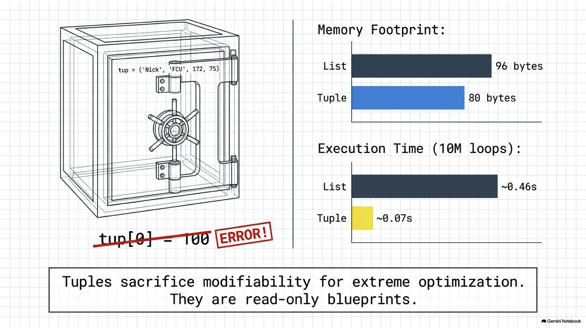
</div>

---

## 4.1.11 排序演算法：氣泡排序法 (Bubble Sort)

* 重複走訪要排序的數列，一次比較兩個相鄰元素，若順序錯誤就交換位置：

```python
import random
# 建立一個 1~100 隨機數的 list
rand_list = [random.randint(1, 100) for _ in range(10)]

size = len(rand_list)
for i in range(1, size):
    # 最後的 i 個已經排好了，不用再比
    for j in range(0, size - i):
        if rand_list[j] > rand_list[j + 1]:
            # 相鄰元素交換
            rand_list[j], rand_list[j + 1] = rand_list[j + 1], rand_list[j]
```

---

## 4.1.12 字串的切分與合併 (split & join)

* **`split()`**：將字串依特定符號切割成 List。
* **`join()`**：將 List 內多個字串元素組裝連接成一個大字串。

```python
city_string = "Taichung Taipei Kaoshiung"

# 切割為 list
city_list = city_string.split() # ['Taichung', 'Taipei', 'Kaoshiung']

# 以特定符號連接 list 元素
joined_str_1 = '-'.join(city_list)   # "Taichung-Taipei-Kaoshiung"
joined_str_2 = ' * '.join(city_list) # "Taichung * Taipei * Kaoshiung"
```

---

## Concept Check Question (CCQ 1)

<div class="ccq-columns">
  <div class="ccq-text">

**給定程式碼如下，請選出執行後的正確輸出結果。**
```python
list1 = [1, 2, 3, 4, 5]
list2 = list1[1:4]
list2[0] = 99
print(list1, list2)
```

* **A.** `[1, 99, 3, 4, 5] [99, 3, 4]`
* **B.** `[1, 2, 3, 4, 5] [99, 3, 4]`
* **C.** `[1, 2, 3, 4, 5] [99, 2, 3, 4]`
* **D.** `[1, 99, 99, 99, 5] [99, 3, 4]`

  </div>
  <div class="ccq-logo">
    
  </div>
</div>

---

## CCQ 1 - 答案與解析

<div class="ccq-columns">
  <div class="ccq-text">

### **正確答案：B.**

* **解析**：
  * `list1[1:4]` 會擷取索引 1 至 3 的元素，得到新列表 `[2, 3, 4]`，此切片操作會**產生新的記憶體複本**，獨立於原列表。
  * `list2[0] = 99` 修改的是新列表 `list2` 的首個元素（原為 2），將其改為 99。這個操作不會影響到原列表 `list1`。
  * 故 `list1` 依然為 `[1, 2, 3, 4, 5]`，而 `list2` 變為 `[99, 3, 4]`。

  </div>
  <div class="ccq-logo">
    
  </div>
</div>

---

## Concept Check Question (CCQ 2)

<div class="ccq-columns">
  <div class="ccq-text">

**在 Python 列表中，`remove()` 方法與 `pop()` 方法最核心的區別是什麼？**

* **A.** `remove()` 回傳被刪除的元素值，而 `pop()` 不回傳任何值。
* **B.** `remove()` 依據索引位置刪除元素，而 `pop()` 依據元素值刪除元素.
* **C.** `remove()` 依據元素值刪除元素，而 `pop()` 依據索引位置刪除元素並回傳該值。
* **D.** `remove()` 可以清空整個列表，而 `pop()` 只能刪除最後一個元素。

  </div>
  <div class="ccq-logo">
    
  </div>
</div>

---

## CCQ 2 - 答案與解析

<div class="ccq-columns">
  <div class="ccq-text">

### **正確答案：C.**

* **解析**：
  * **`remove(val)`**：用來移除列表中第一個值等於 `val` 的成員。它是不帶回傳值（`None`）的，若找不到該值會報 `ValueError`。
  * **`pop(index)`**：移除指定索引 `index` 的成員並**回傳該被移除的物件**。若不傳入引數，則預設是移除最尾端元素（等同 `pop(-1)`）。
  * 故 C 選項敘述完全正確。

  </div>
  <div class="ccq-logo">
    
  </div>
</div>

---
<!-- _class: lead -->

# **4.2 Tuple 集合物件 (Tuple)**

---

## 4.2.1 Tuple 的定義與特性

* 元組（Tuple）使用小括號 `()` 定義，最大的特性是**「不可變性 (Immutable)」**。
* 內容建立後，不能新增、修改、刪除個別元素。主要作為**唯讀的 List**。

```python
tup1 = ('Nick', 'FCU', 172, 75)
tup2 = (1, 2, 3, 4, 5)
tup3 = "a", "b", "c", "d" # 不加括號預設也是 Tuple

# 唯讀性驗證 (執行此行會發生 TypeError)
# tup2[0] = 100 

t = ('a', 'b', 'c', 'd', 'e')
print(t[0])   # 支援索引取得
print(t[1:4]) # 支援切片
```

---

## 4.2.2 Tuple 的效能優勢

* **為什麼要使用 Tuple 替代 List？**
  1. **效能更好**：由於記憶體長度與內容固定，Python 底層對其有記憶體與速度優化，存取速度較 List 更快。
  2. **資料安全**：保護設定檔或常數清單，防止在程式執行過程中被無意中修改。
  3. **可作為字典的 Key**：因為不可變 (hashable)，Tuple 可做為 Dict 的鍵，而 List 則不行。

---

## 4.2.3 元組打包與開箱 (Pack & Unpack)

* **元組打包 (Pack)**：將多個變數/數值包裝在一個元組中。
* **元組開箱 (Unpack)**：將元組中的元素一次性取出賦予多個變數（數量必須一致）。

```python
# 元組打包
person = ('male', 10, 'nick') 

# 元組開箱
sex, age, name = person
print(sex)  # 'male'
print(age)  # 10
print(name) # 'nick'
```

---

## 4.2.4 現代模式匹配 (match-case for list/tuple) (Python 3.10+)

* 現代 Python 支援結構化模式匹配，可以用於比對 Tuple/List 的內容與長度：

```python
def run_command(cmd):
    match cmd:
        case ["move", direction]:
            print(f"移動到方向: {direction}")
        case ["jump", x, y]:
            print(f"跳躍到座標: ({x}, {y})")
        case ["attack", *targets]: # 解構剩餘所有元素
            print(f"攻擊多個目標: {targets}")
        case _:
            print("無法識別的指令")

run_command(["move", "North"])
run_command(["attack", "enemy1", "enemy2"])
```

---

## Concept Check Question (CCQ 3)

<div class="ccq-columns">
  <div class="ccq-text">

**給定程式碼如下，請選出執行後的輸出結果。**
```python
tup = (1, 2, [3, 4])
tup[2][0] = 99
print(tup)
```

* **A.** `(1, 2, [3, 4])` 並且報 `TypeError` 錯誤
* **B.** `(1, 2, [99, 4])` 並且順利執行
* **C.** `(1, 2, [99, 99])` 並且順利執行
* **D.** 程式拋出 `IndexError`

  </div>
  <div class="ccq-logo">
    
  </div>
</div>

---

## CCQ 3 - 答案與解析

<div class="ccq-columns">
  <div class="ccq-text">

### **正確答案：B.**

* **解析**：
  * Tuple 內部元素的**參考位置**不可變，意即我們無法改變 `tup` 去指向其他變數（例如 `tup[2] = 5` 會報錯）。
  * 但如果 Tuple 的內部成員是一個**可變物件（如 list `[3, 4]`）**，我們依然可以直接對該 list 內部的元素值進行修改。
  * `tup[2][0] = 99` 修改了該 list 內部第 0 項為 99，這是允許的，並不會改變 Tuple 記錄該 list 實體的位址。
  * 故能順利執行，印出 `(1, 2, [99, 4])`。

  </div>
  <div class="ccq-logo">
    
  </div>
</div>

---
<!-- _class: lead -->

# **4.3 Set 集合物件 (Set)**

---
<!-- _class: full-image-slide -->

<div class="centered-image">
  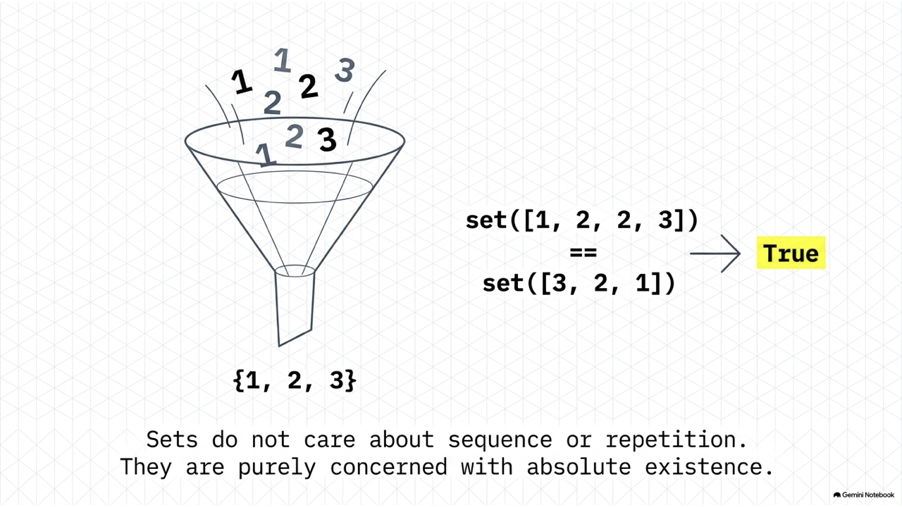
</div>

---
<!-- _class: full-image-slide -->

<div class="centered-image">
  
</div>

---
<!-- _class: full-image-slide -->

<div class="centered-image">
  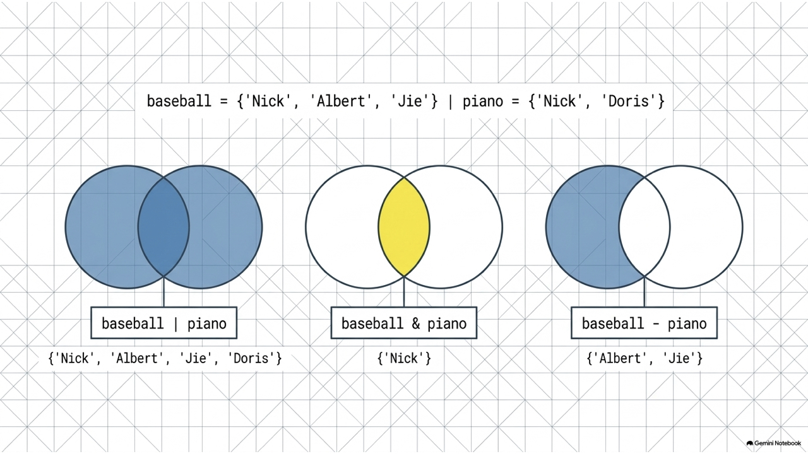
</div>

---

## 4.3.1 Set 的定義與運算

* 集合（Set）是**無序**且元素**不重複**的容器。
* 支援聯集（`|`）、交集（`&`）、差集（`-`）等數學運算：

```python
baseball = ['Nick', 'Albert', 'Jie']
piano = ['Nick', 'Doris']
highGrade = ['Nick', 'Doris', 'Anna']

baseballSet = set(baseball)
pianoSet = set(piano)

# 1. 聯集 (兩社團所有的不重複人名)
community = baseballSet | pianoSet # {'Nick', 'Albert', 'Jie', 'Doris'}

# 2. 交集 (高分群且參加社團者)
commAndHigh = community & set(highGrade) # {'Nick', 'Doris'}
```

---

## 4.3.2 Set 的增修刪查 (CRUD)

* **新增**：`add()` (重複新增會被忽視)。
* **刪除**：`remove()` (不存在會報錯) 或 `discard()` (不存在不報錯)。
* **查詢**：`in` 關鍵字（由於 Hash 機制，Set 查詢極快）。

```python
basketball = set()

basketball.add('Alex')
basketball.add('Alex') # 重複新增，不會出錯也不會增加

# 刪除
basketball.remove('Alex')
# basketball.remove('Peter') # KeyError
basketball.discard('Peter')  # 失敗，但不會出錯

print('Alex' in basketball)  # False (查詢)
```

---

## Concept Check Question (CCQ 4)

<div class="ccq-columns">
  <div class="ccq-text">

**下列布林表達式執行後的結果為何？**
```python
print(set([1, 2, 2, 3]) == set([3, 2, 1]))
```

* **A.** `True`
* **B.** `False`
* **C.** `TypeError`
* **D.** `None`

  </div>
  <div class="ccq-logo">
    
  </div>
</div>

---

## CCQ 4 - 答案與解析

<div class="ccq-columns">
  <div class="ccq-text">

### **正確答案：A. `True`**

* **解析**：
  * 集合（Set）具備**元素不重複**的特性，因此 `set([1, 2, 2, 3])` 在建立時會自動去重，轉換成 `{1, 2, 3}`。
  * 集合同時具備**無順序性**的特性，表示集合間的比較與元素排列順序無關。因此，集合 `{1, 2, 3}` 和 `{3, 2, 1}` 包含完全相同的成員，兩者相等比較為 `True`。

  </div>
  <div class="ccq-logo">
    
  </div>
</div>

---
<!-- _class: lead -->

# **4.4 Dict 集合物件 (Dict)**

---
<!-- _class: full-image-slide -->

<div class="centered-image">
  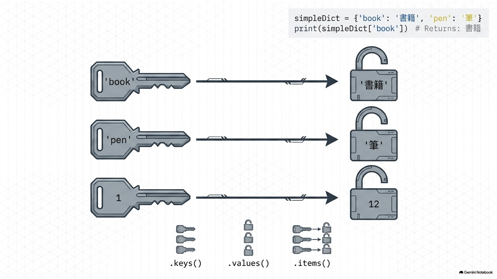
</div>

---

## 4.4.1 Dict 的建立與基本讀寫

* 字典（Dict）由 **Key (鍵) - Value (值)** 對編組。使用大括號 `{}` 或 `dict()` 宣告：
* **重要限制**：鍵（Key）必須是不可變型態（如字串、數值、Tuple），**不可使用可變型態（如 List）做為 Key**！

```python
family = {'dad': 'Jack', 'mom': 'LiLi', 'size': 2}

# 新增/修改鍵值對 (若 key 存在則覆蓋，不存在則新增)
grade = {1: 12, 2: 100}
grade[3] = 90  # 新增鍵 3
grade[2] = 95  # 修改鍵 2 的值

# 刪除鍵值對 (使用 del 或 pop)
del grade[1]
popped_val = grade.pop(3) # 移除並回傳鍵 3 的值 (90)
```

---
<!-- _class: full-image-slide -->

<div class="centered-image">
  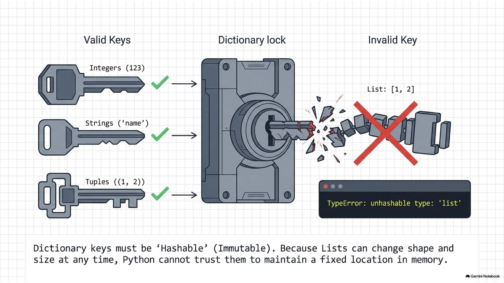
</div>

---

## 4.4.2 現代字典合併方法 (Python 3.9+)

* 從 Python 3.9 起，可以使用 `|` (聯集合併) 與 `|=` (就地更新) 來進行字典合併：

```python
dict1 = {'apple': 10, 'banana': 20}
dict2 = {'banana': 30, 'cherry': 40}

# 1. 字典合併 (重複 key 則以後者為準，不改變原字典)
merged = dict1 | dict2
print(merged) # {'apple': 10, 'banana': 30, 'cherry': 40}
print(dict1)  # {'apple': 10, 'banana': 20}

# 2. 字典原地更新
dict1 |= dict2
print(dict1)  # {'apple': 10, 'banana': 30, 'cherry': 40}
```

---

## 4.4.3 Dict 的走訪與查詢

* 我們可以查詢 Dict 的 key、value 以及整個 tuple 鍵值對：

```python
simpleDict = {'book': '書籍', 'pen': '筆'}

# 走訪所有的 keys
for k in simpleDict.keys():
    print(k)

# 走訪所有的 items (包含鍵與值)
for k, v in simpleDict.items():
    print(f"Key: {k}, Value: {v}")

# 取得特定鍵 (若鍵不存在可使用 get 避免程式出錯)
print(simpleDict.get('bag', '找不到該鍵')) # 回傳預設值 "找不到該鍵"
```

---

## 4.4.4 字典推導式與現代 Zip 限制 (Python 3.10+)

* 透過 `zip` 搭配 `strict=True` 可以確保兩個清單在長度一致時才進行轉換：

```python
std = ['nick', 'john', 'mac']
grades = [100, 90, 80]

# 1. 直接以 zip 轉成 dict
std_dict = dict(zip(std, grades, strict=True))

# 2. 字典推導式 (Dict Comprehension)
# 語法: {key_expr: value_expr for item in iterable}
dict_comp = {k: v for k, v in zip(std, grades, strict=True)}
```

---
<!-- _class: full-image-slide -->

<div class="centered-image">
  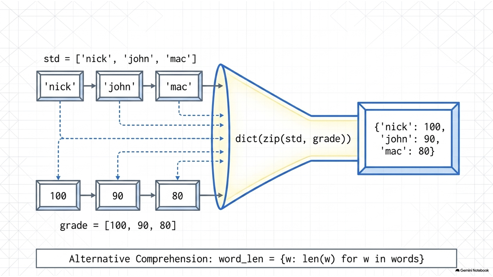
</div>

---
<!-- _class: full-image-slide -->

<div class="centered-image">
  
</div>

---
<!-- _class: full-image-slide -->

<div class="centered-image">
  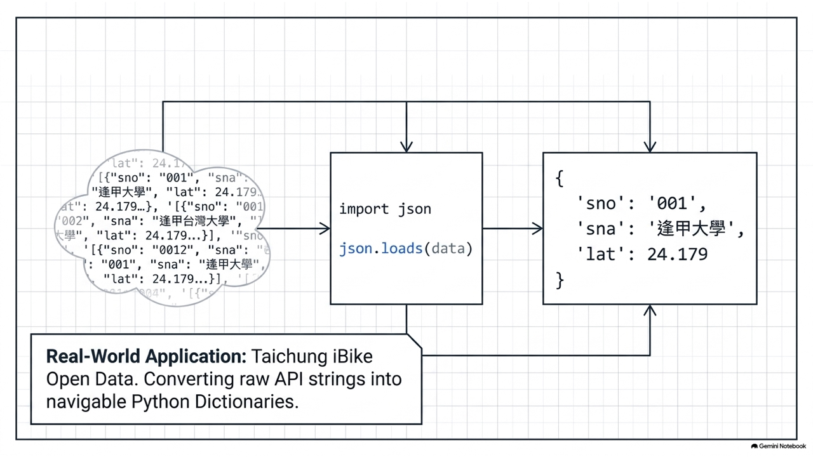
</div>

---

## 4.4.5 JSON 檔案處理 (json.loads & dumps)

* **`json.loads()`**：將 JSON 格式的**字串**解析轉換為 Python 的 **Dict / List** 物件。
* **`json.dumps()`**：將 Python 的 **Dict / List** 編碼轉換為 JSON 格式的**字串**。

```python
import json

# JSON 格式字串
gStr = '{"eng": 60, "math": 78, "phy": 100}'

# 1. 載入 (JSON -> Dict)
gDict = json.loads(gStr)
print(gDict['eng'])  # 60

# 2. 輸出 (Dict -> JSON)
json_output = json.dumps(gDict)
```

---

## Concept Check Question (CCQ 5)

<div class="ccq-columns">
  <div class="ccq-text">

**給定程式碼如下，請選出正確的輸出結果。**
```python
info = {'name': 'Nick', 'age': 20}
print(info.get('score', 60), info.get('age', 60))
```

* **A.** `None 20`
* **B.** `60 60`
* **C.** `60 20`
* **D.** 程式拋出 `KeyError`

  </div>
  <div class="ccq-logo">
    
  </div>
</div>

---

## CCQ 5 - 答案與解析

<div class="ccq-columns">
  <div class="ccq-text">

### **正確答案：C.**

* **解析**：
  * `dict.get(key, default)` 是安全的查詢方法。若指定的 `key` 存在於字典中，則回傳其對應的值；若 `key` 不存在，則回傳所設定的 `default` 值。
  * `info.get('score', 60)`：由於 `'score'` 不在 `info` 中，因此回傳設定的預設值 `60`。
  * `info.get('age', 60)`：由於 `'age'` 存在於 `info` 中，值為 `20`，因此直接回傳其原值 `20`。
  * 故結果為 `60 20`。

  </div>
  <div class="ccq-logo">
    
  </div>
</div>

---
<!-- _class: lead -->

# **4.5 應用：台中市 iBike 開放資料解析**

---
<!-- _class: full-image-slide -->

<div class="centered-image">
  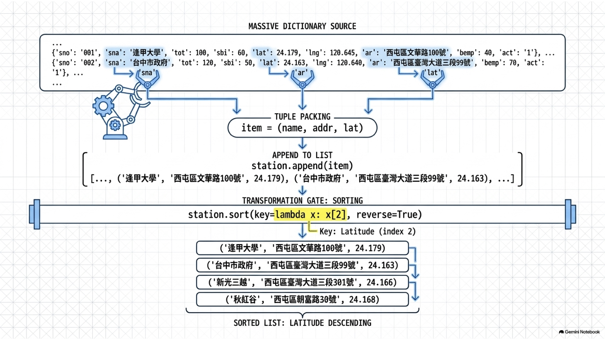
</div>

---

## 4.5.1 iBike 資料結構說明

* 模擬台中市政府 iBike 伺服器回傳之 JSON 資料節點結構：

```json
{
  "retVal": {
    "2001": {
      "sno": "2001",
      "sna": "逢甲大學",
      "tot": "40",
      "sbi": "24",
      "sarea": "西屯區"
    }
  }
}
```

* `retVal` 內含多個站點物件，鍵為站點編號。
* `tot` 代表站點總車位格數，`sbi` 代表目前可借車輛數。

---
<!-- _class: full-image-slide -->

<div class="centered-image">
  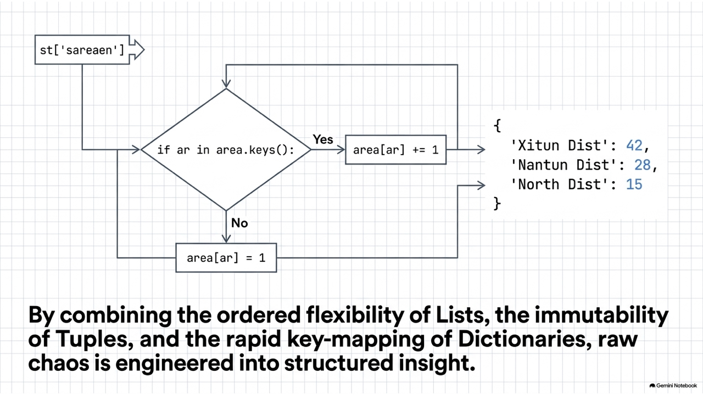
</div>

---

## 4.5.2 資料走訪與車輛充足率統計

* 解析 JSON 資料並統計出車位充足率資訊：

```python
import json

# data = json.loads(api_response)
stations = data["retVal"]

for sno, info in stations.items():
    name = info["sna"]
    total = int(info["tot"])
    available = int(info["sbi"])
    area = info["sarea"]
    
    # 計算充足率
    ratio = (available / total) * 100
    print(f"{area} | {name} | 可借: {available} | 充足率: {ratio:.1f}%")
```
