Ch05 Function
===

函式 函式主要分為五個單元，第一是模組化的設計，第二是參數的傳遞，接下來是Lambda 函式 和例外處理，而在最後我們會給兩個應用。

講到模組化設計，當我們的程式設計越來越大、越來越複雜的時候，你會發現有些功能、流程是重複不斷地在執行的，差別是資料一開始進去的時候，它的值有一些改變，在這種情況下就可以把那段的程式流程抽取出來，獨立形成一個 函式，每一次要執行它的時候，再去呼叫這一個 函式，這樣子能夠大大地降低程式的複雜性，這是所謂的模組化設計。

第二個部分"參數的傳遞"，也是因為把一些流程抽取出來變成一項函式，因此要呼叫這個函式的時候需要傳遞給它值，而這個值就是所謂的參數。這個參數的傳遞也是一門學問，因為有時候我們希望當函式執行完並回傳時，這個參數的值它是被改變的，有時候是不希望它被改變的，所以參數的傳遞也是要特別留意。

第三點是所謂的 Lambda 函式，Lambda 函式 它是一個輕量級的 函式，那它本身可以沒有名字，也可能只有一兩行而已，並且可能只被呼叫一兩次，但是他非常的方便使用。

第四部分是例外 Exception，我們在寫程式的時候常會遇到一些意外的情況，因為使用者使用的習慣或者環境，可能跟我們的是不太一樣的。一開始我們也沒想到會有這樣的情況，因此當使用者做了某些行為，像是檔案放在我們預想之外的位置時，那系統可能就會拋出例外，那就可以用這個方式來做處理。

第五個小節介紹兩個應用，第一個是河內塔的範例，小時候大家玩益智遊戲，可能都有玩過"Hanoi Tower"，就是一直在移動一個圈圈。通過程式來做 Hanoi Tower 就變得相當規律且有趣 -- 一旦你理解了以後，不管是五個十個，你在移動這個 Hanoi Tower，就覺得非常簡單。

第二個範例是讓電腦互玩井字遊戲，井字遊戲大家也都有玩過，那裡面我們在執行這個程式的過程中，有些 函式 是不斷地被執行，因此我們把它抽取出來，使其變成一個獨立的 函式。

學習完這章，你會更像是一個專業的 Programmer，因為第一個你已經具備模組化設計的能力，第二個你了解到參數之間是怎麼做傳遞的，第三個就是恭喜各位也具備開發大型軟體的能力，不是每一次寫出來的程式都是十幾二十行，程式開始會變的越來越大，大概三百到四百行甚至一千行的程式碼，你都有辦法處理。


## 模組化設計

當程式越來越大的時候，我們須要來做模組化的設計來簡化我們程式的複雜度，比方說這裡是我們程式的指令，我們發現某個的地方有特定的功能(例如計算距離)，是能夠把它抽象成一個函式(function)，只要呼叫這個函式就好，不需要再寫一次程式碼。如下圖。函式執行完了後，它的控制權會回到原有程式，繼續從原來的地方往下執行，

函式有兩個重要的優點：第一個就是程式的可讀性會變高，第二個是簡化程式碼，並讓重用性變高。


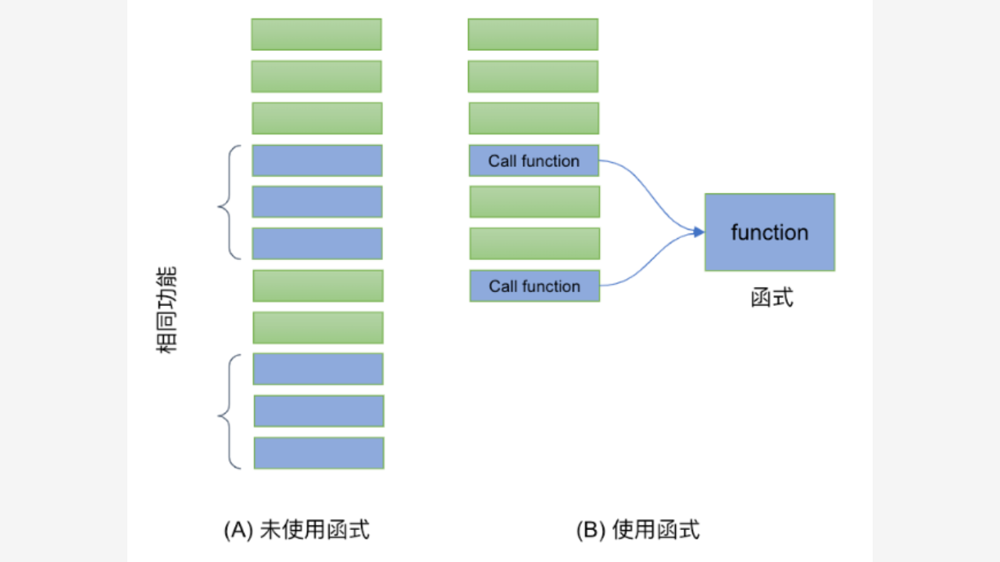

### 函式的定義

定義函式用的保留字是 **def**，後面的部分是「函式名稱()」。冒號（`:`）內的程式碼，是這個函式要做的指令，記得這個部分要做內縮，所有內縮的部份都是屬於函式它定義的範圍。我們先定義一個簡單的功能叫做 `hello`，它做的事情是印出一個 `"Hello, python"` 這樣的動作。注意「定義」和「呼叫執行」是不同的。下列程式碼中，line 1-2 是定義，line 4,5 分別是兩次的呼叫執行，所以共會印出兩次。


```python
def hello():                # 函式的名稱
    print('Hello, python')  # 函式程式內容
    
hello()    # 呼叫
hello()    # 再次呼叫
```

輸出為：
```
Hello, python
Hello, python
```

從第四行起已經不是函式內容而是這一個程式的主程式。注意 `def` 的宣告必須要在主程式（呼叫者）的前面，否則呼叫者會「不認識」函式，而產生失敗。

### 帶參數的函式定義

上面的函式比較簡單，每一次呼叫它的時候它印出來都是這幾個字，但是如果給它參數的話那就不一樣了，它會依據你代入的參數是什麼，表現出不同的行為出來。比方說下面的 `hello2()`，帶入的參數是 `"java"`，那它印出來的結果會是 `"hello, java"`; 如果說我們帶進給它的是 `"python"` 的話，它印出來的結果就是 `"hello, python"`。請注意第二行中的 `p` 是我們帶入的參數。

```python
def hello2(p): 
    print('Hello', p)
    
hello2("Java")    # 呼叫 函式 時，帶入參數
hello2("Python")
```

下面程式碼定義了一個函式 `max`，裡面帶入三個參數，希望找出這三個參數最大的一個值，最後做回傳。
函式的最後一行執行 `return m` 則為回傳 `m` 的值給呼叫者。

```python
def max(a, b, c):
    ''' get max value'''
    if (a>b):
        if (a>c):
           m = a
        else:
           m = c
    elif (b>c):
        m = b
    else:
        m = c
    return m    

print(max(1,2,3))  # 3
print(max(3,2,1))  # 3      
print(max(2,3,1))  # 3      
help(max)
```

這個定義下面的地方有註解，稱之為 `docstring`，它是用來說明這一個函式它的意義的，這樣以後呼叫者可以透過指令 `help` 去了解這一個函式它的用法跟它的意義，使其在使用上會比較正確。

### BMI example

我們再來看 BMI 的例子，那這個例子我們要依據一個人的身高跟體重，來算它們的 BMI，BMI 如果太高或是太低，就代表這個人的身體可能有些狀況，所以我們要控制在一定的範圍。我們一樣建立函式註解的解說。以這個例子來講的話，特別說明說他的身高必須以公尺為單位，體重是以公斤為單位，BMI 的值就是等於體重去除以身高的平方，得到了以後再把這個值把它回傳回去，呼叫端我們就透過 `get_bmi(1.72, 80)` 來呼叫引用。 


```python
def get_bmi(tall, weight):
    """ 
    基於傳入的身高與體重計算人體的 BMI 並回傳。
    身高必須以公尺為單位，體重以公斤為單位。
    """
    bmi_value = weight / (tall*tall)
    return round(bmi_value,2)

bmi = get_bmi(1.72, 80)
print(bmi)
```

### Keyword 參數

宣告在 `def` 參數的位置是有順序的，所以我們傳遞的時候需要按照順序。例如以下 `hello1(name, msg)` 第一個參數是 `姓名`，第二個是`訊息`，如果順序顛倒了，含義就不同了。

不過我們可以透過 `keyword` 參數的方式來指名，例如下述第五行，我們有指名 `msg` 和 `name`，即便順序不同也是沒關係的。這種情況我們稱之為 `keyword 參數`（指名 keyword, value）。


```python
def hello1(name, msg):
  print ("Hi, {}, {}".format(name, msg))

hello1('Nick', 'Good morning')
hello1(msg='Good morning', name='Nick') # 指定關鍵字
hello1('Good morning', 'Nick')          # 含義上的錯誤
```

下述 `hello2` 中，我們在宣告時給了 `msg` 一個預設值，所以如果呼叫時沒有帶這個參數也沒有關係，會用預設值來運算。此類參數稱之為預設參數（default parameter）。

使用 `keyword` 來指定參數時，必須放在後面，下述 line 9 就是一個錯誤的情況, 因為 `Nick` 沒有放在第一個參數。Line 10 是另一個錯誤的範例 -- 因為 `name` 並沒有宣告預設的參數值，所以呼叫的時候一定要給值。`name` 因為沒有預設值所以稱之為必要參數 (required parameter)。

```python
def hello2(name, msg = "Hello"):
  print ("Hi, {}, {}".format(name, msg))

print ('-- hello2: msg has a default value --')
hello2('Nick')
hello2('Nick', 'Good morning')
hello2('Nick', msg = 'Good morning')
hello2('Nick', msg = 'Hello')
# hello2(msg = 'Good morning', 'Nick')  # ERROR
# hello2()                              # ERROR
```

注意宣告端必要參數必須要預設參數之前。下述 `hello2a()` 就是一個錯誤的宣告：`name` 必須在 `msg` 之前。`hello2b()` 是修正後正確的方式。

```python
def hello2a(msg = "Hello", name):     # ERROR
   print (name, msg)

def hello2b(name, msg = "Hello"):     # Correct
   print (name, msg)    
```


`hello3()` 是一個所有參數都有預設值的案例，這時候我們呼叫 `hello3()` 時不帶任何參數也是可以的。

```python
print ('-- hello3: name and msg has default values --')
def hello3(name = "Nick", msg = "Hello"):
  print ("Hi, {}, {}".format(name, msg))

hello3()
輸出：
```
Hi, Nick, Hello
Hi, Nick, Hello
Hi, John, Good night
```

#### 補充：位置專用與關鍵字專用參數 (Python 3.8+)

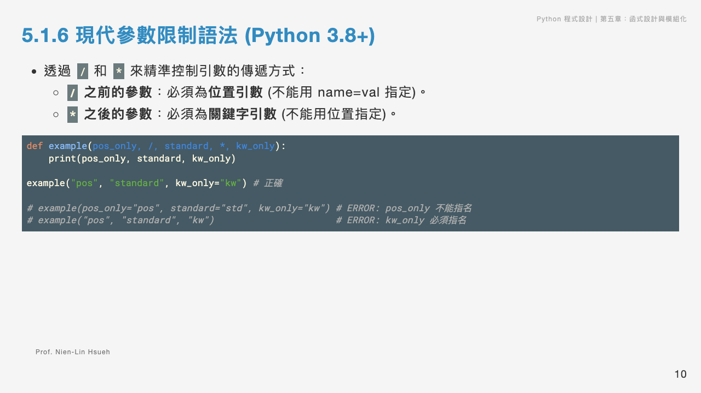

在設計函式時，有時我們想限制某些參數**只能用位置傳入（不能用 keyword 指定）**，或者**只能用 keyword 傳入（不能用位置傳入）**。Python 3.8+ 引入了 `/` 與 `*` 語法來進行限制：

- **`/` 之前的參數**：為**位置專用（Positional-only）**，呼叫時**不能**寫出 `key=value` 的形式。
- **`*` 之後的參數**：為**關鍵字專用（Keyword-only）**，呼叫時**必須**寫出 `key=value` 的形式。

```python
def example(pos_only, /, standard, *, kw_only):
    print(pos_only, standard, kw_only)

# 正確的呼叫方式：
example("I am pos-only", "I am standard", kw_only="I am kw-only")
example("I am pos-only", standard="I am standard", kw_only="I am kw-only")

# 錯誤的呼叫方式 (會引發 TypeError)：
# example(pos_only="error", standard="standard", kw_only="kw-only") # pos_only 不能指名
# example("pos-only", "standard", "kw-only")                       # kw_only 必須指名
```

#### 補充：現代函式型態提示 (Type Hints) (Python 3.10+)

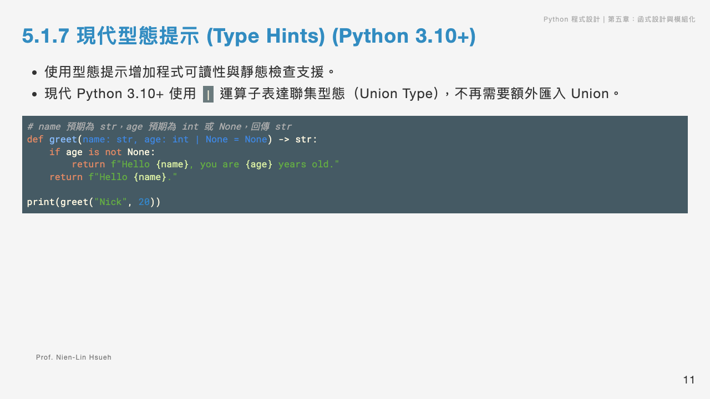

為了解釋參數與回傳值的預期型態，Python 支援**型態提示 (Type Hints)**。在 Python 3.10+ 中，我們可以使用聯集運算子 `|` 來表示多重型態，寫法非常乾淨：

```python
# 表示 name 必須為字串 (str)，age 可以是整數 (int) 或 None，回傳值為字串 (str)
def greet(name: str, age: int | None = None) -> str:
    if age is not None:
        return f"Hello {name}, you are {age} years old."
    return f"Hello {name}."

print(greet("Nick", 20))
```
> [!NOTE]
> 型態提示僅供閱讀、IDE 檢查與 Linter 驗證使用，Python 運行時並不會進行強制的型態阻擋。

```

### prime() example

以下 prime(n) 會印出不大於 n 的所有質數。
```python
def prime1(n):
    "print the prime numbers below n"
    for x in range(2, n+1):
       for d in range (2, x):
           if  x % d == 0:
               break  # x is not prime
       else: # x is prime
           print (x, end=' ') 

prime1(10)
```

多加一個參數 `start` 來指定起算的數，印出 `start` 到 `n` 的所有質數。`start` 是預設參數，如果沒有指定，就印出 `2~n` 的質數。

```python
def prime2(n, start=2):
    "print the prime numbers between start and n"
    if start < 2: start = 2
    for x in range(start, n+1):
       for d in range (2, x):
           if  x % d == 0:
               break  # x is not prime
       else: # x is prime
           print (x, end=' ') 

prime2(10)
prime2(10, 5)
prime2(10, start=5) # 呼叫時，指定 keyword
prime2(start=5)     # incorrect 
prime2(start=5, 10) # incorrect 
```

注意：必要參數必須放在預設參數的前面。 

prime3() 則把兩個參數都宣告為預設參數：

```python
def prime3(pStart=2, pEnd=20):
    "print the prime numbers between s and n"
    if pStart < 2: pStart = 2
    for x in range(pStart, pEnd+1):
       for d in range (2, x):
           if  x % d == 0:
               break  # x is not prime
       else: # x is prime
           print (x, end=' ') 

prime3(pEnd=20, pStart=10)    # correct
prime3(2, 10)                 # correct   
```

### **5.1.1 隨堂測驗 (CCQ 1)**

**問題**

給定函式定義 `def func(a, b=5, c=10): print(a, b, c)`。下列哪一個呼叫方式在 Python 中是**無效的 (Invalid)**，會導致語法錯誤？

A) `func(1)`
B) `func(a=1, c=20)`
C) `func(b=20, 30)`
D) `func(1, c=20, b=30)`

<details>
<summary>點擊查看【隨堂測驗】答案與解析</summary>

**正確答案：C) `func(b=20, 30)`**

* **解析**：
  * Python 的語法規定：**位置引數（Positional Arguments）必須排在關鍵字引數（Keyword Arguments）之前**。
  * 在 `func(b=20, 30)` 中，第一個引數 `b=20` 是關鍵字引數，而第二個引數 `30` 是位置引數。這違反了引數順序規定，會引發 `SyntaxError: positional argument follows keyword argument`。
  * 其他選項皆合法：選項 A 使用預設值；選項 B 僅指定 a 和 c，b 採預設值；選項 D 位置引數在前，後面關鍵字引數順序無礙。

</details>

### 變動的參數個數

有時候我們不確定會有多少個參數，就可以用 `變動` 參數來「收納」。在變數的前面加上 `*` 就形成了變動參數。

```python
def avg(name, *grade): # grade 是變動參數
   sum = 0
   print ("Type of grade: {}, values are: {}".format(type(grade), grade))
   for g in grade: sum += g
   if grade != ():
       avg = sum // len(grade)   
       print (name + ", avg is：", avg)   
   else:
       print ("{} has no grade".format(name))

avg('Nick', 100, 50, 20)
avg('Taylor', 100, 50, 20, 90)
avg('Jerry')
```

輸出：
```python
Type of grade: <class 'tuple'>, values are: (100, 50, 20)
nick, avg is： 56
Type of grade: <class 'tuple'>, values are: (100, 50, 20, 90)
taylor, avg is： 65
Type of grade: <class 'tuple'>, values are: ()
jerry has no grade
```

## 進階參數的傳遞

下面的程式中我們宣告了 `plus1`, `plus2` 分別處理一個整數和一個 list。看起來兩個函式都對傳進的資料做了一些變動。那們在呼叫之後，他們的值有所改變嗎？

```python
def plus1(aNumber):
  aNumber += 1

def plus2(aList):
  for i in range(len(aList)):
    aList[i] += 1

a, m = 1, [1,2]
print ('-- Before Calling function --')
print (a, m)

print ('-- After Calling function --')
plus1(a)
plus2(m)
print (a, m)
```

可以看得到，傳入整數 (`plus1()`)，`a` 的值不會變動，傳入List 則會。這和 Python 對於不同資料型態的處理方式不同及傳遞機制有關係。

```python
--- Before Calling function ---
1 [1, 2]
--- After Calling function ---
1 [2, 3]
```


### 不可變物件

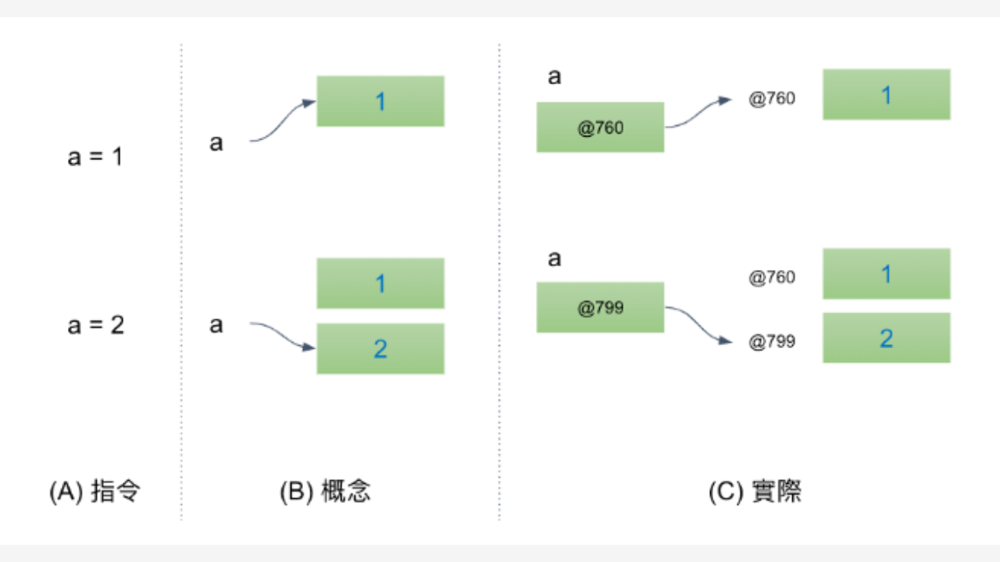

在探討這個問題之前，我們先來介紹 Python 裡面 immutable object (不可變物件)及 mutable object (可變物件)。在 Python 中所有的資料都是「物件」，包含我們常看到的整數 (int)，而且 int 還是一個 不可變的物件。

我們來看一下它真實內部的運作，一開始我們讓 `a` 的值等於 `1`，它真正的作法是：先在記憶體開一個空間去儲存 `1`，假設這個位置是 `@760` (我們用`@` 只是方便示意他是一個記憶體位置)，我們紀錄 `a` 的值存在 `@760`。上圖(B) 表達了這個概念，而 (C) 則更精準的表達實際的狀況。

接著我們今天下一個指令，讓 `a = 2` 的時候，大家可能會想像它運作的方式是把原來 `@760` 這個空間的值，由 `1` 把它改成 `2`，但是實際上的運作並非如此，因為 int 是一個`不可變動物件`，所以 `@760` 這筆資料，它本來放這個整數是不可以做修改。系統額外再增加一個空間叫 `@799`，然後這個地方放的值是 `2`。

```python
# 不可變物件 (Immutable object)
a = 1
a = 2
```

我們來驗證一下。`id(a)` 會印出 `a` 的記憶體位置，以下觀察記憶體位置：

```python
a = 1
print('a 的位置：', id(a), 'a 的值：', a)
a = 2
print('a 的位置：', id(a), 'a 的值：', a)

b = 1
print('b 的位置：', id(b), 'b 的值：', b)

c = 2
print('c 的位置：', id(c), 'c 的值：', c)
```

如下，注意一開始建立儲存 `1` 的位置是 `11126688`，和後來的 `b` 是一樣的。依此類推儲存 `2` 的也是如此。注意：這個記憶體的位置每次執行可能都是不一樣的，在您的電腦跑出的結果也是不同。此範例的重點在觀察不可變的特性。

```
a 的位置： 140683034198256 a 的值： 1
a 的位置： 140683034198288 a 的值： 2
b 的位置： 140683034198256 b 的值： 1
c 的位置： 140683034198288 b 的值： 2
```


字串也是一個不可變物件，大家可以試試以下的程式。

```python
# string 是不可變動的
name = 'nick'
print(id(name))
name = 'albert'
print(id(name))
x = 'nick'
print (id(x))
```

以下物件都是不可變物件:
- int
- float
- bool
- tuple
- str

### 可變物件

相較於 `int`, `str` 是不可變, list 是可變物件，看下面的實驗：

```python
m = [1,2]
print ('m 的內容為', m)
print ('m 的位址：', id(m))

m[0] = 3
print ('m 的內容為', m)
print ('m 的位址：', id(m))
```

輸出如下：

```
m 的內容為 [1, 2]
m 的位址： 140681763103552
m 的內容為 [3, 2]
m 的位址： 140681763103552
```


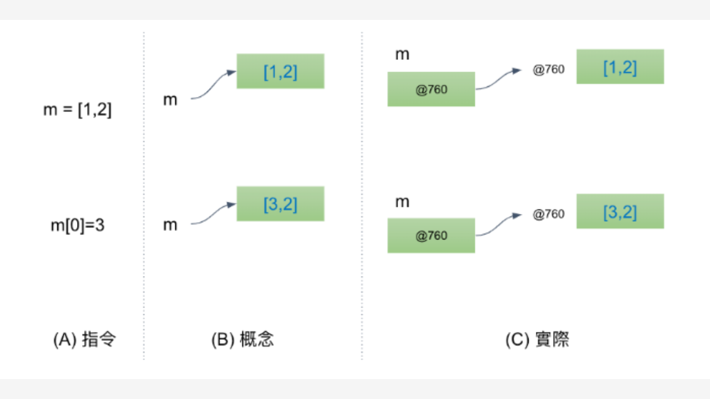

可以看到 `m` 的內容物有改變了，但 `m` 的位置仍然一樣。所謂的可變物件指的是其內容物可改變，如果我們將 m 指定到另一個 list, 當然他的位置也會改變，如下：

```python
m = [1, 2]
id1 = id(m)
m = [3, 4]
id2 = id(m)
```

此時，`id1` 和 `id2` 將會不同。


以下物件都是可變物件:
- list
- dict
- set

### 資料傳遞

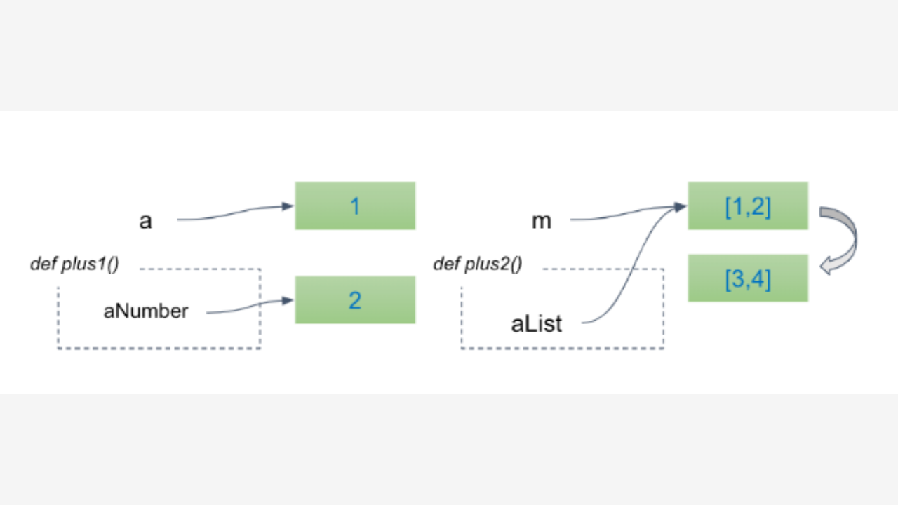

我們回到一開始的例子： 

```python
def plus1(aNumber):
  aNumber += 1

def plus2(aList):
    for i in range(len(aList)):
      aList[i] += 1

a, m = 1, [1,2]
print ('-- Before Calling function --')
print (a, m)

print ('-- After Calling function --')
plus1(a)
plus2(m)
print (a, m)
```

當呼叫到 `plus1` 時，`aNumer` 會被建立，`aNumer` 一開始和 `a` 都是指到 `1` 的位置，但因為要修改 (`aNumber+=1`) 所以給了另一個空間，原來 `a` 的值並不會被變動。所以在返回後，`a` 的值並沒有被變動，還時保持原來的 `1`。

反之，`m` 的內容在呼叫 `plus2()` 之後被變動了。

#### Copy and pass

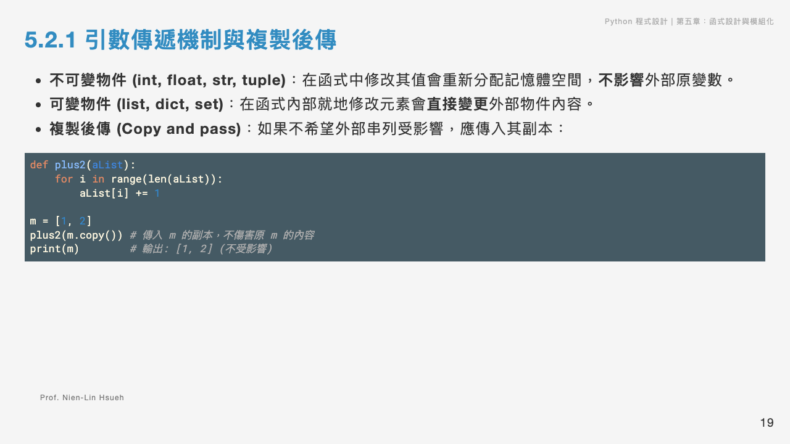

如果要將 list 傳入 函式去執行，但又不想要呼叫端的內容受到影響，這種情形該怎麼辦呢? 這時候我們可以做`複製後傳 (copy and pass)` 的動作，也就是說在呼叫這個函式之前先建立一個副本，傳遞過去的內容是副本，而不是它真正的參考位置。這樣即使對內容做修改，都是副本而已，不是原本的資料。

```python
def plus2(aList):
    for i in range(len(aList)):
      aList[i] += 1

m = [1,2]
plus2(m.copy())
print (m)
```
輸出：
```
[1, 2]
```

### **5.2.1 隨堂測驗 (CCQ 2)**

**問題**

下列程式碼執行後，螢幕上會印出什麼結果？
```python
def modify_values(a, b):
    a = a + 10
    b.append(10)

x = 5
y = [5]
modify_values(x, y)
print(x, y)
```

A) `5 [5]`
B) `15 [5, 10]`
C) `5 [5, 10]`
D) `15 [5]`

<details>
<summary>點擊查看【隨堂測驗】答案與解析</summary>

**正確答案：C) `5 [5, 10]`**

* **解析**：
  * **不可變物件 (Immutable)**：`x = 5` 是整數，傳入函式後，`a = a + 10` 會在函式內部建立一個新的局部變數 `a` 並指向新整數 `15`，這並不會影響外部全域變數 `x` 的值。故 `x` 仍為 `5`。
  * **可變物件 (Mutable)**：`y = [5]` 是列表，傳入函式後，`b.append(10)` 是在原本列表的記憶體位址上直接進行就地修改（in-place modification）。由於 `b` 和 `y` 指向同一個列表，因此外部的 `y` 內容會同步被修改為 `[5, 10]`。

</details>

## Lambda 函式


lambda 函式是一個可以沒有名稱，而且也非常簡短只有一行的函式。目前沒有特別的中文譯名，或許可以稱之為「小函式」。

```python
fname = lambda arguments : expression
```

其中 `fname` 是 lambda 的函式名稱，`arguments` 是參數, `expression` 是程式敘述指令。

```python
def avg(a, b, c):
    return round((a+b+c)/3,2)

print(avg(12, 23, 34)
```

可以簡化為：
```python
avg = lambda a, b, c: round((a+b+c)/3,2)

print(avg(12, 23, 34)
```

下面是一個 `hello` 的例子。
```python
hello = lambda n, msg: print('Hello, {}, {}'.format(n, msg))
hello('Nick', 'Good morning')
```

記得我們之前用 lambda 來指定排序的欄位嗎？ 

```python
grades = [[12,23,43],
          [9,4,10],
          [100,22,1]]

sortedGrade = sorted(grades, key=lambda x: x[-1])
print (sortedGrade)
```

`grades` 內有三筆資料，分別是 `[12,23,43]`,`[9,4,10]`,`[100,22,1]`，如果我們直接呼叫 sorted(grades), 那就會用預設的第一個欄位做排序的基準，也就是比較 12, 9, 和 100。如果我們想要用最後一個欄位來比較，就可以透過 lambda 來做。

`key=lambda x: x[-1]` 表明比較時會抓取最後一個欄位。在排序的過程中，需要兩個數來做比較，例如 `grades[0]` 與 `grades[1]` 做比較，而比較的基準就透過 lambda 來做，`grades[0]` 透過 `key=lambda x: x[-1]` 後會回傳 43, `grades[1]` 會回傳 `10`, `grades[2]` 會回傳 `1`。簡單的說就是透過每一筆的最後一個欄位來排序。


如果我們想依據總分來排序，而每個欄位的的比重是 `0.3`, `0.4`, `0.4`，可以撰寫如下：

```python
r = sorted(grades, key=lambda x: x[0]*0.3+ x[1]*0.4+x[2]*0.4)

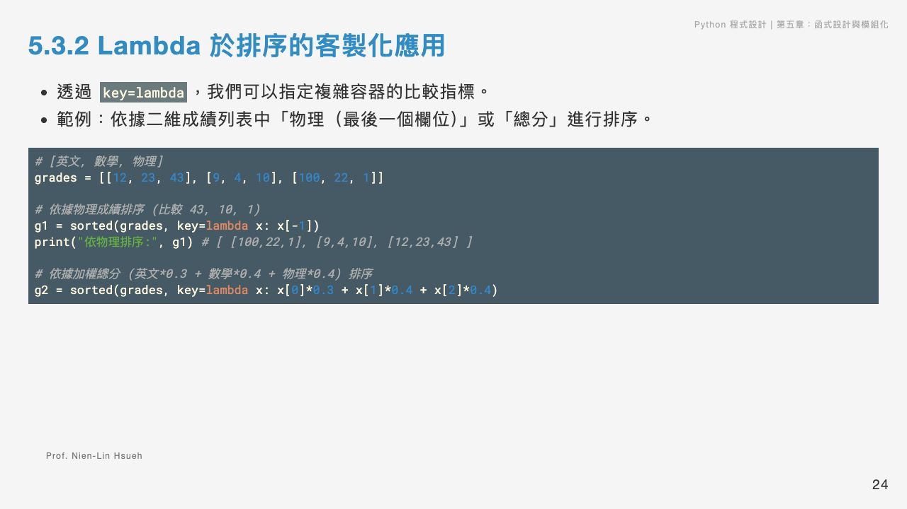
```

### **5.2.2 隨堂測驗 (CCQ 3)**

**問題**

下列程式碼執行後，其輸出結果為何？
```python
nums = [1, 2, 3, 4]
squared_evens = list(map(lambda x: x**2, filter(lambda x: x % 2 == 0, nums)))
print(squared_evens)
```

A) `[1, 4, 9, 16]`
B) `[4, 16]`
C) `[1, 9]`
D) `[2, 4]`

<details>
<summary>點擊查看【隨堂測驗】答案與解析</summary>

**正確答案：B) `[4, 16]`**

* **解析**：
  * `filter(lambda x: x % 2 == 0, nums)` 負責篩選出偶數，此時只會保留 `[2, 4]`。
  * `map(lambda x: x**2, ...)` 會將篩選後的每個元素進行平方運算：`2**2` 變為 `4`，`4**2` 變為 `16`。
  * 最後用 `list()` 將 map 物件轉換回列表，得到 `[4, 16]`。

</details>

## 例外

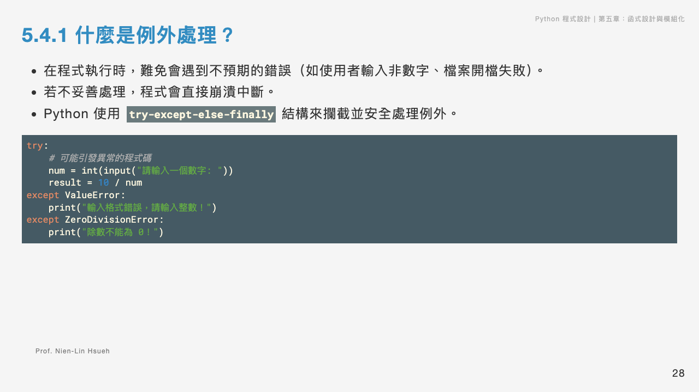


當我們在執行程式時，難免都會遇到一些例外，例如我們希望使用者輸入一個 `number`，但是使用者偏偏輸入一個字母，如果我們沒有特別檢查，就會造成我們在字型型態轉換的時候產生了錯誤。或者我們期望使用者把欲讀取的檔案放在 data 的目錄下，但偏偏使用者放在另一個目錄下，造成在開檔的時候沒辦法順利開檔。對於這些程式邏輯無法避免的例外我們來進行特別的處理，就是所謂的 `例外處理`。

語法是這樣子，前面有一個 `try`，`try` 內的區塊是我們要執行的動作，這個動作無法正常運作的時候就會拋出一個例外，會在 `Except` 這個地方進行例外的處理；如果沒有發生例外的話，就跑到 `else` 子句。`finally` 是指不管你有沒有發生例外，最後都會執行。

```python
try:
   # 可能會發生例外的程式碼
except 例外的型態 as e:
   # 例外處理的程式碼
else:
   # 沒有發生例外的程式碼

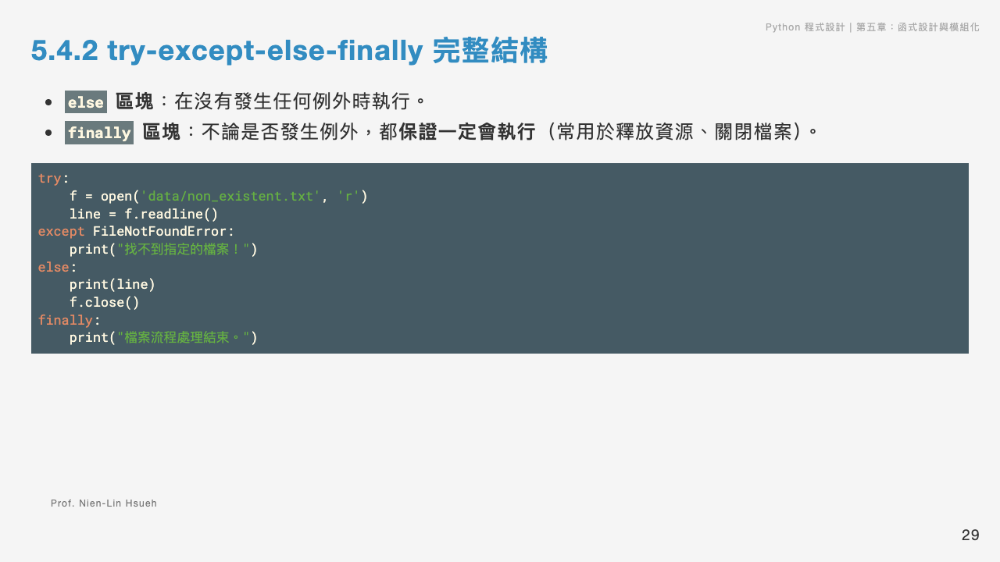
```

其中 `e` 表示例外的該個物件。我們先看看一個沒有處理例外的程式碼：

```python
def getAge(year):
   return 2018-year

year = int(input('Your born year: '))
age = getAge(year)
print('Your age:', age)
```

上面的例子計算年齡的程式，在輸入參數的地方要求輸入出生年，然後呼叫 `getAge()`，最後印出年齡。如果我們在出生年正確輸入一個數字，程式能夠正確的執行，但如果誤以為是姓名而輸入 `nick`，系統會產生一個例外 -- `valueError` -- 因為我們輸入的 `nick` 無法轉成 `int`。程式也因為這個例外而中斷執行了。

```python
while True:
   year = input('Your born year: ')
   if year.isdigit():
      age = getAge(int(year))
      break    
print('Your age:', age)
```

如上，在第二版的程式我們做了一下改良，我們先判斷輸入是不是一個 `0` 以上的數值 (`str.isdigit()` 會檢驗該字串是不是由 `0` 以上的數字所形成的)，如果是數值的話才進行下一步的動作，如果不是的話，則會跑一輪迴圈一直要我們做輸入。

這是在我們知道 `isdigit()` 的情況下的解決，如果我們不知道這個功能，只是預測可能會產出例外，可用 `try` 處理：

```python
while True:
   try:
      year = int(input('Your born year: '))
   except Exception as e:
      print(e, '輸入錯誤，請重新輸入')    
   else:
      age = getAge(year)
      break    
print('Your age:', age)
```

輸出：

```
Your born year: Nick
invalid literal for int() with base 10: 'Nick' 輸入錯誤，請重新輸入
Your born year:
```

第三版我們用 `try exception` 的方式來解決這個問題，它會讓我們的程式變得更簡潔、更通用（因為我們無法預期會發生什麼例外）。

#### raise

我們也可以透過 raise 自己來產出一個例外。我們延伸一下剛剛的範例，如果 `year` 大於 2019 或是小於 1990 都是不被允許的，可視為例外的，我們拋出一個例外。`raise` 的用法如下例：

```python
# v4: Raise exception
def getAge(year):
    if year > 2019 or year < 1900 :
        raise Exception('Impossible year')
    return 2018-year

while True:
   try:
      year = int(input('Your born year: '))
      age = getAge(year)
   except Exception as e:
      print(e)
   else:
      print('Your age:', age)
      break
```

#### 檔案處理的例外

檔案讀不到，不是你程式的錯誤，是執行此程式時環境配置的問題，用例外處理來解決。

```python
import time

# Handling error
try:
    t1 = time.time()
    f = open("salary2.txt", "r")
    line = f.readline()
    print('Reading file')
except FileNotFoundError:
    print ("File not found")
else:
    print (line)
    f.close()
finally:
    t2 = time.time()
    print("Process time: " + str(t2-t1))

print('All done')

```
上述程式碼我們特別安排了一個 finally 來檢驗例外處理後是否會執行 finally 內的程式碼：

```
File not found
Process time: 0.0007429122924804688
All done
```

答案是肯定的，而且最後程式碼有印出 `All done`, 表示程式沒有因為例外而中斷執行。

再看看以下的程式碼，我們將 `except` 後的例外改了一個型態，`ZeroDivisionError`, 因為我們拋出的是一個 `FileNotFound` 的例外，並不是 `ZeroDivisionError`，所以此例外並沒有被處理。即便如此，`finally` 還是會執行，但程式會被中斷而無法印出 `All done`。

```python
# Catch wrong error
try:
    t1 = time.time()
    f = open("salary2.txt", "r")
    line = f.readline()
    print('Reading file')
except ZeroDivisionError:
    print ("File not found")
else:
    print (line)
    f.close()
finally:
    t2 = time.time()
    print("Process time: " + str(t2-t1))

print('All done') # Note: this will not run
```

### **5.3.1 隨堂測驗 (CCQ 4)**

**問題**

下列程式碼執行後，最後在螢幕上會印出什麼結果？
```python
def test_div(a, b):
    try:
        return a / b
    except ZeroDivisionError:
        return "Cannot divide by zero"
    finally:
        return "Always executed"

print(test_div(10, 2))
```

A) `5.0`
B) `Cannot divide by zero`
C) `Always executed`
D) `5.0` 且換行印出 `Always executed`

<details>
<summary>點擊查看【隨堂測驗】答案與解析</summary>

**正確答案：C) `Always executed`**

* **解析**：
  * `finally` 區塊在 Python 的例外處理機制中，**不論 try 與 except 內發生什麼事（即使包含 return 或拋出例外），都一定會被執行**。
  * 如果 `finally` 區塊中包含 `return` 語句，它會直接**覆蓋 (override)** try 區塊或 except 區塊中已準備回傳的 return 值。
  * 因此，當程式在 try 內計算出 `5.0` 並準備 return 時，隨後執行的 `finally` 區塊搶先執行了 `return "Always executed"`，覆蓋了原本的回傳值。

</details>

## 套件

在Python中，要設定一個package，你需要創建一個合適的目錄結構和一些特定的文件。以下是一個基本的步驟：

1. **創建目錄結構**：首先，你需要創建一個包含你的Python程式碼的目錄。假設你想要創建一個名為`my_package`的package，可以這樣創建：

    ```
    my_package/
    ├── __init__.py
    ├── module1.py
    └── module2.py
    ```

    - `__init__.py` 文件是必需的，它可以是空文件，但它表示這個目錄是一個 Python package。
    - `module1.py` 和 `module2.py` 是包含你的Python程式碼的模組文件。

2. **編寫程式碼**：在每個模塊文件中編寫你的 Python 程式碼，這些程式碼將包含在你的 package 中。

3. **使用 package**：一旦你的package被設定好了，你可以通過import語句來使用它。例如：

    ```python
    # 在其他Python文件中
    from my_package import module1
    ```

如果是 from my_package.sub_package import module1 那麼目錄結構是如何?

```
my_package/
├── __init__.py
└── sub_package/
    ├── __init__.py
    ├── module1.py
    └── module2.py
```

如果只要 import module1 內的一個 function `func1()` 呢？

```
 from my_package.module1 import func1
```


## 應用


### 函式應用：河內塔程式設計

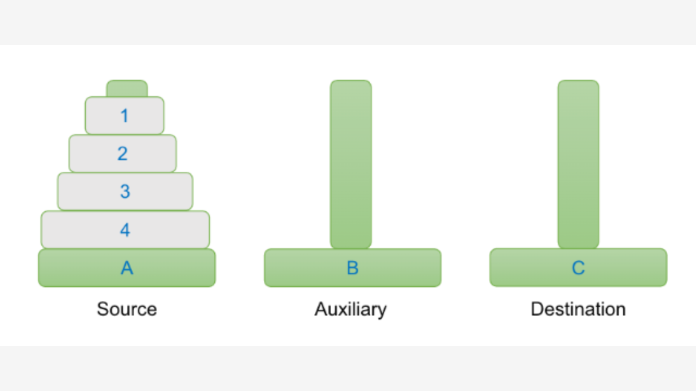

今天要來介紹一個很古老但很有趣的益智遊戲，叫做河內塔，這個遊戲是這麼玩的，我們要把 A 柱上的 3 個方塊，搬移到 C 柱這個地方，但中間有些規則，就是一次只能搬一個，而且搬移的過程中不能大的去壓小的，例如我們一次要把 1、2 搬移到 B，這樣是不行的。又或者是把 1 搬到 B，接著又 2 搬到 B，這時候會造成大的壓小的-- 也是不行。一時間覺得好像不是那麼容易的一個問題，所以我們把這個問題做簡化。


我們先把1搬到B，接著把2搬到C，那這時候 B 的上面會有個 1，再把 1 搬到 C，這樣就解決了我們的問題。因為一次只能搬一個，我們可以忽略環的編號，用 move(X, Y) 表示從 X 柱搬最上面的環到 Y 柱。因此，從Ａ搬兩個到Ｃ的解法如下：

```python
move (A, B); 
move (A, C); 
move (B, C)
```

如果我們用 move(A, C, 2) 來表示從Ａ搬兩個到Ｃ似乎也可以理解，但因為搬超過一個需要有一個輔助柱，所以用 move(A, C, B, 2) 比較合適。如果要搬多個，可以說是 move(source, destination, auxiliary, n) 其中 n 表示要搬移的數量。

```python
move (A, C, B, 3) = 
  move (A, B, C, 2)  # 先搬兩個到輔助柱
  move (A, C, -, 1)  # 搬一個到目標柱
  move (B, C, A, 2)  # 最後把輔助柱上的兩個搬到目標柱
```

其中line2, line4 的動作都搬超過兩個環，所以得再分解：
```python
move (A, C, B, 3) = 
  move (A, B, C, 2)  # 先搬兩個到輔助柱
     move (A, C, -, 1) 
     move (A, B, -, 1)
     move (C, B, -, 1)
  move (A, C, -, 1)  # 搬一個到目標柱
  move (B, C, A, 2)  # 最後把輔助柱上的兩個搬到目標柱
     move (B, A, -, 1) 
     move (B, C, -, 1)
     move (A, C, -, 1)
```

你會發現分解的規則都是類似的。歸納整理後，得到下面的通則：
```python
move (A, C, B, n) = 
  move (A, B, C, n-1)  # 先搬兩個到輔助柱
  move (A, C, -, 1)  # 搬一個到目標柱
  move (B, C, A, n-1)  # 最後把輔助柱上的兩個搬到目標柱
```

也就是是說，每個任務都可以分解為三個步驟：
- 先把 n-1 個搬到輔助柱，
- 把 1 個搬到目的柱，
- 把放在輔助柱的 n-1 個搬到目的柱。

於是我們可以完成以下的程式：

```python
def move(source, dest, aux, n):
    ''' move n blocks from source to destination'''
    if n==1:
        print("{}-> {} move to {}".format(' '*(4-n), source, dest))
    else:
        print("{} {} move top {} to {}".format('S1'*(n), source, n-1, aux))
        move(source, aux, dest, n-1)

        print("S2"*n)
        move(source, dest, "", 1)

        print("{} {} move top {} to {}".format('S3'*(n), aux, n-1, dest))
        move(aux, dest, source, n-1)
n=3
move("A", "C", "B", n)
```

上面的程式碼中我們加上一些訊息方便大家了解其執行的順序。有->的才是真的需要搬動的動作。S1S1S1 From A move top 2 to B 表示是在 n=3 的情況下執行第一步驟的搬動，依此類推。

```
S1S1S1 A move top 2 to B
S1S1 A move top 1 to C
   -> A move to C
S2S2
   -> A move to B
S3S3 C move top 1 to B
   -> C move to B
S2S2S2
   -> A move to C
S3S3S3 B move top 2 to C
S1S1 B move top 1 to A
   -> B move to A
S2S2
   -> B move to C
S3S3 A move top 1 to C
   -> A move to C
```

move() 這個方法不斷的被自己所呼叫使用，這樣的模式我們稱為遞迴（recursive）。
所有的遞回函式都需要有一個中止的條件，以這個例子來講，也就是 n = 1。因為n的值都會遞減到1, 而n==1 的時候不再呼叫 move() 所以最終會停止。

```python
def move(source, dest, aux, n, count):
    if n==1:
        print("{} move to {}".format(source, dest))
        count[0] += 1
    else:
        move(source, aux, dest, n-1, count)
        move(source, dest, "", 1, count)
        move(aux, dest, source, n-1, count)
n=3
count = [0]
move("A", "C", "B", n, count)
print('\n共搬移了 {} 次'.format(count[0]))
```

上面的程式中，我們移除了多餘的提示，僅呈現出移動訊息。多加上一個 count 來記錄搬移的次數。注意因為我們需要累計count 的值，所以使用 list 的 mutable 特性來記錄 -- 如果使用 int 的型態，每次都會產生新值就無法達到效果。

```
A move to C
A move to B
C move to B
A move to C
B move to A
B move to C
A move to C

共搬移了 7 次
```


### 函式應用：井字遊戲設計

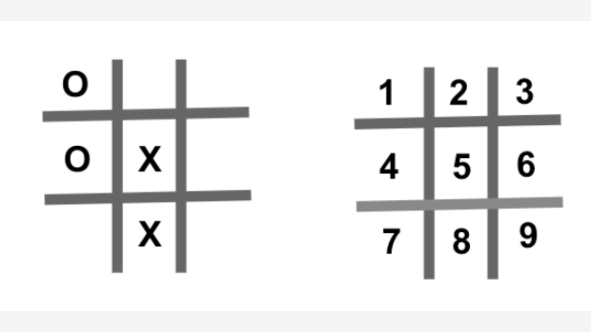

我們來設計一個電腦互玩的井字遊戲（Tic Tac Toe） 的遊戲。這個規則很簡單，有兩位玩家一個是 0，一個是 X，誰能先連接成一條線就能贏得這遊戲，不管這條線是橫的直的還是斜的都可以。要設計這一款遊戲我們有幾點要來做一下思考:
- 第一個就是如何表達井 (棋盤) 的狀態，每一格的狀態是一直在做變更的需要去如何表達一個井的狀態。
- 第二個是我們怎麼去檢查贏的狀態，那贏的基本狀態就是三個橫的是不是都一樣，直的是不是都一樣，斜的 是不是都一樣，必須要有一個邏輯的判斷。
- 第三點是如何隨機下子，假設每一格給它做個編號，左上角這個地方是 1，1 2 3 4 5 6 7 8 9，一開始要從這九個數字裡面挑個數字來下子，下完子以後把下完的位置去除掉，再從剩下的 8 個裡面隨機下子，因此隨機的樣本會一直做變化，該怎麼樣把它運算出來。第四點就是說怎麼樣去交換玩家，一開始可能是玩家一，接著玩家二，又玩家一，如此循環直到遊戲結束為止。
- 最後一個是如何表現思考時間，這個遊戲是讓電腦去做互玩的動作，電腦跑的很快一下子就跑完了，我們希望能夠模擬人類思考的停頓的時間，所以停頓的時間怎樣去做表達。

我們一共宣告了以下的函式：
- `show(board)` 呈現出目前其盤的狀態。
- `move(board, player, loc)` 判斷此移動是否合法，移動後是否造成贏局？如果贏局的話會回傳 `win` 的字串。
- `randomMove(board)` 隨機的找一個還沒有下的位置來放置棋子。

首先我們要讓程式有停頓的效果，我們用 time 這個物件，呼叫這個方法 `sleep} 就可以達到這樣一個效果，一開始的時候我們讓它先停頓 1 秒，然後每個玩家玩完了要換下一個的時候停頓 2 秒，在這個地方就可以表現出來。

我們先來解決第一個問題，怎麼去儲存棋盤的狀態，這個用 list 來儲存是最好不過的，一開始這個棋盤，應該是空的，上面是沒有棋子的，所以我們就宣告一個 list，裡面都放 space 來代表一開始的狀態都是空的，list 這裡面有一個元素，乘與 10 以後，就會代表它有放 10 個元素，那裡面都是 space 的狀態。

```python
import random
import time

NO_FREE_SPACE = -1

def show(board):
    ''' 呈現出目前棋盤的狀態
    '''
    b = board
    print(b[1]+'|'+b[2]+'|'+b[3])
    print('-+-+-')    
    print(b[4]+'|'+b[5]+'|'+b[6])
    print('-+-+-')    
    print(b[7]+'|'+b[8]+'|'+b[9])
```

接下來我們來看第二個問題怎麼去檢查，贏的狀態已經滿足了，因為棋盤都有給它一個 list 的位置，只要去檢查 1 2 3、 4 5 6、7 8 9、1 4 7、2 5 8、3 6 9 是否都一樣，如果是的話，就代表贏的狀態已經滿足了。所以我們宣告一個布林的函式叫做 `win`，比對 win 的條件是否滿足。注意 line15 後面有一個 `\` 表示字串的相連，因為這個判斷句太長了。


```python
def move(bo, player, loc):
    ''' player 在棋盤上移動到 loc。回傳是否 Win
      * 會檢查位置上是否有棋子，若有會拋出例外
      * 會檢查是否贏了，若有，則回傳 Win
    '''
    if loc < 10 and loc > 0:
        if bo[loc] == ' ':
            bo[loc] = player
        else:
            raise Exception("Occupied")
    else:
        raise Exception("Wrong move")
    # check win
    p = player
    win = (p == bo[1] and p == bo[2] and p == bo[3]) or \
          (p == bo[4] and p == bo[5] and p == bo[6]) or \
          (p == bo[7] and p == bo[8] and p == bo[9]) or \
          (p == bo[1] and p == bo[4] and p == bo[7]) or \
          (p == bo[3] and p == bo[6] and p == bo[9]) or \
          (p == bo[1] and p == bo[5] and p == bo[9]) or \
          (p == bo[3] and p == bo[5] and p == bo[7])
    if (win):
        return('Win')
```

接下來看隨機下子問題，當一開始棋盤都是空的時候，從 1 到 9 挑一個數字做下子，可以用 `random.choice` 這個方法，從 list 裡面挑一個值，所以一開始要讓 list 裡面放 1 到 9，假設我們取到了4, 之後就不能再用 4 了。我們可以再建立另外一個 list，裡面的元素就是 1 2 3 5 6 7 8 9，把 4 跳過去，依此類推。

我們宣告了一個叫 `randomMove` 的方法，一開始的時候這個 `list r` 是空的，那我們先跑一個迴圈，如果我這個棋盤裡面是空的話就代表它就還沒有被占領，這時候就把這個位置 `append` 到我的 r 裡面，所以 r 裡面放的都是空的可以下的位置，那如果這個迴圈跑完了以後，這個 r 還是保持空的 list 的話，就代表所有位置都已經被佔領了，到了一個平手的狀態，就 return 一個 `NO_FREE_SPACE`。這個地方是一個常數 -1，因為位置不可能等於 -1，所以我呼叫 `randomMove` 這個方法，只要看到回傳是 -1 的話就知道這個棋盤已經滿了。

```python
def randomMove(bo):
    ''' 回傳一個隨機，有空位的位置
      * 把有空位的位置放到一個 list r
      * 從這個 list 中隨機找一個位置回傳
    '''
    r = []
    for i in range(1, 10):
        if bo[i] == ' ':
            r.append(i)
    if r == []:
        return NO_FREE_SPACE    # full
    return random.choice(r)
```


最後我們來看怎麼做玩家互換的動作，一開始的時候我們讓 `p = p1`，也就是 `p1` 先下子，休息了 1 秒以後，這裡有一個 while 的迴圈永遠等於 true，因為我們要讓玩家1跟玩家2 不斷的互換的動作，平手或是贏了才會跳離這個迴圈。一開始我們就先做 `randomMove` 取得一個位置，把這個位置印出來，如果 loc 等於 `NO_FREE_SPACE` 就代表說已經沒有空的位置，這時候就印出一個平手，然後跳離這一個迴圈，那如果沒有跳離迴圈的話，我們就會讓 p 把它的值移動到 loc 這個位置，同時回傳 `moveResult` ，然後把棋盤做一個刷新再 show 出來，如果 `moveResult` 等於 win 的話就代表剛剛這個移動讓 p 贏得了這場遊戲，這時候印出 p 贏得了這個遊戲，再跳離這個迴圈。那如果說它沒有平手，也沒有贏得這一個遊戲，就代表依然可以繼續玩下去。

如果 `p` 等於 `p1` 的話，就代表剛剛都是 `p1` 在玩，這時候我們就讓 `p` 等於 `p2`，換成 `p2` 來玩，否則就代表剛剛是 `p2` 在玩，這時候就該讓 `p1` 來玩，所以這個迴圈不斷地執行。為了讓它有一個間段的效果，在這個地方 sleep 兩秒。


```python
hint = '0 1 2 3 4 5 6 7 8 9'
print("Location:")
show(hint.split()) # 畫出每個位置的編碼0-9

p1 = 'O'
p2 = 'X'

board = [' '] * 10
p = p1
print("=============")
print("  PLAY GAME  ")
print("=============")
time.sleep(1)
while True:
    loc = randomMove(board)
    print('\n', p, ' move to ', str(loc))

    # loc == -1 means no more free location
    if loc == NO_FREE_SPACE:
        print('平手')
        break
    moveResult = move(board, p, loc)
    show(board)
    if (moveResult == 'Win'):
        print(p, ' Win the game!!')
        break    
    if p == p1:         # switch
        p = p2
    else:
        p = p1
    time.sleep(2)   
```

這個就是整個程式的邏輯，我們剛剛已經完成了井字遊戲的程式設計，大家可以練習看看，不要看著程式碼，自己來重新設計一遍，並且完成以下的延伸練習，第一個把剛剛的程式 改成人機互玩的游戲，大家也可以想想：怎麼讓電腦有智慧，如果電腦先玩的情況下，保持不敗，各位練習看看。


## 套件應用

### import 的用法

三種引用模組套件的方法。

1. 沒有別名，所以需要把 `random` 完整寫出來。
2. 採用 `r`別名, 所以之後都用 `r` 來呼叫 `random` 的函式。
3. 第三種明確的要求只引用 `randint`，所以可以不用前置物件名稱。

[Colab](https://colab.research.google.com/drive/1JsYnezUoGCftmQWddnxrpaaFSoQXKeXH#scrollTo=UnkWBRuW2qqW&line=1&uniqifier=1)

```python
import random                 # method 1
x = random.randint(1, 100)

import random as r            # method 2
y = r.randint(1, 100)

from random import randint    # method 3
z = randint(1, 100)
```

### Youtube 檔案下載

[see Colab](https://colab.research.google.com/drive/1JsYnezUoGCftmQWddnxrpaaFSoQXKeXH#scrollTo=hBVEdHLV2tNP&line=1&uniqifier=1)

這一章節要介紹一個小工具，叫做 pytube，它可以幫助我們自動下載 YouTube 的影片。由於預設並沒有這一個套件，所以我們必須先安裝：

在終端機下執行pip install 來安裝套件：
```python
pip install pytube
```

以下是一個範例：

```python
from pytube import YouTube

yt = YouTube('https://youtu.be/KOdfpbnWLVo')
print('開始下載影片，請稍候！')
yt.streams.first().download()
print('影片下載完成')
```

`pytube.YouTube` 這個物件可以下載影片。透過 `streams.first()` -- 代表說是從前面開始去抓，然後執行這個 download() 開始下載的動作，下載完成的時候它會顯示 影片下載完成。


