# Python 程式設計

## 第五章：函式設計與模組化 (Function & Module)
**Prof. Nien-Lin Hsueh**
Department of Information Engineering
Feng Chia University

---

## 本章學習重點

* **5.1 模組化設計與函式基本定義 (Modular Design)**
  - 函式定義、引數傳遞、回傳值、Keyword 參數、預設值
  - 限制參數傳遞機制 (`/` 與 `*`)、現代型態提示 (Type Hints)
  - 可變動引數個數 (`*args`、`**kwargs`)
* **5.2 進階參數的傳遞 (Parameter Passing)**
  - 不可變物件 vs 可變物件傳遞、複製後傳 (Copy and pass)
* **5.3 Lambda 匿名函式 (Lambda)**
  - Lambda 宣告、客製化排序應用
* **5.4 例外處理 (Exception)**
  - try-except-else-finally 結構、主動 raise 例外
* **5.5 套件與應用 (Packages & Application)**
  - 套件結構與 import，河內塔、井字棋、YouTube 下載範例

---
<!-- _class: lead -->

# **5.1 模組化設計 (Modular Design)**

---
<!-- _class: full-image-slide -->

<div class="centered-image">
  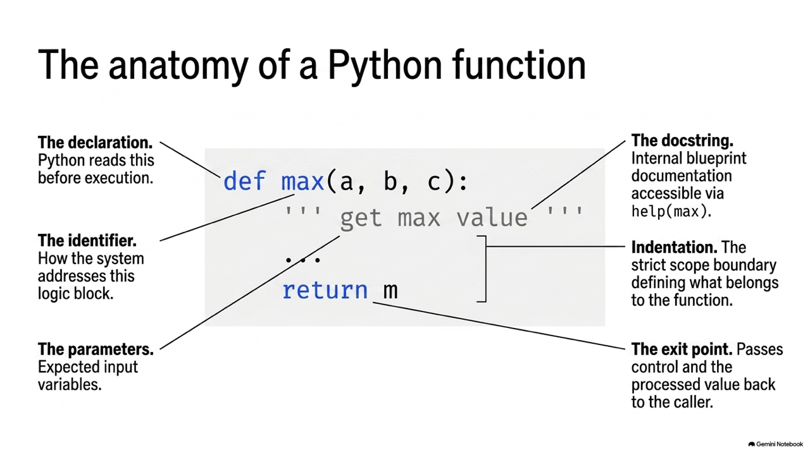
</div>

---

## 5.1.1 什麼是函式？

* 函式是**組織好的、可重複使用的、用來實現單一或相關聯功能的代碼段**。
* 函式能提高應用的模組性，和代碼的重複利用率。
* Python 提供了許多內建函式（如 `print()`、`len()`），但也可以自己建立函式（自訂函式）。

---
<!-- _class: full-image-slide -->

<div class="centered-image">
  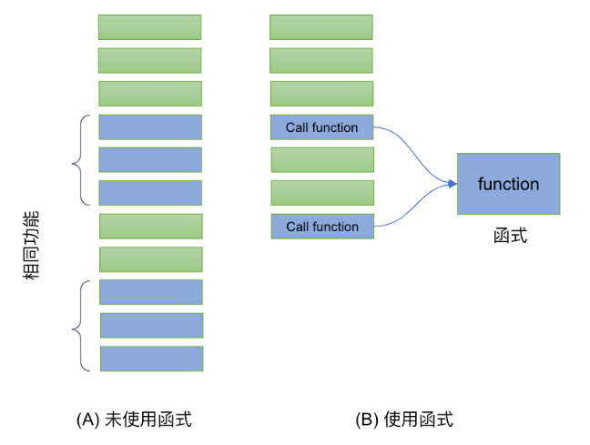
</div>

---

## 5.1.2 函式的定義與呼叫

* 透過 `def` 關鍵字來定義函式，定義後即可重複呼叫，增進程式重用性與可讀性：

```python
# 函式的定義 (包含一個參數 p)
def hello2(p): 
    print('Hello', p)

# 呼叫 (Call) 函式並帶入引數
hello2("Java")    # 輸出: Hello Java
hello2("Python")  # 輸出: Hello Python
```

---
<!-- _class: full-image-slide -->

<div class="centered-image">
  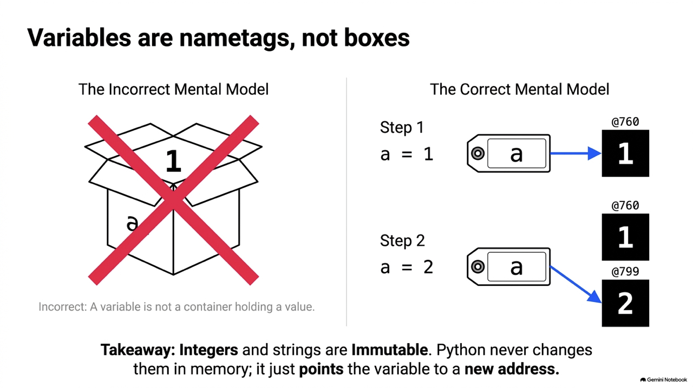
</div>

---

## 5.1.3 帶參數的函式與回傳值

* 使用 `return` 可以將函式的運算結果回傳給呼叫端。可撰寫 `docstring` 提供說明：

```python
def find_max(a, b, c):
    ''' 比較三個數並回傳最大值 '''
    if (a > b):
        if (a > c):
            m = a
        else:
            m = c
    elif (b > c):
        m = b
    else:
        m = c
    return m    # 回傳最大值

print(find_max(1, 2, 3)) # 3
help(find_max)           # 讀取註解 (docstring)
```

---

## 5.1.4 綜合範例：計算 BMI

* 基於定義好的公式 `weight / (tall^2)`，計算後回傳：

```python
def get_bmi(tall, weight):
    """ 
    基於傳入的身高與體重計算人體的 BMI 並回傳。
    身高必須以公尺為單位，體重以公斤為單位。
    """
    bmi_value = weight / (tall * tall)
    return round(bmi_value, 2)

bmi = get_bmi(1.72, 80)
print(bmi) # 27.04
```

---

## 5.1.5 關鍵字引數 (Keyword Arguments)

* 呼叫函式時，預設是依據位置順序傳遞。但也可利用關鍵字指定，不受順序限制：

```python
def hello1(name, msg):
    print("Hi, {}, {}".format(name, msg))

# 1. 依位置傳遞
hello1('Nick', 'Good morning')

# 2. 依關鍵字傳遞 (指名 keyword=value)
hello1(msg='Good morning', name='Nick')

# 3. 順序相反但未指名 (將會印出 Hi, Good morning, Nick - 語意錯誤)
hello1('Good morning', 'Nick')
```

---

## 5.1.6 預設參數 (Default Parameters)

* 定義時可給參數預設值。呼叫時若未傳該參數，則使用預設值。
* **規則**：定義時「必要參數」必須放在「預設參數」之前。

```python
def hello2(name, msg = "Hello"):
    print("Hi, {}, {}".format(name, msg))

hello2('Nick')                 # 使用預設值 -> Hi, Nick, Hello
hello2('Nick', 'Good morning') # 覆蓋預設值 -> Hi, Nick, Good morning

# def hello_err(msg = "Hello", name): # ERROR: 必要參數必須在預設參數前
#     print(name, msg)
```

---

## 5.1.7 位置專用與關鍵字專用參數 (Python 3.8+)

* 透過 `/` 和 `*` 來精準控制引數的傳遞方式：
  - **`/` 之前的參數**：必須為**位置引數** (不能用 name=val 指定)。
  - **`*` 之後的參數**：必須為**關鍵字引數** (不能用位置指定)。

```python
def example(pos_only, /, standard, *, kw_only):
    print(pos_only, standard, kw_only)

example("pos", "standard", kw_only="kw") # 正確

# example(pos_only="pos", standard="std", kw_only="kw") # ERROR: pos_only 不能指名
# example("pos", "standard", "kw")                      # ERROR: kw_only 必須指名
```

---

## 5.1.8 現代型態提示 (Type Hints) (Python 3.10+)

* 使用型態提示增加程式可讀性與靜態檢查支援。
* 現代 Python 3.10+ 使用 `|` 運算子表達聯集型態（Union Type），不再需要額外匯入 Union。

```python
# name 預期為 str，age 預期為 int 或 None，回傳 str
def greet(name: str, age: int | None = None) -> str:
    if age is not None:
        return f"Hello {name}, you are {age} years old."
    return f"Hello {name}."

print(greet("Nick", 20))
```

---

## 5.1.9 可變動的參數個數

* 當傳入的參數數量不確定時：
  - **`*args`** (變動位置參數)：以 **Tuple** 形式收集多個位置引數。
  - **`**kwargs`** (變動關鍵字參數)：以 **Dict** 形式收集多個關鍵字引數。

```python
def avg(name, *grade): # grade 收集為 tuple
    total = sum(grade)
    print(f"Student: {name}, Avg: {total / len(grade) if grade else 0}")

avg("Nick", 90, 80, 100) # grade 為 (90, 80, 100)

def intro(name, **kwargs): # kwargs 收集為 dict
    print(f"Name: {name}, Detail: {kwargs}")

intro("Albert", age=20, city="Taichung") # kwargs 為 {'age': 20, 'city': 'Taichung'}
```

---

## Concept Check Question (CCQ 1)

<div class="ccq-columns">
  <div class="ccq-text">

**給定函式定義 `def func(a, b=5, c=10): print(a, b, c)`。下列哪一個呼叫方式在 Python 中是無效的，會導致語法錯誤？**

* **A.** `func(1)`
* **B.** `func(a=1, c=20)`
* **C.** `func(b=20, 30)`
* **D.** `func(1, c=20, b=30)`

  </div>
  <div class="ccq-logo">
    
  </div>
</div>

---

## CCQ 1 - 答案與解析

<div class="ccq-columns">
  <div class="ccq-text">

### **正確答案：C. `func(b=20, 30)`**

* **解析**：
  * Python 的引數傳遞語法嚴格規定：**位置引數（Positional Arguments）必須排在關鍵字引數（Keyword Arguments）之前**。
  * 在選項 C `func(b=20, 30)` 中，第一個引數 `b=20` 為關鍵字引數，而第二個 `30` 為位置引數，這直接違反了語法規則，會拋出 `SyntaxError: positional argument follows keyword argument`。
  * 其他選項皆為合法呼叫。

  </div>
  <div class="ccq-logo">
    
  </div>
</div>

---
<!-- _class: lead -->

# **5.2 進階參數的傳遞 (Parameter Passing)**

---
<!-- _class: full-image-slide -->

<div class="centered-image">
  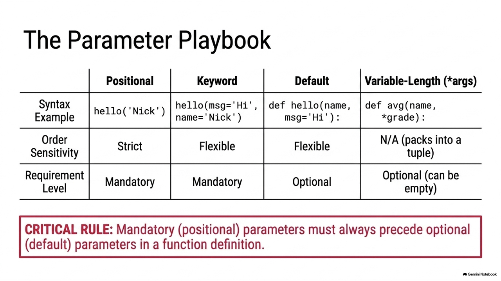
</div>

---

## 5.2.1 不可變物件傳遞 (Immutable Passing)

* 整數、浮點數、字串、元組皆為不可變物件。
* 當不可變物件傳入函式中，在函式內部的修改會重新綁定局部變數的記憶體位址，呼叫端的原變數**不會**受到任何影響。

```python
def plus1(aNumber):
    aNumber += 1

a = 1
plus1(a)
print(a) # 輸出: 1 (未受影響)
```

---
<!-- _class: full-image-slide -->

<div class="centered-image">
  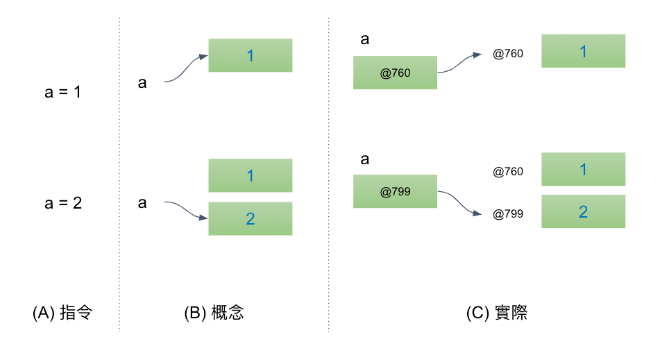
</div>

---

## 5.2.2 可變物件傳遞 (Mutable Passing)

* 列表、字典、集合皆為可變物件。
* 當可變物件傳入函式，並在函式內部就地（in-place）修改內容時，會**直接變更**呼叫端傳入的原物件。

```python
def plus2(aList):
    for i in range(len(aList)):
        aList[i] += 1

m = [1, 2]
plus2(m)
print(m) # 輸出: [2, 3] (原串列被修改)
```

---
<!-- _class: full-image-slide -->

<div class="centered-image">
  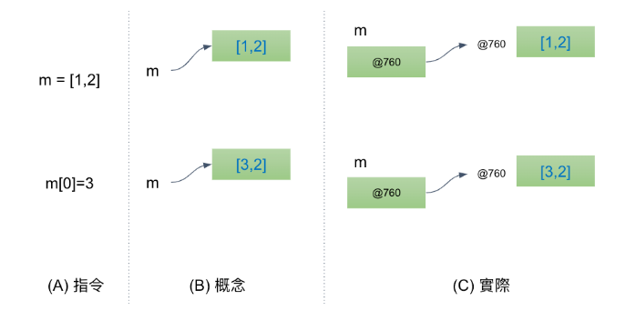
</div>

---
<!-- _class: full-image-slide -->

<div class="centered-image">
  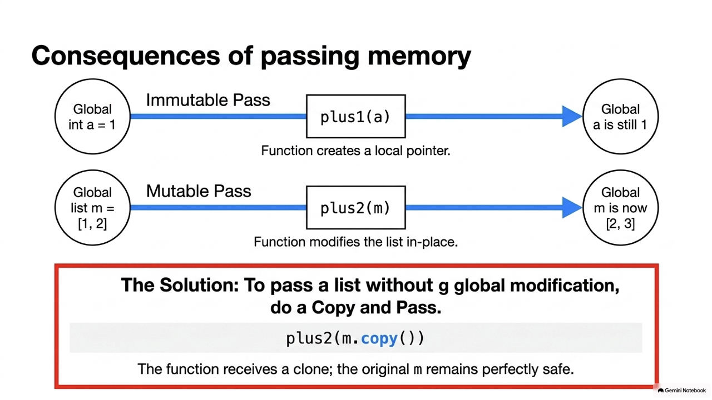
</div>

---
<!-- _class: full-image-slide -->

<div class="centered-image">
  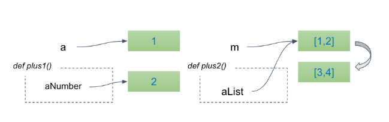
</div>

---

## 5.2.3 複製後傳 (Copy and pass)

* 如果不希望傳入的串列受函式內部修改影響，應傳入其副本：

```python
def plus2(aList):
    for i in range(len(aList)):
        aList[i] += 1

m = [1, 2]
plus2(m.copy()) # 傳入 m 的副本，不傷害原 m 的內容
print(m)        # 輸出: [1, 2] (不受影響)
```

---

## Concept Check Question (CCQ 2)

<div class="ccq-columns">
  <div class="ccq-text">

**下列程式碼執行後，螢幕上會印出什麼結果？**
```python
def modify_values(a, b):
    a = a + 10
    b.append(10)

x = 5
y = [5]
modify_values(x, y)
print(x, y)
```

* **A.** `5 [5]`
* **B.** `15 [5, 10]`
* **C.** `5 [5, 10]`
* **D.** `15 [5]`

  </div>
  <div class="ccq-logo">
    
  </div>
</div>

---

## CCQ 2 - 答案與解析

<div class="ccq-columns">
  <div class="ccq-text">

### **強確答案：C. `5 [5, 10]`**

* **解析**：
  * `x = 5` 為整數（不可變物件），傳入後 `a = a + 10` 在局部作用域建立新物件並重綁局部變數 `a`，**不影響**外部 `x` 的值。故 `x` 依然為 `5`。
  * `y = [5]` 為串列（可變物件），傳入後 `b.append(10)` 是在原本的串列位址上就地進行修改，因此外部的 `y` 內容會被同步更改為 `[5, 10]`。

  </div>
  <div class="ccq-logo">
    
  </div>
</div>

---
<!-- _class: lead -->

# **5.3 Lambda 匿名函式 (Lambda)**

---

## 5.3.1 Lambda 匿名函式基本語法

* `lambda` 常用來建立一次性、簡單的迷你功能。其結構為：`lambda 參數: 運算表達式`。
* 表達式會自動被回傳，不需要（也不能）寫 `return`。

```python
# 宣告一個簡單的加法 lambda
add = lambda x, y: x + y
print(add(5, 3)) # 8

# 與 map, filter 搭配使用
nums = [1, 2, 3, 4]
squared = list(map(lambda x: x**2, nums))
print(squared) # [1, 4, 9, 16]
```

---
<!-- _class: full-image-slide -->

<div class="centered-image">
  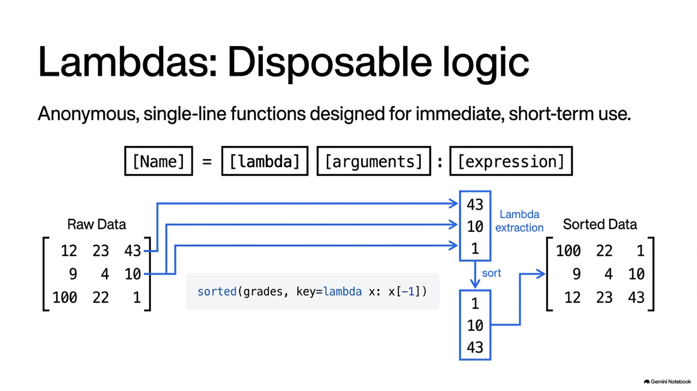
</div>

---

## 5.3.2 Lambda 於排序的客製化應用

* 透過 `key=lambda`，我們可以指定複雜容器的比較指標。
* 範例：依據二維成績列表中「物理（最後一個欄位）」或「加權分數」進行排序。

```python
# [英文, 數學, 物理]
grades = [[12, 23, 43], [9, 4, 10], [100, 22, 1]]

# 依據物理成績排序 (比較 43, 10, 1)
g1 = sorted(grades, key=lambda x: x[-1])
print("依物理排序:", g1) # [ [100,22,1], [9,4,10], [12,23,43] ]

# 依據加權總分 (英文*0.3 + 數學*0.4 + 物理*0.4) 排序
g2 = sorted(grades, key=lambda x: x[0]*0.3 + x[1]*0.4 + x[2]*0.4)
```

---

## Concept Check Question (CCQ 3)

<div class="ccq-columns">
  <div class="ccq-text">

**下列程式碼執行後，其輸出結果為何？**
```python
nums = [1, 2, 3, 4]
squared_evens = list(map(
    lambda x: x**2, 
    filter(lambda x: x % 2 == 0, nums)
))
print(squared_evens)
```

* **A.** `[1, 4, 9, 16]`
* **B.** `[4, 16]`
* **C.** `[1, 9]`
* **D.** `[2, 4]`

  </div>
  <div class="ccq-logo">
    
  </div>
</div>

---

## CCQ 3 - 答案與解析

<div class="ccq-columns">
  <div class="ccq-text">

### **正確答案：B. `[4, 16]`**

* **解析**：
  * 核心部分：`filter(lambda x: x % 2 == 0, nums)` 會先篩選出偶數，篩選後的元素序列為 `[2, 4]`。
  * 外層部分：`map(lambda x: x**2, ...)` 接收此偶數序列並依序進行平方運算：`2^2 = 4`，`4^2 = 16`。
  * 最後透過 `list()` 轉為串列輸出，結果為 `[4, 16]`。

  </div>
  <div class="ccq-logo">
    
  </div>
</div>

---
<!-- _class: lead -->

# **5.4 例外處理 (Exception)**

---

## 5.4.1 什麼是例外處理？

* 在程式執行時，難免會遇到不預期的錯誤（如使用者輸入非數字、檔案開檔失敗）。
* 若不妥善處理，程式會直接崩潰中斷。
* Python 使用 **`try-except-else-finally`** 結構來攔截並安全處理例外。

```python
try:
    # 可能引發異常的程式碼
    num = int(input("請輸入一個數字: "))
    result = 10 / num
except ValueError:
    print("輸入格式錯誤，請輸入整數！")
except ZeroDivisionError:
    print("除數不能為 0！")
```

---

## 5.4.2 try-except-else-finally 完整結構

* **`else` 區塊**：在沒有發生任何例外時執行。
* **`finally` 區塊**：不論是否發生例外，都**保證一定會執行**（常用於釋放資源、關閉檔案）。

```python
try:
    f = open('data/non_existent.txt', 'r')
    line = f.readline()
except FileNotFoundError:
    print("找不到指定的檔案！")
else:
    print(line)
    f.close()
finally:
    print("檔案流程處理結束。")
```

---

## 5.4.3 主動拋出例外 (raise)

* 當程式偵測到不合邏輯的業務狀態（例如年齡小於 0 歲）時，可使用 `raise` 主動引發錯誤，交由上層補獲處理。

```python
def set_age(age):
    if age < 0 or age > 150:
        # 主動拋出值錯誤例外
        raise ValueError("年齡必須介於 0 至 150 之間！")
    print(f"年齡設定成功：{age}")

try:
    set_age(-5)
except ValueError as e:
    print("補獲錯誤:", e) # 輸出: 補獲錯誤: 年齡必須介於 0 至 150 之間！
```

---

## Concept Check Question (CCQ 4)

<div class="ccq-columns">
  <div class="ccq-text">

**下列程式碼執行後，最後在螢幕上會印出什麼結果？**
```python
def test_div(a, b):
    try:
        return a / b
    except ZeroDivisionError:
        return "Cannot divide by zero"
    finally:
        return "Always executed"

print(test_div(10, 2))
```

* **A.** `5.0`
* **B.** `Cannot divide by zero`
* **C.** `Always executed`
* **D.** `5.0` 且換行印出 `Always executed`

  </div>
  <div class="ccq-logo">
    
  </div>
</div>

---

## CCQ 4 - 答案與解析

<div class="ccq-columns">
  <div class="ccq-text">

### **正確答案：C. `Always executed`**

* **解析**：
  * 在 Python 例外處理中，`finally` 區塊必定會執行。
  * **關鍵規則**：如果 `finally` 區塊中包含了 `return` 語句，它會直接**覆蓋 (override)** try 區塊或 except 區塊中已準備返回的任何值。
  * 呼叫 `test_div(10, 2)` 時，try 內計算得 `5.0` 並準備 return，隨後進入 `finally` 執行了 `return "Always executed"`，覆蓋了原本的 `5.0`。

  </div>
  <div class="ccq-logo">
    
  </div>
</div>

---
<!-- _class: lead -->

# **5.5 套件與應用 (Packages & Application)**

---
<!-- _class: full-image-slide -->

<div class="centered-image">
  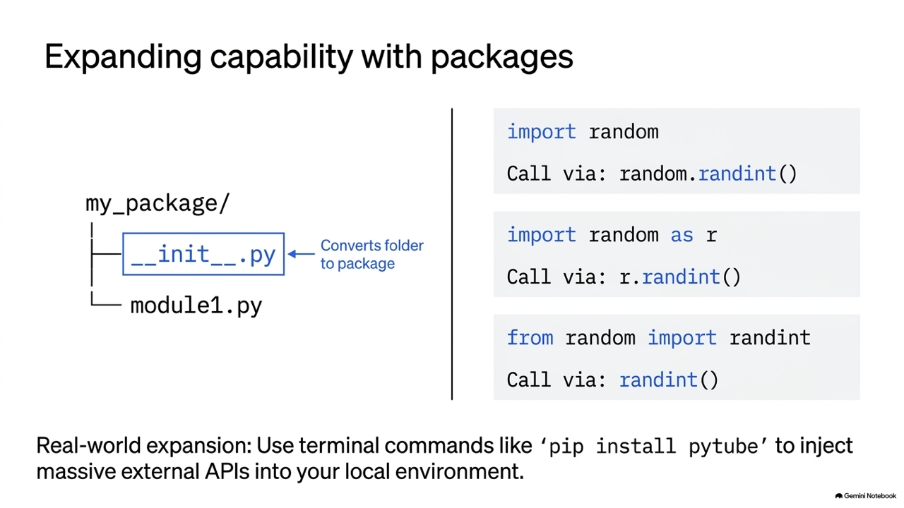
</div>

---

## 5.5.1 Python 套件結構與導入

* **套件 (Package)**：是一個包含一個特殊檔案 `__init__.py` 的資料夾目錄，可以包含多個子模組 (modules)。
* **常用的 import 語法**：

```python
# 1. 匯入整個套件模組
import time
print(time.time())

# 2. 僅匯入模組內特定函數 (呼叫時不用加模組名稱字首)
from math import sqrt
print(sqrt(9)) # 3.0

# 3. 給予別名簡化呼叫
import json as js
data = js.loads('{"value": 100}')
```

---
<!-- _class: full-image-slide -->

<div class="centered-image">
  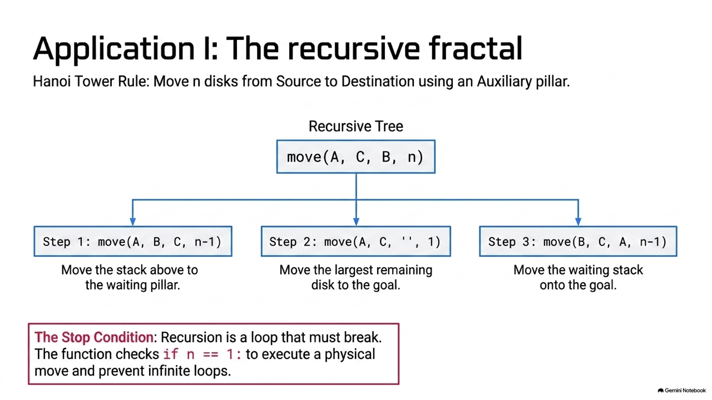
</div>

---
<!-- _class: full-image-slide -->

<div class="centered-image">
  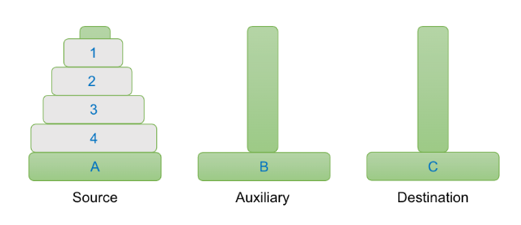
</div>

---

## 5.5.2 遞迴應用：河內塔程式實作

* 以遞迴函式簡潔表達河內塔的搬移步驟：

```python
def hanoi(n, start, temp, end):
    if n == 1:
        print(f"把盤子 1 從 {start} 搬移到 {end}")
    else:
        # 1. 將上面 n-1 個盤子從起始柱搬到輔助柱
        hanoi(n - 1, start, end, temp)
        # 2. 將底層第 n 個盤子從起始柱搬到目標柱
        print(f"把盤子 {n} 從 {start} 搬移到 {end}")
        # 3. 將輔助柱上的 n-1 個盤子搬到目標柱
        hanoi(n - 1, temp, start, end)

hanoi(3, 'A', 'B', 'C') # 搬移 3 個盤子需 7 步
```

---
<!-- _class: full-image-slide -->

<div class="centered-image">
  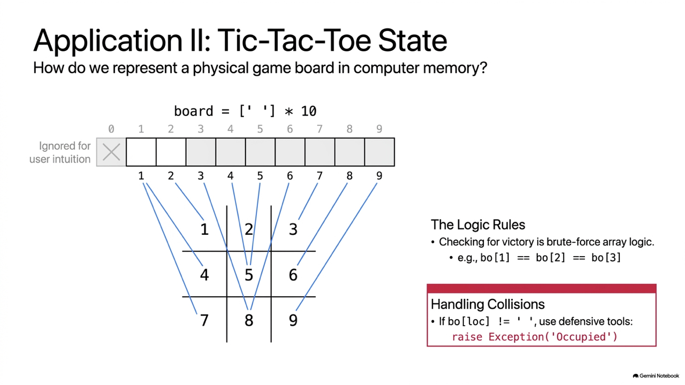
</div>

---
<!-- _class: full-image-slide -->

<div class="centered-image">
  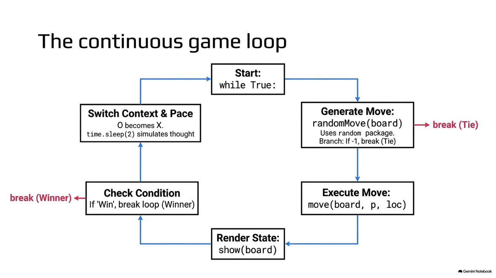
</div>

---
<!-- _class: full-image-slide -->

<div class="centered-image">
  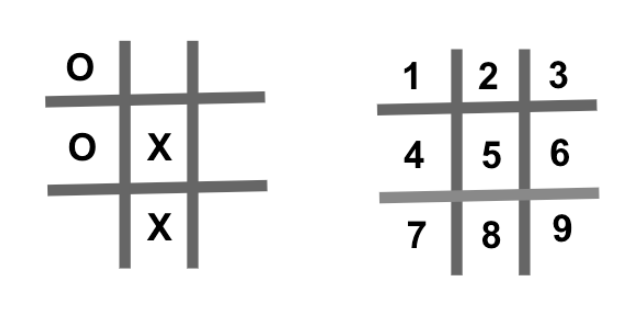
</div>

---

## 5.5.3 應用：井字棋狀態與勝負判定

* 使用 9 元素的一維串列表示井字棋格盤狀態。
* 呼叫函式判定落子位置與連線獲勝：

```python
# 初始化棋盤
board = [str(i) for i in range(1, 10)]

def check_win(player):
    # 八種勝負連線情況
    win_cond = [
        [0,1,2], [3,4,5], [6,7,8], # 橫
        [0,3,6], [1,4,7], [2,5,8], # 直
        [0,4,8], [2,4,6]           # 斜
    ]
    for c in win_cond:
        if board[c[0]] == board[c[1]] == board[c[2]] == player:
            return True
    return False
```

---

## 5.5.4 應用：YouTube 檔案下載 (pytubefix)

* 利用外部套件 `pytubefix` 下載最高畫質 YouTube 影片範例：

```python
# 使用 pip install pytubefix 安裝套件
from pytubefix import YouTube

try:
    url = 'https://youtu.be/KOdfpbnWLVo'
    yt = YouTube(url)
    print("影片標題:", yt.title)
    
    # 取得最高畫質的影片串流並下載
    stream = yt.streams.get_highest_resolution()
    stream.download(output_path='output/')
    print("下載完成！")
except Exception as e:
    print("下載出錯:", e)
```
