Ch06 Pandas data analysis
===


# 資料處理

## 基礎 Pandas 介紹
此章節介紹資料處理，總共分為四個小節：基礎 Pandas、進階 Pandas 的資料處理、圖表繪製以及應用。

Pandas 的結構就是資料會被一筆一筆的儲存下來，這些資料彼此之間都有一些共同的欄位（column），或是說它的 feature， 它的特性。當它被儲存下來以後，我們就可以對它做一些加總、平均、標準差等等計算。這些在 Excel 非常容易就可以計算出來，同樣在 python 要去處理這些問題也相當簡單。那對應哪一個套件？就是 Pandas 這一個套件。我們會跟大家介紹，怎麼樣用 Pandas 快速算出這一些值。

#### row_column
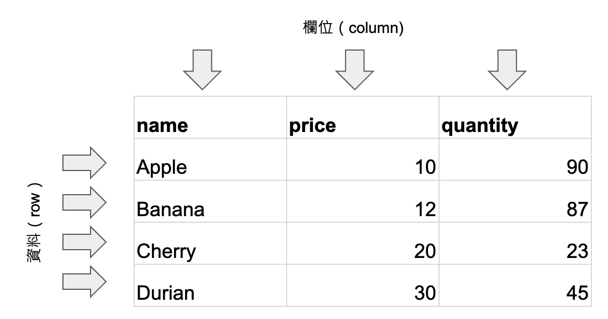


第二個部分是一個進階 Pandas 的資料處理。當資料是跨表格的時候，怎麼樣去做合併；或者是說資料中有一些所謂的 missing data（資料遺漏），我怎麼樣去處理它？這個我們在第二個部分的時候會跟大家做介紹。

第三部分是圖表繪製，相信大家都承認圖表非常的重要，人類是視覺化動物，一張設計好的這個圖表可以解釋非常多的現象。所以在這個章節中，我們會跟大家介紹各式的表格，包含了長條圖或是圓餅圖等等。我們看 Pandas 怎麼樣來繪製這些圖表。

第四部分是應用，這個地方會跟大家介紹三個應用。第一個是新北市的 ubike，我們在前面的章節中已經有用台中市的 ibike 來做一個範例，不過那時候用的例子是用 JSON file，讀進來以後是用 dictionary 的方式處理，現在我們是直接從 csv，它一樣是一種像表格式的資料，我們直接讀進來然後處理，相當的方便，你也會發現 Pandas 更強大的功能。第二個應用是大專院校的分析應用，我們使用各校人數的數據來做一些計算，例如我可以算出男女比例最懸殊的幾所學校是哪一些學校。第三個範例是台北市不動產買賣實價登錄，想買房子的人也非常的注意這一項資料。

我相信透過這三個範例的講解，大家對於 python 或者是 Pandas 對資料處理方面的能力就會有更進一步的理解。這裡會跟大家介紹一個open data 的這個網站，事實上這三筆資料也都是從 open date 裡面取得的。各位可以找有興趣的資料，實際把這些資料讀進來然後做一些運算，做一些圖形的呈現，相信你在資料處理方面就能跨出了一大步了。

### Pandas 簡介

此處介紹 Pandas 的資料分析，
而如圖 [apple_example](#apple_example) 的 2D 資料表是經常被應用的一種資料處理的方式

#### apple_example
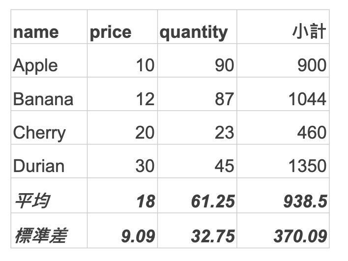

比方說有一個表用來記錄水果的價格跟數量，蘋果的價格是十塊錢，數量是九十箱;香蕉的價格是 12，數量是 87 等等。這樣的一個資料表儲存起來以後可以做很多的應用。比方可以查詢蘋果目前的價格是多少錢，也可以去做一些彙總資料的計算，例如平均的價格是多少，標準差是多少，總產量是多少，最高的產量是多少。也可以對某一筆資料去做運算，如蘋果的總價格是多少。所以我們就可以在這個表上面，去做一些延伸的計算。

#### price_quantity
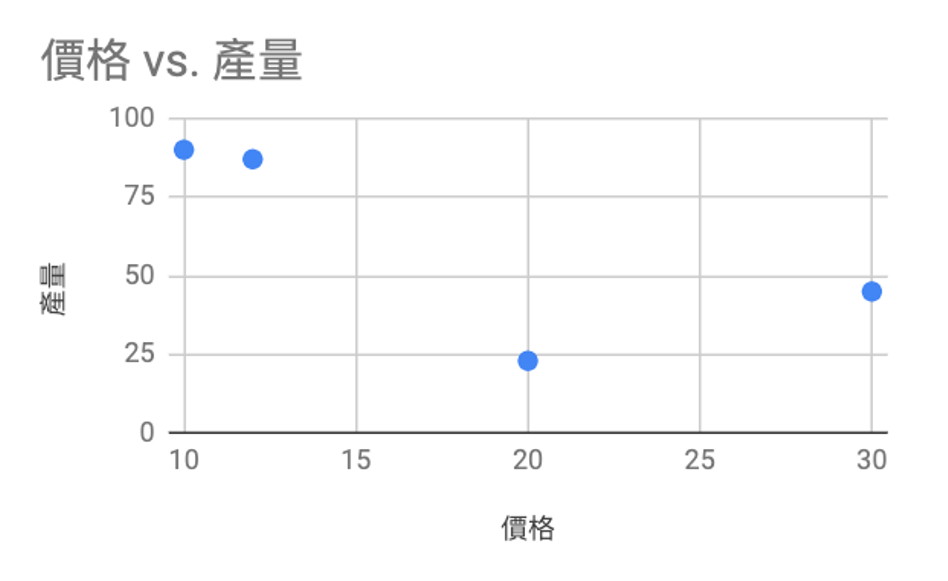

我們也會想要用一些圖表的方式來呈現這一筆資料，比方說用圓餅圖來呈現每一個水果產量的比例，圖 [price_quantity](#price_quantity) 是用長條圖來比較每一種水果價格跟數量的差異。關於 Pandas 更多的功能，相關的一些 API 應用會在這個網頁 [pandas.pydata.org](https://pandas.pydata.org) 都有相關的資料可以查看。


### Build a dataframe from a dict

我們就來先介紹怎麼產生一個這樣的資料表。產生 Pandas 資料有很多種方式，第一個比較簡單的是透過一個 dict 來建立這個資料表。

```python
import pandas as pd

f = {"name": ['Apple', 'Banana', 'Cherry', 'Durian'],
      "price": [10, 12, 20, 30],
      "quantity": [90, 87, 23, 45]
      }

df = pd.DataFrame(f)
print (df)
```
See [Code](https://colab.research.google.com/drive/1sL4w_DWy6jOMQUDn6uTU9X2-4HFCYxHd#scrollTo=Lz2MRjkKXq7H&line=5&uniqifier=1)

我們建立了一個 dict，此處的 name 就是 column 或是稱為 features，所以我有這個 apple bananacherry 跟這個榴槤，那價格就蘋果是十塊錢，banana 的價格是 12 等等。那 quantity 是數量，這樣子就建好了一個 dictionary，接下來就能透過 pd，這個 pd 是 Pandas 的一個物件，而 .DataFrame(f) 就是依據 f 的內容來產生一個 Pandas 的資料。把它印出來看就可以看到這樣子的一個資料表：

```
     name  price  quantity
0   Apple     10        90
1  Banana     12        87
2  Cherry     20        23
3  Durian     30        45  
```

前面這裡 Pandas 會自動的加上一個 0, 1, 2, 3，這個就代表它的 index（索引值），就像是這筆資料的住址一樣，我們可以透過這個索引值來去抓取一筆資料。

#### 建立索引

```python
df = pd.DataFrame(f, index=f['name'])
print (df)
print ('---')
print (df.loc['Apple'])
```

```
          name  price  quantity
Apple    Apple     10        90
Banana  Banana     12        87
Cherry  Cherry     20        23
Durian  Durian     30        45
---
name        Apple
price          10
quantity       90
Name: Apple, dtype: object
```

剛剛是透過系統自動設定 index ，我們也可以自己去指定它的 index。比方說在這個例子裏面，我們在產生 df 這個物件的時候，我帶了一個參數叫index，這個 index 是一個 list ，其內容是 f['name']。也就是說我是要用 name 的這一個欄位來當成我的索引值。這樣子印出來了以後大家就可以看到，索引這個地方已經不是數字的0, 1, 2, 3，而是 apple, banana 等。

我們可以透過 df.loc[index] 來取得某一筆索引為 index 的資料。因為蘋果這一筆資料的 index 是 'apple'，所以 df.loc['apple']就可以取出蘋果的資料。另外，我們如果想要去印出某一個欄位的資料的時候，我們就直接透過 df.price 可以把它印出來。

#### 由位置取得資料


#### iloc
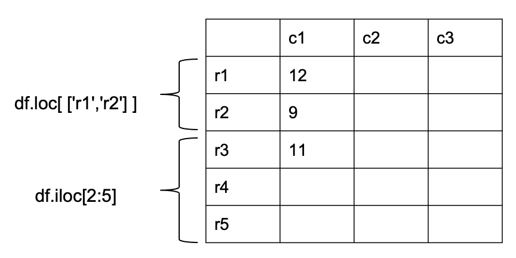


如果今天要取的資料是兩筆以上的話那也沒有問題，我們剛看到這個 loc 後面是接一個 index 的值，那如果說是兩個以上的話就用一個 list 包起來，如 ['r1','r2'] 這樣子抓出來的資料就會是這兩個欄位的資料。

另外一個方式是依照它的順序位置 (position)，第一筆資料是 0, 接下來是 1, 2, 等。在 Python 中是用 iloc 來存取這個資料。注意索引和順序位置是不同的 -- 雖然我們沒有指定特別索引時，其值和 position 是一樣的。

```python
df = pd.DataFrame(f, index=f['name'])
print(df.loc[ ['Apple', 'Banana'] ])
print(df.iloc[ [0,1] ])
```
### **6.1.1 隨堂測驗 (CCQ 1)**

**問題**

在 Pandas 中，若我們建立了 Series `s = pd.Series([10, 20, 30], index=['a', 'b', 'c'])`，下列哪一種存取方式會回傳 `20`？

A) 只有 `s['b']` 與 `s.loc['b']`
B) 只有 `s[1]` 與 `s.iloc[1]`
C) 只有 `s['b']`、`s.loc['b']` 與 `s.iloc[1]`
D) 四種方式 `s['b']`、`s[1]`、`s.loc['b']`、`s.iloc[1]` 皆會回傳 `20`。

<details>
<summary>點擊查看【隨堂測驗】答案與解析</summary>

**正確答案：D) 四種方式 `s['b']`、`s[1]`、`s.loc['b']`、`s.iloc[1]` 皆會回傳 `20`。**

* **解析**：
  * **標籤索引 (Label-based)**：`s['b']` 和 `s.loc['b']` 會依據我們自訂的標籤索引 `'b'` 來取得對應元素值 `20`。
  * **位置索引 (Position-based)**：即使指定了自訂字串索引，Pandas 仍會保留預設的 0 開始整數位置索引。因此，第 2 個元素（索引位置 1）可透過 `s[1]` 或 `s.iloc[1]` 來存取，同樣會回傳 `20`。
  * 故四者皆為有效存取方式。

</details>

### **6.1.2 隨堂測驗 (CCQ 2)**

**問題**

已知有一個 DataFrame `df` 內容如下：
|    |  A  |  B  |
|:---|:----|:----|
|  x |  1  |  2  |
|  y |  3  |  4  |

請問執行 `df.loc['x', 'B']` 與 `df.iloc[0, 1]` 回傳的值分別為何？

A) 兩者皆回傳 `1`。
B) `df.loc` 回傳 `2`，`df.iloc` 回傳 `3`。
C) 兩者皆回傳 `2`。
D) `df.loc` 回傳 `1`，`df.iloc` 回傳 `4`。

<details>
<summary>點擊查看【隨堂測驗】答案與解析</summary>

**正確答案：C) 兩者皆回傳 `2`。**

* **解析**：
  * `df.loc['x', 'B']` 是**標籤型存取**（列標籤為 `'x'`，欄標籤為 `'B'`），對應到的值為 `2`。
  * `df.iloc[0, 1]` 是**位置型存取**（列位置為 0 即第一列 `'x'`，欄位置為 1 即第二欄 `'B'`），對應到的值同樣為 `2`。
  * 因此，兩個表達式都指向同一個儲存格，回傳的值都是 `2`。

</details>

[Code](https://colab.research.google.com/drive/1sL4w_DWy6jOMQUDn6uTU9X2-4HFCYxHd#scrollTo=LcKVoIeNFvum&line=1&uniqifier=1)

### 資料的頭尾與隨機

- df.head(n): 前面 n 筆資料。
- df.tail(n): 後面 n 筆資料。
- df.sample(n): 隨機 n 筆資料。

當我們在做的資料處理的時候，有時候要先把這個資料 show 出來看一下內容是什麼。如果資料非常的多，若一下子跑個一萬筆出來，看了都會眼花撩亂。所以我們常常會先透過 df.head(n) 看幾筆資料，這個 n 就代表幾筆。那透過 tail(n) 是去找它最後 n 筆的資料，如果想看新增的資料是否正確，tail() 就很合適。若透過 sample(n) 則是隨機找 n 筆出來。

### 資料的切片

#### slice

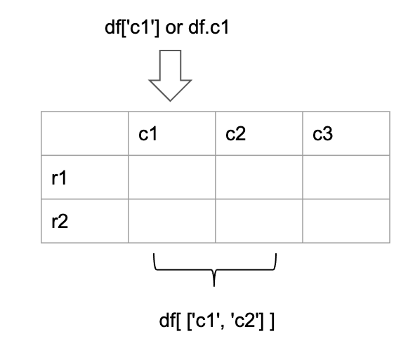


如果要取得部分欄位的資料，就可以使用 data slicing 的技巧。例如某筆資料有 c1, c2, c3 三個欄位，可是我現在只要找 c1 跟 c2 這個欄位的時候，我們可以採用 df[['c1', 'c2']] 來取得。注意不可以寫 df['c1','c2'] 因為 [] 內必須是一個欄位或是一個欄位集的資料型態。如果我們只要取得 c1 的資料可以用 df['c1']或是 df.c1 即可。

### 資料過濾

接下來介紹資料過濾，我們經常會對資料的欄位做一些篩選。例如 c1 欄位代表價格，如果要找價格大於十塊錢，用 [code_filter](#code_filter) 的方式就能把欄位 c1 大於十的找出來。

#### code_filter
```python
g = df.c1>10
df[g] # df[過濾條件]

df[df.c1>10]
```

因為條件是對於一個欄位資料的布林判斷，所以得出來的結果一樣會是一個 table，那這個table裡面存放了就是 true false true 這樣的一個表。產生這個表了以後，接下來就可以透過 df.loc 的方式找出某一些資料。

### **6.1.3 隨堂測驗 (CCQ 3)**

**問題**

若要從 DataFrame `df` 中過濾出欄位 `"Age"` 大於 `30` 的所有資料列（Rows），下列哪一個指令是正確的？

A) `df[df["Age"] > 30]`
B) `df.filter("Age > 30")`
C) `df.where("Age" > 30)`
D) `df[Age > 30]`

<details>
<summary>點擊查看【隨堂測驗】答案與解析</summary>

**正確答案：A) `df[df["Age"] > 30]`**

* **解析**：
  * 在 Pandas 中，過濾資料最標準的方式是使用**布林索引 (Boolean Indexing)**。
  * `df["Age"] > 30` 會先針對每一列進行條件判斷，產生一個由 `True` 和 `False` 組成的 Series。
  * 將此布林 Series 作為索引傳入 `df[...]` 中，DataFrame 就會篩選出所有對應值為 `True` 的 Rows。

</details>

[code](https://colab.research.google.com/drive/1sL4w_DWy6jOMQUDn6uTU9X2-4HFCYxHd#scrollTo=nwDBntLdT6oN) 提供更多範例供參考。

### 資料排序

資料排序也是經常使用的處理方法，我們可以使用 `df.sort_values(by=c1)` 的方式，也就是依據 c1 欄位排序。

假設我們有一筆資料如下：

```python
df = pd.DataFrame({
    'c1': ['A', 'A', 'B', 'Z', 'D', 'C'],
    'c2': [2, 1, 9, 8, 7, 4],
    'c3': [0, 1, 9, 4, 2, 3],
    'c4': ['a', 'B', 'c', 'D', 'e', 'F']})
print (df.sort_valaues(by='c1'))
print ('---')
df2 = df.sort_values(by=['c1','c2'])
print(df2)
```

```
  c1  c2  c3 c4
0  A   2   0  a
1  A   1   1  B
2  B   9   9  c
3  Z   8   4  D
4  D   7   2  e
5  C   4   3  F
---
  c1  c2  c3 c4
1  A   1   1  B
0  A   2   0  a
5  C   4   3  F
4  D   7   2  e
3  Z   8   4  D
2  B   9   9  c
```

更多的參數：
```python
df.sort_values(by='c1',             # 排序依據
               ascending=False)     # 遞減排序
               na_position='first') # 把NaN 的資料排在前面

```


#### 統計分析

另外一個非常好用的方法就是統計性的一些計算，比方說透過 df.means 就可以把所有的欄位平均。或者是對 c1 這個欄位求出它的平均數、中位數、加總、累加、標準差等等。

範例如下：

```python
df.mean()           # 所有的欄位都做平均
df['c1'].mean()     # 平均
df['c1'].median()   # 中位數
df['c1'].sum()      # 合計
df['c1'].cumsum()   # 累計
df['c1'].std()      # 標準差
```

還有一個非常方便的一個 function 叫做 describe()。df.describe() 會把資料表內可以統計的資料一次算好，包含 count 數量、mean 平均、std 標準差、min 最小值、25%、50%（也就是中位數）、75%、最大值都呈現出來。不過須注意該方法只能針對數值型的資料，如果資料欄位的內容是字串就不會呈現出來。如下面這個例子。

```python
analysis = df.describe()
print (analysis)
```

```
           price   quantity
count   4.000000   4.000000
mean   18.000000  61.250000
std     9.092121  32.745229
min    10.000000  23.000000
25%    11.500000  39.500000
50%    16.000000  66.000000
75%    22.500000  87.750000
max    30.000000  90.000000
```

#### 分群計量

我們可以透過 group by 來幫我們做資料的一些彙整。如圖 [group_by](#group_by) 左邊的資料表，台中的西屯區房價每一坪可能是二十萬，台南的新營區是十萬等等。對這個資料表 group by city 後，就變成如右的資料表，右邊資料表的台中就是原本資料表 city 屬於台中的平均，台中因為有兩筆，西屯 20 與北屯 15，那台中的兩個區域平均就是17.5。
台南是 10、台北是 45 等等。

#### group_by
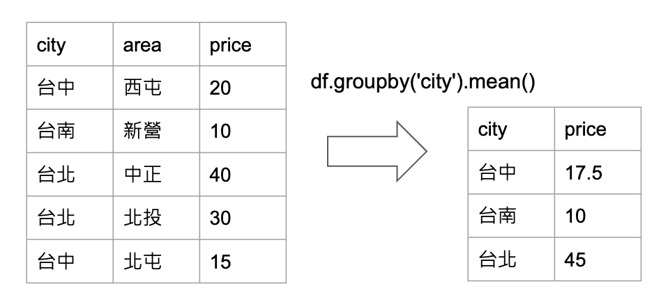

### Pandas 實作

首先一樣是 import pandas，然後宣告一個 dictionary，再來透過 .dataframe 來產生資料表，然後把這個資料印出來。那我們要取欄位資料的時候就可以透過 df[欄位的名稱]，把這一個欄位的所有資料秀出來。
那我們可以看到前面的 0 1 2 3，這個就是系統預設的索引值，從 0 開始遞增。

```python
import pandas as pd

f = {"name": ['Apple', 'Banana', 'Cherry', 'Durian'],
      "price": [10, 12, 20, 30],
      "quantity": [90, 87, 23, 45]
      }

df = pd.DataFrame(f)
print(df)
```
```
     name  price  quantity
0   Apple     10        90
1  Banana     12        87
2  Cherry     20        23
3  Durian     30        45
```

如果使用 loc 就是代表是要用資料的索引值取出某一筆資料，若索引值是 0 的時候這一筆資料剛好是 apple，然後就把 10 90 這筆資料取出來。

```python
df = pd.DataFrame(f, index=f['name'])
print(df)
print ('---')
print(df.loc['Apple'])
```
```
          name  price  quantity
Apple    Apple     10        90
Banana  Banana     12        87
Cherry  Cherry     20        23
Durian  Durian     30        45
---
name        Apple
price          10
quantity       90
Name: Apple, dtype: object
```

先前有提過資料是可以取某個欄位裡面的第幾筆資料，所以水果這個欄位的第 0 筆資料的結果就是 apple。當然也可以取第 0 筆資料裡面的某一個欄位，跑出來的結果事實上一樣也是 apple。
```python
df.loc[0]['name']
```
```
'Apple'
```


那真實應用的時候，其實比較少透過 dict 來新增資料，大多是從資料庫或是某一個檔案讀取資料。所以我們這個地方介紹 `read_csv`，就是從 csv 檔讀取資料。如果資料量太大，我們只是想要看看資料的長相，那我們就可以用 sample 或是 head，這樣它就會秀十筆出來。

```python
house = pd.read_csv('house.csv')
house.head(10)
```
```
	longitude	latitude	housing_median_age	ocean_proximity
0	  -122.23	   37.88	              41.0         NEAR BAY
1	  -122.22	   37.86	              21.0         NEAR BAY
2	  -122.24	   37.85	              52.0         NEAR BAY
```

前面提到 index 系統預定給的話是用 0 1 2 3 來做，可是這些 0 1 2 3 有時候對我們來講沒有什麼意義，所以我們想要用另外一個 list 來做為我們的 index，那我們就用水果這個欄位的 list 當成是我們的索引值。結果就不再是 0 1 2 3，而是 apple banana 等等。這樣子在抓資料的時候就可以比較容易理解要抓哪筆資料。例如抓 apple 的那筆資料。

```python
f = {"水果": ['Apple', 'Banana', 'Cherry', 'Durian'],
    "價格": [10, 12, 20, 30],
    "數量": [90, 87, 23, 45]
    }
# 指定 index 為水果，系統就不會用 0, 1, 2, .. 為索引
df = pd.DataFrame(f, index=f['水果'])
print(df)

print ('== 透過 apple 當索引來找資料 ==')
df.loc['Apple']
```
```
          水果  價格  數量
Apple    Apple    10    90
Banana  Banana    12    87
Cherry  Cherry    20    23
Durian  Durian    30    45
== 透過 apple 當索引來找資料 ==
水果    Apple
價格       10
數量       90
Name: Apple, dtype: object
```

另外一種方式則是一開始就直接從所有的欄位裡面去挑選一個欄位作為 index。就是透過 `df.set_index('欄位名稱')` 挑選一個欄位作為 index。

如下例子，各位可以發現一樣是三個欄位，但水果這個欄位直接拿來當成索引值。原來的方法是額外再做一個欄位當成索引值，只是它的內容剛好跟水果這個地方的內容是一樣。那透過 set index 就可以少掉一個欄位。

```python
# 和上面有一點不一樣，這一次用 set_index() 來設定索引值
# 你會發現有不同，這一次沒有水果欄位了，因為直接變成索引

df = pd.DataFrame(f)
df = df.set_index('水果')
df
```
```
  水果    價格	數量
Apple	    10	  90
Banana 	    12	  87
Cherry	    20	  23
Durian	    30	  45
```

那我們也可以做一個客製化的 index，就是宣告一個 list，然後用這個 list 當成 index。就可以變成比較簡潔的 a b c d。事實上 a 就代表 apple，b 的話就代表 banana。

```python
# 你也可以使用 客製化的索引值

fn = ['a', 'b', 'c', 'd']
df = pd.DataFrame(f, index = fn)
df
```
```
          水果	  價格	數量
   a	 Apple	    10	  90
   b	Banana	    12	  87
   c	Cherry	    20	  23
   d	Durian	    30	  45
```


由於有一些動作可能會對這個資料表造成一些修改，。所以這個地方寫了一個 function 叫做`reset_data`，就是資料修改了以後再執行這一個 function，它會 return(df) 的這一筆資料去做一個 reset。此處程式碼可到 [Colab](https://colab.research.google.com/drive/1sL4w_DWy6jOMQUDn6uTU9X2-4HFCYxHd#scrollTo=Rk9QPg4-LFyf&line=9&uniqifier=1) 進行執行。


```python
# 定義 reset_data() 這個函式只是方便等一下 demo 時資料比較乾淨。
# 請按左方的 執行鍵（或 control + Enter）。

def reset_data():
  f = {"水果": ['Apple', 'Banana', 'Cherry', 'Durian'],
      "價格": [10, 12, 20, 30],
      "數量": [90, 87, 23, 45]
      }

  df = pd.DataFrame(f)
  return (df)

def reset_data2():
  f = {"水果": ['Apple', 'Banana', 'Cherry', 'Durian'],
      "價格": [10, 12, 20, 30],
      "數量": [90, 87, 23, 45]
      }

  df = pd.DataFrame(f, index=['a', 'b', 'c', 'd'])
  return (df)
```

一樣先執行一下讓這個系統認得這一個 function。接下來我們來看一下怎麼去改變它的值，一樣用 `df['欄位名稱']` 看是要改變哪一個欄位，然後用一個 list 去做設定，這樣子就可以看到價格的欄位做了改變，變成是 10 12 20 30。一樣我們也可以用 `df.欄位名稱`，這個是一樣的。

那如果要把所有的欄位清成是一樣的值的話，可以直接點後面一個數字，而不是一個 list。那我們看一下執行完了以後，所有的價格都會變成是 10。

```python
df.價格 = 10 # 全部都是 10
df
```
```
              水果	  價格	  數量
    0	    Apple	    10	    90
    1	    Banana	    10	    87
    2	    Cherry	    10	    23
    3	    Durian	    10	    45
```

若要多增一個欄位叫做 sum，這個欄位是把數量的值做加總，我們就執行一下 `df['數量'].sum()`，這時候跑出來結果是 245，事實上就是數量這個欄位的總和。那我們也可以去做在數量這個欄位上累加，執行 `df.數量.cumsum()` 完了以後，各位就可以看到 90，這個就是 apple 的數量，然後再加上 banana 就是 177，然後再加上櫻桃就是 200，以此類推。所以要去做累加的話很簡單，就是直接呼叫這個 cumsum 這一個 function 就可以了。

如果要算平均也很簡單，價格的平均(`df['價格'].mean()`)就是 18 塊，數量(`df['數量'].mean()`) 就是61.25，當然也可以去算標準差等等。用 describe 的話就會把這兩個數值相關的值，如數量、平均數等等全部都秀出來。

```python
df.describe()
```
```
        價格	    數量
count	 4.0	 4.000000
mean	10.0	61.250000
std	 0.0	32.745229
min	10.0	23.000000
25%	10.0	39.500000
50%	10.0	66.000000
75%	10.0	87.750000
max	10.0	90.000000
```

接下來如果在抓取資料的時候，我只想要抓取部分的欄位，那我可以在 DataFrame 加上一個 columns 是我要抓取的欄位。例如我只要抓價格跟數量這個兩個欄位，執行一下就會發現沒有水果名稱的欄位，抓出來就只有這兩個欄位而已。

```python
df2 = pd.DataFrame(f, columns=['價格', '數量'])
df2
```
```
        價格	  數量
0	 10	   90
1	 12	   87
2	 20	   23
3	 30	   45
```

另外一種方式就是說假設 dataframe 的物件已經產生的話，就透過篩選的方式，只要這兩個屬性這也是可以的。這樣跑出來效果是一樣的。

```python
df3 = df[['價格', '數量']]
df3
```
```
        價格	  數量
0	 10	   90
1	 12	   87
2	 20	   23
3	 30	   45
```

接下來就是要添加一個新欄位，第一個就是透過 Pandas 裡面有另外一個物件 series，series 是一維的，它等於是一個 column 一樣。各位記得原本的 dataframe 是二維的，而 series 就是一維的。

原來的資料只有價格數量跟水果名稱，所以在這個地方，多加了一個品質這樣的一個欄位。新增的 Apple 品質是 -1，也就是說這一批的品質不太好，那 banana 品質還不錯是 2 等等。

```python
q = [-1, 2, 0, -2]
df['品質'] = q # 把品質一欄添加到資料表中
df
```
```
    水果	    價格	數量	品質
0	Apple	    10	    90	    -1
1	Banana	    12	    87	     2
2	Cherry	    20	    23	     0
3	Durian	    30	    45	    -2
```

當然也可以多加一個欄位，而這個欄位是從其他的欄位所計算出來的。比方說有一個叫累計的欄位，各位看到這個累計是 90 就等於 Apple 的數量，下一筆則是 Apple 的數量再加 Banana 的數量，等於 177 200 以此類推。

```python
df['累計'] = df['數量'].cumsum()
df
```
```
    水果	    價格	數量	品質    累計
0	Apple	    10	    90	    -1       90
1	Banana	    12	    87	     2      177
2	Cherry	    20	    23	     0      200
3	Durian	    30	    45	    -2      245
```

那一樣可以多加一個產地。

```python
loc = ['tw', 'usa', 'jpn', 'eu']
df['產地'] = pd.Series(loc)
df
```
```
    水果	    價格	數量	品質    累計    產地
0	Apple	    10	    90	    -1       90     tw
1	Banana	    12	    87	     2      177     usa
2	Cherry	    20	    23	     0      200     jpn
3	Durian	    30	    45	    -2      245     eu
```


當然也可以去增加資料的內容，例如這裡多加一個 dictionary，那它一樣是水果，這個水果有兩個，一個是李子跟桃子，然後價格分別是 10 跟 12 等等。那我們就可以透過 `df.append`，append 是再多加上一個 dataframe的資料。後面這個 dataframe 是透過 f2 這一個的 dictionary 所產生的。我們給它的 index 一個是 l 一個是 k，增加完了以後，就可以看到我們本來只有 4 筆資料，現在又多增加這兩筆資料了。

```python
df = reset_data()

f2 = {"水果": ['李子', '桃子'],
      "價格": [10, 12],
      "數量": [90, 87]
      }

df.append(pd.DataFrame(f2, index=['k','l']))
```
```
     水果        價格    數量
0    Apple       10	 90
1    Banana      12     87
2    Cherry      20	 23
3    Durian      30	 45
k    李子         10     90
l    桃子         12     87
```

接下來這個地方其實都已經有提過了，就是只想要選擇部分的資料的話，就是通過 loc。如果說資料本身的索引很多，可以用一個 list 來做表示。也可以先選擇欄位，這些欄位可以是多欄位的，然後再選擇哪一筆資料。這些資料一樣是多資料的，所以一樣用 loc，再用一個 list 來做包裝。

```python
df = reset_data2()
df
```
```
    水果	價格	數量
a	Apple	10	90
b	Banana	12	87
c	Cherry	20	23
d	Durian	30	45
```

```python
print (df.loc['a'])
print ("---")
print (df.loc[['a', 'b']])
print ("---")
print (df[['水果','價格']].loc[['a', 'b']])
print ("---")
# iloc is index based
# iloc[col, row]
print (df.iloc[0:2])
print (df.iloc[0:2, 1:3])
```
```
水果    Apple
價格       10
數量       90
Name: a, dtype: object
---
   水果  價格  數量
a   Apple  10  90
b  Banana  12  87
---
   水果  價格
a   Apple  10
b  Banana  12
---
水果  價格  數量
a   Apple  10  90
b  Banana  12  87
   價格  數量
a  10  90
b  12  87
```

我們用 condition 來做資料的篩選，首先價格大於 20 這個條件它會回傳一個資料表，裡面都是一些布林值，這樣的一個布林值並不是真正我要的這個資料，所以必須要再把這個 condition 放到資料表裡面，這樣子印出來的結果才會是符合這一個條件的資料表。

```python
# select by condition
print (df.價格 > 20)
print("---")
print (df[df.價格 > 20])
```
```
a    False
b    False
c    False
d     True
Name: 價格, dtype: bool
---
   水果  價格  數量
d  Durian  30  45
```

接下來是對資料去做排序，用的 function 就是 `sort_values`。ascending=False 表示不要遞增。

```python
print (df.sort_values(by='價格', ascending=False))
```
```
    水果  價格  數量
d  Durian  30  45
c  Cherry  20  23
b  Banana  12  87
a   Apple  10  90
```
跑出來的結果是依照價格遞減，所以是 30 20 12 10。

## 進階 Pandas 資料處理

### 遺失資料之處理

這一小節介紹一些比較偏向資料前置處理的方法。我們的資料常常並不會一開始就太整齊，中間可能會穿插著一些 missing data，就是資料是有殘缺的。例如說像這一個水果的這個例子，我有 A B C D E 總共 5 個水果，但是 E 的這個水果它的價格目前是不明的，然後 D 它的數量也是不明的。所以這個資料集並不是一個完整的資料。那怎麼辦？我們有幾種處理的方式，第一個就是因為這一筆資料不完整就把它刪除，那當然也可以就把這筆資料用另外的資料來頂替。這個地方大家看到的是 None，這個是 python 用來代表一個空值的一個符號。

```python
import pandas as pd
import numpy as np

def reset_data():
    f = {"name": ['A', 'B', 'C', 'D', 'E'],
         "price": [10, 12, 20, 30, None],
         "quantity": [90, 87, None, 45, 20],
      }
    df = pd.DataFrame(f, index = f['name'])
    return (df)

df = reset_data()
```
```
    name	price	quantity
A	    A	10.0	90.0
B	    B	12.0	87.0
C	    C	20.0	NaN
D	    D	30.0	45.0
E	    E	NaN	    20.0
```


### NaN and None

#### NaN_None
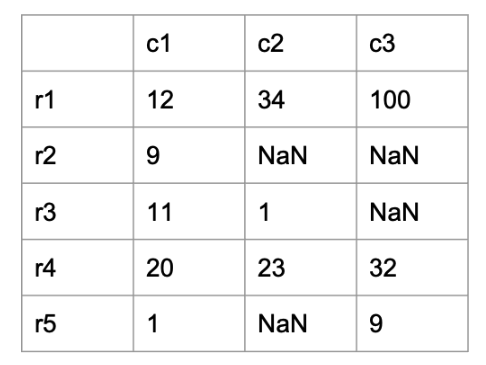

可是在 Pandas 它代表的空值是 NaN，所以這個大家要記一下。那我們來看第一個策略，就是把只要是含有 NaN 的資料刪除，這個就叫做 dropna，這個 na 代表就是空值的意思。那我們看一下，C 跟 E 的這一筆資料現在都被刪除了。

```python
# 把有空值的資料刪除
df2 = df.dropna(axis=0)
df2
```
```
    name	price	quantity
A	    A	10.0	90.0
B	    B	12.0	87.0
D	    D	30.0	45.0
```

其實這個地方還有另外一種策略，是把具備空值的這一筆資料的column刪除。剛剛是把一筆資料刪除，那如果要是刪除欄位，這樣子的話我們就必須要去指定軸是1，軸是1的話就代表column 的資料。那我們再把這個 df 印出來看一下，會發現雖然剛剛這個地方的 output 已經是刪除了兩個欄位，可是接著再把 df 印出來的時候還是一樣是完整無缺的，也就是說這一個 function 本身並不會傷害 df 這一個資料，它就會回傳另外一個 dataframe。那我們預設值都是用 0，如果不寫的話也是沒關係的。如果是 default 的 dropna ，那它會把兩筆資料刪除，第二種情況就是說我為這一個 NaN 填上一個特定的值。

- Dropna
- fill in

那我們這裡宣告了一個 dict，price 是 10、quantily 是 40，這個意思就是如果在價格上面有 NaN 的話就用 10 來頂替，數量就用四十來做頂替。
執行一下你會發現，這時候這一筆 E 的資料，它已經用 10 來頂替了，而 C 這筆資料它用 40 來頂替。

```python
# fill in specified values
d = {'price': 10, 'quantity': 40}
print (df.fillna(d))
```
```
  name  price  quantity
A    A   10.0      90.0
B    B   12.0      87.0
C    C   20.0      40.0
D    D   30.0      45.0
E    E   10.0      20.0
```

下面是我從 10 到 20 之間，或者是說從 20 到 90 之去取一個隨機的值來去做一個填值，所以你可能兩次執行跑出來的結果其實是不太一樣的。

```python
# fill in an specified random value
r1 = np.random.randint(10, 30, 1)[0]
r2 = np.random.randint(20, 90, 1)[0]
d = {'price': r1, 'quantity': r2}
df4 = df.fillna(d)
df4
```
```
	name	price	quantity
A	    A	10.0	90.0
B	    B	12.0	87.0
C	    C	20.0	68.0
D	    D	30.0	45.0
E	    E	22.0	20.0
```

接下來最後一種方法是可以往前參考或者是往後參考，這個通常是用在資料有一個連續性，舉個例子來講，這個欄位代表是一個時間，
那雖然這個時間這一筆資料它是 missing data，但是跟前一筆資料其實是差不了多少，可能差個 5 秒還是幾秒。所以我等於你的秒數，其實對整個資料的運算不會有很大的影響。所以可以讓後面的值就等於前面的值，執行一下後這一筆資料它就會 follow 前面的這筆，所以就變成是 30。這一筆資料的話，它就 follow 前面一筆，就變成是 87。你如果把它改成是往後參考的話，這時候，這一筆就變成是後面的這個 45。這一筆因為後面已經沒資料，所以它還是保持原來的這個 NaN。

```python
# 把有空值的資料刪除
print (df)
print (df.dropna(axis=0))
print (df)

print (df.fillna(0)) 
print (df)

# fill in specified values
d = {'price': 10, 'quantity': 40}
print (df.fillna(d))

# fill in an specified random value
r1 = np.random.randint(10, 30, 1)[0]
r2 = np.random.randint(20, 90, 1)[0]
d = {'price': r1, 'quantity': r2}
print (df.fillna(d))

# ffill: forward propagate
# bfill: backward propagate
print (df.fillna(method = 'bfill'))
```


### **6.2.1 隨堂測驗 (CCQ 4)**

**問題**

給定一個 DataFrame `df`，包含 `"Department"`（部門）與 `"Salary"`（薪水）兩個欄位。若要計算每個部門的平均薪水，下列哪一個指令是正確的？

A) `df.groupby("Department")["Salary"].mean()`
B) `df.groupby("Department").mean("Salary")`
C) `df.groupby("Department").average("Salary")`
D) `df["Department"].groupby("Salary").mean()`

<details>
<summary>點擊查看【隨堂測驗】答案與解析</summary>

**正確答案：A) `df.groupby("Department")["Salary"].mean()`**

* **解析**：
  * `df.groupby("Department")`：先以 `"Department"` 欄位作為分組基準。
  * `["Salary"]`：接著從分組後的資料中選取 `"Salary"` 欄位。
  * `.mean()`：最後呼叫 `mean()` 函式計算每一組的平均值。
  * 這是 Pandas 中進行分組聚合（Aggregation）的最標準寫法。其他選項如 `average()` 並非 Pandas 的內建聚合函式。

</details>

### 現代 Pandas 重要觀念（Pandas 2.0+ 新特性）

隨著 Pandas 2.0 及其後續版本的釋出，資料庫底層與運作機制有了重要的優化，以下介紹兩個現代開發必知的觀念：

#### 1. 寫入時複製 (Copy-on-Write, CoW)
在舊版 Pandas 中，當我們對 DataFrame 進行切片或篩選時，回傳的到底是原資料的**視圖 (View)** 還是**副本 (Copy)** 並不明確。若在切片上直接進行修改，常會引發著名的 `SettingWithCopyWarning` 警告，且容易無意中改動到原始資料。

從 Pandas 2.0 開始引入、並在後續版本預設啟用的 **Copy-on-Write (CoW)** 機制，規定：
* 所有的切片和篩選操作都**保證不改變原始 DataFrame**。
* 只有當我們**真正嘗試寫入/修改**切片後的資料時，Pandas 才會在幕後複製一份實體資料出來供修改。
* 這完全避免了 `SettingWithCopyWarning`，讓資料操作變得極為安全與直覺。

#### 2. 支援缺失值的原生型態 (Nullable Data Types)
傳統的 Pandas 在處理包含空值 (`NaN`/`None`) 的整數 (int) 或布林 (bool) 欄位時，會自動將整個欄位強制轉型為**浮點數 (float64)**，這在商務與科學運算中十分不便。

現代 Pandas 支援了新型態：
- 使用 **`Int64`** (大寫 I) 替代 `int64`：允許包含整數與空值而不失真。
- 使用 **`boolean`** 替代 `bool`：允許包含 `True`、`False` 與空值。
- 使用 **`string`** 替代 `object`：專門存放文字字串，存取與正則匹配效能更佳。

我們可以直接呼叫 `convert_dtypes()` 讓 Pandas 自動幫我們將資料表升級為這些現代且安全的資料型態：
```python
# 自動將 Object 轉為 String，含空值的 float 轉為 Int64 等
df_modern = df.convert_dtypes() 
print(df_modern.dtypes)
```

### 資料表合併

#### append_merge


這個章節介紹資料的整併，在資料處理的過程中，它們來源可能是有很多不同的表格，那因為要整體性的去做分析，所以需要先把資料做整併。整併基礎上大概有兩種方式：一種是橫向一種是縱向。舉例子來說，現在有一個資料是 104 年度每一個人的收入狀況，還有另外一筆是 105 年度的收入狀況。
這兩個資料的結構基本上一樣，就是它可能有這個人的名字、身分證字號、還有他每個月的薪水等等，所以它的欄位是一樣的。這時候就可以做一個縱向的整併，整併以後，它的欄位還是一樣的，只是說資料的量是變多的。

#### 橫向整併

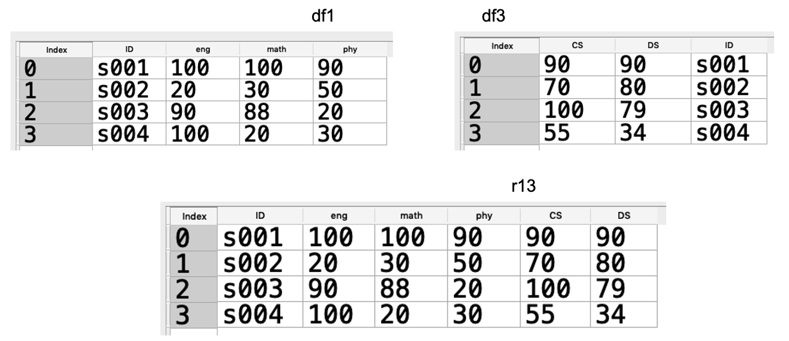

那另外一種方式是做一個橫向的整併，資料的欄位會變多。例如有份資料是 104 年度每一個人的收入跟他購買咖啡的數量和金額，這時候它的欄位名稱就會不一樣。那整併以後它欄位的數量就會變多，但是資料的本體，基本上是不會變多的。這時候我們用的方式就是 merge，所以有 append 跟 merge 這兩種模式。


#### 成績的 Merge
```python
import pandas as pd

f1 = {'ID': ['s001','s002','s003','s004'],
      'eng': [100, 20, 90, 100],
      'math': [100, 30, 88, 20],
      'phy': [90, 50, 20, 30]}

f2 = {'ID': ['s005','s006','s007'],
      'eng': [100, 20, 90],
      'math': [100, 30, 88],
      'phy': [90, 50, 20]}

f3 = {'ID': ['s001','s002','s003','s004'],
      'CS': [90, 70, 100, 55],
      'DS': [90, 80, 79, 34]}

f4 = {'ID': ['s001','s008','s009'],
      'eng': [100, 20, 90],
      'math': [100, 30, 88],
      'CS': [90, 50, 20]}

df1 = pd.DataFrame(f1)
df2 = pd.DataFrame(f2)
df3 = pd.DataFrame(f3)
df4 = pd.DataFrame(f4)
```

我們明確的來看一個例子，我們還是用成績的例子來做解說。這裡有一個 df1 的表格，那它包含學號、英文、數學還有物理的成績。第一張表是有學號 001 一直到 004，第二張表的話是 005 到 007，那它資料的結構都是一樣的。所以我們這時候是想要做一個縱向的整併把資料拉長，所以這個整併以後，就會變成是 001 到 007。可以看到前面的四筆都是來自於 df1，後面三筆是來自於 df2。

```python
# 兩筆資料結構都一樣，預整併資料列表
r12 = df1.append(df2)
r12
```
```
    ID	    eng	    math	phy
0	s001	100	    100	    90
1	s002	20	    30	    50
2	s003	90	    88	    20
3	s004	100	    20	    30
0	s005	100	    100	    90
1	s006	20	    30	    50
2	s007	90	    88	    20
```

接下來是 merge，一樣是 df1，跟上面的那張表是一樣的，那 df3 的話有一點不一樣，它這個地方有學號，但另外加了兩個科目，一個是 cs 電腦的課，另外這個是資料結構的課，所以它多了兩個不同的欄位。這時候我們要把它整併起來產生一個新的表，這個新的表總共就會有這個 6 個欄位，包含了學號等等。所以各位可以看到它一樣是學號 001 到 004，但欄位變多了。這個就叫做inner 的 merge，事實上就是一種交集的觀念。

```python
# merge
r13 = df1.merge(df3)
r13
```
```
    ID	    eng	    math	phy	CS	DS
0	s001	100	    100	    90	90	90
1	s002	20	    30	    50	70	80
2	s003	90	    88	    20	100	79
3	s004	100	    20	    30	55	34
```


#### Outer merge

df1 還是保持剛剛的那一張表格，就是一個學號和三個欄位。那 df4 它是有一個學號，然後它有一個 cs、英文跟數學成績欄位，那英文跟數學還有學號是在 df1 共同有的欄位，但是 cs 它是多出來的這個欄位，而且資料的這個內容也有一些重疊、新增，像有一個 001、然後又有一個 008 跟 009。008 跟 009 是 df1 沒有的學生資料，001 是共同有的資料，這時候我們把這筆資料做 merge 會產生什麼結果？這時候它預設會去做一個交集，因為這兩筆資料共同有的都是 001 這個學生，那 001 的英文、數學然後物理還有 cs 的成績全部都會呈現在這個地方。因為我們在做 merge 的時候它會去看欄位，欄位名稱一樣都是 id，然後 df1 的 eng 會跟 df4 的 eng 做比較，然後 df1 的 math 會跟 df4 的 math 去做比較，這三筆資料都一樣它就會放進來，然後把 phy 跟 cs 這兩個是個別在 table 裡面有的再去把它去做一個整併。所以出來的這個表格，就會變成是這個樣子。那有交集就有所謂的聯集，聯集就是叫做 outer 的 merge 或者是 outer 的 join。
```python
# 採用 inner, 做交集
r14 = df1.merge(df4) # default is inner
r14_inner = df1.merge(df4, how='inner')
r14_inner
```
```
    ID      eng    math    phy    CS
0   s001    100    100    90.0    90.0
```

那我們再來看一下這兩個表，但是如果說我們採取的是一種 outer 的 merge 的話，會把所有的資料全部呈現出來，也就是 001 到 004 以及 008 跟 009，這 5 個資料全部都呈現出來。但是這一些資料裡面有一些欄位就會沒有值。例如說 002 的這筆資料，它並沒有 cs 的成績，所以它整併起來以後這個地方就不曉得要填什麼，我們就會填上一個 nan，就是空值的意思。那同理 003 跟 004 也都是填上 nan。那對 008 的這一筆資料來講它是有 cs 資料的，它沒有的是 phy，所以這個地方它就填這樣的一個值。所以我們採取 outer merge 的，記得資料全部它都會呈現。

```python
# 採用 outer, 做聯集
r14_outer = df1.merge(df4, how='outer')
r14_outer
```
```
        ID	eng	math    phy    CS
0	s001	100	100    90.0    90.0
1	s002	20	30     50.0    NaN
2	s003	90	88     20.0    NaN
3	s004	100	20     30.0    NaN
4	s008	20	30     NaN     50.0
5	s009	90	88     NaN     20.0
```

#### Outer left merge

我們再來看另外一種叫做 left outer merge，它的合併方式是，我左邊的資料都一定要保有，所以左邊 df1 有 1 到 4 ，所以 1 到 4 全部都有。那右邊的這個 8 跟 9 我就不呈現出來。所以這個跟聯集跟交集是不一樣的，左邊的就是我主體的資料，我要它都呈現出來，即便有一些資料是有空值的。有 left outer merge，就會有 right outer merge。同理就是，我要把右邊的資料全部都呈現出來，所以這個地方有 1 8 9，一樣 phy 這個地方，它就會填上空值。

```python
r14_right = df1.merge(df4, how='right')
r14_right
```
```
	ID	    eng	math	phy	    CS
0	s001	100	100	    90.0	90
1	s008	20	30	    NaN	    50
2	s009	90	88	    NaN	    20
```


## 圖表繪製

資料視覺在資料分析中也非常的重要，一個好的圖表可以幫我們非常容易的了解資料的含意。在 python 中比較常用 Matplotlib 裡面的 pyplot 這個套件來幫助我們畫圖。它的功能十分強大，但是 Matplotlib 也比較瑣碎一點。那既然我們現在已經學會了 dataframe，我們就直接用 dataframe 來畫圖。dataframe 在畫圖的過程中其實也是會呼叫 Matplotlib 來幫助我們畫圖。那我們就來看一下有哪一些常用的圖表。

#### 折線圖 Plot

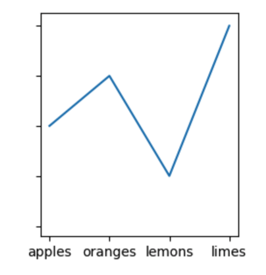

第一個是 plot 折線圖，就像上圖大家所看到的，x 軸是代表某一筆資料，y 軸則是代表這筆資料的數據。那折線圖可以幫助我們。比較資料的大小，如果它的 x 軸代表著時間的話，它還可以用來呈現這個趨勢。

#### 條狀圖 Bar chart

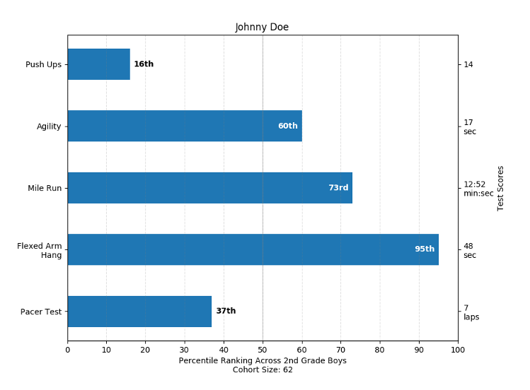

Bar chart 條狀圖，它可以用來比較資料的大小，我們可以用橫向的方式來呈現這個資料，
也可以用縱向的方式來做資料的呈現。

#### 圓餅圖 Pie chart

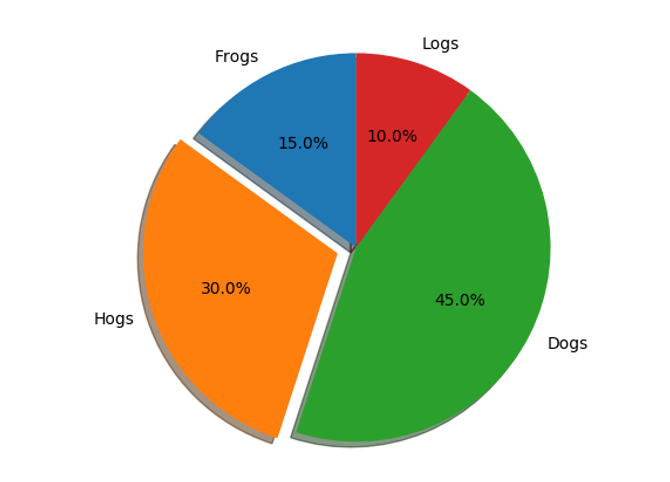

圓餅圖 Pie chart 也是常看到的，它可以幫助我們比較資料所佔比例的多寡，這整個圓加起來是 100%。

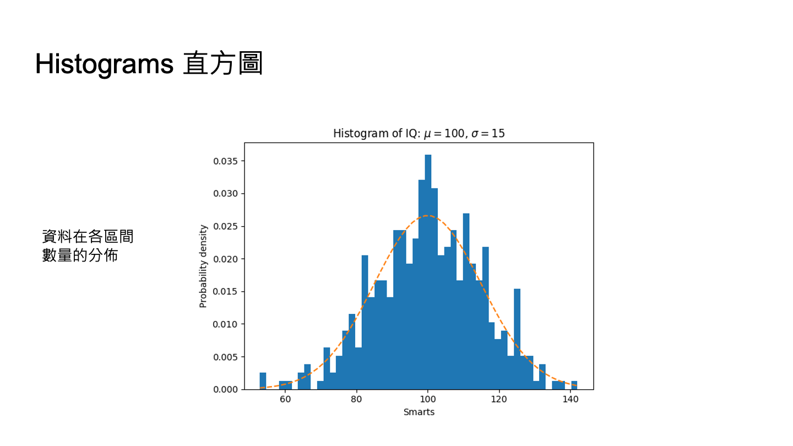

直方圖 histogram 可用來表示某一個資料或者是一個區段的資料密度，就是有多少資料是落在這個區間的。從這個圖裡面，各位可以看到大部分的資料是落在大概 100 左右的，那 140 或者是 60 的資料量就比較少一點。
所以我們常看到 normal distribution 就是用直方圖來做呈現的。

#### 散佈圖 Scatter plots

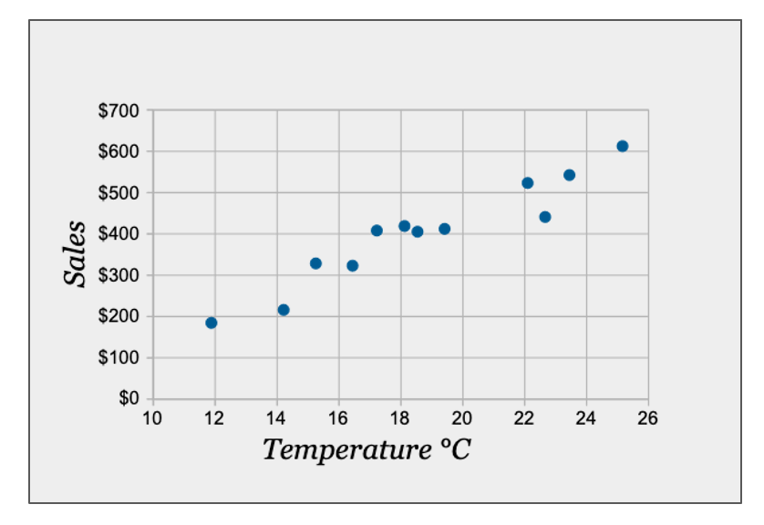

散佈圖 Scatter plots 可以用來呈現兩個數值大小之間的關係，比方說這個地方看到溫度跟銷售量，12 度的時候是 200，14 度的時候 200 多一點點，以此類推。我們可以從圖上看到，它大概有一個線性的關係，溫度越高的話銷量越好，所以可能是賣冰淇淋之類。

#### 箱型圖 Boxplot

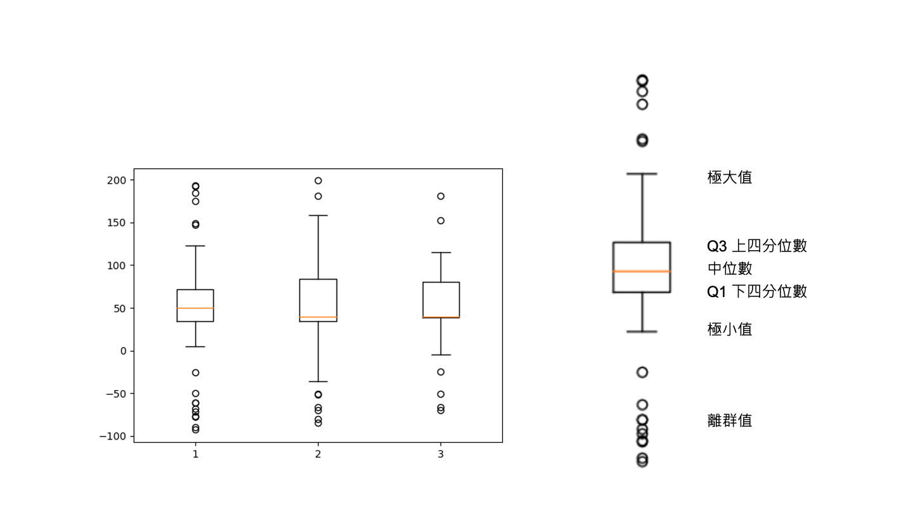


Boxplot 箱型圖，又叫做盒鬚圖。它也是用來比較資料的分佈，如上圖三筆資料的分佈，它有五個比較重要的點。我們看一下右邊這裡，分別是極小值、q1、中位數、q3跟極大值。如果資料落在極小值以下的話就是一個極小的離群值。如果在極大值以上也代表著一個離群值，例如呈現薪資狀況，那全台首富的值可能就會落在離群值了。中位數代表這群資料的中間，它是贏過百分之五十的人。q1 下四分位數則是在四分之一的位置，它贏過 25\% 的人，這個地方是百分之七十五。所以箱型圖的這個箱子就佔了百分之五十的資料。如果中位數越低的話，就代表中間的值是偏低。那箱型圖如果越短的話，代表百分之五十的值它是比較緊密一點，集中在這個箱子裡面。

#### 常用名詞

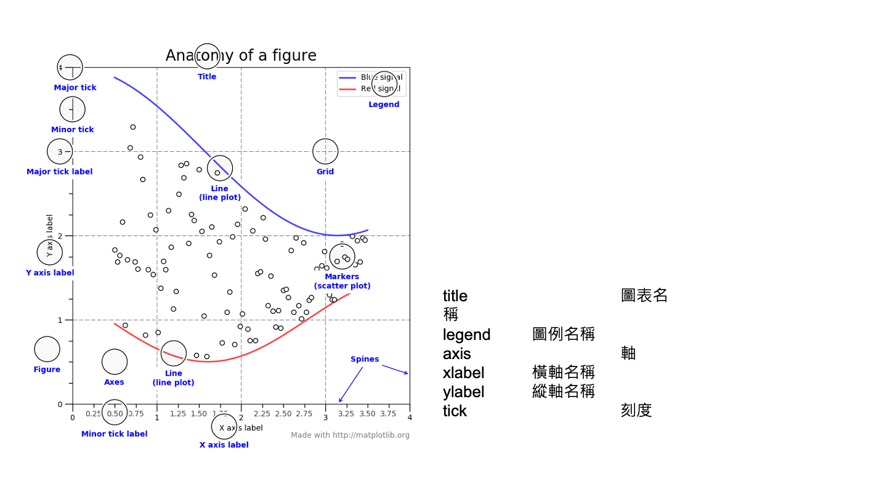


Pandas 在畫圖的時候，常常會用到一些觀念，裡面當然牽涉到一些英文命名的問題，
所以我們挑幾個比較常用的來做一下說明。
像 title 代表圖表的名稱，就是抬頭的部分。
legend 是圖例的名稱，比方說藍色代表什麼、紅色代表什麼。
再來每一個軸上面會有它的名稱，是用 xlabel 跟 ylabel 來表示，刻度的話就是 tick。

### 中文問題

Matplotlib 預設無法顯示中文，若想顯示中文，只要去修改 matplotlibrc 設定檔，將其預設的字體更換為繁體中文字體即可。

可以先使用以下程式碼去尋找設定檔路徑：

```python
#find matplotlibrc path
import matplotlib 
print(matplotlib.matplotlib_fname())
```

Windos10 設定：

- 首先進入matplotlibrc 預設路徑
- 用記事本開啟 matplotlibrc 設定檔
- 搜尋 font.family，將第一個字元 \# 移除
- 搜尋 font.sans-serif，將第一個字元 \# 移除，並在 font.sans-serif 後方加入Microsoft JhengHei，完整子句如下：
```
font.sans-serif : Microsoft JhengHei, DejaVu Sans,... 
```
- 在以下路徑找到.matplotlib快取資料夾，並刪除它：

```
C:\\Users\\使用者名稱
```

- 到網路上下載 微軟正黑體.ttf，以 msj.ttf 命名之，再儲存到以下路徑資料夾 ：
```
C:\\Users\\使用者名稱\\Anaconda3\\Lib\\site-packages\\matplotlib\\mpl-data\\fonts\\ttf
```
- 最後在 python 中使用 rcParams 參數指定字體，即可顯示中文。

```python
import matplotlib.pyplot as plt
plt.rcParams['font.sans-serif'] = ['Microsoft JhengHei'] 
plt.rcParams['axes.unicode_minus'] = False
```

Mac 設定：(與 Win10 同理)

- 下載及安裝字型。
- 刪除 fontList.py3k.cache 這個暫存檔
- 修改設定檔。
- 設定字體參數。在 python 中使用 rcParams 參數指定字體，即可顯示中文。

### 繪製圖表
此章節程式碼可至 [colab](https://colab.research.google.com/drive/1sL4w_DWy6jOMQUDn6uTU9X2-4HFCYxHd#scrollTo=eNekZb0wH9hJ) 參考

產生數據:
```python
import matplotlib.pyplot as plt
import pandas as pd
import random as r

g1 = r.sample(range(1, 100), 50)
g2 = r.sample(range(40,100), 50)
g3 = r.sample(range(1,70), 50)
gender = {'girl':[16,20,30], 'boy':[34,30,20]}

# 產生dataframe物件
s1 = pd.DataFrame(g1)
s2 = pd.DataFrame(g2)
s = pd.DataFrame({'Eng': g1,
          'Math': g2,
          'Phy': g3})
sg = pd.DataFrame(gender, index=['c1', 'c2', 'c3'])
```

s:
```
    Eng  Math  Phy
0    72    84   48
1    59    56   62
2    32    52    9
...
48   70    63   61
49    4    79   30
```

sg:
```
    girl  boy
c1    16   34
c2    20   30
c3    30   20
```
我們會用這兩個表格來呈現一些圖表，
其中 s 代表著總共 50 個學生的英文、數學跟物理三科成績，
sg 這張表是代表三個班級 C1 C2 C3 男生跟女生的數量，
用這兩張表來跟大家做說明。
第一張圖用 plot 畫折線圖，只要一行的指令，就可以把這一個看起來滿複雜的折線圖畫出來。
```python
# 折線圖
s.plot()
```
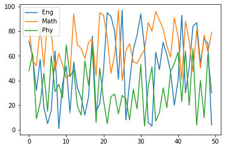

s 是一個 dataframe 的物件，使用 `s.plot()` 方法後如果 title 後面的參數沒有寫其實也沒關係，它就不會呈現 title，有寫 title 這個地方就會呈現出來，而且預設把圖例的說明放在右上角。如果不要用dataframe.plot 來做，想要用 matplotlib 來做也是可以。首先先 import matplotlib，然後設定它的 title，就直接用這個 plt ，plt 它等於是一個 pyplot 的物件去 .title 去設定這個 title，然後去設定它的 x 軸跟 y 軸，再透過 plot 把 s 這一筆資料印出來如 Code。

```python
import matplotlib.pyplot as plt
plt.title('Student Grade')
plt.ylabel('Grade')
plt.xlabel('S ID')
plt.plot(s)
```

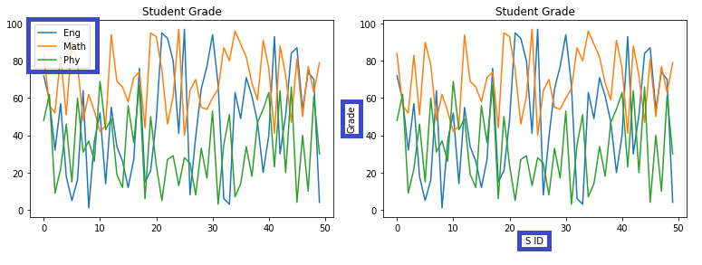

左右這兩張圖，可以看到差別就是右邊使用 matplot 繪製的圖有 xlabel 跟 ylabel 。在 matplot 裡面，要去設定 xlabel 跟 ylabel 是相當容易的，但是在 dataframe 裡面並沒有一個直接的物件去設定，必須要先去獲得它另外一個物件才能去設定它。所以獲得另一個物件再去設定的部份今天就先跳過。

那如果要去畫 histogram，一樣只需一個指令就完成了，`s.hist()` 它就會把三筆資料的分佈秀出來，如圖\ref{fig:s_hist}。

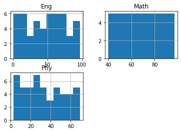


從圖中可以看到，英文這一個科目好像大家都考得不是很好，在 0 分到十幾分的數量上是比較多的。數學方面就比較平均一點。Bar chart 的部分一樣是一行的指令，`s.plot.bar`。是先呼叫 plot 的指令，然後再去呼叫 bar。我們也可以指定一下大小，因為 x 軸其實非常多，所以我們設定 figsize 等於 10。10 代表它 X 軸寬的部分，然後 y 軸高的部分設為 5，整個呈現起來就如下圖：

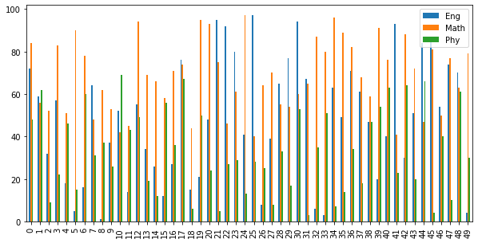

如果說想用橫向的 bar，就在 bar 右邊再加上 h，代表 horizon 水平的意思，如下圖：

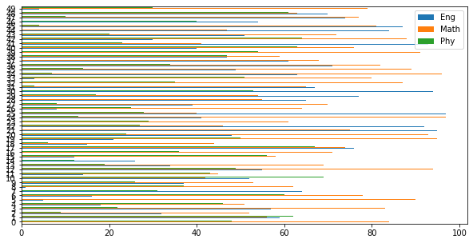

再看另外一個例子會更清楚一點，這個資料量比較少，使用 bar chart 比較有意義。將 sg 這張表，也就是 3 班 c1 c2 c3 各班男生跟女生的人數繪製成 bar chart 如下圖就可以很清楚的看到了。

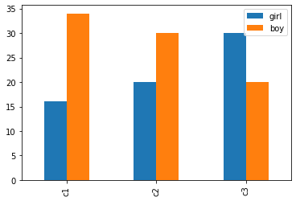

那如果不想把這兩筆資料放在同一張圖，我們可以下一個參數就是 `subplots=True`，這樣就會自動的將兩筆資料它分開呈現，如下圖。

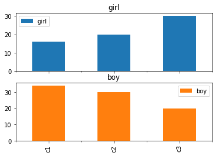

接下來看 pie chart 如下圖，pie chart 一樣先呼叫 plot 再呼叫 pie，如 

```python
sg.plot.pie(y='boy', autopct='\%.2f',figsize=(5,5))
```

而後面的 y=boy 所代表的意思是因為這裡有兩筆資料，所以必須要去選定要呈現哪一筆資料。所以當 y=boy，代表說我是要去分析 y 的這筆資料。
那 autopct 的 pct 則是代表 percent 百分比的意思。autopct= 後接一個字串，第一個 percent 就是代表要用百分制的方式來呈現，後面的 .2f 是代表小數點後兩位。figsize 一樣是圖形的大小。如果說今天是想要把兩個資料全部都呈現，就做一個 subplots=True，這樣兩筆資料都會呈現出來了。

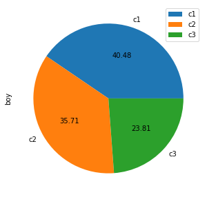

## 應用

### 新北 YourBike 分析


此章節會介紹兩個資料分析範例，第一個是新北市 youbike 相關資訊的應用，第二個是大專院校學生分析。新北市 youbike 相關資訊在前面介紹 dictionary 的部分時也曾經用過這一筆資料。那時候使用的資料是用 dictionary 的方式來讀進台中市 youbike 的資訊，這筆資料的結構包含像每一個站點、代碼名稱、總共有多少個停車格與目前還有多少車子。在這個 station 裡面還有它所在的區域、座標等等。在學完 dataframe 以後，我們用這個方式再來對這筆資料做一遍處理，效果跟整個過程是完全不一樣的，變得更方便了。那取得這一筆資料的方式，就到 data.gov.tw 下的交通下載csv的檔案格式。csv 是一個像 table 結構的這個檔案，在使用 dataframe 的話就比較好處理。雖然下載下來以後，資料內容密密麻麻看起來非常的複雜，可是當轉換成 dataframe 讀取的時候，這筆資料其實還蠻清楚的。

#### youbike_station_bar
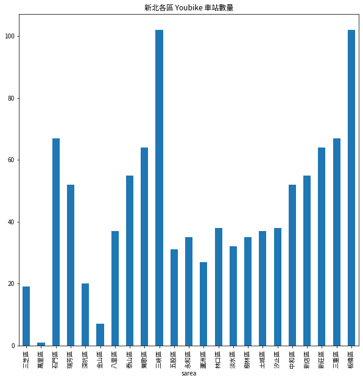


接下來畫幾張圖，用視覺化的方式來呈現這個 youbike 的一些狀況，例如每一個區域有多少個 youbike 的 station 等等。圖 [youbike_station_bar](#youbike_station_bar) 是我們先跑出來的結果，各位可以看到這個板橋區與三峽區大概是最多的，其他像萬里區或金山區數量就比較少。

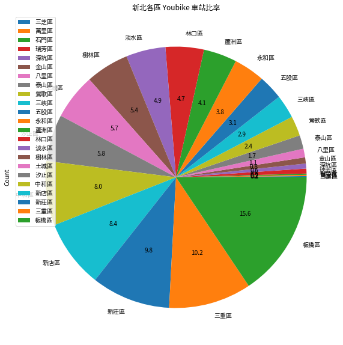

那我們也可以用圓餅圖的方式來去呈現，如圖 [youbike_station_pie](#youbike_station_pie)，一樣大家可以看到這個是百分比由小到大排序。

我們還可以做分佈圖，因為這一筆資料裡面有經緯度的座標，所以我們就用這個資訊畫 scatter，如圖[youbike_station_scatter1](youbike_station_scatter1)，就可以畫出這整個 youbike station它分佈的這個狀況。

#### youbike_station_scatter1
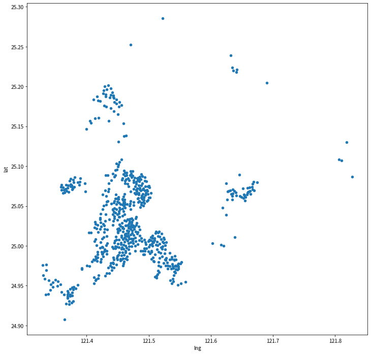

#### new_taipei_map


[new_taipei_map](#new_taipei_map)是新北市的行政區域圖，中間這個地方是台北市所以我們這個資料裡是沒有台北市的站點資訊，所以這個地方空了一大堆。右邊的區域大概是貢寮區，北邊這個地方大概是金山區，所以我們也可以畫出這樣子的圖。


畫這些圖都非常的簡單，透過 dataframe 只需要三到五行程式碼就可以畫出這樣子的圖了。我們也可以畫出借出率的箱型圖，如[youbike_station_box](#youbike_station_box)，借出率就是每一個 station 借出 youbike 的這個比例是多少。當然借出的比例越高的話，代表這一個 station 是越熱門，越多人來借用 youbike。由此圖可以看到，借出率的中位數有來到 60、70% 左右

#### youbike_station_box
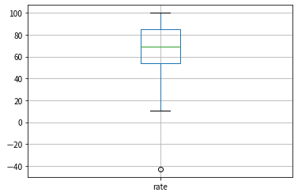

我們也可以依照這個借出率的高低來繪製圈圈的大小，如下圖：

#### Youbike_station_scatter2
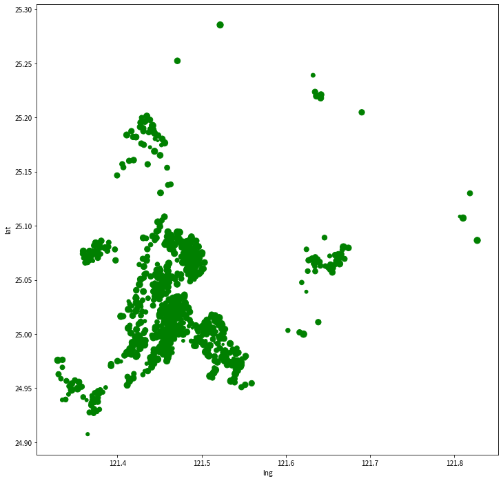


如各位看到，有些圈圈是比較小一點的代表這個站點的借出率是比較低的。因為平均來看借出率都還挺高，所以圈圈看起來其實都差不多。

接下來看看畫出這些圖的程式碼，此部分程式碼可到 [colab 連結](https://colab.research.google.com/drive/1sL4w_DWy6jOMQUDn6uTU9X2-4HFCYxHd#scrollTo=HIGaXvHgIFFv&line=3&uniqifier=1
) 執行操作。


```python
import pandas as pd

def setupFont_mac():
    ''' 參考：
        https://www.itread01.com/content/1508747936.html
        https://medium.com/@wulala505/matplotlib-pyplot-%E5%9C%A8mac%E8%A8%AD%E5%AE%9A%E7%B9%81%E9%AB%94%E4%B8%AD%E6%96%87%E5%AD%97%E5%9E%8B-88f5b027a352
    '''
    import matplotlib as mpl
    from matplotlib.font_manager import _rebuild
    _rebuild()
    mpl.rcParams['font.sans-serif']=[u'SimHei']
    mpl.rcParams['axes.unicode_minus']=False    

def setupFont_window():
    import matplotlib as mpl
    mpl.rcParams['font.sans-serif'] = ['KaiTi']
    mpl.rcParams['font.serif'] = ['KaiTi']
    
def init_data():
    ''' 讀入檔案，轉型態
    '''
    file_path = "data/youbike_newTPE.csv"

    df = pd.read_csv(file_path,
                    header = 0,
                    dtype={'sno':str}
                    )
    return df

setupFont_mac()
df = init_data()
```

首先，在上面這個地方宣告了三個 function，第一、二個 function 是在設定顯示中文的字型，第一個是 mac 版，第二個是 Window 版。這是因為 matplotlib 預設並沒有中文的字型，所以這個地方需要處理一下。第三個 function 是 init data，就是初始化資料。

先設定資料的目錄，此處是放在 data 下面的`youbike_newTPE.csv`，那設定好路徑了以後，就可以透過 `pd.read_csv` 將這個檔案的資料讀進來，`pd.read_csv()`括號裡放的是 `file_path`，`file_path` 就是`data/youbike_newTPE.csv`，然後 header 等於 0 的意思是這筆資料有表頭的欄位說明。

#### youbike_data
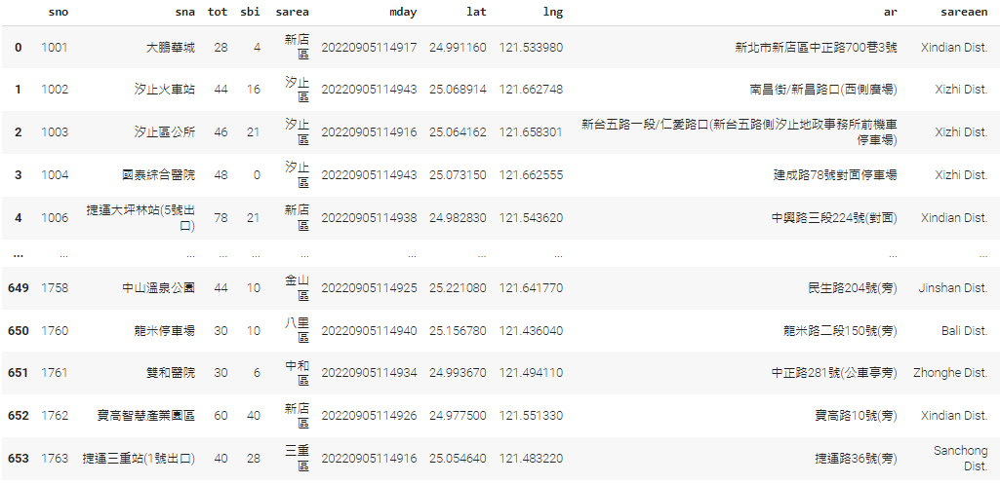

那我們來看一下這一筆資料，如 [youbike_data](#youbike_data)，就是這個 csv 檔的內容。會在第一行的部分會看到它會有許多這個欄位的名稱，就代表說它的表頭並不是一筆資料而是欄位名稱，所以在這個地方必須要把 header 設為零。那接下來這個 dtype 是 sno : str，我們再看一下這個 dataframe 的資料，這個 sno 是每一個站的一個序號，但是這一筆資料全部都是數字，如果不強迫跟 Pandas 講說它是一個字串的話就會誤認為它是一個整數，若是一個整數的話等一下就會被拿去做加減乘除等等的運算。這對我們來講這是沒什麼意義的，所以我們就在這個地方特別說明它是一個字串。

這三個 function 的含義應該很容易了解，所以就進入到主程式，首先設定一下字型，然後接下來把檔案讀進來放在 dataframe 的 df 中。那讀完了以後就能看到該 df 的資料，我們先來看一下 df 的資料，sno 就是我們剛剛提到的站亭代碼、然後是站點的名稱、total 是多少個車位、sbi 目前還有多少車輛可被借用、sarea 站點是在哪一個區域等等。這個 sarea 等一下我們會用到，所以我們花一點時間來看一下資料。透過排序後，可以看到三峽區這個地方其實本身擁有蠻多的 station，接下來是三重區等等。`dataframe.read_csv` 事實上幫我們做了很智慧的判讀，看到數字就自動當成是一個數字，其實呈現出來是比較方便的。


```python
#
# 以長條圖呈現每一區的數量
# 一行就可以解決
#
df.groupby('sarea').count()['sno'].plot.bar(figsize=(10,10))

#
# 稍微修改一下，排序
#
stationCount = df.groupby("sarea").count()[['sno']]
stationCount.rename(columns = {'sno':'Count'}, inplace=True)

stationCount = stationCount.sort_values(by='Count')
stationCount['Count'].plot.bar(title='新北各區 Youbike 車站數量', figsize=(10,10))
```

我們再往下繼續看程式碼，這個程式第一個要用長條圖來呈現每一個區的站點數量，我們會用到 groupby 這一個 function，所以 `df.groupby` 就是我要用什麼欄位來做分群，這裡使用 sarea 這個欄位，也就是站點所在的區域做分群。分群完了以後，這個 count 的 function 的作用是什麼？我需要去算總數，不是算平均，也不是算加總，而是算他的數量。意思就是去算有多少筆資料是屬於三峽區、多少筆資料是屬於三重區，所以這裡使用 count。

當這裡的 count 做完了以後，這裡所有的欄位都會去儲存這個 count 的數字，包含的像這裡的 sno 他都會儲存這個區域數量的數字。所以我們去取得 sno 這一個值的時候，我們取到的這個資料就是他的數量。然後接下來再透過 `plot.bar` 就可以把長條圖把畫出來，後面的就帶一個參數 figsize = (10,10) 設定產生圖片的大小。產生出來的圖片就如圖 [youbike_station_bar](#youbike_station_bar)， x 軸就是區域名稱， y 軸是欄位分群後的資料數量，因為我們是取這個 sno 的 count ，所以就可以呈現出這樣的結果。


接下來稍微修改一下剛剛這一行的指令，把它做一下修改，讓它可以去排序。程式碼部份也把它拆解成幾個步驟來進行，首先一樣透過 groupby，然後 sarea 去做 groupby。那得到的結果是 count，然後取 sno 的值。這樣子完了以後再把它 rename，這裡為什麼要 rename？執行完了以後它儲存在 station count 裡面，那的確可以看到就是三峽區有十七個，三重區有六十二個等等的，所以此時這個資料就是區域有多少個 station，但是這個欄位名稱還是叫 sno，事實上 sno 是站點序號的意思，所以資料是對的，但欄位的名稱並不太好，所以我們 rename 這個欄位名稱。那我們就是呼叫 rename 的這個 function，那怎麼 rename 

我們用 `columns = {'sno':'Count'}` 這樣 rename 欄位名稱。這個地方是一個 dictionary，那我們是要把 sno rename 成 count，也就是它的數量。當然你可以一次 rename 非常多欄位，所以它是用 dictionary 的方式讓我們來填入。那程式執行結束以後，我們就直接把它儲存在 station count 裡面，而不是再回傳給另外一個變數，所以這個地方我們寫 `inplace = True`，就代表我是在原來的變數做這個修改。執行完了以後我們再來看一下這個 station count，就可以看到欄位的名稱修改完成了。

再來是排序，直接 `sort_values(by=count)`，就是依照 count 排序，排序完的結果一樣丟到 staton count。那執行完了以後再來看一下，這時候它就由小到大排序完成了。所以 這個資料是從 2 一直到 89。

有了這樣的資料後，接下來要畫 bar chart 就容易了，跟剛剛的程式碼一樣執行完就是由小而大的這樣的一筆資料。

```python
#
# 以 pie chart 呈現比例
#
stationCount.plot.pie(y='Count', autopct='%.1f', 
                      figsize=(10, 10),
                      title = '新北各區 Youbike 車站比率')

#
# 畫出地理分佈圖
#
df2 = df[['lng', 'lat']]
df2.plot.scatter(x='lng', y='lat', figsize=(12,12))


# 
# 觀察借出率
# 
df2 = df[df.act == 1] #只算還有在營運的
df2['rate'] = (1 - df2['sbi'] / df['tot']) * 100 # 借出率
df2['rate'] = round(df2['rate'], 1)
df2['rate'].describe()
df2[['rate']].boxplot()

#
# 再劃出地理分佈，越大的借出率越高
# s: 表示圈圈的大小
#
df2.plot.scatter(x='lng', y='lat',
                 s=df2['rate'], 
                 c='green',
                 figsize=(12,12))
```
                 
                
延續剛剛的 bar chart，再來用 pie chart 呈現這一筆資料，首先還是看一下 station count 的這一筆資料，station count 就是每一個區域有多少個 station。那我們現在要用 pie chart 來呈現這件事情相當的簡單，只要一行程式碼就好了。

直接使用 dataframe.plot.pie，設定一下他的資料是 count，所以我們讓 y 等於 count，然後 autopct 表示資料位數最多顯示小數點下一位。然後`figsize` 是他的大小，再制定一下 title。


執行程式碼以後就會產生圖，因為這筆資料是有排序過的，可以看一下他會從 x 軸開始，逆時針的由小而大的排序作為資料的呈現。因為我們這筆資料已經有排序過了，所以比例最小的是深坑區，一直繞到最右邊的板橋區。

那接下來看地理位置的分布，把所有的 station 用地理的方式呈現出來。執行後看一下結果，呈現出來的樣子如前面敘述，中間空的地方就是台北市，這裡 x 軸相當於是經度，那 y 軸相對就是緯度，所以要呈現的資料其實只需要兩個欄位，就是經度跟緯度。這個 df 裡面本來就有這兩筆資料了，所以我們就去選擇欄位 lng 跟 lat 把他們放在 df2 裡面，然後要去畫這散佈圖的話就是 scatter，x 軸我們去讓他設定是lng、 y 軸的話是lat。然後設定一下大小就可以呈現出這樣一個結果。

接下來再來看借出率，在這個地方我們只考慮有在營運的站點，因為沒有在營運的站點去算它的借出率比較沒有意義。我們有一個欄位 act ，如果值等於1的話代表這個站點是有在營運的。那我們再回顧一下這個資料 df ，最右邊這個地方 ACD 等於 1 的話就代表它是有在營運，所以這個地方做 boolean 的判斷。要去算站點的借出率的話，就是讓 sbi，就是這個站點裡面現在有多少輛車子，去除以 total，就是目前有在 station 的比例。然後我們再讓 1 去扣掉這一個比例，就是借出去的。計算完了以後因為要去算百分比，所以再讓它去乘以一百。那乘以一百以後，我們要求小數點下一位，所以在這個地方透過 round 1 去算到小數點下一位。執行完後一樣來看一下 df2 的這一筆資料，右邊這個地方多加了一個欄位是它的 rate，就是它借的這個比例。最小的從零開始，最大的話這個資料是一百，所以借出率百分之百的 station 其實還蠻多的。那我們用 describe 看一下這一筆資料相關的統計，總共有五百七十七筆資料，

平均是 65.3、標準差是 22.6、那最小數值是 0，那中位數的話是 66 最大 100。如果說這樣的一個方式還是不夠視覺化、不夠好看，我們可以去呼叫 boxplot 來畫盒鬚圖，如 圖 [youbike_station_box](#youbike_station_box)。這個盒鬚圖事實上百分之五十的資料都是落在八十二到五十中間，那它的中位數也是偏高，大概有將近70\%左右。


這些資料最後再回到散布圖，如圖 [youbike_station_scatter2](youbike_station_scatter2)，我們一樣來看一下站點的分佈，但是做一個小變化，在這裡透過一個 `c='green'`，c 代表是 color 顏色，
這張圖把它變成是綠色的點，同時這個地方設定`s=df2['rate']`，s 的話是代表點的 size 大小，跟 rate 數值是相關的，就是借出率越高的話這個這個圈圈就會大一點，反之的話就會比較小一點，可以用這樣子的視覺化的來看我們的這一筆資料
                 


### 大專院校學生
此單元 [colab 連結](https://colab.research.google.com/drive/1sL4w_DWy6jOMQUDn6uTU9X2-4HFCYxHd#scrollTo=ZXAwnxGSeFp8&line=2&uniqifier=1)。

```python
def init_data():
    ''' 讀入檔案，轉型態
    '''
    file_path = "data/107_student.csv"

    df = pd.read_csv(file_path,
                    header = 0, # 第一筆資料是表頭
                    dtype={'學校代碼':str} # 避免誤認為整數
                    )

    ''' columns[4:-2] 的資料包含 -, 其意義是 0
        大一男生, 大一女生...
        透過以下程式將 - 取代為 0
    '''    
    for c in df.columns[4:-2]:
        df[c] = df[c].str.replace('-', '0').astype('int')

    return df    
```

此應用介紹分析 107 學年度大專院校學生的人數，這個資料一樣是在 data.gov.tw 網站下載。 我們可以直接的用 [大專院校校別學生數](https://data.gov.tw/dataset/6231} 去找到這個資料。首先資料下載下來放在工作目錄裡，以這個例子是放在 data 下面然後叫做 `107_student.csv`。先看一下這筆資料，那這筆資料包含了很多的欄位，像學校的代碼、名稱、是日間部還是進修部，接下來就一大堆的數量，包含一年級的學生、一年級的男生女生等等一直到五六年級，然後還有研究生等等，最後有縣市的名稱還有他的體系別等等。

所以先寫一個 function 把資料讀進來，一樣我們先指名一下它的第 0 行是 header，是一個欄位的說明，然後學校的代碼，因為它都是一個數字型態的，所以我們把它強制的告訴 Pandas 它是一個字串。另外有一個要特別注意的點，就是原始的資料裡面它會把這個數量是零的欄位用 dash 來表示，這一個 dash 等一下我們在做加總的時候會出現問題，所以這裡要先做一個處理。我們跑一個迴圈把那些欄位只要看到 dash 的值就把它replace 變成是 0，所以我們看一下 dash 這個數值的欄位是在哪些欄位，到原始資料看一下0 1 2 3 4，從第四個 column 開始，一年級男生這個地方開始是數值型態，一直到最右邊這個地方，這裡是 -1 -2 -3 研修生的女生也是數值， 這個地方是 -3，那我們要到 -3 的下一個 -2。

所以我們是跑這個迴圈就是從 columns 4 到 -2，在每一次的執行我們都是先把這筆資料把它轉成 str，否則它是一個 dataframe 的一個型態。先把它轉成字串，再把這個 dash replace 變成是 0，然後此時還是一個字串型態，所以我們再透過 astype 轉型成整數的型態。執行一下這一個程式後，這時候這個檔案已經讀進來了，那接下來我們就到主程式的地方執行一下，我們把它寫到 df107 的這一個資料表裡面。接下來看一下 df107 的這一個資料表，資料全部都讀進來後，可以看到該資料包含學校代碼、學校的名稱，也可以看到它的進修別等等後面全部都是數字。除了倒數第二、三個欄位這個地方不是一個數字的形態。

#### 學校人數分析

```python
df = df107.groupby(by = '學校名稱').sum()
df['tot'] = df[df.columns[0:]].sum(axis=1)
df = df.sort_values('tot')
df['tot'].describe()
df.head(10)['tot']
df.tail(10)['tot']
```

接下來分析每一間學校的人數，從資料裡面可以看到每一間學校因為有不同的學制，包含了日間部跟進修部還有不同的等級，所以像政治大學其實它就包含了四筆資料，這四筆資料必須要做加總。另外它有不同年級的資料也需要做加總，所以首先透過 groupby 先把學校依照學校的名稱 group 起來。之後用的 aggregation function 是 sum  就是將這些欄位做一個加總。我們再來看一下 df，這時候各學校就會只剩一筆資料，像是世新大學他就只有一筆資料，而且因為這個地方已經有做加總，往後右邊的這裡全部都是數字的資料。因為我們是做 groupby，接下來我們要把後面的 column 加總起來，所以要做一個新的欄位，這裡把它叫做 tot，是等於第 0 個欄位一直加總到最後的一個欄位，一樣是使用 sum。需要注意的是這個 sum 函式是從縱向的開始計算的，要計算橫向的話要加上一個參數 axis 等於 1，這樣才會橫向的去加總這個數字。那執行完了以後再來看一下 df，那我們拉到最右邊就能看到 tot 的欄位出現了。那我們希望資料能夠依照 tot 來排序，所以就呼叫 `sort_value`。那排序完了以後這個資料一樣要丟給 df，所以 df 就是排序後的結果，這時候他就已經是經過排序的了。從這些資料可以看到法鼓文理學院人數是最少的，接下來是台灣戲曲學院，從這個 df 當然可以看得很清楚，如果說想要在這個面板上直接呈現的話，可以直接透過 describe 來看它的一些相關統計的數據，所以各位看到最多人數的學校，它的值有三萬多，最小的也有到兩百八十，就是法鼓這個學校。中位數的話是落在六千多，那我們也可以直接透過 head 跟 tail 把學校列出來，這是列出幾所人數較多與較少的學校，看一下果然是台大人數是最多的。


#### 國立，私立學校數量

```python
def national(df):
    ''' 回傳國立和私立兩張資料表
      * 依據前面有沒有國立兩個字
    '''
    
    df_n = df[df['學校名稱'].str.contains('國立')]
    df_p = df[~df['學校名稱'].str.contains('國立')]
    
    return (df_n, df_p) 

#    
# MAIM program
#
    
df107 = init_data()
```

```python
df = df107.groupby(by = '學校名稱', as_index = False).sum()
df['學校名稱'].str.contains('國立')
df_n = df[df['學校名稱'].str.contains('國立')]
df_p = df[~df['學校名稱'].str.contains('國立')]
n, p = len(df_n), len(df_p)
print ('國立：{}, 私立：{}, 共：{}'.format(n, p, n+p))
```

接下來算一下國立大學跟私立大學的這個數量，因為在我們這個資料表裡面其實並沒有一個特別的欄位去表明是國立大學或私立大學，但是我們其實知道只要名稱裡有包含國立那就是國立，沒有的話就是私立大學。透過這樣的規則就可以來查詢字串裡面有沒有包含國立，但是有一個問題是 index，剛剛在做 groupby 的時候我們使用的欄位是學校名稱，所以它預設就變成這筆新的資料的 index。那這樣子的話就不好搜尋，所以這個地方我們做一下變化，在 groupby 的時候 `as_index` 把他設為 False。跑出來一樣是把它設為 df，這時候的 index 它會自己去排，從0一直到最後一筆，而且學校的名稱就會保持在學校名稱這個欄位。我們先看一下這第三行這個地方，這裡的 `df_n` n是代表 national 國立的意思，df 後面這個地方事實上是一個條件句，就是學校的名稱轉成字串了以後判斷是否包含國立兩個字，所以這裡產生出來他會是一個 boolean。那再把這個 boolean 結果丟到這一個 df 裡面，它就會把國立大學列出來。

執行一遍 `df_n` 可以看到全部都是裡面包含國立大學。同理，要列出私立大學只要在這個條件前面加上一個波浪，波浪是代表 not 的意思，這樣子跑出來學校都是沒有包含國立的，也就是私立的學校。如果各位對這麼長的一個敘述覺得有點困惑的話，可以先把這個條件先複製到前面，先執行一遍，執行出來了以後會看到它一樣是一群的這個資料，只是說後面這個地方緊接著就是一個條件句， True 跟 False，再代到 df 裡面，就會把相對應的這個資料它印出來。這樣就有國立大學跟私立大學的這兩個資料表，再透過`len()`計算兩個資料表的長度計算學校所數。可以知道國立大學的數量有四十七所，私立的話有一百零六，總共是有一百五十三所。

#### 男女比例

```python
def gender(df):
   ''' 建立一個新表，有男女生人數
   '''
   gender_df = df.copy()
   boy = "一年級男生 二年級男生 三年級男生 四年級男生 五年級男生 六年級男生 七年級男生 延修生男生".split()
   gender_df['Male'] = 0
   for i in boy:
       gender_df['Male'] = gender_df['Male'] + gender_df[i]

   girl = "一年級女生 二年級女生 三年級女生 四年級女生 五年級女生 六年級女生 七年級女生 延修生女生".split()
   gender_df['Female'] = 0
   for i in girl:
       gender_df.Female = gender_df.Female + gender_df[i]

   return (gender_df)
```

接下來我們想看看各學校在男女比例相關的這個資訊，那男女比例因為資訊是散布在各個欄位裡面，所以我們要去做額外的一些處理。我們寫了一個 gender function 來做這件事情，然後把資料表帶進來產生一個新的資料表，那裡面有男生跟女生的人數。先我們先透過 `df.copy` 複製另外一個表，內容都是一樣的，就像在處理 excel 的時候若擔心說原來的資料被破壞，所以複製一個副本來操作。

接下來用另外一種技巧來把這個男生跟女生的資料做加總，我們把所有的欄位例如一年級男生二年級男生的欄位名稱變成字串，接下來再透過呼叫 `.split` 切割成一個 list，那這個 list 的第 0 個欄位就是一年級男生，然後接下來就是二年級男生等等...。再來我們增加了一個欄位叫做 male，是代表男生的總數，一開始初始值為 0，然後跑這個 list 的迴圈去計算男生的人數。

當然 boy 裡面的第一個就是一年級男生，所以等一下跑迴圈的時候這一個 `gender_df[0]` 就會抓到一年級男生的這一筆資料，以此類推，所以迴圈跑完的話就可以知道所有男生的人數。同理，女生就寫在 female 這一個欄位裡面。

```python
df_gender = gender(df107)
df_gender = df_gender.groupby(by='學校名稱').sum()
df_gender['Rate'] = (df_gender.Male / df_gender.Female).round(2)

# 介於 0.9-1.1 之間的學校
balance = df_gender['Rate'].between(0.9, 1.1)
df_balance = df_gender[balance]
df_balance['Rate']

# 男女差距比較多的學校
df_gender.sort_values(by = 'Rate', ascending = False, inplace = True)
df_gender.head(10)['Rate']
df_gender.tail(10)['Rate']
df_gender['Rate'].describe()

# 觀看整體，建立另一個較為簡潔的資料表
df_rate = pd.DataFrame(df_gender[['Male', 'Female', 'Rate']])
df_rate[['Rate']].boxplot()
```

全部都加總完了以後，我們就把這個資料 return 回來存到 `df_gender`。先來看下 `df_gender` 這筆資料，拉到最右邊這個地方就有男生跟女生的資料，算出男女生的人數以後就可以計算比例，這個比例就等於男生除以女生，然後是到小數點下兩位。執行結束後得到新的表，首先看一下男女生比例還蠻均勻的學校，那我們就定義比例是男女比介於 0.9 到 1.1 之間的條件，叫 balance ，再去檢查 Rate 值是在 0.9 到 1.1 之間的學校。那就是先產生這個條件，再把這個條件放到 dataframe 裡面過濾，過濾出來以後的這個 balance 就是滿足這條件的所有學校。


我們把這個學校印出來，可以看到總共大概有十幾所學校男女比例還蠻均勻的。接下來再來看一下差距比較大的，先對 rate 做排序。排序完了以後我們把排在前面的幾個學校它印出來，那因為我們是遞減排序，所以值越高的話就代表男生的人數是越多的，所以包含像虎尾科大、台北科大等等學校的男生的人數都是相對女生人數較多的。tail 就是比較尾端的幾個學校，就是男女比例中女生比較多的，包含的像是護專等學校。我們也可以透過 describe 去看一下狀況，平均大概是 1.1 還算蠻不錯的，balance 的地方大概是在 0.9。這樣子的一張表`df_gender` 產生出來了以後其實是還蠻大張的一張表，因為我們又增加了三個欄位。如果覺得爾後要去做運算的時候只會使用到這三個欄位，可以先做一下處理，透過這個 Dataframe 然後只取這三個欄位來產生一個新的表就叫做 `df_rate`，這樣子的話 `df_rate` 就會比較簡潔一點，也可以畫出它的 boxplot。

#### 每個縣市有多少大學？

```python
# group by 兩個欄位，才會都保留
df_city_u = df107.groupby(by = ['縣市名稱', '學校名稱'],
                          as_index = False).sum()
df_city = df_city_u.groupby(by = '縣市名稱').count()
df_city = pd.DataFrame(df_city[['學校名稱']])
df_city.columns = ['學校個數']
df_city.plot.bar()
```


接下來分析縣市中大學的數量分佈，先看一下原來的資料，其實裡面有學校名稱以外還有縣市的資訊，所以這個資訊讓我們可以做這樣子的計算。
但是如果我們做 groupby 的時候只用縣市的名稱，那學校名稱這個資訊就會不見，因為他會把這個數值方面的欄位做加總，或者是計算他的數量，所以學校的名稱就不見了。如果我們用學校名稱來做 groupby 的話，那縣市名稱也就會跟著不見，所以這裡就用一個小技巧，就是 groupby 使用的欄位事實上是兩個，用縣市的名稱跟學校的名稱兩個欄位來做 groupby 而且希望這兩個欄位都保留不要變成 index，所以這個 `as_index` 的這個地方一樣把他設為 False 去做加總。

在 `df_city_u` 計算出來以後，就可以看到縣市名稱跑到前面來了。從這張表可以看到新北市有很多的學校，再來因為目標是要去計算每一個縣市有多少個學校，所以我們再次做一次 groupby，那這一次就是用縣市名稱來去計算它的 count，它的數量。

執行完了以後存在 `df_city`，這樣子就會看到用縣市的名稱當成 index，然後後面這個地方會變成數量。因為包含後面男生女生的欄位全部都會有，我們其實只需要學校名稱，所以產生一個新的表再把這個表塞給 `df_city`，我們就只抓學校的名稱，那當然學校名稱對於我們這一個表的意義又不太一樣，事實上應該代表的是學校的個數，所以我再透過 .columns 等於學校個數。這樣子把這個名稱做修訂，執行後一樣看 `df_city`，就可以看到前面是縣市的名稱，接下來是學校的個數。
那我們可以畫出 bar chart，一樣這個地方看到台北市最多，金門的學校個數就少一點。

```python
#
# Exercise: 在六都讀書的學生，佔全國多少比例？
#
六都=['臺北市','新北市','臺中市','台南市','高雄市']
```

那各位可以想想看，六都的話總共學生人數是多少、佔全國多少比例，這個就留著讓大家來練習。