# Python 程式設計

## 第六章：資料處理 (Pandas)
**Prof. Nien-Lin Hsueh**
Department of Information Engineering
Feng Chia University

---

## 本章學習重點

* **6.1 基礎 Pandas 介紹**
  - Pandas 簡介、Series 與 DataFrame 概念
  - DataFrame 建立、索引設定與 loc/iloc 存取
  - 資料的頭尾、隨機、切片與過濾
  - 資料排序與分群計量 (groupby)
* **6.2 進階 Pandas 資料處理**
  - 遺失資料處理 (dropna, fillna)
  - 現代 Pandas 新特性 (Copy-on-Write, Nullable Types)
  - 資料表合併 (concat, merge)
* **6.3 圖表繪製 (Visualization)**
  - Matplotlib 中文字型設定、基礎折線圖與長條圖
* **6.4 應用實例**
  - 新北 YouBike 開放資料分析
  - 大專院校學生人數與男女比例分析

---
<!-- _class: lead -->

# **6.1 基礎 Pandas 介紹**

---
<!-- _class: full-image-slide -->

<div class="centered-image">
  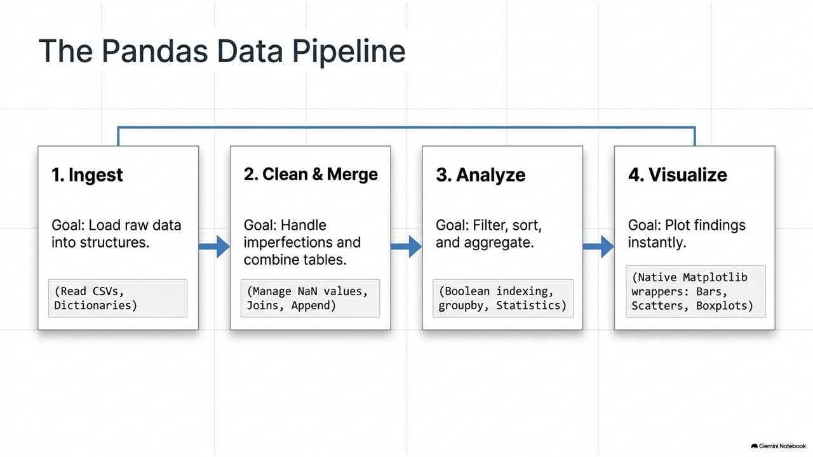
</div>

---

## Row & Column 概念

* 資料結構是以表格方式儲存
* 每一筆資料都有共同的欄位 (Columns/Features) 與列 (Rows)

<div class="split55">
  <div class="left">

  * **Row (列/橫向)**：一筆完整的記錄
  * **Column (欄/縱向)**：某個屬性或特徵
  * 可以輕鬆做加總、平均、標準差等計算
  
  </div>
  <div class="right">
    
  </div>
</div>

---
<!-- _class: full-image-slide -->

<div class="centered-image">
  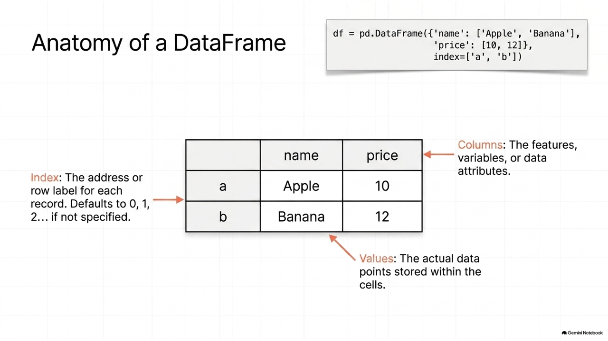
</div>

---

## Pandas 1D 結構：Series

* Series 是一維的標籤化陣列，可以容納 any 資料型態
* 包含「索引值 (Index)」與「資料值 (Values)」

<div class="split55">
  <div class="left">

  * 若未指定索引，系統會自動給予 `0, 1, 2...` 的數字索引
  * 指定自訂索引 (如 Apple, Banana) 可以更容易地依標籤查詢資料
  
  </div>
  <div class="right">
    
  </div>
</div>

---
<!-- _class: full-image-slide -->

<div class="centered-image">
  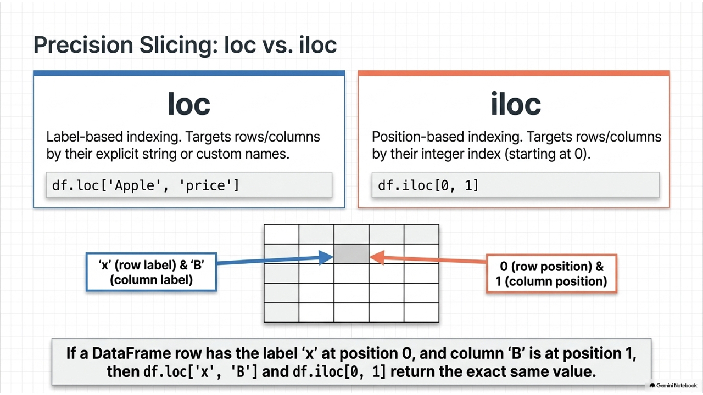
</div>

---

## Pandas 2D 結構：DataFrame

* DataFrame 是二維的表格式資料結構，由多個 Series 組成

```python
import pandas as pd

f = {"name": ['Apple', 'Banana', 'Cherry', 'Durian'],
     "price": [10, 12, 20, 30],
     "quantity": [90, 87, 23, 45]}

df = pd.DataFrame(f)
print(df)
```

輸出結果：
```
     name  price  quantity
0   Apple     10        90
1  Banana     12        87
2  Cherry     20        23
3  Durian     30        45
```

---

## 建立自訂索引

* 我們可以利用 `index` 參數來指定自訂索引：

```python
# 使用 name 欄位作為索引值
df = pd.DataFrame(f, index=f['name'])
print(df)
print('---')
# 依據標籤 'Apple' 取出該列資料
print(df.loc['Apple'])
```

輸出結果：
```
          name  price  quantity
Apple    Apple     10        90
Banana  Banana     12        87
...
---
name        Apple
price          10
quantity       90
Name: Apple, dtype: object
```

---
<!-- _class: full-image-slide -->

<div class="centered-image">
  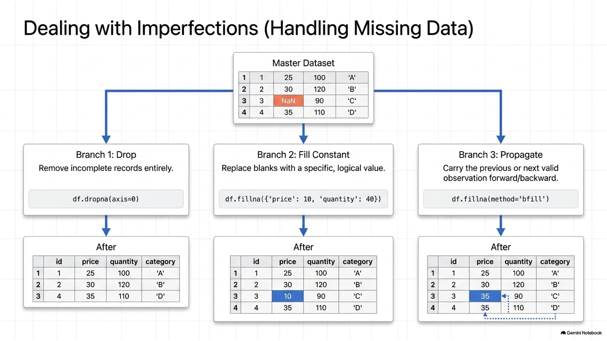
</div>

---

## 索引與資料選取：loc vs iloc

* **`loc`**：標籤索引 (Label-based)，依據自訂標籤名稱存取。
* **`iloc`**：位置索引 (Position-based/Integer-based)，依據 0 開始的整數順序存取。

<div class="split55">
  <div class="left">

```python
df = pd.DataFrame(f, index=f['name'])

# 取多筆資料 (用 list 包起來)
print(df.loc[['Apple', 'Banana']])

# 用整數位置取前兩列
print(df.iloc[[0, 1]])
```
  
  </div>
  <div class="right">
    
  </div>
</div>

---

## Concept Check Question (CCQ 1)

<div class="ccq-columns">
  <div class="ccq-text">

**在 Pandas 中，若我們建立了 Series `s = pd.Series([10, 20, 30], index=['a', 'b', 'c'])`，下列哪一種存取方式會回傳 `20`？**

* **A.** 只有 `s['b']` 與 `s.loc['b']`
* **B.** 只有 `s[1]` 與 `s.iloc[1]`
* **C.** 只有 `s['b']`、`s.loc['b']` 與 `s.iloc[1]`
* **D.** 四種方式 `s['b']`、`s[1]`、`s.loc['b']`、`s.iloc[1]` 皆會回傳 `20`。

  </div>
  <div class="ccq-logo">
    
  </div>
</div>

---

## CCQ 1 - 答案與解析

<div class="ccq-columns">
  <div class="ccq-text">

### **正確答案：D**

* **解析**：
  * **標籤索引 (Label-based)**：`s['b']` 和 `s.loc['b']` 會依據我們自訂的標籤索引 `'b'` 來取得對應元素值 `20`。
  * **位置索引 (Position-based)**：即使指定了自訂字串索引，Pandas 仍會保留預設的 0 開始整數位置索引。因此，第 2 個元素（索引位置 1）可透過 `s[1]` 或 `s.iloc[1]` 來存取，同樣會回傳 `20`。
  * 故四者皆為有效存取方式。

  </div>
  <div class="ccq-logo">
    
  </div>
</div>

---

## Concept Check Question (CCQ 2)

<div class="ccq-columns">
  <div class="ccq-text">

**已知有一個 DataFrame `df` 內容如下：**
|    |  A  |  B  |
|:---|:----|:----|
|  x |  1  |  2  |
|  y |  3  |  4  |

**請問執行 `df.loc['x', 'B']` 與 `df.iloc[0, 1]` 回傳的值分別為何？**

* **A.** 兩者皆回傳 `1`。
* **B.** `df.loc` 回傳 `2`，`df.iloc` 回傳 `3`。
* **C.** 兩者皆回傳 `2`。
* **D.** `df.loc` 回傳 `1`，`df.iloc` 回傳 `4`。

  </div>
  <div class="ccq-logo">
    
  </div>
</div>

---

## CCQ 2 - 答案與解析

<div class="ccq-columns">
  <div class="ccq-text">

### **正確答案：C**

* **解析**：
  * `df.loc['x', 'B']` 是**標籤型存取**（列標籤為 `'x'`，欄標籤為 `'B'`），對應到的值為 `2`。
  * `df.iloc[0, 1]` 是**位置型存取**（列位置為 0 即第一列 `'x'`，欄位置為 1 即第二欄 `'B'`），對應到的值同樣為 `2`。
  * 因此，兩個表達式都指向同一個儲存格，回傳的值都是 `2`。

  </div>
  <div class="ccq-logo">
    
  </div>
</div>

---

## 資料的頭尾與隨機

* 對於巨量資料，我們通常只檢視部分資料以利快速預覽：
  - **`df.head(n)`**：回傳前面 `n` 筆資料（預設 5 筆）
  - **`df.tail(n)`**：回傳後面 `n` 筆資料
  - **`df.sample(n)`**：隨機抽取 `n` 筆資料

```python
# 範例：檢視前 2 筆與後 2 筆資料
print(df.head(2))
print(df.tail(2))
```

---

## 資料的切片 (Slicing)

* 使用雙中括號 `df[['col1', 'col2']]` 可以選取特定欄位集。
* 注意：不能寫成 `df['col1', 'col2']`。單欄位可用 `df['col1']` 或 `df.col1`。

<div class="split55">
  <div class="left">

```python
# 僅選取 c1 與 c2 欄位
df[['c1', 'c2']]

# 選取單一欄位
df['c1']
# 或
df.c1
```
  
  </div>
  <div class="right">
    
  </div>
</div>

---

## 資料過濾 (Filtering)

* 透過對欄位進行條件判斷，產生一個布林 Series，再用它來篩選 DataFrame：

```python
# 產生布林條件 (過濾出 c1 欄位值大於 10 的 True/False 序列)
g = df.c1 > 10
print(g)

# 使用布林 Series 過濾 DataFrame
print(df[g]) 

# 常用的精簡寫法
print(df[df.c1 > 10])
```

---

## Concept Check Question (CCQ 3)

<div class="ccq-columns">
  <div class="ccq-text">

**若要從 DataFrame `df` 中過濾出欄位 `"Age"` 大於 `30` 的所有資料列（Rows），下列哪一個指令是正確的？**

* **A.** `df[df["Age"] > 30]`
* **B.** `df.filter("Age > 30")`
* **C.** `df.where("Age" > 30)`
* **D.** `df[Age > 30]`

  </div>
  <div class="ccq-logo">
    
  </div>
</div>

---

## CCQ 3 - 答案與解析

<div class="ccq-columns">
  <div class="ccq-text">

### **正確答案：A**

* **解析**：
  * 在 Pandas 中，過濾資料最標準的方式是使用**布林索引 (Boolean Indexing)**。
  * `df["Age"] > 30` 會先針對每一列進行條件判斷，產生一個由 `True` 和 `False` 組成的 Series。
  * 將此布林 Series 作為索引傳入 `df[...]` 中，DataFrame 就會篩選出所有對應值為 `True` 的 Rows。

  </div>
  <div class="ccq-logo">
    
  </div>
</div>

---

## 資料排序 (Sorting)

* 使用 `df.sort_values(by='col')` 來對特定欄位進行排序。
* 可傳入 List 進行多重欄位排序。

```python
df = pd.DataFrame({
    'c1': ['A', 'A', 'B', 'Z', 'D', 'C'],
    'c2': [2, 1, 9, 8, 7, 4],
    'c3': [0, 1, 9, 4, 2, 3],
    'c4': ['a', 'B', 'c', 'D', 'e', 'F']})

# 依 c1 排序 (升冪)
print(df.sort_values(by='c1'))

# 依 c1 排序，若相同則依 c2 排序
df2 = df.sort_values(by=['c1', 'c2'])
print(df2)
```

---
<!-- _class: full-image-slide -->

<div class="centered-image">
  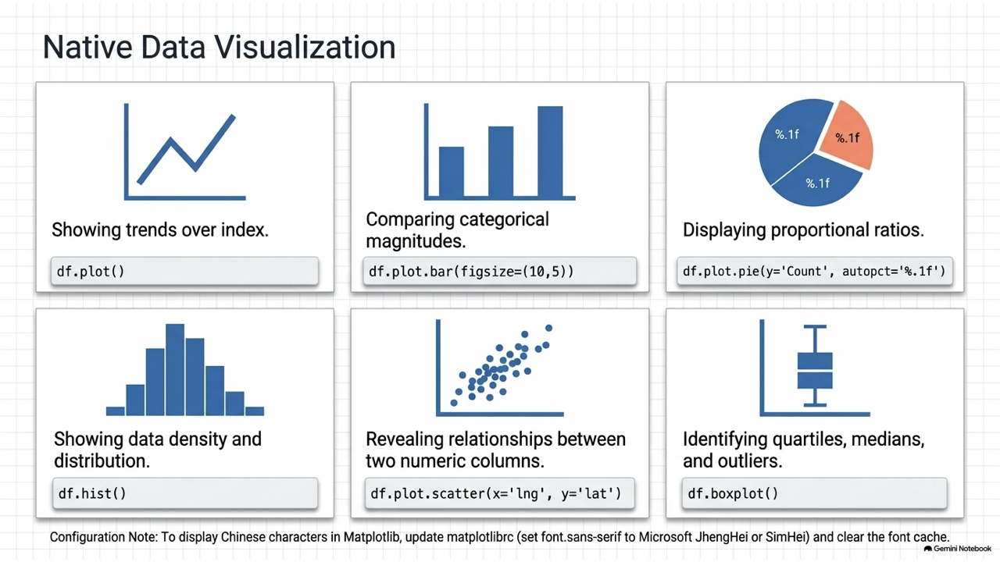
</div>

---

## 分群計量 (groupby)

* `groupby` 可以將資料依照特定欄位的值分組，並對各組進行統計（如 `sum()`、`mean()`、`count()`）。

<div class="split55">
  <div class="left">

```python
# 依學制分群並加總
df.groupby('學制').sum()

# 依縣市與學制分群，計算個數
df.groupby(['縣市名稱', '學制']).count()
```
  
  </div>
  <div class="right">
    
  </div>
</div>

---
<!-- _class: lead -->

# **6.2 進階 Pandas 資料處理**

---
<!-- _class: full-image-slide -->

<div class="centered-image">
  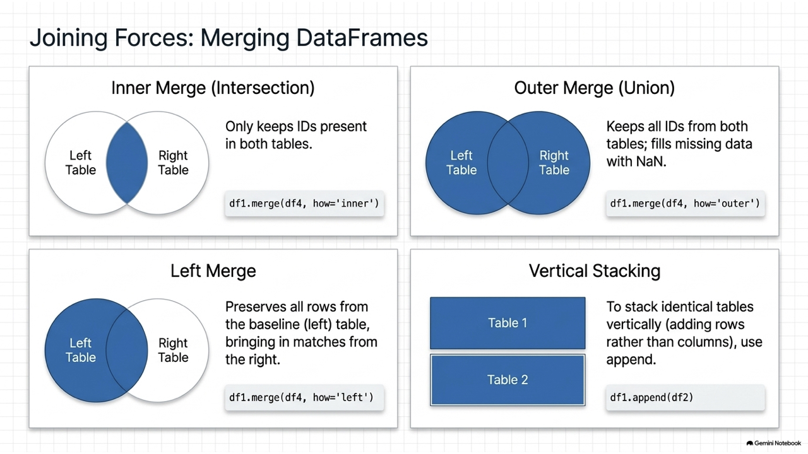
</div>

---

## 遺失資料之處理

* 資料收集時難免會有遺失值（在 Pandas 中通常顯示為 `NaN` 或 `None`）。
* 常見處理策略：
  1. **刪除空值**：`df.dropna()`
  2. **填補空值**：`df.fillna(value)` (可用常數、字典指定各欄填補值，或用 `ffill`/`bfill`)

```python
# 刪除含有任何空值的資料列
df.dropna()

# 各欄位填補不同預設值
df.fillna({'price': 0, 'quantity': 10})

# 向後傳遞填補 (使用後一筆非空值來填補前一筆空值)
# 舊版 method='bfill'，新版建議用：
df.bfill()
```

---
<!-- _class: full-image-slide -->

<div class="centered-image">
  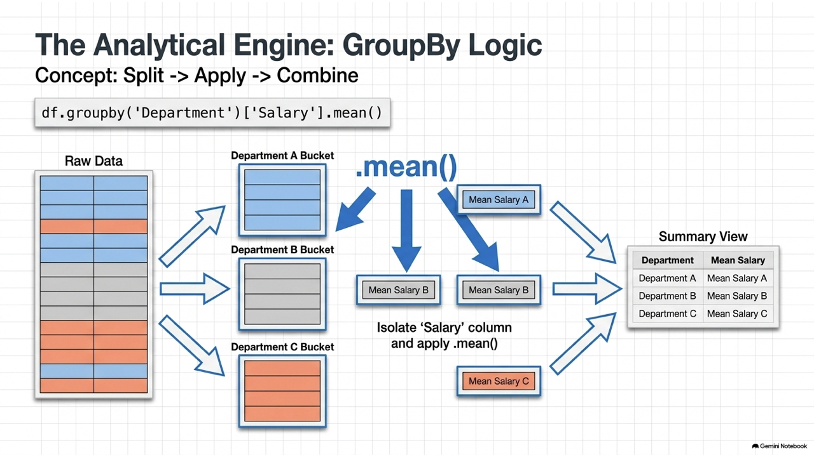
</div>

---

## Nullable Data Types (Pandas 2.0+)

* 傳統 Pandas 在整數欄位若有 `NaN` 會自動將整數轉為 `float`。
* 現代 Pandas 引入了**大寫開頭的 Nullable 型態**（如 `Int64`、`boolean`、`string`），允許整數與空值共存而不改變型態。

```python
# 傳統做法：含有空值的整數欄位會轉為 float64，無可避免精度遺失或混淆
# 現代做法：使用 convert_dtypes() 自動轉換為可含空值的原生型態
df_modern = df.convert_dtypes()
print(df_modern.dtypes)
# 原本 float64 的空值整數欄位會成功轉換成 Int64
```

---
<!-- _class: full-image-slide -->

<div class="centered-image">
  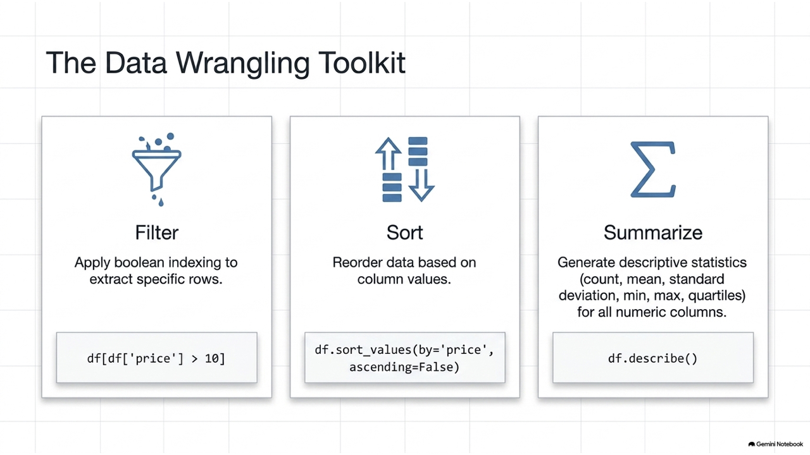
</div>

---

## 寫入時複製 (Copy-on-Write, CoW)

* Pandas 2.0+ 引入且即將在 Pandas 3.0 成為預設的效能與安全機制。
* **概念**：當複製 DataFrame 或選取子集時，並不會立即複製底層資料（共享同個記憶體），只有在其中一個 DataFrame **被修改時**，才會真正執行複製。
* 徹底解決了惱人的 `SettingWithCopyWarning` 警告，讓資料操作更加安全。

```python
# 啟用 CoW 
pd.options.mode.copy_on_write = True

df2 = df.copy()  # 極快，底層指向同一個記憶體
df2.iloc[0, 0] = 99  # 此時修改才真正分裂複製
```

---

## Concept Check Question (CCQ 4)

<div class="ccq-columns">
  <div class="ccq-text">

**給定一個 DataFrame `df`，包含 `"Department"`（部門）與 `"Salary"`（薪水）兩個欄位。若要計算每個部門的平均薪水，下列哪一個指令是正確的？**

* **A.** `df.groupby("Department")["Salary"].mean()`
* **B.** `df.groupby("Department").mean("Salary")`
* **C.** `df.groupby("Department").average("Salary")`
* **D.** `df["Department"].groupby("Salary").mean()`

  </div>
  <div class="ccq-logo">
    
  </div>
</div>

---

## CCQ 4 - 答案與解析

<div class="ccq-columns">
  <div class="ccq-text">

### **正確答案：A**

* **解析**：
  * `df.groupby("Department")`：先以 `"Department"` 欄位作為分組基準。
  * `["Salary"]`：接著從分組後的資料中選取 `"Salary"` 欄位。
  * `.mean()`：最後呼叫 `mean()` 函式計算每一組的平均值。
  * 這是 Pandas 中進行分組聚合（Aggregation）的最標準寫法。其他選項如 `average()` 並非 Pandas 的內建聚合函式。

  </div>
  <div class="ccq-logo">
    
  </div>
</div>

---
<!-- _class: full-image-slide -->

<div class="centered-image">
  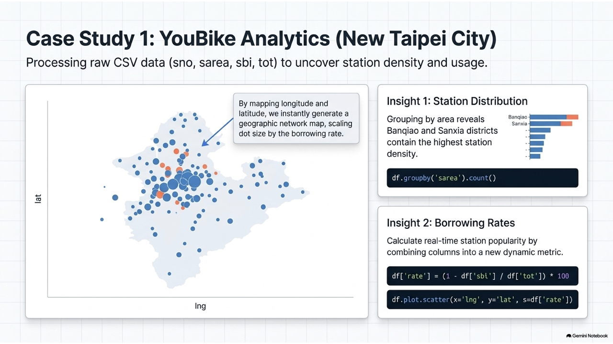
</div>

---

## 資料表合併 (1) — concat 聯結

* `pd.concat([df1, df2])` 用於沿著特定軸 (預設為 row 方向) 將多個 DataFrame 連接在一起。

<div class="split55">
  <div class="left">

```python
# 垂直合併兩筆結構相同的資料
df_all = pd.concat([df1, df2], 
                   ignore_index=True)
```
  
  </div>
  <div class="right">
    
  </div>
</div>

---

## 資料表合併 (2) — merge 關聯

* `pd.merge(df1, df2, on='key', how='inner'|'outer'|'left'|'right')` 類似 SQL 的 Join 操作，根據共同欄位關聯資料。

<div class="split46">
  <div class="left">

* **`inner` (內聯結)**：只保留 key 在兩表中皆存在的資料。
* **`outer` (外聯結)**：保留兩表所有的資料，缺失處補 `NaN`。
  
  </div>
  <div class="right">
    
  </div>
</div>

---

## Merge 程式碼範例

```python
# 1. 內聯結 (Inner Join) - 取交集
df_inner = pd.merge(df_price, df_qty, on='name', how='inner')
print(df_inner)

# 2. 外聯結 (Outer Join) - 取聯集
df_outer = pd.merge(df_price, df_qty, on='name', how='outer')
print(df_outer)
```

---
<!-- _class: lead -->

# **6.3 圖表繪製 (Visualization)**

---
<!-- _class: full-image-slide -->

<div class="centered-image">
  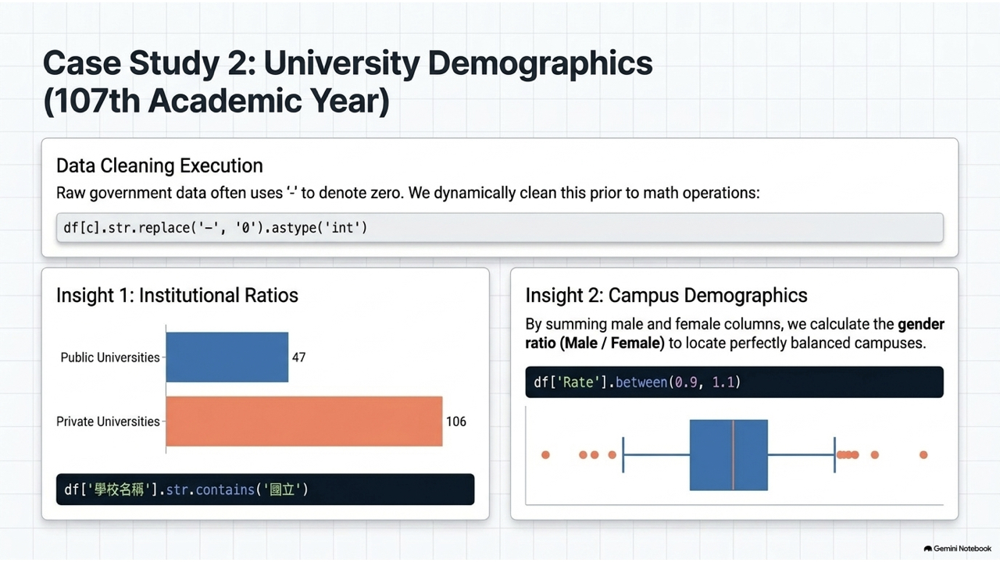
</div>

---

## 中文顯示問題

* Matplotlib / Pandas 繪圖預設不支援中文字型，常會出現方塊字。
* 解決方式：在繪圖前設定支援中文的字型 (KaiTi, Microsoft JhengHei, Heiti TC 等)。

```python
import matplotlib as mpl

# Mac 系統字型設定
def setupFont_mac():
    mpl.rcParams['font.sans-serif'] = ['Heiti TC']
    mpl.rcParams['font.serif'] = ['Heiti TC']
    mpl.rcParams['axes.unicode_minus'] = False # 正常顯示負號
```

---

## 基礎折線圖 (Line Plot)

* 使用 `df.plot(kind='line')` 或是 `df.plot.line()`：

<div class="split46">
  <div class="left">

```python
import pandas as pd
import matplotlib.pyplot as plt

df = pd.DataFrame({
    'c1': [1, 2, 3, 4],
    'c2': [4, 3, 2, 1]
})
df.plot.line(title="折線圖範例")
plt.show()
```
  
  </div>
  <div class="right">
    
  </div>
</div>

---
<!-- _class: lead -->

# **6.4 應用實例**

---
<!-- _class: full-image-slide -->

<div class="centered-image">
  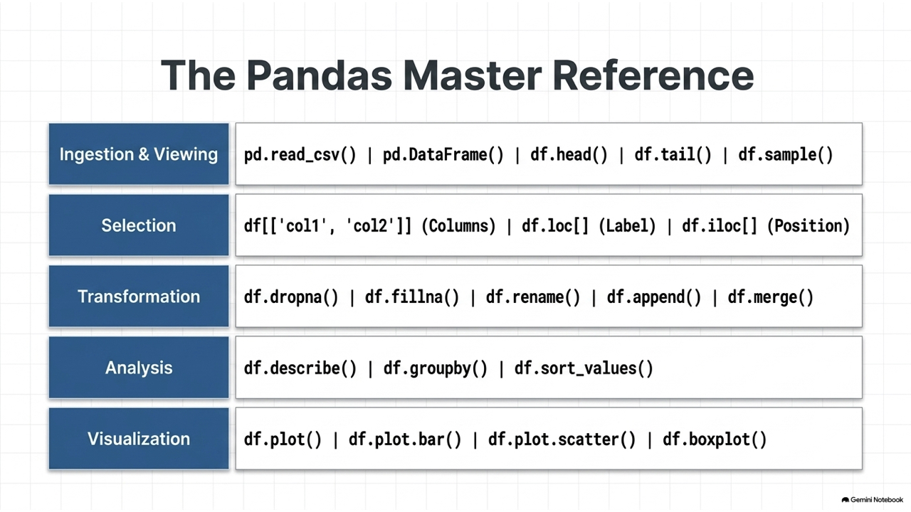
</div>

---

## 實例一：新北 YouBike 資料分析

* 目標：讀取 CSV 檔案、分群分析各區車位數量與地理分佈

```python
def init_data():
    file_path = "data/youbike_newTPE.csv"
    # sno 是站點序號，強迫讀成 str 避免被誤認為整數
    df = pd.read_csv(file_path, header=0, dtype={'sno': str})
    return df

setupFont_mac() # 設定中文字型
df = init_data()
print(df.head(2))
```

---

## 依區域統計 YouBike 車站數量

* 依據 `sarea` (區域) 進行分群，計算個數並排序繪圖。

<div class="split46">
  <div class="left">

```python
# 1. 依 sarea 分群並算數量 (使用 sno 欄位)
stationCount = df.groupby("sarea").count()[['sno']]
# 2. 重新命名欄位為 Count
stationCount.rename(columns={'sno': 'Count'}, 
                   inplace=True)
# 3. 排序
stationCount = stationCount.sort_values(by='Count')
# 4. 繪製長條圖
stationCount['Count'].plot.bar(
    title='新北各區 Youbike 車站數量', 
    figsize=(10,6))
```
  
  </div>
  <div class="right">
    
  </div>
</div>

---

## 各區 YouBike 車站佔比圓餅圖

* 使用 `plot.pie` 呈現比例，`autopct` 設定數值百分比格式。

<div class="split46">
  <div class="left">

```python
stationCount.plot.pie(
    y='Count', 
    autopct='%.1f%%', 
    figsize=(8, 8),
    title='新北各區 Youbike 車站比率'
)
```
  
  </div>
  <div class="right">
    
  </div>
</div>

---

## YouBike 站點地理分佈散佈圖

* 利用經度 (`lng`) 與緯度 (`lat`) 作為 `x` 與 `y` 繪製散佈圖。

<div class="split46">
  <div class="left">

```python
# 取出經緯度欄位
df2 = df[['lng', 'lat']]
# 繪製 scatter plot
df2.plot.scatter(
    x='lng', 
    y='lat', 
    figsize=(8,8)
)
```
  
  </div>
  <div class="right">
    
  </div>
</div>

---

## 營運站點借出率分析

* 借出率公式：`Rate = (1 - sbi / tot) * 100`。透過 `boxplot` 檢視分佈。

<div class="split46">
  <div class="left">

```python
# 只篩選營運中的站點 (act == 1)
df2 = df[df.act == 1].copy()
df2['rate'] = (1 - df2['sbi'] / df2['tot']) * 100
df2['rate'] = round(df2['rate'], 1)

# 印出描述性統計
print(df2['rate'].describe())

# 繪製盒鬚圖 (Boxplot)
df2[['rate']].boxplot()
```
  
  </div>
  <div class="right">
    
  </div>
</div>

---

## 地理分佈與借出率 (Bubble Chart)

* 在散佈圖上，用圓圈大小 (`s`) 來表示借出率的高低。

<div class="split46">
  <div class="left">

```python
df2.plot.scatter(
    x='lng', 
    y='lat',
    s=df2['rate'],  # 點大小隨借出率變化
    c='green',      # 點顏色
    figsize=(8,8)
)
```
  
  </div>
  <div class="right">
    
  </div>
</div>

---

## 實例二：大專院校學生人數分析

* 目標：分析各校人數、國/私立大學比例、以及男女生性別比例。

```python
def init_data():
    file_path = "data/107_student.csv"
    df = pd.read_csv(file_path, header=0, dtype={'學校代碼': str})
    
    # 原始資料中的 '-' 代表零，需替換並轉型為整數
    # 數值欄位為第 4 欄至倒數第 3 欄
    for c in df.columns[4:-2]:
        df[c] = df[c].str.replace('-', '0').astype('int')
    return df
```

---

## 各校總學生人數排序與描述

* 將同校但不同學制學程的列合併 (`groupby`)，再對橫向進行欄位加總。

```python
df107 = init_data()

# 依學校名稱分群並加總
df = df107.groupby(by='學校名稱').sum()

# 橫向加總所有年級欄位 (axis=1)
df['tot'] = df[df.columns[0:]].sum(axis=1)

# 依據總人數排序
df = df.sort_values('tot')
print(df['tot'].describe())

# 檢視人數最多與最少的學校
print(df.head(5)['tot'])  # 最少 (如：法鼓文理學院)
print(df.tail(5)['tot'])  # 最多 (如：台灣大學)
```

---

## 國立與私立大學個數統計

* 使用字串篩選方法 `str.contains('國立')` 來區分國立與私立學校。

```python
# groupby 且不將名稱作為 index (保留為欄位)
df = df107.groupby(by='學校名稱', as_index=False).sum()

# 篩選國立與私立
df_n = df[df['學校名稱'].str.contains('國立')]
df_p = df[~df['學校名稱'].str.contains('國立')]

n, p = len(df_n), len(df_p)
print('國立學校：{} 所, 私立學校：{} 所, 共：{} 所'.format(n, p, n+p))
# 輸出: 國立：47, 私立：106, 共：153
```

---

## 男女比例分析 — 資料準備

* 利用迴圈，分別將所有年級的男生、女生人數加總，建立 Male/Female 欄位。

```python
def gender(df):
    gender_df = df.copy()
    boy = "一年級男生 二年級男生 三年級男生 四年級男生 五年級男生 六年級男生 七年級男生 延修生男生".split()
    gender_df['Male'] = 0
    for i in boy:
        gender_df['Male'] = gender_df['Male'] + gender_df[i]

    girl = "一年級女生 二年級女生 三年級女生 四年級女生 五年級女生 六年級女生 七年級女生 延修生女生".split()
    gender_df['Female'] = 0
    for i in girl:
        gender_df['Female'] = gender_df['Female'] + gender_df[i]
    return gender_df
```

---

## 男女比例分析 — 結果過濾

* 計算比例：`Rate = Male / Female`。利用條件篩選找出男女比例極端的學校。

```python
df_gender = gender(df107).groupby(by='學校名稱').sum()
df_gender['Rate'] = (df_gender.Male / df_gender.Female).round(2)

# 篩選比例均衡 (0.9 ~ 1.1) 的學校
balance = df_gender['Rate'].between(0.9, 1.1)
print(df_gender[balance]['Rate'])

# 男女比率描述性統計
print(df_gender['Rate'].describe())

# 遞減排序看男生比例極高與極低(女生極多)的學校
df_gender.sort_values(by='Rate', ascending=False, inplace=True)
print(df_gender.head(5)['Rate']) # 例如：虎尾科大、台北科大
print(df_gender.tail(5)['Rate']) # 例如：護專
```

---

## 每個縣市擁有的大學校數統計

* 先以 `縣市名稱` 和 `學校名稱` 雙重 groupby (去重)，再依 `縣市名稱` count 計算數量。

```python
# 雙重 groupby
df_city_u = df107.groupby(by=['縣市名稱', '學校名稱'], as_index=False).sum()

# 依縣市計數
df_city = df_city_u.groupby(by='縣市名稱').count()
df_city = pd.DataFrame(df_city[['學校名稱']])
df_city.columns = ['學校個數']

# 繪製長條圖
df_city.plot.bar(figsize=(10,6), title='各縣市大學個數')
```

---

## 隨堂練習

### **隨堂練習：在六都讀書的大專院校學生，佔全國多少比例？**

* **六都定義**：
  ```python
  六都 = ['臺北市', '新北市', '臺中市', '台南市', '高雄市']
  # 註：原始資料可能包含 '臺南市' 或 '台南市'，需注意名稱對齊！
  ```

* **思考步驟**：
  1. 如何篩選出屬於六都的大專院校？
  2. 如何加總六都學生人數與全國總學生人數？
  3. 如何算出百分比？
