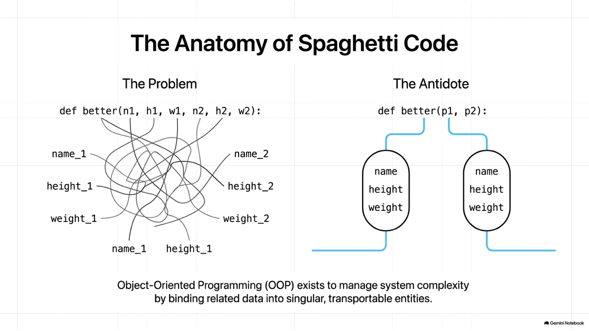
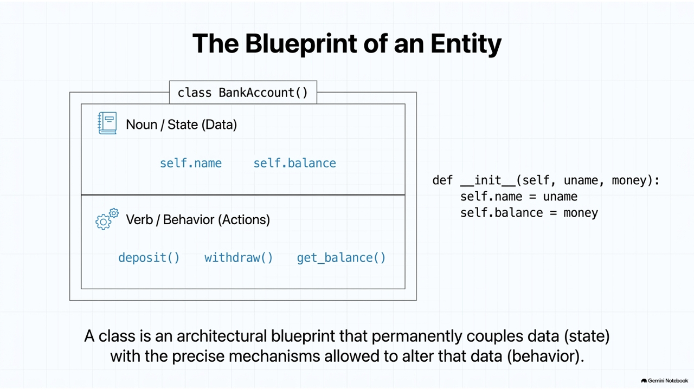
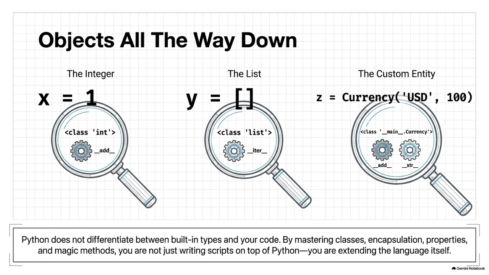
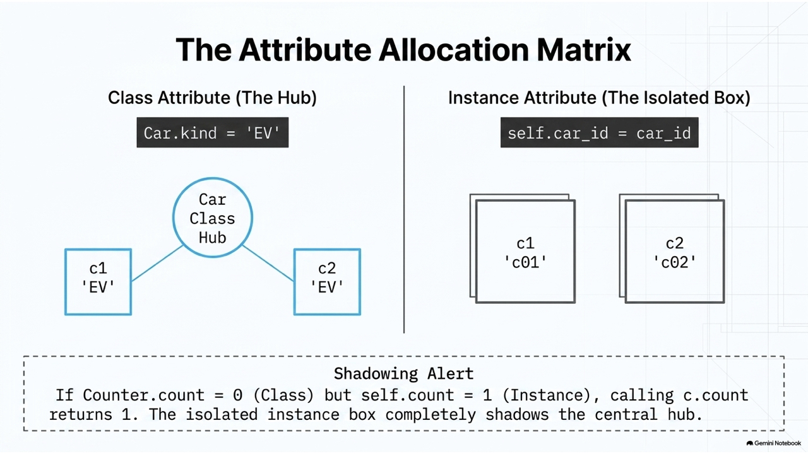
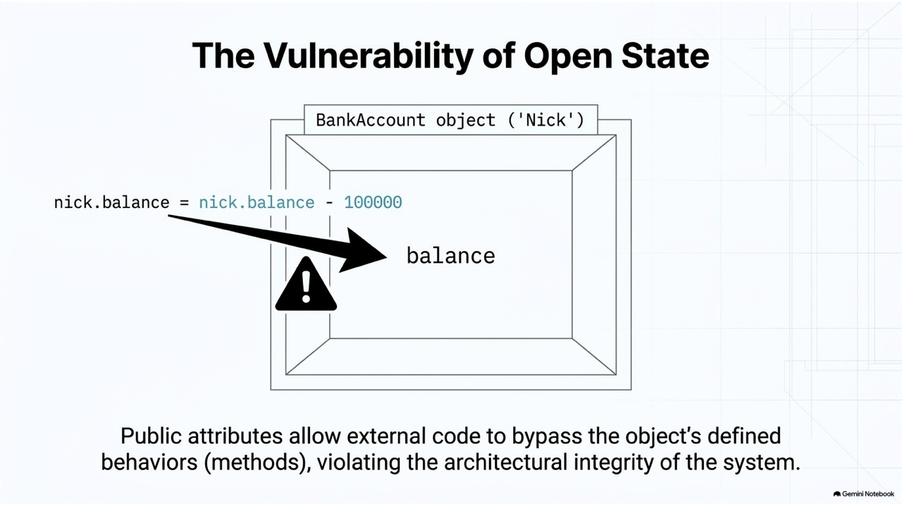
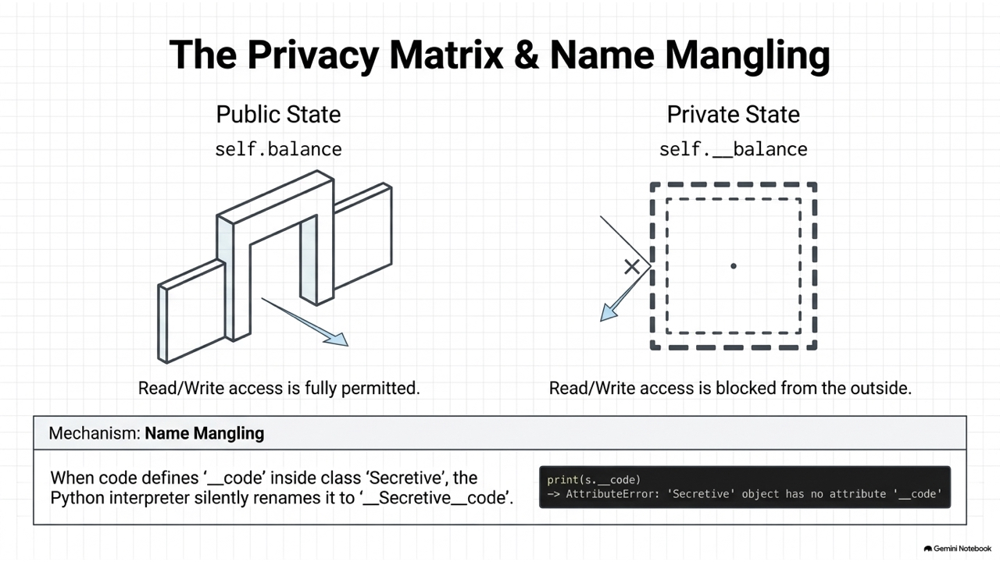
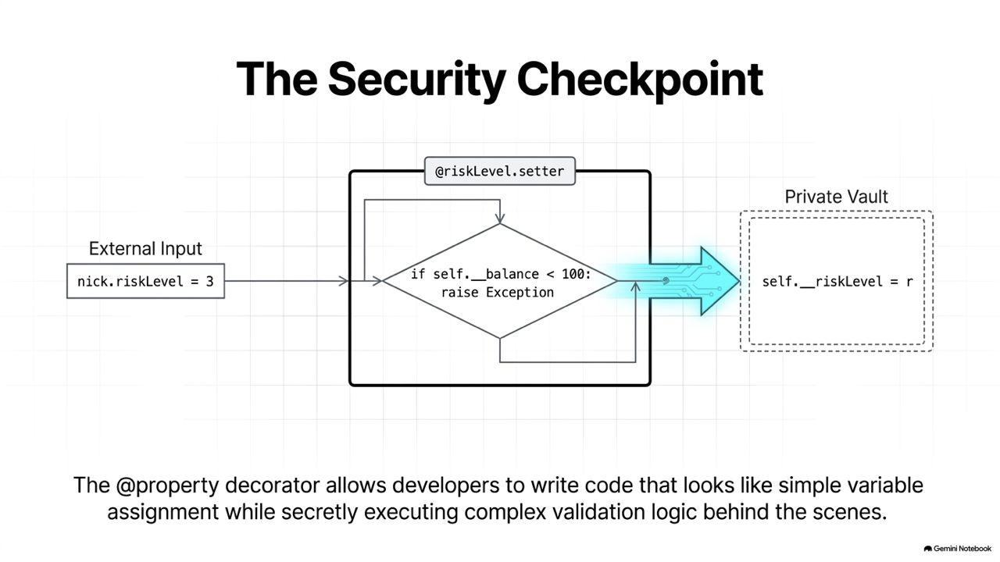
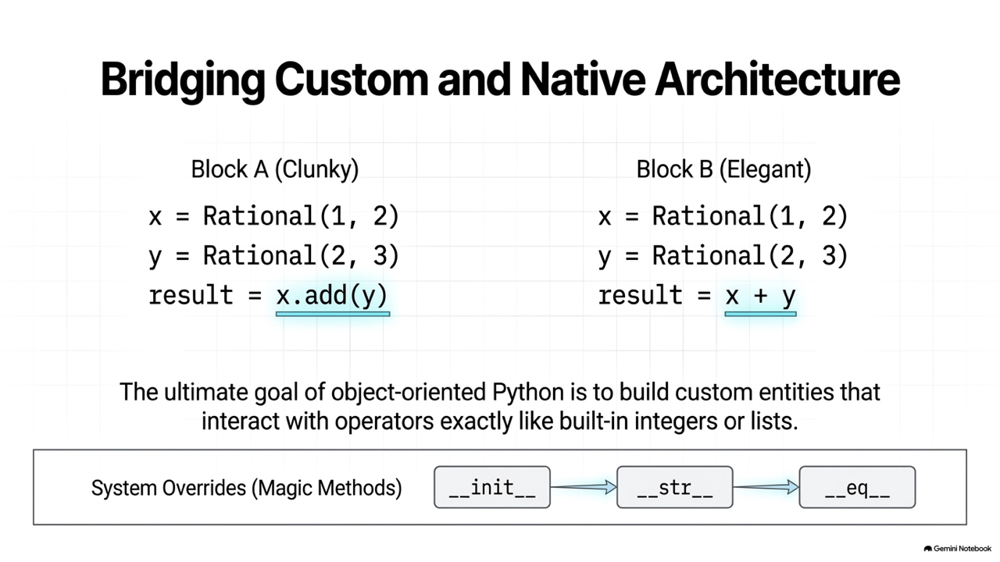
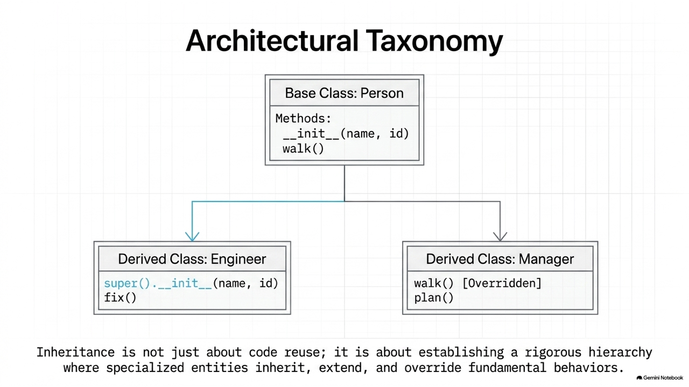
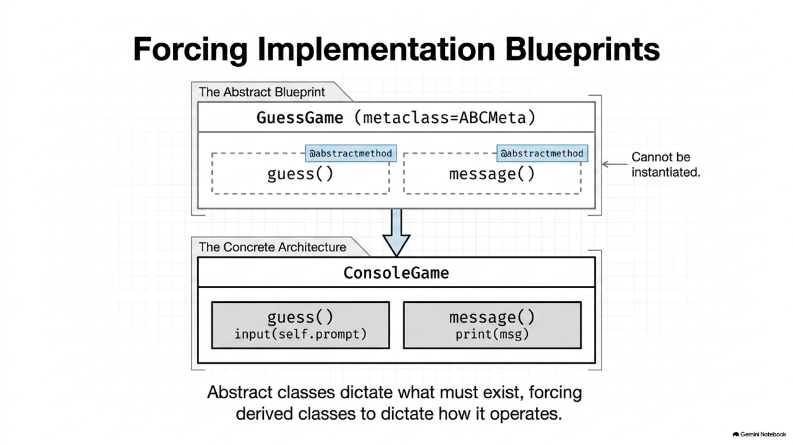

Ch07 Object oriented programming
===

[coloab](https://colab.research.google.com/drive/1klbOhDaHK_3-OOmmygHGxdq3Uzeoc_c0?usp=sharing#scrollTo=141XqNVH_5hz)

## 類別

這一節跟大家來介紹物件設計，物件設計是目前程式設計的主流，因為隨著系統越來越大，我們必須要有一些機制來解決這個問題。我們有所謂的**功能導向**跟**物件導向設計**的方式降低程式的複雜度。功能導向就是說把一個大系統切割成小的問題，每一個問題用一個函式來去解決它。之後再把它組裝起來，來符合一開始的這個系統需求。物件導向設計它最小單元是一個個的**物件**，每一個物件內封裝了和這個物件觀念相關的資料，還有上面可以執行的功能或者是函式，所以一般來講物件導向如果設計得宜，它更能夠來解決程式的複雜性。



### 類別的宣告


```python
# 類別的宣告
class class_name():
   def __init__(self, x, y):
      # 一些初始化

   def f1(self, z):
      # 會用到物件變數的函式

   def f2(p, q):
      # 不會用到物件變數的函示

   def getX(self):
      # 取用 x 並計算後回傳的函式

   def setX(self, new_x):
      # 設定 x 的函示

# 物件的生成
obj = class_name()
```

### List 也是物件

物件大家並不陌生，和我們之前在講到的各種資料形態，例如 `int`、`float`、`list`、`dict` 等在 Python 中都是用物件來設計，只是過去我們是直接用 所以大家可能沒有感覺。以 `list` 物件為例來說明物件的資料與函式。`list` 內的資料例如一群成績資料是物件的資料，操作這些資料的函式包含 `append`、`extend`、`insert` 等是這個物件的方法。我可以透過呼叫這些方法來修改物件內部的資料。



### People

我們再多看了一個例子：我們宣告一個類別 `People`，內部有一些屬性包含姓名、身高、體重等。除了身高和體重以外，在健康資訊中我們更重視一個人的 BMI 值，太高或太低的 BMI 都不好。BMI 是延伸計算出來的。我們可以提供 `getBMI()` 獲取他的值。 也可以設計一個方法 `better()` 來比較兩個人的健康狀態。我們可以把兩個人的參數帶進去做比較，因為 `People` 裏面已經封裝了他的姓名、身高、體重等資訊。



如果沒有用物件導向設計的話，傳進去的參數可能要這麼多，第一個人的姓名、身高、體重，第二個人的姓名、身高、體重，最後才算出來以後， 才去回傳比較健康的那一個人的名字，所以大家可以看出有這樣物件封裝的好處，你的程式的簡潔度也會大大的提升。

```python
jack = People(...)
jack.height
jack.weight
jack.BMI()

# 透過物件封裝做較好的設計
def better(p1, p2):     # p1, p2 是物件
   …

# 參數太多-- 不好的設計
def better(n1, h1, w1, n2, h2, w2):
```

### Currency
```plantuml
class Currency {
    symbol: string
    amount: int
    --
    __add__(other:Currency)
    convert()
}

```
我們再多看幾個例子。`Currency` 代表的是錢幣，事實上錢幣不只是一個數字，必須還包含幣值。例如 **100台幣** 或是 **100 美金**。所以他是包含兩個屬性的資訊，就很適合用一個類別來包裝。

在 `Currency` 中也會有許多的函式，例如 `convert()` 來做幣值的轉換; `add()` 來做錢幣的加總等。下方我們先展示部分的程式碼，讓大家有概念，詳細說明描述在後。

```python
class Currency:
    def __init__(self, symbol, amount):
        self.symbol = symbol
        self.amount = amount

    def __add__(self, other):
        ...

    def convert(sy1, sy2, amount):
        ...

a = Currency('NTD', 100.0)
b = Currency('USD', 200.0)
print (a, b)
print ('Total is',  (a + b))
```

### BankAccount

一個銀行的帳戶也可以封裝為類別，包含姓名與餘額，姓名用來識別唯一的開戶者（這裡姑且用姓名，比較精準應該用身分證字號）。`BankAccount`` 會包含一些與帳號相關的函式，例如 `deposit()`` 會存款，帳戶內的金額會增加。`withdraow()`` 會提款，帳戶內的金額會減少。

```plantuml
class BankAccount {
    name
    balance
    --
    + deposit()
    + withdraw()
    + get_balance()
    
}
```

```python
class BankAccount():
    '銀行帳號類別，可以存款與扣款'

    def __init__(self, uname, money):       
        self.name = uname     # user name
        self.balance = money  # initial balance                
    def deposit(self, money): 
        # 存錢
        self.balance += money               

    def withdraw(self, money):       
        # 提款
        self.balance -= money               

    def get_balance(self): 
        # 回傳餘額
        return self.balance

nick = BankAccount('Nick', 10000) 
print ('{} 的帳戶有 {} 元'.format(nick.name, nick.get_balance()))

nick.deposit(60000)
print ('{} 的帳戶有 {} 元'.format(nick.name, nick.get_balance()))
nick.withdraw(5000)    
print ('{} 的帳戶有 {} 元'.format(nick.name, nick.get_balance()))
```

### 現代 Python 類別優化：資料類別 (Data Classes) (Python 3.7+)

在傳統類別設計中，如果我們宣告一個類別「單純是用來存放資料」的，我們必須手寫非常多樣板程式碼（Boilerplate Code），例如 `__init__()` 建構子、可以用於友善印出物件內容的 `__repr__()`，以及用來比較兩個物件是否相等的 `__eq__()` 等。

自 Python 3.7 起，引入了 `@dataclass` 裝飾器，會自動幫我們生成這些方法，寫法極其簡潔：

```python
from dataclasses import dataclass

@dataclass
class Student:
    name: str
    student_id: str
    grades: list[int]

# 自動生成 __init__(name, student_id, grades)
s1 = Student('Nick', 'S9201201', [90, 72, 100])
s2 = Student('Nick', 'S9201201', [90, 72, 100])

# 自動生成友善的 __repr__ 字串表達
print(s1)  # 輸出: Student(name='Nick', student_id='S9201201', grades=[90, 72, 100])

# 自動生成 __eq__ 比較內容（而非比較記憶體地址）
print(s1 == s2)  # 輸出: True
```

#### 補充：回傳自身的 `Self` 型態提示 (Python 3.11+)

在現代 Python 的方法型態提示中，如果一個方法會回傳該類別本身的實例（例如鏈式呼叫），我們可以使用 `typing.Self` 來提示回傳型態：

```python
from typing import Self

class Book:
    def __init__(self, title: str):
        self.title = title

    def rename(self, new_title: str) -> Self:
        self.title = new_title
        return self  # 回傳物件本身，型態為 Self
```

### 相關函式

- `type(obj)`: 返回實現物件的類的名稱。
- `dir(obj)`。 返回物件的所有方法和屬性。
- `id(obj)`。 返回物件的唯一標識 (內存地址)。
- `hasattr(obj, name)`。 檢查屬性是否屬於物件。
- `getattr(物件，名稱，預設值)`。 獲取可能屬於某個物件的屬性。
- `callable(物件)`。 檢查物件是否可調用，即是否可以調用。

```python
class BMI:
  upper = 30
  bottom = 25
  w_unit = 'kg'
  h_unit = 'm'
  def __init__(self, weight, height):
    self.weight = weight
    self.height = height

b = BMI(70, 1.7)
print ('type(): ', type(b))

print ('id(): ', id(b))

print ('hasattr(b, weight): ', hasattr(b, 'weight'))

print ('\ndir() and getattr(): ')
for att in dir(b):
    print (att, getattr(b,att))
```

輸出如下：

```python
type():  <class '__main__.BMI'>
id():  140176966311216
hasattr(b, weight):  True

dir() and getattr(): 
__class__ <class '__main__.BMI'>
__delattr__ <method-wrapper '__delattr__' of BMI object at 0x7f7d7e485d30>
__dict__ {'weight': 70, 'height': 1.7}
__dir__ <built-in method __dir__ of BMI object at 0x7f7d7e485d30>
__doc__ None
__eq__ <method-wrapper '__eq__' of BMI object at 0x7f7d7e485d30>
__format__ <built-in method __format__ of BMI object at 0x7f7d7e485d30>
__ge__ <method-wrapper '__ge__' of BMI object at 0x7f7d7e485d30>
__getattribute__ <method-wrapper '__getattribute__' of BMI object at 0x7f7d7e485d30>
__gt__ <method-wrapper '__gt__' of BMI object at 0x7f7d7e485d30>
__hash__ <method-wrapper '__hash__' of BMI object at 0x7f7d7e485d30>
__init__ <bound method BMI.__init__ of <__main__.BMI object at 0x7f7d7e485d30>>
__init_subclass__ <built-in method __init_subclass__ of type object at 0x315b4b0>
__le__ <method-wrapper '__le__' of BMI object at 0x7f7d7e485d30>
__lt__ <method-wrapper '__lt__' of BMI object at 0x7f7d7e485d30>
__module__ __main__
__ne__ <method-wrapper '__ne__' of BMI object at 0x7f7d7e485d30>
__new__ <built-in method __new__ of type object at 0x9085a0>
__reduce__ <built-in method __reduce__ of BMI object at 0x7f7d7e485d30>
__reduce_ex__ <built-in method __reduce_ex__ of BMI object at 0x7f7d7e485d30>
__repr__ <method-wrapper '__repr__' of BMI object at 0x7f7d7e485d30>
__setattr__ <method-wrapper '__setattr__' of BMI object at 0x7f7d7e485d30>
__sizeof__ <built-in method __sizeof__ of BMI object at 0x7f7d7e485d30>
__str__ <method-wrapper '__str__' of BMI object at 0x7f7d7e485d30>
__subclasshook__ <built-in method __subclasshook__ of type object at 0x315b4b0>
__weakref__ None
bottom 25
h_unit m
height 1.7
upper 30
w_unit kg
weight 70
```

在 `dir()` 中，會回傳所有的屬性與方法，前綴字有 `__` 的表示是私有的內建屬性，我們沒有宣告也會有。其中 `b.__dict__` 紀錄著我們宣告的屬性和他的值。


## 屬性

### 物件與類別屬性

- 物件屬性 (實體屬性)：每個物件都有個別的一個空間儲存。
- 類別屬性：類別層級，所有物件共用。
- 特性：加上 `@property` 的屬性，用來設定該屬性的存取。

下面的例子，`car_id` 是物件變數，`kind` 是類別變數。

```python
class Car:
   kind = '燃油車'             # 類別變數

   def __init__(self, car_id):
      self.car_id = car_id    # 物件變數

print ('類別變數的值：', Car.kind)
c1 = Car('c1')
c2 = Car('c2')
print (c1.car_id, c1.kind)
print (c2.car_id, c2.kind)

Car.kind = '電動車'
c1.car_id = 'c01'
print (c1.car_id, c1.kind)
print (c2.car_id, c2.kind)
```

其產出為：
```python
類別變數的值： 燃油車
c1 燃油車
c2 燃油車
c01 電動車
c2 電動車
```

### **7.1.1 隨堂測驗 (CCQ 1)**

**問題**

給定下列 Python 類別定義：
```python
class Counter:
    count = 0  # 類別屬性 (Class Attribute)
    def __init__(self):
        self.count = 1  # 實例屬性 (Instance Attribute)

c = Counter()
print(Counter.count, c.count)
```
請問程式執行的輸出結果為何？

A) `0 0`
B) `0 1`
C) `1 1`
D) 引發 `AttributeError`

<details>
<summary>點擊查看【隨堂測驗】答案與解析</summary>

**正確答案：B) `0 1`**

* **解析**：
  * `Counter.count` 存取的是定義在類別層級的**類別屬性**，其值為 `0`。它被所有實例共用，但不能透過實例進行直接覆寫（除非特別指定）。
  * `c.count` 存取的是實例 `c` 初始化時在 `__init__` 中建立的**實例屬性**，其值為 `1`。
  * 實例屬性與類別屬性同名時，實例屬性會**遮蔽 (shadow)** 類別屬性，因此存取 `c.count` 會優先返回實例屬性的值 `1`。

</details>

### 私有屬性

如果一個屬性沒有設為私有，外面的程式可以任意的修改它，這是很危險的：



```python
'''
balance 不是私有屬性，會被外界修改
'''
nick.balance = nick.balance - 100000
```

Python 宣告私有屬性的方式：加上雙底線，如以下程式中的 `__balance`:



```python
# 用 __ 來宣告私有變數
class BankAccount():
    def __init__(self, uname, money):       
        self.name = uname       # user name
        self.__balance = money  # 私有屬性
        
    def deposit(self, money): 
        # 存錢
        self.__balance += money               

    def withdraw(self, money):       
        # 只有透過這個方法才能讓錢減少
        if (self.__balance - money < 0):
          raise Exception('餘額不足')
        else:
          self.__balance -= money               

    def get_balance(self): 
        # 回傳餘額
        return self.__balance

nick = BankAccount('Nick', 10000) 
print ('{} 的帳戶有 {} 元'.format(nick.name, nick.get_balance()))

nick.deposit(60000)
print ('{} 的帳戶有 {} 元'.format(nick.name, nick.get_balance()))
nick.withdraw(5000)    
print ('{} 的帳戶有 {} 元'.format(nick.name, nick.get_balance()))
```
注意類別以外的程式我們不能用 `nick.__balance` 來直接讀取 `__balance`，我們透過 `get_balance()` 來取得值，透過 `set_balance()` 來設定他的值。

### **7.1.2 隨堂測驗 (CCQ 2)**

**問題**

下列程式碼執行時會發生什麼事？
```python
class Secretive:
    def __init__(self):
        self.__code = 42

s = Secretive()
print(s.__code)
```

A) 正常執行，印出 `42`
B) 正常執行，印出 `None`
C) 引發 `AttributeError`
D) 引發 `NameError`

<details>
<summary>點擊查看【隨堂測驗】答案與解析</summary>

**正確答案：C) 引發 `AttributeError`**

* **解析**：
  * 在 Python 中，以兩個底線開頭但不用兩個底線結尾的屬性名稱（例如 `__code`），會觸發 **名稱修飾 (Name Mangling)** 機制。
  * 翻譯器會自動將這個屬性重新命名為 `_ClassName__attributeName`（即 `_Secretive__code`），以避免在繼承關係中意外衝突。
  * 因此，在外部直接透過 `s.__code` 存取該屬性時，會因為找不到此名稱而引發 `AttributeError: 'Secretive' object has no attribute '__code'`。

</details>

### 特性

可以透過 `@property` 的標記來更快設定 `getter` 與 `setter`, 以下我們設定一個新的屬性 `riskLevel`, 來講解 `@property` 的使用：




```python
# 沒有使用 @property 的版本

class BankAccount():
    def __init__(self, uname, money):       
        self.name = uname     # user name
        self.__balance = money  # initial balance                
        self.__riskLevel = 0

    def deposit(self, money): 
        # 存錢
        self.__balance += money               

    def withdraw(self, money):       
        # 提款
        if (self.__balance - money < 0):
          raise Exception('餘額不足')
        else:
          self.__balance -= money               

    def get_balance(self): 
        # 回傳餘額
        return self.__balance

    def set_riskLevel(self, risk_level):
        if self.__balance < 100:
          raise Exception("存款不足，無法設定此風險等級")
        else:
          self.__riskLevel = risk_level   
    
    def get_riskLevel(self):
        level = {0: 'not set', 1: 'Low', 2: 'medium', 3: 'high'}
        return level[self.__riskLevel]

    riskLevel = property(get_riskLevel, set_riskLevel)    
         
nick = BankAccount('Nick', 10000) 

print ('呼叫 getter, setter 來設定 risk level')
print ('Risk level: ', nick.get_riskLevel())
nick.set_riskLevel(2)
print ('Risk level: ', nick.get_riskLevel())

print ('\n因為 risk level 已經被宣告為 property, 所以可以直接設定取用')
print ('Risk level: ', nick.riskLevel)
nick.riskLevel = 3
print ('Risk level: ', nick.riskLevel)
```

改用 `@property` 語法來做：

```python
# property 的使用: 透過裝飾品 @ 來撰寫 property
class BankAccount():
    def __init__(self, uname, money):       
        self.name = uname    
        self.__balance = money  
        self.__riskLevel = 0

    def deposit(self, money): 
        # 存錢
        self.__balance += money               

    def withdraw(self, money):       
        # 提款
        if (self.__balance - money < 0):
          raise Exception('餘額不足')
        else:
          self.__balance -= money               

    def get_balance(self): 
        # 回傳餘額
        return self.__balance

    @property
    def riskLevel(self):    
        # 注意這裡不需要有 get_; 直接是該 property 的名稱
        level = {0: 'not set', 1: 'Low', 2: 'medium', 3: 'high'}
        return level[self.__riskLevel]

    @riskLevel.setter
    def riskLevel(self, r): 
        # 注意這裡不需要有 set_; 直接是該 property 的名稱
        if self.__balance < 100:
          raise Exception("存款不足，無法設定此風險等級")
        else:
          self.__riskLevel = r   
    
nick = BankAccount('Nick', 10000) 

print ('Risk level: ', nick.riskLevel)
nick.riskLevel = 2
print ('Risk level: ', nick.riskLevel)
```

要注意:

* property `riskLevel` 對應的是 `__riskLevel` 或是 `_riskLevel`, 不能是 `riskLevel`。也就說這裡的屬性一定要宣告為私有。
* setter 的宣告一定要在 `@property` 宣告之後，其形式為 @xxx.setter。

### 再談類別變數

當我們用 `物件.類別屬性` 來設定值時，要注意該屬性是否是可修改的 (immutable) 的。若是不可修改 (如 `str`)，則會建立一個物件屬性給該物件專用。

```python
class Car:

    kind = '燃油車'                 # 類別變數
    travel = []                    # 類別變數 

    def __init__(self, car_id):
        self.car_id = car_id       # 物件變數

print ('類別變數的值：', Car.kind, Car.travel) # 燃油車 []
c1 = Car('c1')  
c2 = Car('c2')  
print (c1.car_id, c1.kind)  # c1 燃油車
print (c2.car_id, c2.kind)  # c2 燃油車

print ('\n修改一些 c1 的類別變數，c1 變成 電動車 且加上 車架')
c1.kind = '電動車'             
c1.travel.append('車架')

print (Car.kind, Car.travel)            # 燃油車 ['車架']
print (c1.car_id, c1.kind, c1.travel)   # c1 電動車 ['車架']
print (c2.car_id, c2.kind, c2.travel)   # c2 燃油車 ['車架']

print ('\n現在直接修改 Car 的類別變數')
Car.kind = '油電混合車'
Car.travel.append('旅行支架')
print (c1.car_id, c1.kind, c1.travel)   # c1 電動車 ['車架', '旅行支架']
print (c2.car_id, c2.kind, c2.travel)   # c2 油電混合車 ['車架', '旅行支架']
```

輸出結果：
```
類別變數的值： 燃油車 []
c1 燃油車
c2 燃油車

修改一些 c1 的類別變數，c1 變成 電動車 且加上 車架
燃油車 ['車架']
c1 電動車 ['車架']
c2 燃油車 ['車架']

現在直接修改 Car 的類別變數
c1 電動車 ['車架', '旅行支架']
c2 油電混合車 ['車架', '旅行支架']
```

在程式第 16 行，`c1.kind = '電動車'` 因為 kind 是字串，是不可變的，所以 c1 物件會用額外的空間來儲存。反之，c1.`travel.append('車架')` 是針對 list 進行資料的新增，list 是可變物件，所以 c1, c2 都共享了這個空間。可以看出後來印出的結果，不論 c1 或是 c2, travel 都是 `['車架']`。

### 動態屬性

在 runtime 的時候宣告物件的屬性稱之為董太屬性。注意動態屬性只屬於該物件，其他同類別的物件並不會同時有該動態屬性。

```python
class Book:
   pass
   
b1 = Book()
b1.title = 'Design pattern'
print (b1.title)

b2 = Book()
print (b2.title) # Error
```

b1.title 設定了一個動態屬性，b2 是沒有此屬性的。

## 方法

### 建構子
```python
# 多重建構子
# 定義一個類別 Person
class Person():
    # 建構子(全部屬性)
    def __init__(self, id=None , name=None , gender=None , address=None , father=None , mother=None):
        self.id = id
        self.name = name
        self.gender = gender
        self.address = address
        self.father = father
        self.mother = mother

# 只給 name 和 address
Jack = Person(name='Jack',address='Taichung')

# 印出名字，而 father 會顯示None
print(Jack.name,' ',Jack.father)
```

上述 `__init__` 是 Person 的建構子。因為他所有的參數都預設為 None, 也就是不要求一定要帶入參數。如果我們是宣告 `def __init__(self, id, name, gender=None, address=None, father=None, mother=None)` 表示我們在生成 Person 一定要帶入他的 id 與姓名。

### 特殊方法之應用

特殊方法（也被稱為魔法方法）是 Python 中一些以雙下劃線（`__`）開頭和結尾的特殊函數，用於定義對象的行為和操作。它們允許您自定義類的行為，使其可以模擬內置數據類型，如整數、字符串和列表。以下是一些常見的特殊方法以及它們的說明：




| 特殊方法                        | 說明                                                                           |
| ------------------------------- | ------------------------------------------------------------------------------ |
| `__init__(self, ...)`           | 這是構造函數，用於初始化對象的屬性。當創建對象時，它會自動調用。               |
| `__str__(self)`                 | 返回一個描述對象的字符串，通常在使用 `str(obj)` 或 `print(obj)` 時調用。       |
| `__repr__(self)`                | 返回一個可用於重新創建對象的字符串表示。通常在交互式環境中使用 `obj` 來顯示。  |
| `__len__(self)`                 | 返回對象的長度，通常在使用 `len(obj)` 時調用。                                 |
| `__getitem__(self, key)`        | 允許使用索引訪問對象的元素，如 `obj[key]`。                                    |
| `__setitem__(self, key, value)` | 允許為對象的元素分配值，如 `obj[key] = value`。                                |
| `__delitem(self, key)`          | 允許刪除對象的元素，如 `del obj[key]`。                                        |
| `__iter__(self)`                | 返回一個疊代器對象，使對象可疊代，通常與 `__next__` 方法一起使用，以支持疊代。 |
| `__next__(self)`                | 定義疊代器的下一個元素，與 `__iter__` 方法一起使用。                           |
| `__contains__(self, item)`      | 允許使用 `in` 運算符來檢查對象是否包含某個元素。                               |
| `__eq__(self, other)`           | 定義對象的相等性，通常用於 `==` 運算符。                                       |
| `__ne__(self, other)`           | 定義對象的不相等性，通常用於 `!=` 運算符。                                     |
| `__lt__(self, other)`           | 定義小於運算符 `<` 的行為。                                                    |
| `__le__(self, other)`           | 定義小於或等於運算符 `<=` 的行為。                                             |
| `__gt__(self, other)`           | 定義大於運算符 `>` 的行為。                                                    |
| `__ge__(self, other)`           | 定義大於或等於運算符 `>=` 的行為。                                             |
| `__add__(self, other)`          | 定義對象的加法操作，如 `obj1 + obj2`。                                         |
| `__sub__(self, other)`          | 定義對象的減法操作，如 `obj1 - obj2`。                                         |
| `__mul__(self, other)`          | 定義對象的乘法操作，如 `obj1 * obj2`。                                         |
| `__truediv__(self, other)`      | 定義對象的除法操作，如 `obj1 / obj2`。                                         |

這些特殊方法允許您自定義類的行為，以便更好地與 Python 的內置操作和函數進行交互。您可以根據需要實現這些方法，以創建具有自定義行為的對象。


```python
class C():
   def __init()__:
      # 物件建立時會呼叫
 
   def __str()__:
      # print 此物件時會呼叫
 
   def __repr()__:
      # 在命令列直接打物件時名稱時會呼叫
 
   def __iter()__:
      # 迭代
```

範例：Rational 是一個有理數的物件，主要由分子與分母構成，設計如下：
      
```python
class Rational:
    'Rational 有理數物件，主要由分子與分母構成'
    
    def __init__(self, n, d):  # 物件建立之後所要建立的初始化動作
        self.numer = n
        self.denom = d
    
    def __str__(self):   # 定義物件的字串描述
        return str(self.numer) + '/' + str(self.denom)
    
    def __add__(self, that):  # 定義 + 運算
        return Rational(self.numer * that.denom + that.numer * self.denom, 
                        self.denom * that.denom)
    
    def __sub__(self, that):  # 定義 - 運算
        return Rational(self.numer * that.denom - that.numer * self.denom,
                        self.denom * that.denom)
                           
    def __mul__(self, that):  # 定義 * 運算
        return Rational(self.numer * that.numer, 
                        self.denom * that.denom)
        
    def __truediv__(self, that):   # 定義 / 運算
        return Rational(self.numer * that.denom,
                        self.denom * that.denom)

    def __eq__(self, that):   # 定義 == 運算
        return self.numer * that.denom == that.numer * self.denom
```

我們可以對有理數物件進行 + - * / ，因為在上面的類別中我們有定義了。

```python
print (Rational.__doc__)
x = Rational(1, 2)
y = Rational(2, 3)
z = Rational(2, 3)
print(x)       # 1/2
print(y)       # 2/3
print(x + y)   # 7/6
print(x - y)   # -1/6
print(x * y)   # 2/6
print(x / y)   # 3/6
print(x == y)  # False
print(y == z)  # True
```

再來看 Currency 的例子

```python
class Currency:
    def __init__(self, symbol, amount):
        self.symbol = symbol
        self.amount = amount

    def __repr__(self):
        return '{} {:.3f}'.format(self.symbol, self.amount)

    def __str__(self):
        return '{} {:.2f}'.format(self.symbol, self.amount)

    def __add__(self, other):
        new_amount = self.amount + \
        Currency.convert(other.symbol, self.symbol, other.amount)
        return Currency(self.symbol, new_amount)

    def convert(sy1, sy2, amount):
      rate = {('USD','NTD'):30, ('NTD', 'USD'):0.33}
      if (sy1, sy2) in rate:
        return rate[(sy1, sy2)] * amount
      else:
        raise Exception('No such rate')
```

同樣的，我們可以對他進行加減：
```
a = Currency('NTD', 100.0)
b = Currency('USD', 200.0)
print (a, b)
print ('Total is',  (a + b))
print ('Total is',  (b + a))
```

看看錢包的例子，因為裡面我們有宣告 `__iter__`, 就可以用 `for ... in` 來走訪。

```python
class Wallet:
    def __init__(self):
        self.currencies = []
    def put(self, money):
        self.currencies.append(money)

    def __iter__(self):
        for c in self.currencies:
            yield c

wallet = Wallet()
wallet.put(Currency('USD', 10))
wallet.put(Currency('USD', 100))
wallet.put(Currency('NTD', 300))

for i in wallet:
  print (i)
```
  
  
## 繼承

```plantuml
基礎類別 <|-- 衍生類別
```

* class A (B) 表示 A 繼承 B，B 稱為基底類別 (或父類別), B 稱為衍生類別
* 衍生類別具備基底類別的屬性與功能



### Person

```plantuml
class Person {
    +__init__()
    +walk()
}

Person <|-- Engineer
Person <|-- Manager

class Engineer {
    +fix()
}

class Manager {
    +plan()
}

```

```python
class Person():
    def __init__(self, name, id):
        self.name = name
        self.id = id

    def walk(self):
        print(self.name, 'is walking')

# Engineer inherits Person
class Engineer(Person):
    def __init__(self, name, id, skill):
        super().__init__(name, id)
        # new attribute
        self.skill = skill

    # new method
    def fix(self):
        print(self.name, 'is fixing something')

# Manager is another child class of Person
class Manager(Person):
    # override method
    def walk(self):
        print(self.name , 'is walking and thinking')

    def plan(self):
        print (self.name, 'is planning for new project')    

Jack = Engineer('Jack' ,'S123456789' ,'software engineering')
Mary = Manager ('Mary', 'S221332414')
Nick = Person('Nick', 'R222111444')

group = [Jack, Mary, Nick]

for p in group:
  p.walk()

Jack.fix()
Mary.plan()
```

上述例子中，`Engineer` 和 `Manager` 都是 `Person` 的延伸類別。

### **7.2.1 隨堂測驗 (CCQ 3)**

**問題**

給定下列繼承關係程式碼：
```python
class Parent:
    def __init__(self):
        self.val = 10

class Child(Parent):
    def __init__(self):
        self.val = 20

c = Child()
print(c.val)
```
請問程式執行的輸出結果為何？

A) `10`
B) `20`
C) 引發 `AttributeError`
D) `None`

<details>
<summary>點擊查看【隨堂測驗】答案與解析</summary>

**正確答案：B) `20`**

* **解析**：
  * 子類別 `Child` 定義了自己的建構子 `__init__`，這會直接**覆寫 (override)** 父類別 `Parent` 的建構子。
  * 當我們實例化 `Child()` 時，只有子類別的建構子會被執行，其中 `self.val` 被設定為 `20`。
  * 因為子類別建構子內沒有呼叫 `super().__init__()`，所以父類別建構子沒有被執行（但 `self.val` 已經在子類別中建立並賦值），故 `c.val` 回傳的值是 `20`。

</details>

### GuessGame

下面的例子中，`GuessGame` 宣告為抽象類別，裡面有抽象方法。透過 `metaclass=ABCMeta` 來宣告為抽象類別。`guess` 上面的 `@abstractmethod` 表示這個方法是一個抽象的。



```plantuml
abstract class GuessGame {
    +message() {abstract}    
    +guess() {abstract}    
    +go()
}
```

```python
import random
from abc import ABCMeta, abstractmethod

class GuessGame(metaclass=ABCMeta):
    '設定 metaclass=ABCMeta, GuessGame 才能成為抽象類別'

    @abstractmethod
    def message(self, msg):
        pass

    @abstractmethod
    def guess(self):
        pass     

    def go(self):
        ' Game 的大部流程，其中 guess 和 message 留給子類別實踐'
        self.message(self.welcome)
        number = int(random.random() * 10)
        while True:
            guess = self.guess();
            if guess > number:
                self.message(self.bigger)
            elif guess < number:
                self.message(self.smaller)
            else:
                break
        self.message(self.correct)
```

下方的 `ConsoleGame` 繼承了 `GuessGame`，因為它不是抽象的，所以必須實作上方抽象的方法。

```plantuml
GuessGame <|- ConsoleGame
```

`ConsoleGame` 不是以視窗的方式呈現，是命令列的互動方式，所以印出訊息是用 `print()` 的方式。下方第九行 `message()` 的實作說明了 `ConsoleGame` 印出訊息的方法。注意 `GuessGame` 中已經定義 `message()` 是一個抽象方法，`ConsoleGame` 既然已經繼承了，就必須將之實做出來。同理 `guess()` 也是在基礎類別中的抽象方法，`ConsoleGame` 也必須將之時做。下方第13行的實作表明 `guess()` 的運作是留給使用者輸入，系統會給予一個提示字：`輸入數字：`。

```python
class ConsoleGame(GuessGame):
    def __init__(self):
        self.welcome = "歡迎"
        self.prompt = "輸入數字："
        self.correct = "猜中了"
        self.bigger = "太大，猜小一點"
        self.smaller = "太小，猜大一點"
    
    def message(self, msg):
        print(msg)
    
    def guess(self):
        return int(input(self.prompt))

# g = GuessGame()       # 會產生錯誤
game = ConsoleGame()    # 這樣才對    
game.go()
```

上述最後的程式碼表明了抽象類別不能生成物件。