# Python 智慧系統與工程應用

### 第八章：資電學群科學計算與軟硬體整合

講師：Python 程式設計教學團隊

---

<!-- _class: full-image-slide -->

<div class="centered-image">
  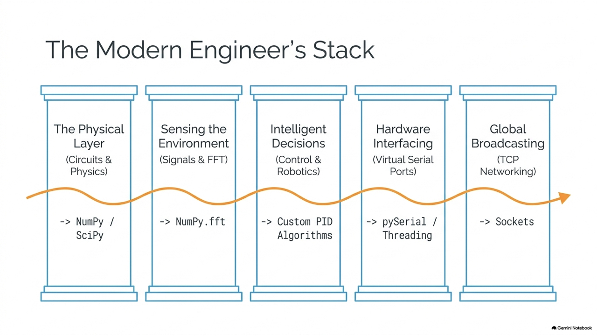
</div>

---

# 8.1 科學運算與電路求解 (NumPy / SciPy)

* **網目電流法 (Mesh Analysis)**：
  - 將基爾霍夫電壓定律 (KVL) 表示為線性方程組：$A \cdot I = B$。
  - 使用 `numpy.linalg.solve(A, B)` 高效求解。
* **二階 RLC 電路動態模擬**：
  - 將二階常微分方程 (ODE) 轉為一階狀態方程組。
  - 使用 `scipy.integrate.solve_ivp` 對電阻-電感-電容迴路進行數值解模擬。

---

<!-- _class: full-image-slide -->

<div class="centered-image">
  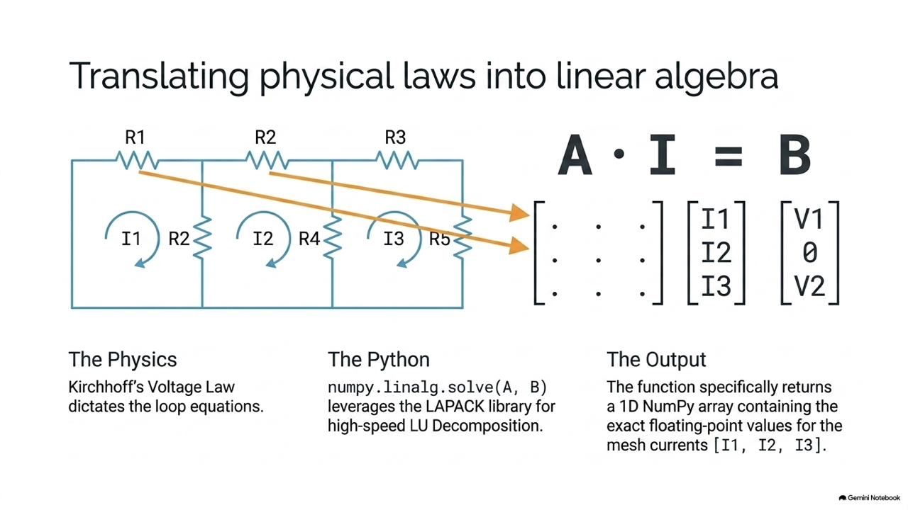
</div>

---

## 網目電流矩陣求解程式碼

```python
import numpy as np

# 電阻 (Ohm) 與電源 (V) 定義
R1, R2, R3, R4, R5 = 5, 10, 15, 20, 25
V1, V2 = 24, 12

# 網目方程式阻抗矩陣 A 與電壓矩陣 B
A = np.array([
    [R1 + R2, -R2, 0],
    [-R2, R2 + R3 + R4, -R4],
    [0, -R4, R4 + R5]
])
B = np.array([V1, 0, -V2])

# 求解網目電流 [I1, I2, I3]
I = np.linalg.solve(A, B)
print(f"I1={I[0]:.3f}A, I2={I[1]:.3f}A, I3={I[2]:.3f}A")
```

---

<!-- _class: full-image-slide -->

<div class="centered-image">
  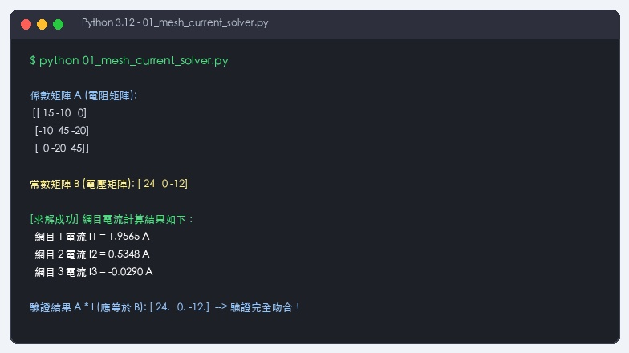
</div>

---

<!-- _class: full-image-slide -->

<div class="centered-image">
  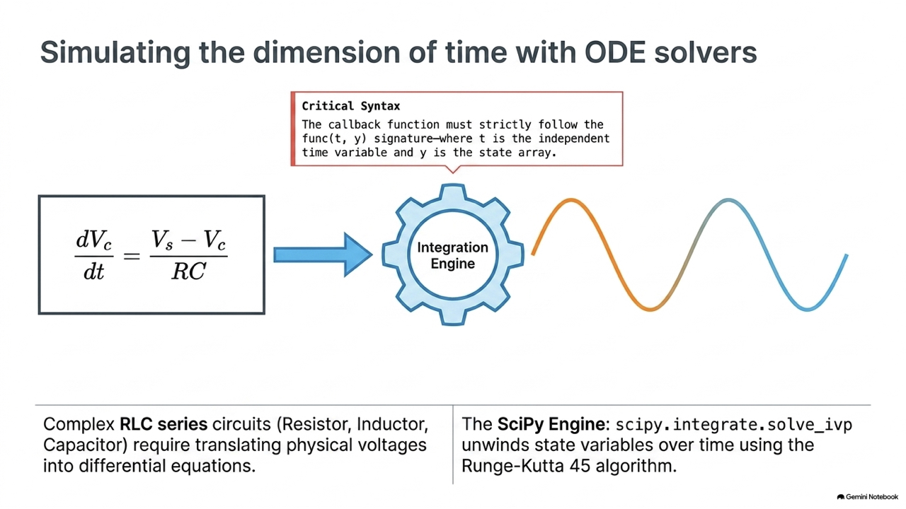
</div>

---

## RLC 暫態響應常微分方程求解 (solve_ivp)

```python
import numpy as np
from scipy.integrate import solve_ivp

R, L, C, Vs = 50.0, 0.1, 100e-6, 10.0 # 元件參數
RC = R * C

# y[0] 為電容電壓 Vc, y[1] 為迴路電流 IL
def rlc_ode(t, y):
    Vc, IL = y[0], y[1]
    return [IL / C, (Vs - R * IL - Vc) / L]

t_span = (0, 0.05)
initial_state = [0.0, 0.0] # 初始狀態無電壓、無電流

sol = solve_ivp(rlc_ode, t_span, initial_state, t_eval=np.linspace(0, 0.05, 500))
# sol.t 包含時間序列，sol.y[0] 包含電容充電電壓軌跡
```

---

<!-- _class: full-image-slide -->

<div class="centered-image">
  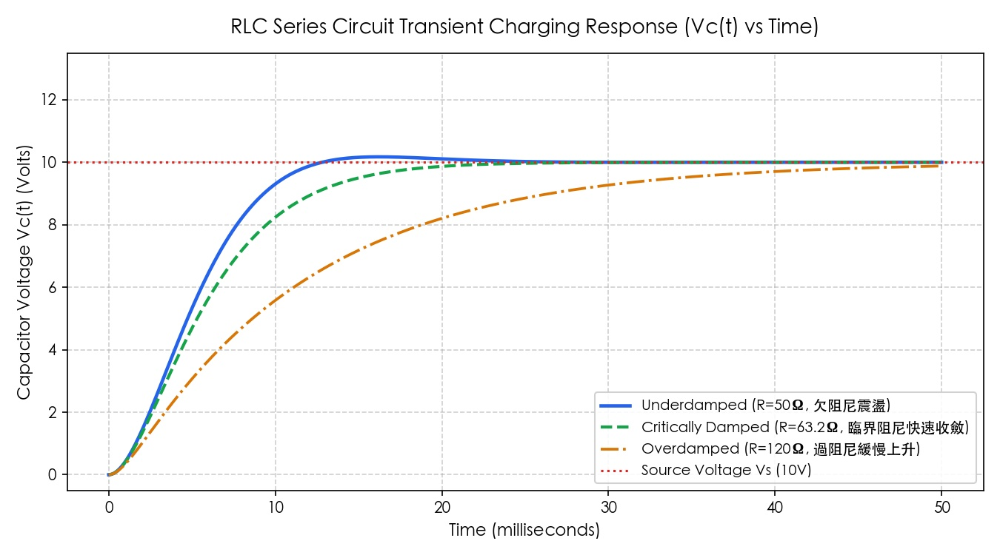
</div>

---

## Concept Check Question (CCQ 1)

<div class="ccq-columns">
  <div class="ccq-text">

**給定下列電路求解程式碼片段：**
```python
R_matrix = np.array([[8, -3], [-3, 12]])
V_matrix = np.array([5, 0])
I = np.linalg.solve(R_matrix, V_matrix)
```
**下列關於 `I` 變數的敘述，何者正確？**

* **A.** `I` 是一個逆矩陣物件，可用 `I.apply()`
* **B.** `I` 是一個含有兩個元素的一維 NumPy 陣列
* **C.** `I` 包含了 `R_matrix` 的特徵向量
* **D.** 若 `R_matrix` 的行列式值為 0，此程式仍可順利執行並回傳全 0

  </div>
  <div class="ccq-logo">
    
  </div>
</div>

---

## CCQ 1 - 答案與解析

<div class="ccq-columns">
  <div class="ccq-text">

### **正確答案：B. `I` 是一個含有兩個元素的一維 NumPy 陣列**

* **解析**：
  - `np.linalg.solve` 解線性聯立方程式，回傳結果為包含未知變數解的一維 Array。
  - 當係數矩陣行列式值為 0 (奇異矩陣) 時，表示方程式無解或無限多組解，此時呼叫此函數會拋出 `LinAlgError`，而非回傳全 0。

  </div>
  <div class="ccq-logo">
    
  </div>
</div>

---

## Concept Check Question (CCQ 2)

<div class="ccq-columns">
  <div class="ccq-text">

**使用 `scipy.integrate.solve_ivp` 求解暫態電壓隨時間變化時，我們需要傳入微分方程函數。下列何者為正確的函數參數宣告？**

* **A.** `def rc_ode(Vc, t):`
* **B.** `def rc_ode(t, Vc):`
* **C.** `def rc_ode(t, y, dt):`
* **D.** `def rc_ode(y, t):`

  </div>
  <div class="ccq-logo">
    
  </div>
</div>

---

## CCQ 2 - 答案與解析

<div class="ccq-columns">
  <div class="ccq-text">

### **正確答案：B. `def rc_ode(t, Vc):`**

* **解析**：
  - `solve_ivp` 要求傳入的常微分方程式回呼函數，其第一引數必須是時間自變數 `t`，第二引數為狀態變數或向量 `y`（如電容電壓 `Vc`），即符合 `f(t, y)` 形式。
  - 選項 A 與 D 參數順序相反，會導致 runtime 與計算結果錯誤。

  </div>
  <div class="ccq-logo">
    
  </div>
</div>

---

# 8.2 訊號處理與頻域分析 (Signal Processing & FFT)

* **時域 (Time Domain) vs 頻域 (Frequency Domain)**：
  - 時域訊號受高頻雜訊干擾時，肉眼難以直接看出其組成。
  - 傅立葉變換將訊號在不同頻率的分量展開。
* **快速傅立葉變換 (FFT)**：
  - 使用 `numpy.fft.fft()` 進行數值快速傅立葉轉換。
  - 可以完美擷取混雜了白雜訊中的特定頻率正弦波峰值。

---

<!-- _class: full-image-slide -->

<div class="centered-image">
  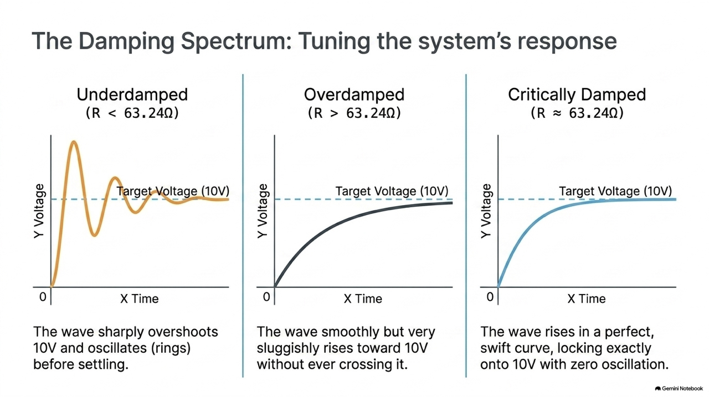
</div>

---

## 快速傅立葉變換 (FFT) 程式碼

```python
import numpy as np

sampling_rate = 1000 # 採樣率 1000Hz
t = np.linspace(0, 1.0, sampling_rate, endpoint=False)

# 合成信號: 50Hz + 120Hz + 高斯白噪音
noisy_signal = np.sin(2 * np.pi * 50 * t) + 0.5 * np.sin(2 * np.pi * 120 * t) + np.random.normal(0, 1.5, len(t))

# 快速傅立葉變換
n = len(t)
fft_result = np.fft.fft(noisy_signal)
fft_freq = np.fft.fftfreq(n, 1 / sampling_rate)

# 取正頻率部分與振幅大小
half_n = n // 2
frequencies = fft_freq[:half_n]
amplitude = np.abs(fft_result[:half_n]) * 2 / n
```

---

<!-- _class: full-image-slide -->

<div class="centered-image">
  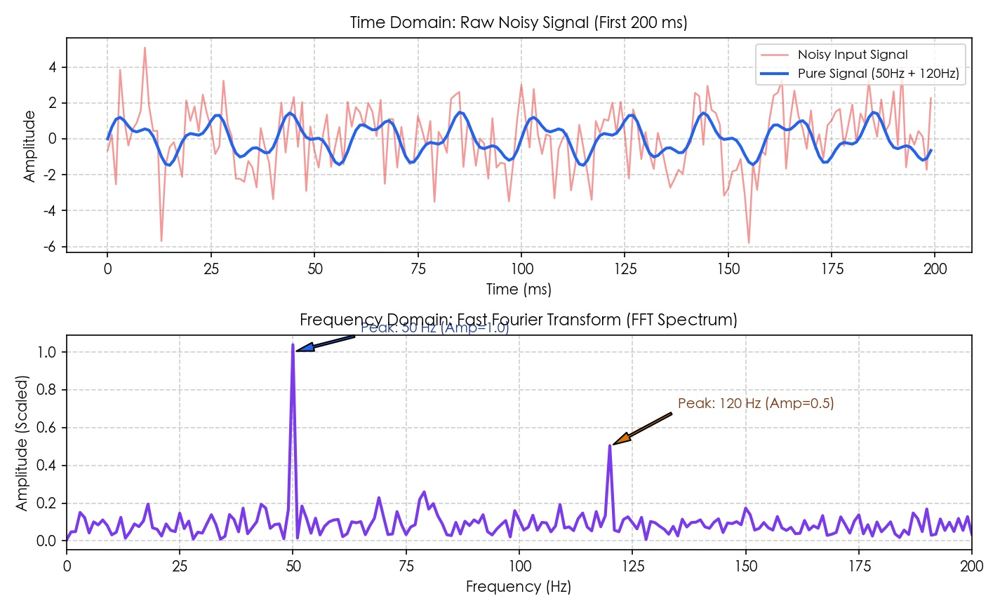
</div>

---

# 8.3 自動控制與機械手臂運動學 (Control & Robotics)

* **自動控制與 PID 閉迴路系統**：
  - **比例 (P)**：與誤差成比例，提供基礎控制力。
  - **積分 (I)**：累積歷史誤差，用以消除「穩態誤差」。
  - **微分 (D)**：感應誤差變化率，抑制系統震盪。
* **機械手臂運動學 (Kinematics)**：
  - **正向運動學**：給定角度 $\theta_1, \theta_2 \rightarrow$ 求末端平面座標 $(x, y)$。
  - **逆向運動學**：給定末端座標 $(x, y) \rightarrow$ 利用餘弦定理求解角度。

---

<!-- _class: full-image-slide -->

<div class="centered-image">
  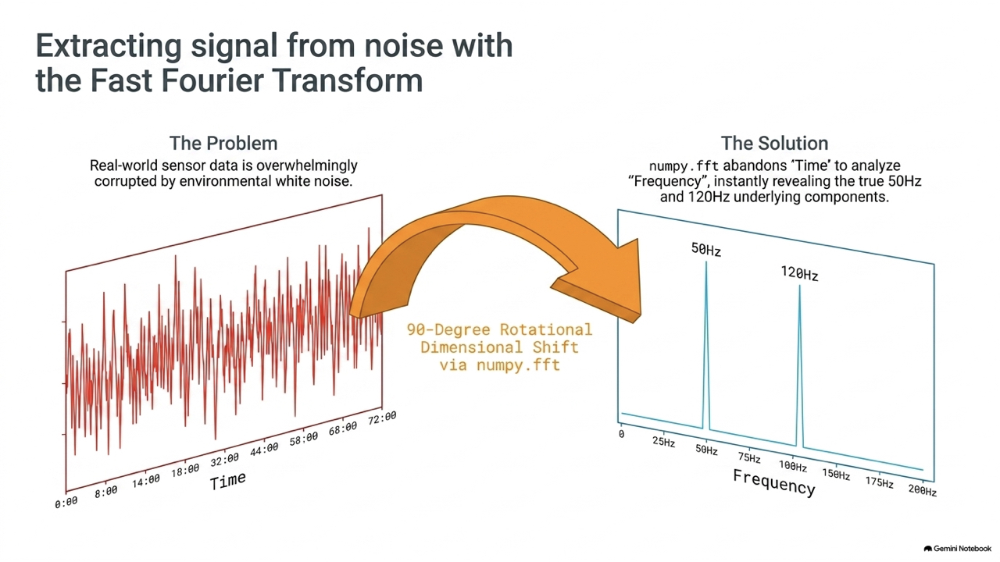
</div>

---

## 實作物件導向 PID 控制器

```python
class PIDController:
    def __init__(self, Kp, Ki, Kd, setpoint):
        self.Kp, self.Ki, self.Kd = Kp, Ki, Kd
        self.setpoint = setpoint
        self.prev_error = 0.0
        self.integral = 0.0

    def update(self, current_value, dt):
        error = self.setpoint - current_value
        
        # P 項、I 項與 D 項計算
        P_out = self.Kp * error
        self.integral += error * dt
        I_out = self.Ki * self.integral
        derivative = (error - self.prev_error) / dt if dt > 0 else 0.0
        D_out = self.Kd * derivative
        
        self.prev_error = error
        return P_out + I_out + D_out
```

---

<!-- _class: full-image-slide -->

<div class="centered-image">
  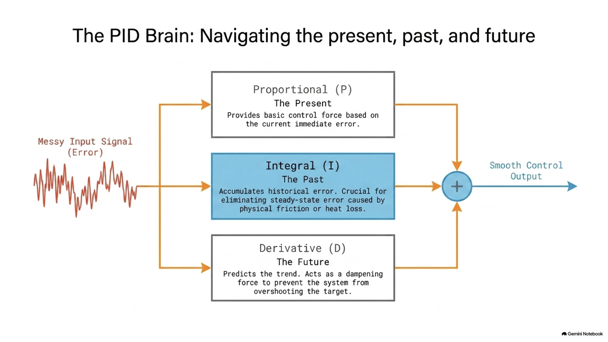
</div>

---

<!-- _class: full-image-slide -->

<div class="centered-image">
  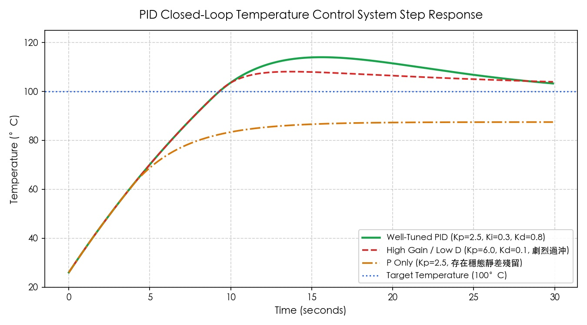
</div>

---

<!-- _class: full-image-slide -->

<div class="centered-image">
  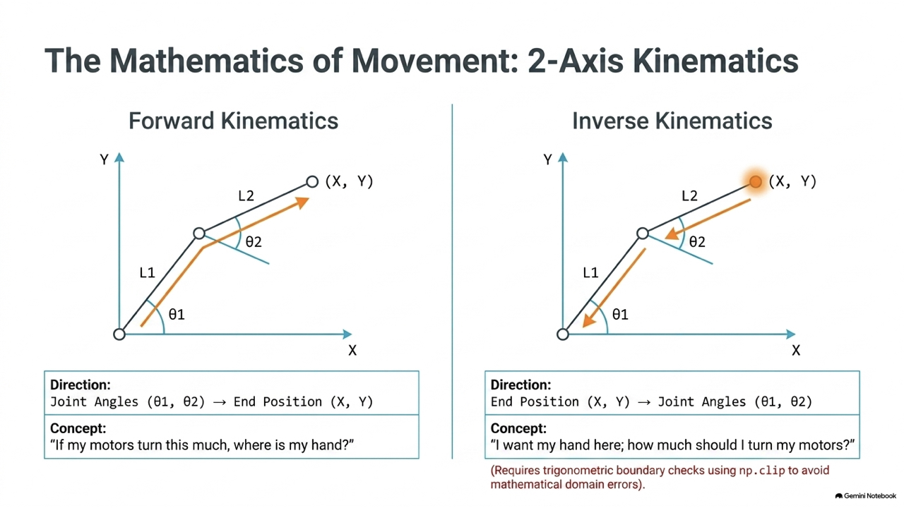
</div>

---

## 平面二軸手臂逆向運動學解法

```python
class RoboticArm2R:
    def __init__(self, L1, L2):
        self.L1, self.L2 = L1, L2

    def inverse_kinematics(self, x, y):
        # 餘弦定理求 theta2
        r_sq = x**2 + y**2
        cos_theta2 = (r_sq - self.L1**2 - self.L2**2) / (2 * self.L1 * self.L2)
        cos_theta2 = np.clip(cos_theta2, -1.0, 1.0)
        theta2 = np.arccos(cos_theta2) # 弧度解
        
        # 三角函數求 theta1
        alpha = np.arctan2(y, x)
        beta = np.arctan2(self.L2 * np.sin(theta2), self.L1 + self.L2 * np.cos(theta2))
        theta1 = alpha - beta
        
        return theta1, theta2
```

---

<!-- _class: full-image-slide -->

<div class="centered-image">
  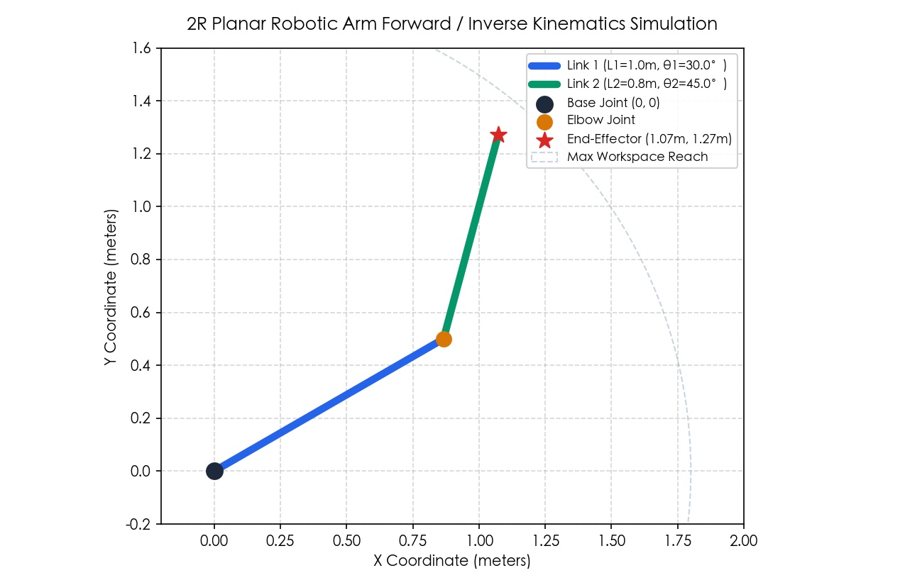
</div>

---

## Concept Check Question (CCQ 3)

<div class="ccq-columns">
  <div class="ccq-text">

**在閉迴路溫控系統的 PID 控制器實作中，我們常發現系統已經運作了很久，但實際溫度始終與目標溫度差了 2°C (穩態誤差)。此時我們應優先調大哪一個參數？**

* **A.** 比例增益 (Kp)
* **B.** 微分增益 (Kd)
* **C.** 積分增益 (Ki)
* **D.** 取樣時間常數 (dt)

  </div>
  <div class="ccq-logo">
    
  </div>
</div>

---

## CCQ 3 - 答案與解析

<div class="ccq-columns">
  <div class="ccq-text">

### **正確答案：C. 積分增益 (Ki)**

* **解析**：
  - 穩態誤差是由於比例項輸出力量太小，剛好與外界阻力/散熱抵銷所產生的靜態誤差。
  - **積分項 (Ki)** 會隨時間持續累計誤差數值，並逐步放大控制輸出，直到誤差完全被消除為止。因此優先調升 Ki，故選 C。

  </div>
  <div class="ccq-logo">
    
  </div>
</div>

---

# 8.4 虛擬序列埠與實體硬體互動 (pySerial)

* **微控制器硬體通訊**：
  - 外部晶片藉由 USB 串口發送數據字串，以換行符 `\n` 作為結束符。
* **pySerial 套件**：
  - 提供 `serial.Serial(port, baudrate)` 連線實體 COM Port。
* **虛擬串流測試與多執行緒**：
  - 如果沒有硬體，可用 `threading.Thread` 與 `queue.Queue` 在背景模擬持續送出的串口數據流，便於電腦端程式進行接收除錯。

---

<!-- _class: full-image-slide -->

<div class="centered-image">
  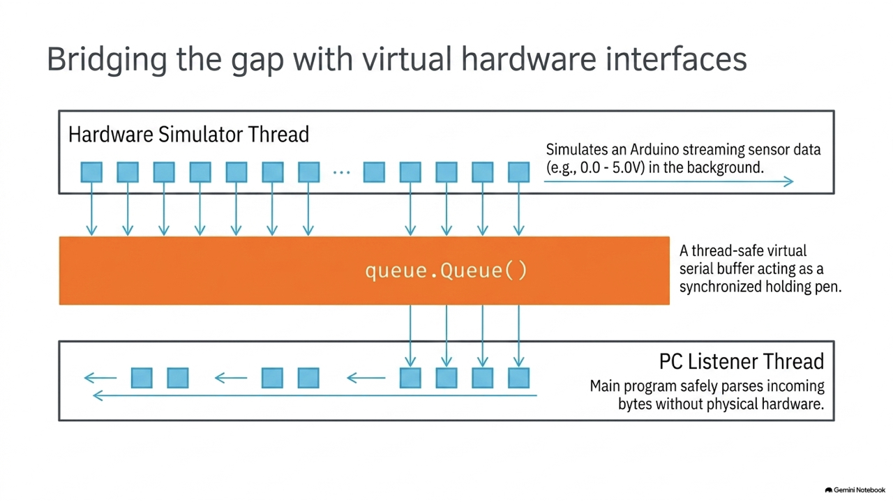
</div>

---

<!-- _class: full-image-slide -->

<div class="centered-image">
  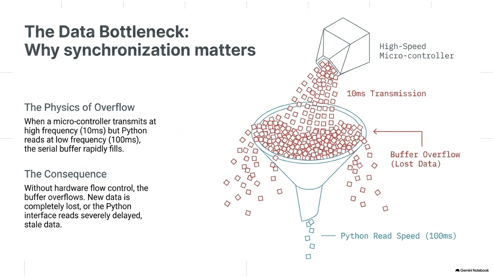
</div>

---

<!-- _class: full-image-slide -->

<div class="centered-image">
  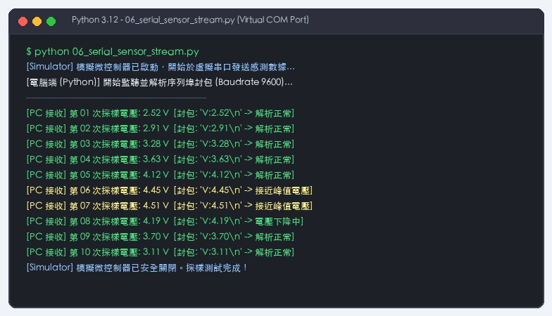
</div>

---

## Concept Check Question (CCQ 4)

<div class="ccq-columns">
  <div class="ccq-text">

**若硬體發送序列埠資料的週期是 10ms，而 Python 每 100ms 才呼叫一次 `readline()`，且未配置 Flow Control。這會導致什麼後果？**

* **A.** Python 程式運算效能會提高十倍
* **B.** 接收端的緩衝區 (Buffer) 會發生溢位，資料會大量遺失或產生延遲亂碼
* **C.** 訊號在傳輸線上會被自動平均成低通濾波值
* **D.** Python 直譯器會傳送指令強制降低晶片的發送頻率

  </div>
  <div class="ccq-logo">
    
  </div>
</div>

---

## CCQ 4 - 答案與解析

<div class="ccq-columns">
  <div class="ccq-text">

### **正確答案：B. 接收端的緩衝區 (Buffer) 會發生溢位，資料會大量遺失或產生延遲亂碼**

* **解析**：
  - 序列晶片的軟硬體緩衝區大小是有限的。
  - 當發送端（寫入速度）大於接收端（讀取速度），緩衝區會被塞滿。新數據會被直接拋棄，或者 Python 讀取到的都是很久之前的舊資料，造成資料的嚴重延遲。

  </div>
  <div class="ccq-logo">
    
  </div>
</div>

---

# 8.5 網路通訊與 Socket 程式 (TCP Networking)

* **TCP (Transmission Control Protocol)**：
  - 物聯網與網路最基礎之傳輸層協定。
  - 提供可靠、有連線導向、雙向傳輸的串流服務。
* **Socket 機制與多連接埠**：
  - Server 先進行 `bind()` 綁定與 `listen()` 監聽。
  - 當新用戶端連線時，伺服器在 `accept()` 獲得新 Socket。
  - 為了防止多個用戶端互相阻塞，必須為每一條連線開闢獨立的執行緒背景處理。

---

<!-- _class: full-image-slide -->

<div class="centered-image">
  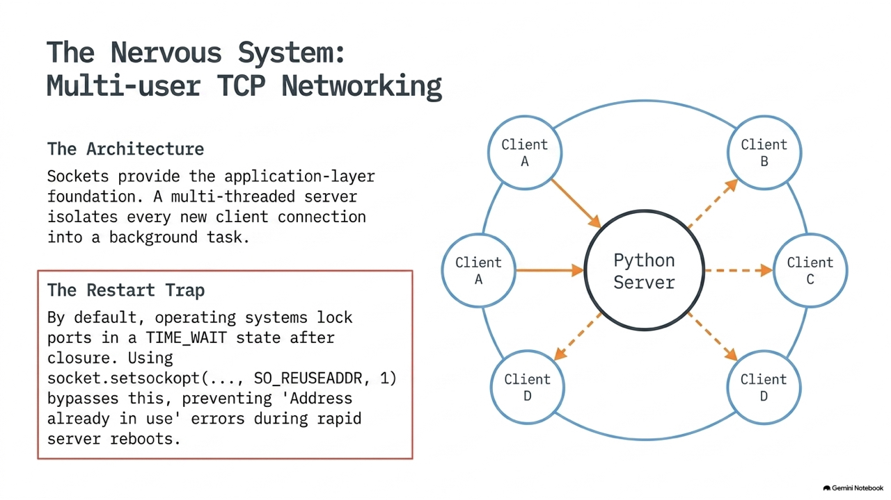
</div>

---

<!-- _class: full-image-slide -->

<div class="centered-image">
  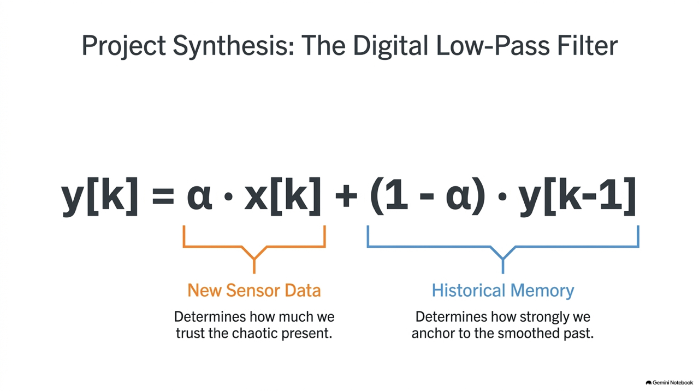
</div>

---

<!-- _class: full-image-slide -->

<div class="centered-image">
  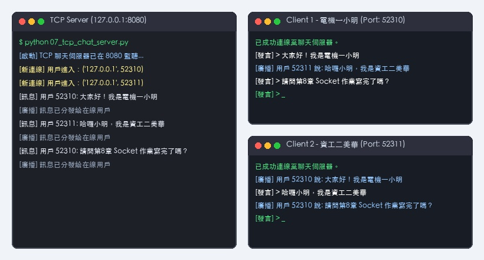
</div>

---

## Concept Check Question (CCQ 5)

<div class="ccq-columns">
  <div class="ccq-text">

**在開發 TCP 伺服器時，常在 bind 之前加入以下配置：**
```python
server_socket.setsockopt(socket.SOL_SOCKET, 
                         socket.SO_REUSEADDR, 1)
```
**此設定的主要作用為何？**

* **A.** 限制外部用戶端在同一時間點的連線數量
* **B.** 加密傳輸通道防止網路竊聽
* **C.** 允許伺服器關閉重啟後，立即重新 bind 原埠號，免受 TIME_WAIT 保留期限制
* **D.** 將傳輸協定強制提升為 UDP 封包形式

  </div>
  <div class="ccq-logo">
    
  </div>
</div>

---

## CCQ 5 - 答案與解析

<div class="ccq-columns">
  <div class="ccq-text">

### **正確答案：C. 允許伺服器關閉重啟後，立即重新 bind 原埠號，免受 TIME_WAIT 保留期限制**

* **解析**：
  - TCP 連線終止後，連接埠會在作業系統內部保留在 TIME_WAIT 狀態數分鐘，防堵網路殘存封包。
  - 此時重新 bind 同一埠號會拋出 Address already in use 錯誤。
  - 配置 `SO_REUSEADDR` 能允許重用埠號，大幅方便程式除錯，故選 C。

  </div>
  <div class="ccq-logo">
    
  </div>
</div>

---

# 8.6 本章綜合工程實作專題 (Digital LPF)

* **數位濾波器 (Digital Filter)**：
  - 排除感測器在傳輸過程中的高頻波動，保留核心物理訊號。
* **一階數位低通濾波器差分方程**：
  - 運算方程式：$y[k] = \alpha \cdot x[k] + (1 - \alpha) \cdot y[k-1]$。
  - 其中 $\alpha$ 介於 0 與 1 之間。
  - $\alpha$ 越小，抗噪效果越強，但也會伴隨較大的時間延遲。

---

<!-- _class: full-image-slide -->

<div class="centered-image">
  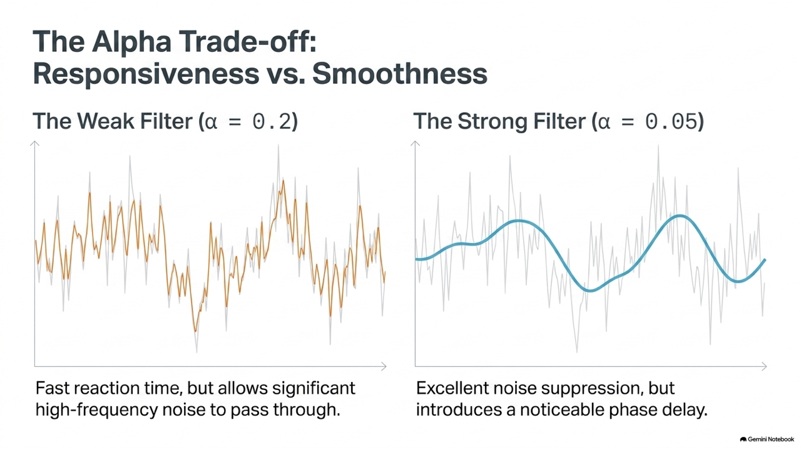
</div>

---

<!-- _class: full-image-slide -->

<div class="centered-image">
  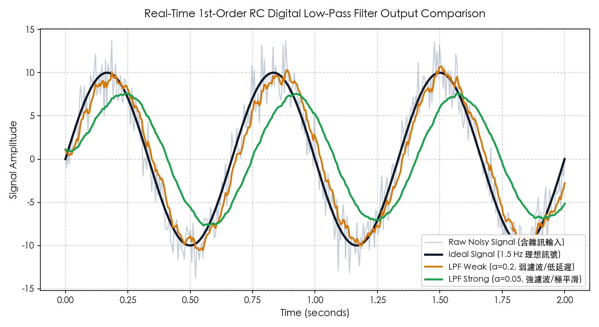
</div>

---

<!-- _class: full-image-slide -->

<div class="centered-image">
  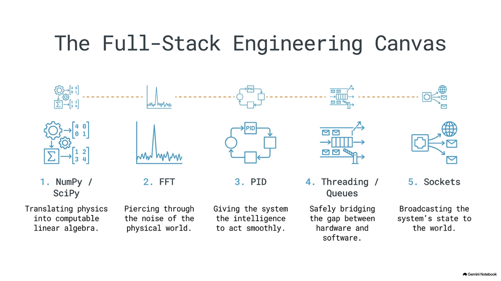
</div>
