# Python 機器學習入門

### 第九章：Scikit-Learn 與機器學習基礎專題

講師：Python 程式設計教學團隊

---

<!-- _class: full-image-slide -->

<div class="centered-image">
  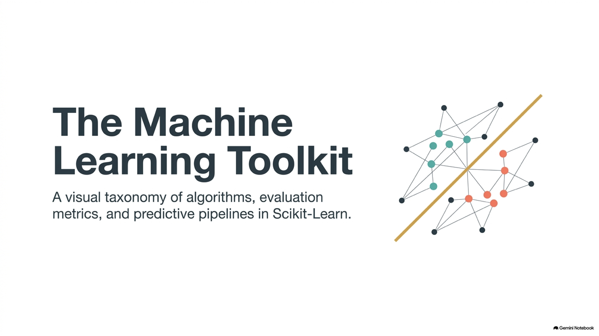
</div>

---

# 9.1 機器學習基礎觀念

* **AI vs ML vs DL**：
  - **AI** (人工智慧)：模擬人類智慧。
  - **ML** (機器學習)：從歷史數據中「自我學習」規律。
  - **DL** (深度學習)：利用多層神經網路處理複雜非線性結構。
* **監督式學習 (Supervised)**：
  - 有給定標籤。如：**分類**（預測類別）與**迴歸**（預測數值）。
* **非監督式學習 (Unsupervised)**：
  - 無給定標籤。如：**分群**。

---

<!-- _class: full-image-slide -->

<div class="centered-image">
  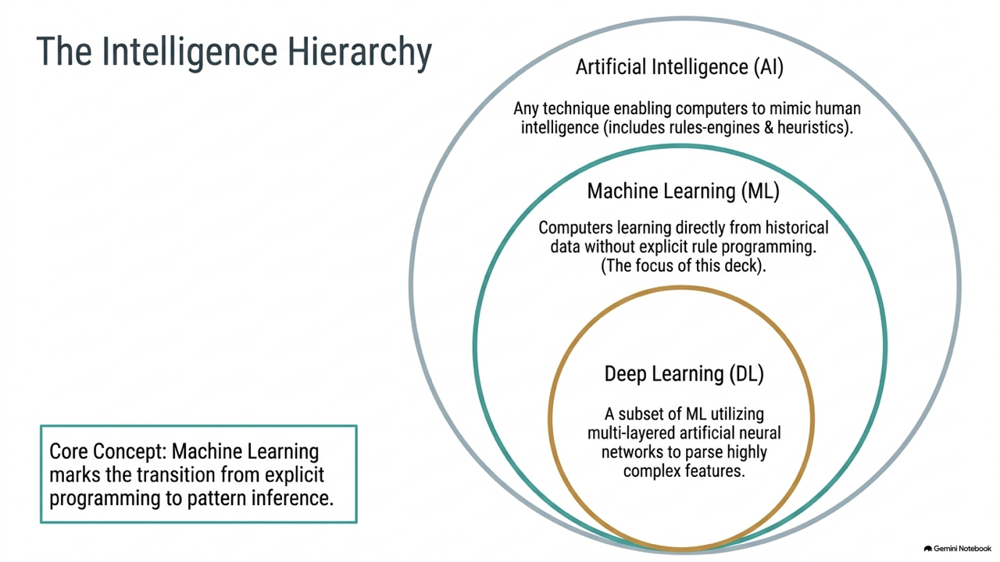
</div>

---

<!-- _class: full-image-slide -->

<div class="centered-image">
  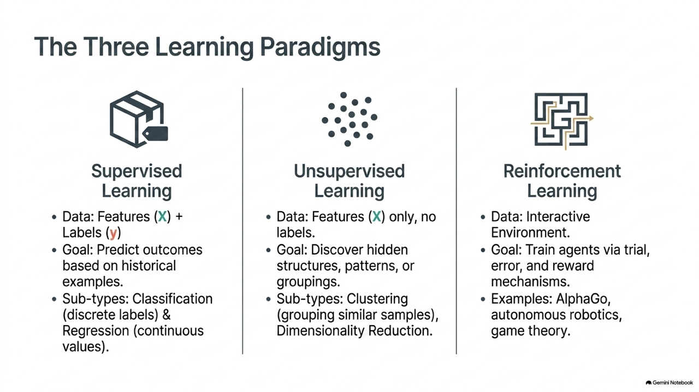
</div>

---

# 9.2 監督式學習：分類任務與超參數調校

* **K-近鄰演算法 (KNN)**：
  - 依據最近的 $K$ 個鄰居的多數決決定類別。
  - 核心數學：歐氏距離與曼哈頓距離。
* **決策樹 (Decision Tree)**：
  - 利用「二分問答」將資料分類，追求最純淨分割。
  - 核心指標：吉尼不純度 (Gini Impurity)。
* **隨機森林 (Random Forest)**：
  - 集成學習。利用 Bagging 與特徵隨機選擇，統合多個決策樹降低過擬合。

---

<!-- _class: full-image-slide -->

<div class="centered-image">
  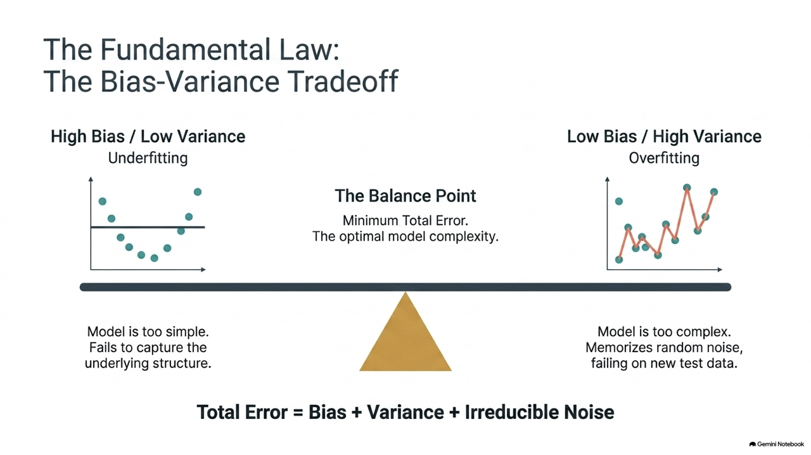
</div>

---

<!-- _class: full-image-slide -->

<div class="centered-image">
  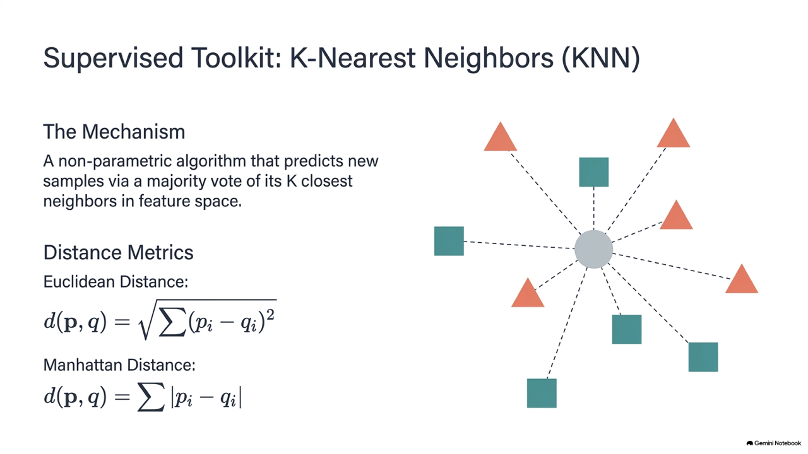
</div>

---

<!-- _class: full-image-slide -->

<div class="centered-image">
  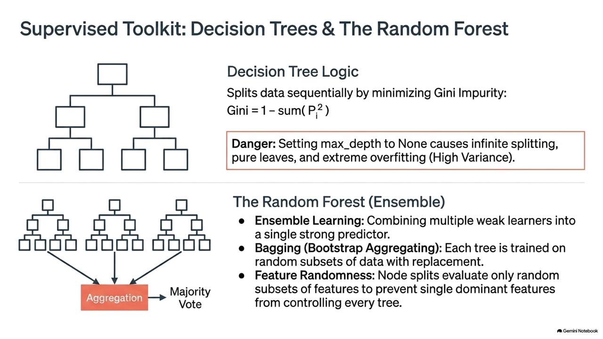
</div>

---

<!-- _class: full-image-slide -->

<div class="centered-image">
  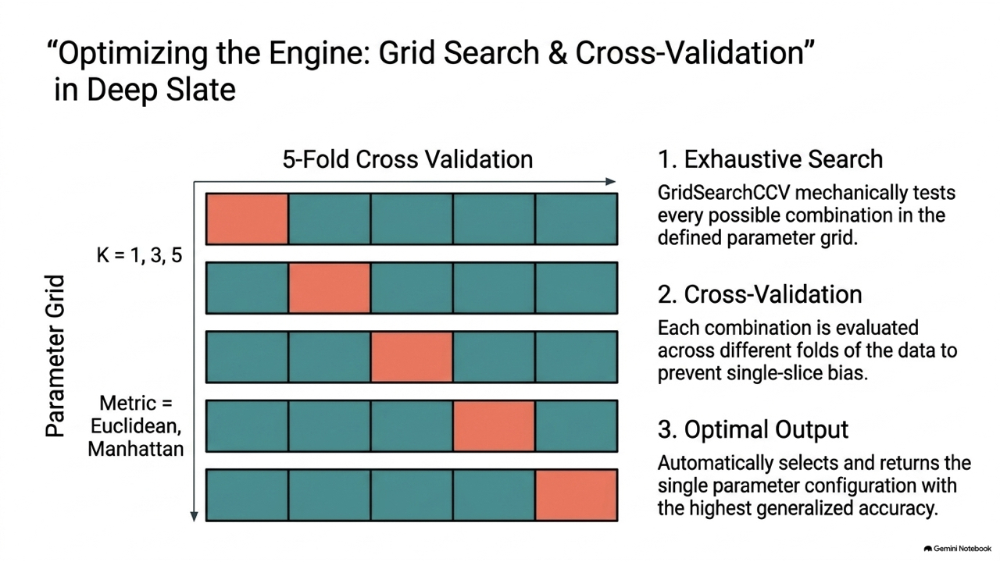
</div>

---

## 網格搜尋參數調優與交叉驗證代碼

```python
from sklearn.model_selection import GridSearchCV
from sklearn.neighbors import KNeighborsClassifier

# 設定搜尋超參數網格
knn_param_grid = {
    'n_neighbors': [1, 3, 5, 7, 9],
    'weights': ['uniform', 'distance'],
    'metric': ['euclidean', 'manhattan']
}

# 5-fold 交叉驗證網格搜尋
grid_search = GridSearchCV(KNeighborsClassifier(), knn_param_grid, cv=5, scoring='accuracy')
grid_search.fit(X_train, y_train)

print(f"最佳參數組合：{grid_search.best_params_}")
print(f"交叉驗證最佳精度：{grid_search.best_score_:.4f}")
```

---

## Concept Check Question (CCQ 1)

<div class="ccq-columns">
  <div class="ccq-text">

**在機器學習中，使用 `GridSearchCV` 進行「超參數網格搜尋與交叉驗證」的主要目的為何？**

* **A.** 為了加速模型訓練的速度，避免使用 CPU
* **B.** 自動在各種參數組合中，找出最能防止過擬合且泛化能力最佳的參數設定
* **C.** 為了將無標籤的資料集進行自動分群
* **D.** 將特徵維度進行降維以利於繪圖

  </div>
  <div class="ccq-logo">
    
  </div>
</div>

---

## CCQ 1 - 答案與解析

<div class="ccq-columns">
  <div class="ccq-text">

### **正確答案：B. 自動在各種參數組合中，找出最能防止過擬合且泛化能力最佳的參數設定**

* **解析**：
  - `GridSearchCV` 採用窮舉法測試網格內的參數，配合 $K$-折交叉驗證以防範單次切分所產生的預測偏誤，進而決定出泛化效能最好的超參數，故選 B。

  </div>
  <div class="ccq-logo">
    
  </div>
</div>

---

## Concept Check Question (CCQ 2)

<div class="ccq-columns">
  <div class="ccq-text">

**當決策樹（Decision Tree）的 `max_depth` (最大深度) 參數設定為 `None`（不限制深度）時，模型最易面臨什麼風險？**

* **A.** 模型會因為結構過於簡單而產生欠擬合 (Underfitting)
* **B.** 決策樹會無法進行多類別分類
* **C.** 決策樹會過度分裂，極易產生過擬合 (Overfitting) 並喪失泛化能力
* **D.** 程式會因為死迴圈而當機

  </div>
  <div class="ccq-logo">
    
  </div>
</div>

---

## CCQ 2 - 答案與解析

<div class="ccq-columns">
  <div class="ccq-text">

### **正確答案：C. 決策樹會過度分裂，極易產生過擬合 (Overfitting) 並喪失泛化能力**

* **解析**：
  - 不設最大深度的樹會一直分裂到所有葉節點都只包含單一類別（即 100% 純淨），這會使其記住訓練集中微小的隨機噪聲，降低新樣本預測能力。
  - 通常需要透過限制樹深度（Pre-pruning）來做正規化，故選 C。

  </div>
  <div class="ccq-logo">
    
  </div>
</div>

---

# 9.3 監督式學習：迴歸任務與評估指標

* **多元線性迴歸 (OLS)**：
  - 藉由多項特徵求解預測值：$\hat{y} = w_1 x_1 + w_2 x_2 + w_3 x_3 + b$。
  - 核心算法為最小平方法，旨在最小化殘差平方和。
* **L1 & L2 正規化 (Regularization)**：
  - **脊迴歸 (Ridge / L2)**：加上權重平方懲罰項，均勻縮小所有權重。
  - **套索迴歸 (Lasso / L1)**：加上權重絕對值懲罰，強制將不重要權重歸 0。
* **評估指標**：
  - MAE (直觀平均誤差)、MSE (加重懲罰大誤差) 與 $R^2$ Score (解釋度)。

---

<!-- _class: full-image-slide -->

<div class="centered-image">
  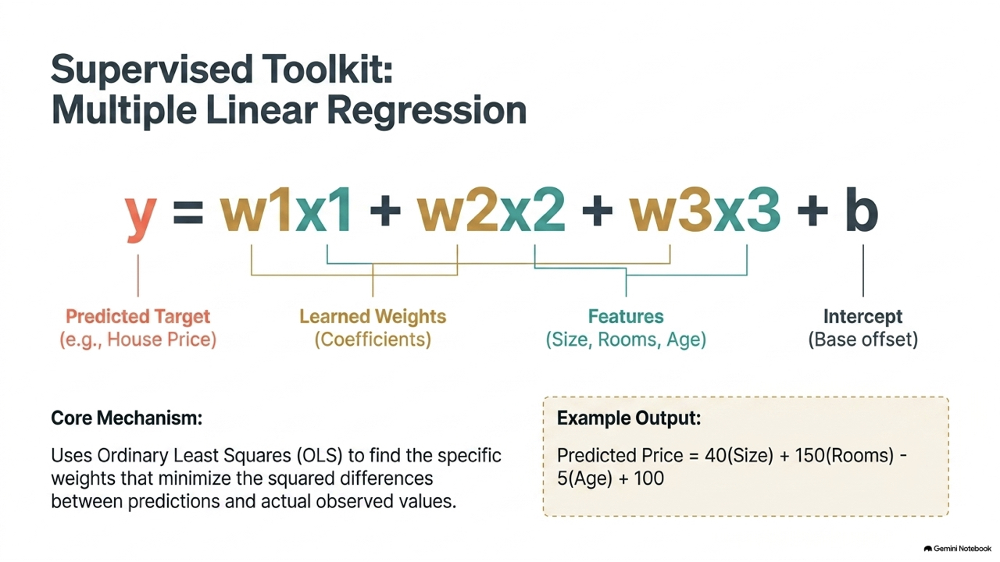
</div>

---

<!-- _class: full-image-slide -->

<div class="centered-image">
  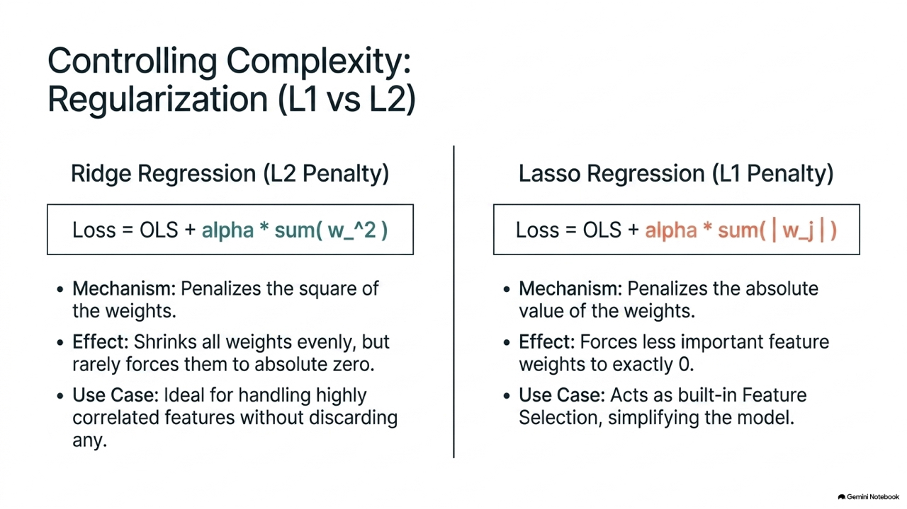
</div>

---

<!-- _class: full-image-slide -->

<div class="centered-image">
  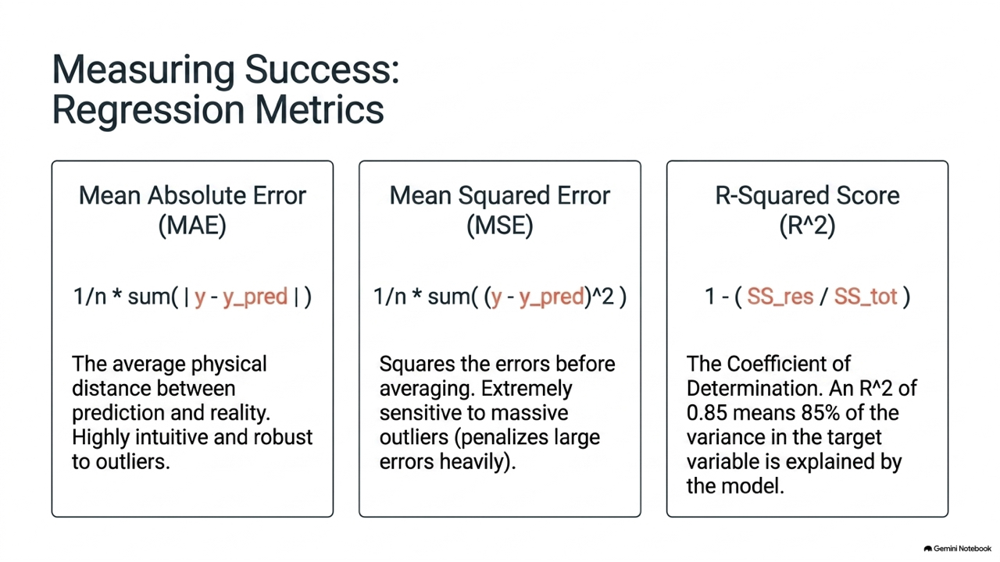
</div>

---

## Concept Check Question (CCQ 3)

<div class="ccq-columns">
  <div class="ccq-text">

**在評估迴歸預測模型效能時，若我們算出模型的決定係數 $R^2$ 值為 `0.85`，這代表什麼工程含義？**

* **A.** 該模型預測對了 85% 的數值，剩下的 15% 數值預測錯誤
* **B.** 該模型所預測的值比真實值平均貴了 85 單位
* **C.** 自變數（特徵）能夠解釋因變數（標籤）中 85% 的變異量
* **D.** 模型有 85% 的機率會產生過擬合

  </div>
  <div class="ccq-logo">
    
  </div>
</div>

---

## CCQ 3 - 答案與解析

<div class="ccq-columns">
  <div class="ccq-text">

### **正確答案：C. 自變數（特徵）能夠解釋因變數（標籤）中 85% 的變異量**

* **解析**：
  - $R^2$ (決定係數) 反映模型相對於平均基準預測的解釋力。
  - $0.85$ 代表 85% 的變異已包含於迴歸曲線中。$R^2$ 越高代表模型擬合效果越好，故選 C。

  </div>
  <div class="ccq-logo">
    
  </div>
</div>

---

# 9.4 非監督式學習：K-Means 資料分群與肘部法

* **K-Means 聚類演算法**：
  - 重複計算群心並更新資料點分配，目標是最小化點至群心之距離和。
* **肘部法 (Elbow Method)**：
  - 計算不同 $K$ 值對應之 Inertia (群內誤差平方和)。
  - 在折線圖上手肘彎折的轉折點即為最合理的 $K$ 值選擇。
* **K-Means 限制**：
  - 必須預先指定分群數。
  - 假設資料呈現球狀圓形分佈。新月形或非均質密度資料分群建議採用 **DBSCAN**。

---

<!-- _class: full-image-slide -->

<div class="centered-image">
  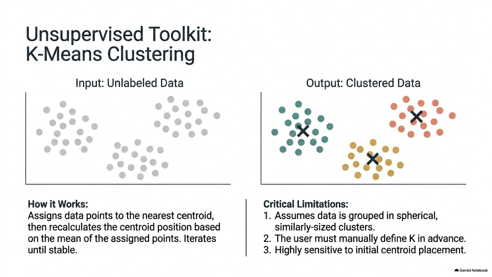
</div>

---

<!-- _class: full-image-slide -->

<div class="centered-image">
  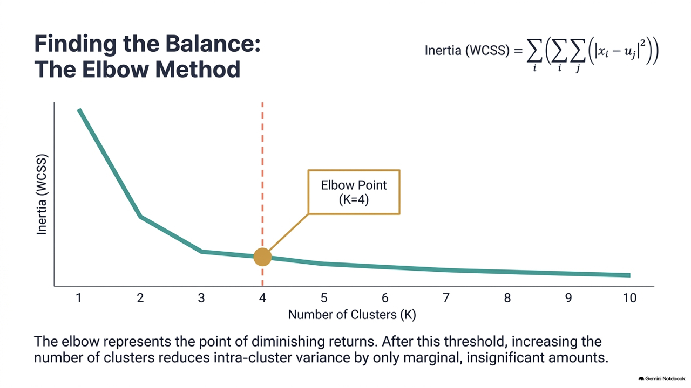
</div>

---

## Concept Check Question (CCQ 4)

<div class="ccq-columns">
  <div class="ccq-text">

**在實施 K-Means 分群時，使用「肘部法」尋找最佳分群數，下列何者正確？**

* **A.** 轉折點代表 Inertia 開始變為負值的地方
* **B.** 轉折點代表在此群數之後，增加群數所能降低的群內誤差和幅度明顯變小
* **C.** 轉折點代表分群準確度達到 100%
* **D.** 轉折點後的 K 值代表模型開始欠擬合

  </div>
  <div class="ccq-logo">
    
  </div>
</div>

---

## CCQ 4 - 答案與解析

<div class="ccq-columns">
  <div class="ccq-text">

### **正確答案：B. 轉折點代表在此群數之後，增加群數所能降低的群內誤差和幅度明顯變小**

* **解析**：
  - 在肘部彎曲之前，增加 $K$ 值能大幅縮小 Inertia ；彎折點之後，誤差縮減速度明顯放緩，此處為邊際效應最佳折衷點，故選 B。

  </div>
  <div class="ccq-logo">
    
  </div>
</div>

---

# 9.5 關鍵觀念與特徵工程 (Feature Engineering)

* **特徵縮放 (Feature Scaling)**：
  - **StandardScaler** (Z-Score)：縮放為平均 0、標準差 1。適用於距離型算法 (KNN, SVM) 與梯度下降法。
  - **MinMaxScaler**：壓縮至 0 ~ 1。
* **獨熱編碼 (One-Hot Encoding)**：
  - 用於將無順序關係的類別特徵轉換為二進位獨立向量。
  - 防止模型假設類別特徵具有大小數值大小偏見。

---

<!-- _class: full-image-slide -->

<div class="centered-image">
  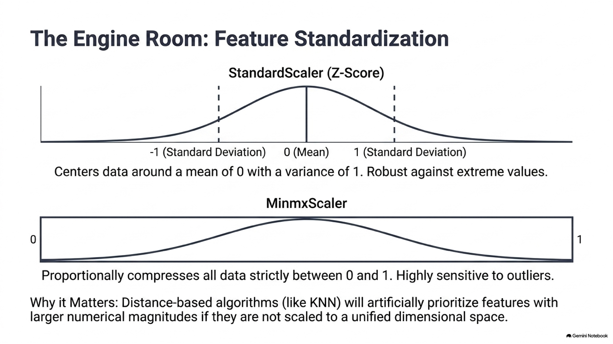
</div>

---

<!-- _class: full-image-slide -->

<div class="centered-image">
  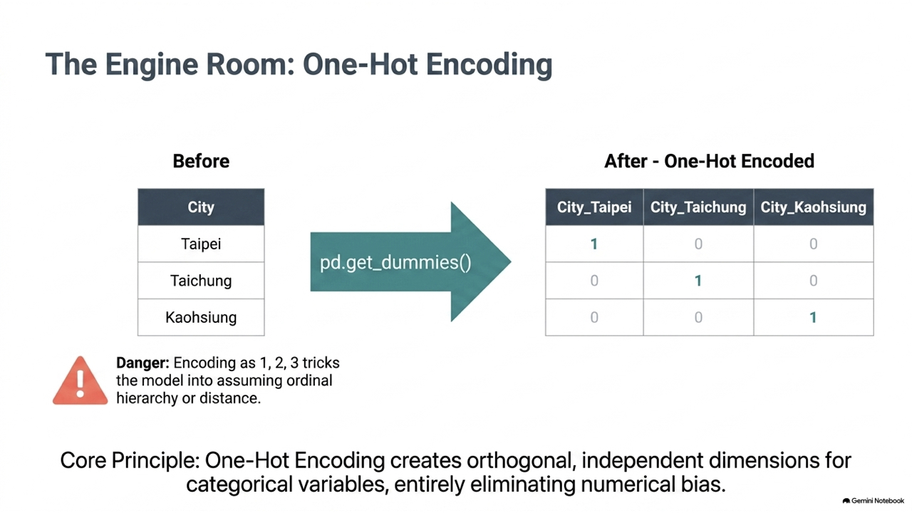
</div>

---

## Concept Check Question (CCQ 5)

<div class="ccq-columns">
  <div class="ccq-text">

**在處理無序「類別特徵（如科系、班級）」時，為什麼通常建議使用 One-Hot Encoding 而非直接數字對照（如電機=1, 機械=2）？**

* **A.** 因為 Scikit-Learn 的模型只支援 0 或 1 的輸入
* **B.** 避免模型錯誤地假設這些類別特徵之間存在數值順序或倍數關係
* **C.** One-Hot Encoding 可以自動刪除重複的特徵
* **D.** 整數對照編碼會佔用十倍以上的記憶體

  </div>
  <div class="ccq-logo">
    
  </div>
</div>

---

## CCQ 5 - 答案與解析

<div class="ccq-columns">
  <div class="ccq-text">

### **正確答案：B. 避免模型錯誤地假設這些類別特徵之間存在數值順序或倍數關係**

* **解析**：
  - 若寫入 $1, 2, 3$，模型會計算距離並假設科系可以進行數學加減運算。
  - One-Hot 編碼透過將各選項對應到獨立維度，使它們彼此正交，維持合理的類別間關係，故選 B。

  </div>
  <div class="ccq-logo">
    
  </div>
</div>

---

# 9.6 本章綜合實作專題

* **紅酒多重分類器任務**：
  - 使用 `StandardScaler` 標準化。
  - 建立 `DecisionTreeClassifier` 分類器。
  - 使用 `GridSearchCV` 進行 5 折交叉驗證。
  - 使用 `classification_report` 評估 Precision, Recall 與 F1-score。

---

<!-- _class: full-image-slide -->

<div class="centered-image">
  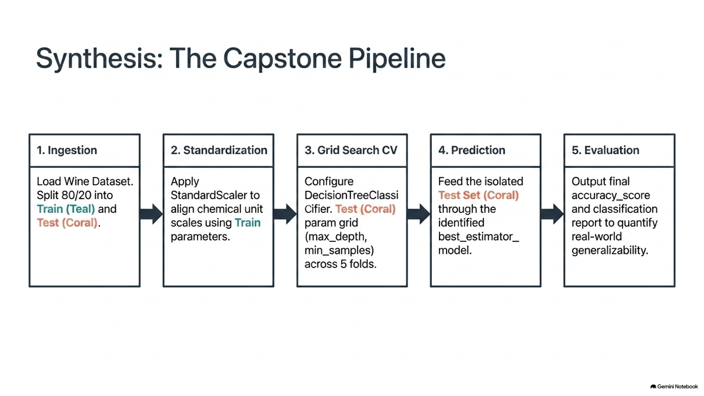
</div>
