Ch10 Artificial Intelligence & LLM Application
===

# Python 人工智慧與 LLM 應用

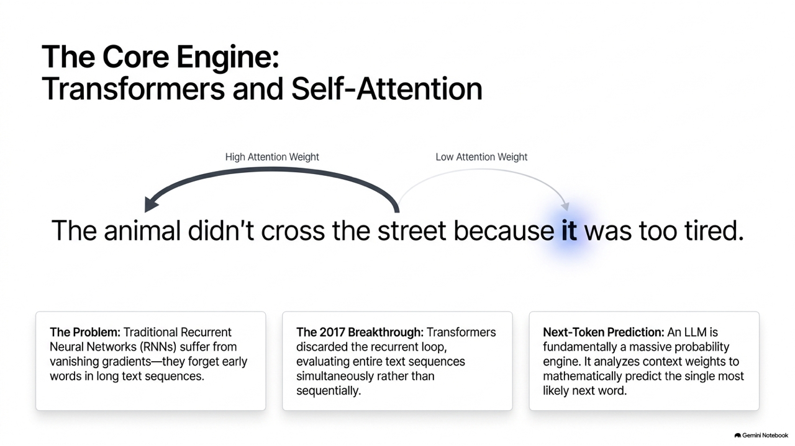

本章將引導你踏入生成式 AI (Generative AI) 與大型語言模型 (Large Language Models, LLM) 的應用開發領域。在今日的資電工程中，能夠串接 LLM API 並為現有軟硬體系統賦能，已成為開發者的必備技能。我們將探討 Transformer 的基礎原理，並使用最新版 Google Gemini API 實作各種進階應用，例如串流輸出、對話歷史管理、多模態影像分析、強格式 JSON 輸出、Function Calling 工具調用，以及檢索增強生成 (RAG) 的概念。

本章包含以下核心單元：
* **10.1 生成式 AI 與大型語言模型架構原理**：探討 Transformer、Self-Attention、Next-token Prediction 的核心概念，以及超參數（Temperature、Top-P、Top-K）對模型輸出隨機性的控制。
* **10.2 Google Gemini API 開發入門**：設定開發環境與 API Key，實作基礎文字生成、串流輸出 (Streaming Response) 與多輪對話歷史 (Chat Session)。
* **10.3 進階開發技巧與 API 串接**：利用 Multimodality 進行圖片影像描述、使用 JSON Mode 強制生成結構化資料，並實作 Function Calling（工具調用）。
* **10.4 檢索增強生成 (RAG)**：理解 RAG 解決模型幻覺 (Hallucination) 與過期資料的原理，並用純 Python 實作一個基礎的文字相似度檢索知識庫。
* **10.5 綜合實作專案：終端機多功能 AI 助理代理人 (Agent)**。

---

## 10.1 生成式 AI 與大型語言模型架構原理

### 10.1.1 Transformer、Self-Attention 與文字接龍

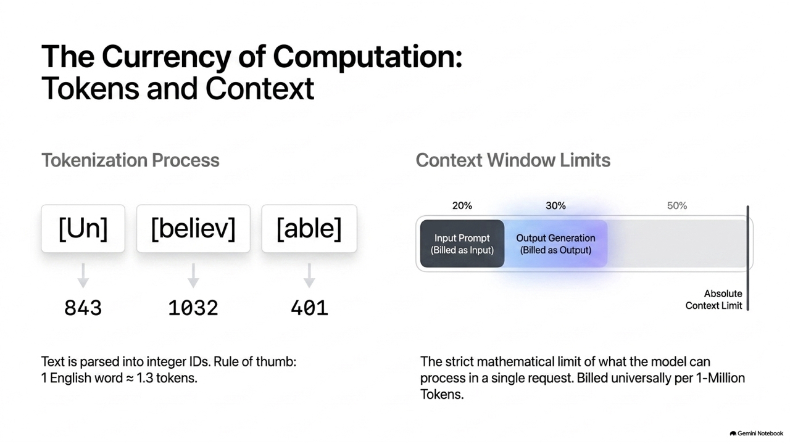

現代 LLM（包括 GPT 系列、Gemini、Llama 等）之所以如此強大，全部基於 Google 於 2017 年提出的 **Transformer** 架構：
* **自注意力機制 (Self-Attention)**：允許模型在處理一個詞（Token）時，同時評估整個句子中其他詞與它的關聯度。這使得模型能精準理解上下文語意與代名詞所指代的對象，擺脫了過去循環神經網路 (RNN) 長距離記憶衰減的物理限制。
* **文字接龍 (Next-token Prediction)**：生成式 AI 的本質上是個概率模型。當你輸入一段提示詞 (Prompt)，LLM 會在詞庫中計算出「下一個最有機率出現的 Token 是什麼」，然後將這個字加入輸入中，再預測下下個字，如此循環反覆，直到輸出結束符號為止。

### 10.1.2 標記 (Token) 與計費模型

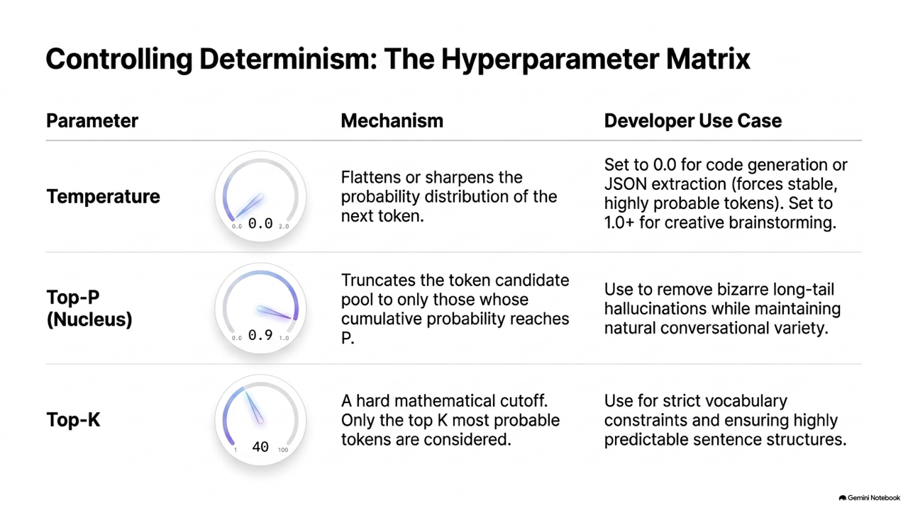

模型並不直接處理英文字母或中文字元，而是處理 **標記 (Token)**。一個 Token 通常是字詞的一部分或一整個漢字。
* **Context Window (上下文窗口)**：模型一次所能處理的 Input + Output 最大 Token 量。如果對話過長，超出了窗口限制，模型就會「忘記」最前面的對話。
* **計費方式**：API 開發通常是以 Token 數量計費，即每 100 萬個輸入 Token 與 100 萬個輸出 Token 收取多少美金。

### 10.1.3 隨機性控制超參數：溫度 (Temperature)、Top-P、Top-K

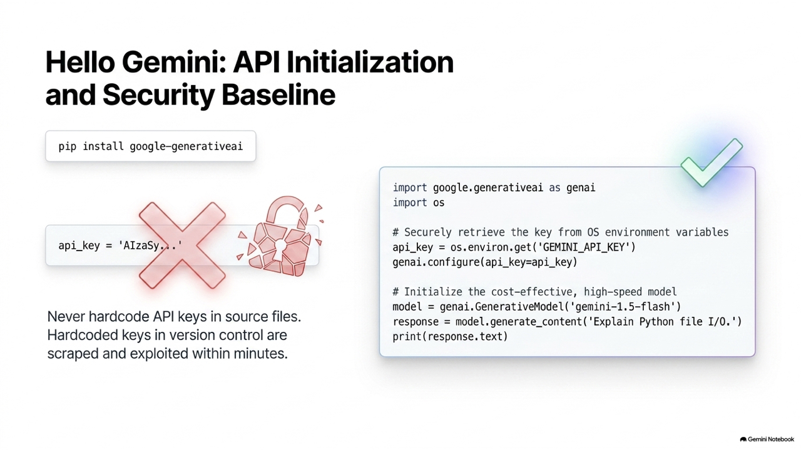

為了控制 LLM 回答的創造力（隨機性），我們在調用 API 時可以設定以下參數：
* **溫度 (Temperature, `temp`)**：控制機率分佈的平滑度。
  - `temp` 越接近 0：模型回答越確定、死板，每次呼叫的結果幾乎一樣（適合寫程式、計算、問答）。
  - `temp` 越接近 1（或大於 1）：模型回答越有創意、發散，具有隨機性（適合寫小說、腦力激盪）。
* **Top-K**：限制模型只能在機率最高的 $K$ 個 Token 中挑選下一個字。
* **Top-P (Nucleus Sampling)**：限制模型只能在累積機率值達到 $P$ 的最小 Token 集合中挑選。例如 `top_p = 0.9`，代表模型只考慮累積機率加總前 90% 的單字。

---

### **10.1.4 隨堂測驗 (CCQ 1)**

**問題**

在設計一個用來進行「自動寫程式與編譯 Debug」的 AI 軟體工程師代理人時，你應該如何調整 Gemini API 的 `temperature` (溫度) 超參數，以確保程式碼生成的一致性與語法正確度？

A) 調高溫度至 1.0 或以上，以激發 AI 的無限創造力。
B) 調低溫度至 0.0 或接近 0，使模型生成最確定、最符合標準語法的答案。
C) 關閉 Top-P 與 Top-K，只使用 Temperature=1.5。
D) 將溫度設為 -1.0。

<details>
<summary>點擊查看【隨堂測驗】答案與解析</summary>

**正確答案：B) 調低溫度至 0.0 或接近 0，使模型生成最確定、最符合標準語法的答案。**

* **解析**：
  * 對於邏輯推理、程式撰寫、數值計算等任務，我們要求系統「高確定性」且「可重複驗證」，所以必須將溫度降至最低（趨近於 0）。
  * 若溫度調高（如選項 A），AI 生成的程式碼每次呼叫都會大相逕庭，且極易產生隨機的幻覺程式碼，故選 B。

</details>

---

## 10.2 Google Gemini API 開發入門

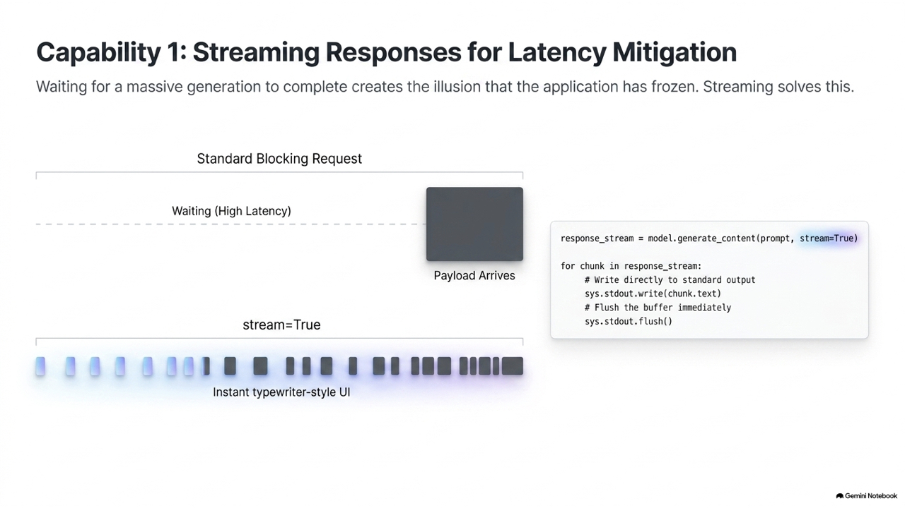

本節我們將實作如何使用 Python 呼叫 Google 最強的 Gemini 模型。

### 10.2.1 環境建置與環境變數管理

為了保護隱私安全，我們**絕不可將 API 金鑰直接寫死在程式碼中**。正確的做法是將金鑰存放在系統的環境變數中。

請在終端機安裝 Google 官方 SDK：
```bash
pip install google-generativeai
```

在 macOS/Linux 終端機設定環境變數：
```bash
export GEMINI_API_KEY="你的_Gemini_API_Key"
```

在 Windows 終端機 (Cmd) 設定環境變數：
```cmd
set GEMINI_API_KEY="你的_Gemini_API_Key"
```

### 10.2.2 呼叫生成模型

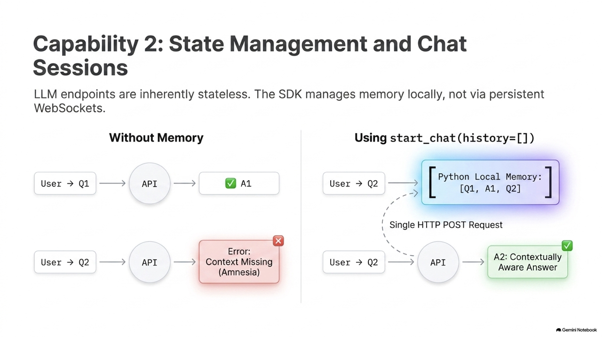

以下是基本的 Gemini API 呼叫示範。它會自動從作業系統環境變數中取得金鑰：

```python
import os
import google.generativeai as genai

# 1. 從環境變數讀取 API Key 並設定
api_key = os.environ.get("GEMINI_API_KEY")
if not api_key:
    raise ValueError("找不到 GEMINI_API_KEY 環境變數，請先設定它！")

genai.configure(api_key=api_key)

# 2. 初始化 Gemini 1.5 Flash 模型 (速度快、成本低，非常適合日常任務)
model = genai.GenerativeModel('gemini-1.5-flash')

# 3. 呼叫生成內容
response = model.generate_content("請用簡單的三句話向大眾解釋什麼是物聯網 (IoT)。")

print("=== Gemini 回覆 ===")
print(response.text)
```

---

### 10.2.3 串流輸出 (Streaming Response) 與多輪對話歷史

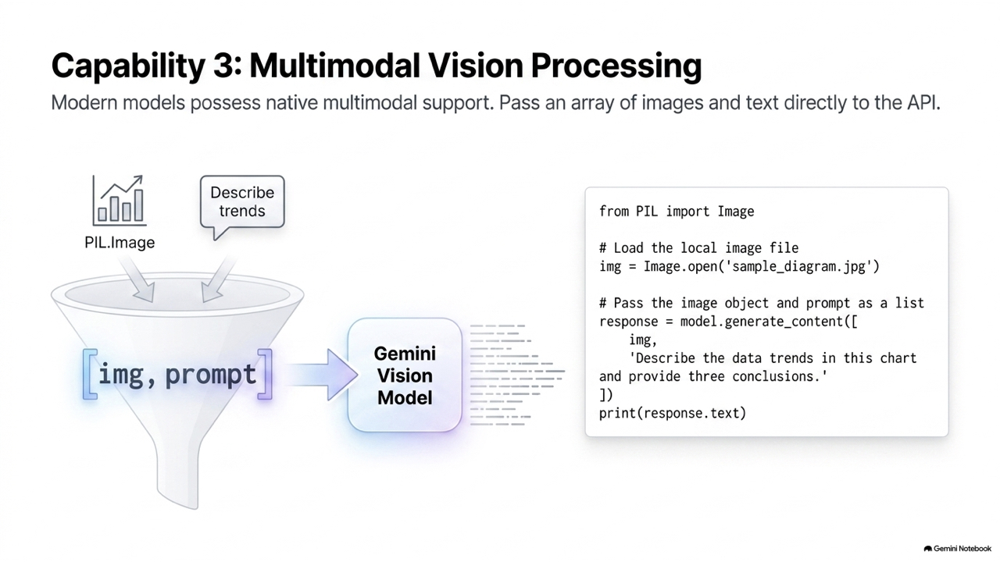

#### 1. 串流輸出 (Streaming Response)
當模型產生的答案很長時，等待模型生成完全部內容可能需要十幾秒，這會讓使用者覺得程式當機。我們可以使用 `generate_content_stream` 實作動態的「打字效果」：

```python
response = model.generate_content("請寫一首關於機器人學習彈鋼琴的短詩。", stream=True)

print("=== 串流輸出 (打字機效果) ===")
for chunk in response:
    # end="" 確保不換行，flush=True 確保終端機即時沖刷輸出緩衝區
    print(chunk.text, end="", flush=True)
print("\n")
```

#### 2. 多輪對話歷史 (Chat Session)

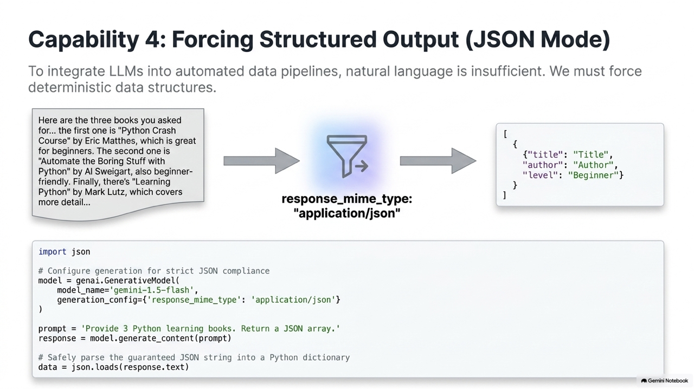

若使用 `generate_content`，每次呼叫都是獨立的（無狀態的），模型不記得先前的對話。為了維持對話脈絡，我們可以使用 `start_chat` 建立一個連貫的對話工作階段：

```python
# 啟動具有記憶功能的對話 Session
chat = model.start_chat(history=[])

# 第一輪對話
response = chat.send_message("哈囉！我是輔仁大學電機系一年級的學生張小明。")
print(f"AI: {response.text}")

# 第二輪對話 (不提到姓名與學校，測試記憶)
response = chat.send_message("請幫我規劃適合我目前科系的 Python 學習計畫。")
print(f"\nAI: {response.text}")
```

---

## 10.3 進階開發技巧與 API 串接

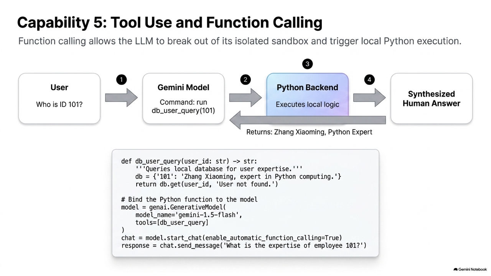

### 10.3.1 多模態分析：傳入圖片進行辨識 (Multimodality)

Gemini 原生支援多模態輸入，我們可以同時傳入圖片與文字提示詞，讓它分析圖中內容：

```python
# 模擬載入一個圖片物件 (此處需要 pillow 套件: pip install pillow)
from PIL import Image
import io

# 此範例隨機建立一個純色圖像代替實體圖像檔案，方便運行
img = Image.new('RGB', (300, 200), color = 'blue')

# 呼叫多模態生成
response = model.generate_content([
    "這是一張圖片，請告訴我這張圖片的主色調是什麼？並用英文形容這種藍色給人什麼感覺。",
    img
])

print("=== 多模態圖片分析結果 ===")
print(response.text)
```

### 10.3.2 結構化輸出 JSON 模式 (JSON Mode)

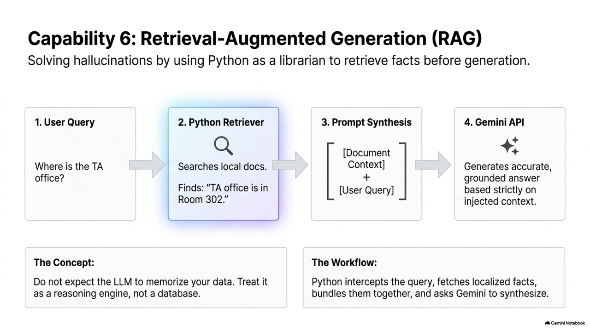

當我們需要將 LLM 接上後台系統（如自動生成資料庫欄位）時，我們必須保證模型回傳的格式是純 JSON，且不包含任何額外的廢話（如 "Here is the JSON:"）。我們可以通過 `response_mime_type` 強制規定輸出格式：

```python
import json

# 配置輸出格式為 application/json
response = model.generate_content(
    "請隨機列出三個台北市的景點，並回傳成一個 JSON 陣列，每個元素包含：name, type, description。",
    generation_config={"response_mime_type": "application/json"}
)

print("=== 獲得的 JSON 字串 ===")
raw_json = response.text
print(raw_json)

# 使用 Python 內建 json 解析
data = json.loads(raw_json)
print("\n=== 解析後的 Python List ===")
for place in data:
    print(f"景點: {place['name']} ({place['type']})")
```

---

### 10.3.3 工具調用 (Function Calling)

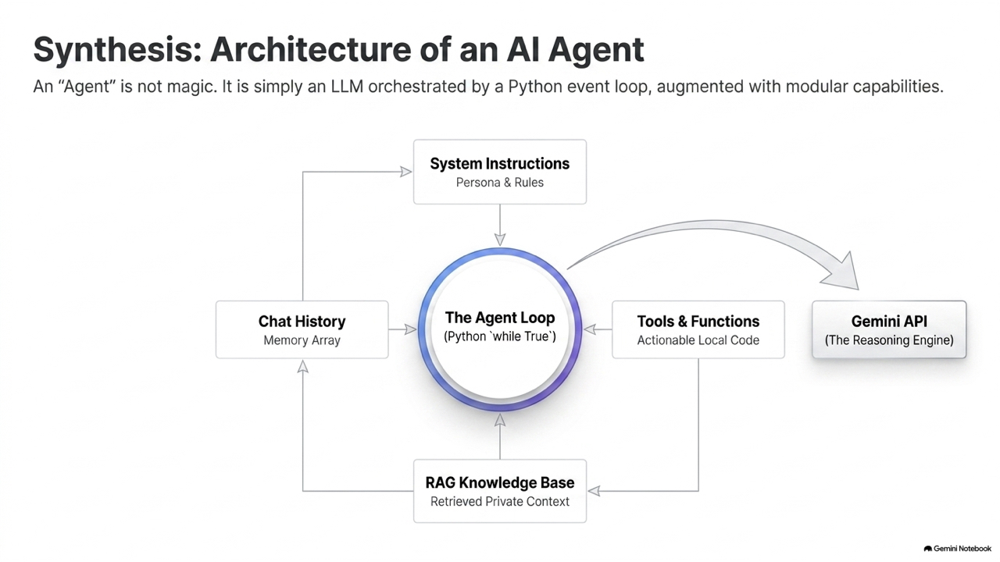

LLM 的最大硬傷在於無法獲取最新即時資料，也無法執行真實世界的物理操作。
**Function Calling** 解決了這個問題：我們提供一組 Python 函數的宣告（工具箱）給 Gemini，Gemini 分析使用者的意圖後，如果發現需要這些工具，它會**主動回傳「請執行某某函數，參數值為 X」的指令**。我們在本地執行該函數，將運算結果回傳給 Gemini，最後由 Gemini 整理成人類聽得懂的答案。

```
[ 用戶 ] ---> "現在高雄天氣如何？" ---> [ Gemini ]
                                         |
                                (判斷需要即時天氣工具)
                                         |
[ 用戶 ] <--- "請執行 get_weather(city='Kaohsiung')" <--- [ Gemini ]
   |
(本地執行函數，獲得結果 "32度，晴天")
   |
   +---> "本地計算結果為 32度，晴天" ---> [ Gemini ] ---> "高雄現在是晴天，氣溫32度。" ---> [ 用戶 ]
```

---

### **10.3.4 隨堂測驗 (CCQ 2)**

**問題**

關於大型語言模型 (LLM) 的「Function Calling (工具調用)」機制，下列敘述何者是正確的？

A) 該機制允許 LLM 直接繞過作業系統權限，在你的電腦硬碟中自動下載、編譯並執行任何 Python 程式碼。
B) LLM 不會直接執行該函數；它僅負責閱讀函數的簽章與說明文檔，並根據使用者意圖輸出一個包含「欲調用之函數名稱與引數數值」的結構化指令，由開發者的本地程式碼負責實際執行。
C) Function Calling 是一種用來對 LLM 進行深度微調 (Fine-Tuning) 的演算法。
D) 這會將模型的運算速度提升 100 倍。

<details>
<summary>點擊查看【隨堂測驗】答案與解析</summary>

**正確答案：B) LLM 不會直接執行該函數；它僅負責閱讀函數的簽章與說明文檔，並根據使用者意圖輸出一個包含「欲調用之函數名稱與引數數值」的結構化指令，由開發者的本地程式碼負責實際執行。**

* **解析**：
  * LLM 運行於雲端沙盒中，沒有權限也無法直接運作你的本地 Python 函數。
  * 它的本質是「意圖路由與參數擷取器」，告訴你「你該去執行這個函數了，我幫你把參數抓好了」。實際執行是你的程式（本地）的工作，故選 B。

</details>

---

## 10.4 檢索增強生成 (Retrieval-Augmented Generation, RAG)

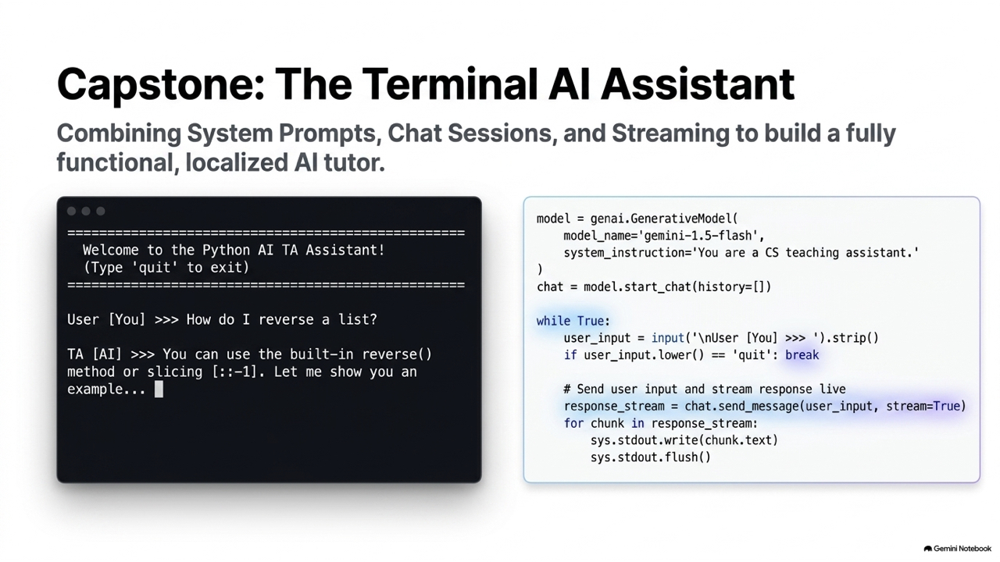

LLM 的訓練資料是有截止日期的，且無法取得企業內部的私人文件。
**RAG (檢索增強生成)** 解決了這個痛點：
1. 當使用者提問時，系統先去「外部知識庫（如 PDF 文件、資料庫）」中檢索與問題最相關的文字段落。
2. 將這些段落作為「背景參考資料 (Context)」併入 Prompt 中。
3. 傳送給 LLM，要求 LLM「必須根據我提供的背景資料回答問題」，從而避免幻覺。

### 10.4.1 RAG 流程與向量相似度檢索實作

在標準 RAG 中會使用向量嵌入 (Embeddings) 來檢索資料。為了讓本章代碼完全 runnable 且展現底層演算法本質，我們用 Python 實作一個簡易的文字相似度搜尋引擎（以單字交集比例作為相似度）：

```python
# 模擬本地內部知識庫 (企業私人文件)
knowledge_base = [
    "電機系辦公室位於資電大樓四樓，開放時間為週一至週五 9:00-17:00。",
    "資工系專題發表會定於 12 月 15 日在體育館二樓舉行。",
    "智慧系統控制實驗室由王教授指導，位於資電大樓 602 室。",
    "Python 程式設計期末考將於第 16 週進行，考試形式為上機考。"
]

def search_related_context(query, database):
    """ 純 Python 關鍵字相似度檢索演算法 (計算交集詞比例) """
    query_words = set(query.lower())
    best_match = None
    max_score = -1
    
    for idx, doc in enumerate(database):
        # 簡單計算字符交集數
        doc_words = set(doc.lower())
        overlap = len(query_words.intersection(doc_words))
        score = overlap / len(query_words) if len(query_words) > 0 else 0
        
        if score > max_score:
            max_score = score
            best_match = doc
            
    return best_match

# 模擬 RAG 運作
user_query = "請問電機系辦在哪？"
retrieved_context = search_related_context(user_query, knowledge_base)

print("=== [步驟 1] 檢索出來的相關知識 ===")
print(retrieved_context)

# [步驟 2] 動態合成 Prompt
rag_prompt = f"""
你是一個輔助學生解惑的助理。請嚴格根據以下提供的【背景知識】來回答使用者的【問題】。
如果背景知識中沒有相關資訊，請誠實回答「抱歉，我不太清楚」。

【背景知識】：{retrieved_context}
【問題】：{user_query}
"""

print("\n=== [步驟 3] 合成後的 Prompt 內容 ===")
print(rag_prompt)

# 在實際 RAG 系統中，會將 rag_prompt 送至 model.generate_content() 獲取精準回答
```

---

### **10.4.2 隨堂測驗 (CCQ 3)**

**問題**

在實作 RAG (檢索增強生成) 系統時，將檢索出來的外部私人參考文件作為「上下文 (Context)」一同送入 LLM 提示詞中，主要是為了解決 LLM 的什麼重大痛點？

A) 網路頻寬太慢的問題。
B) 解決模型因為訓練資料截止或缺乏私人知識而產生的幻覺 (Hallucination) 問題，並提供有憑有據的回答。
C) 提高模型的推理硬體算力。
D) 自動將輸入的程式碼進行最佳化編譯。

<details>
<summary>點擊查看【隨堂測驗】答案與解析</summary>

**Correct Answer: B) 解決模型因為訓練資料截止或缺乏私人知識而產生的幻覺 (Hallucination) 問題，並提供有憑有據的回答。**

* **解析**：
  * RAG 透過「給模型看開卷答案」的方式，讓模型在回答時有具體的參考文本，大幅降低胡說八道（幻覺）的機率，並能附帶來源參考，極具商用價值，故選 B。

</details>

---

## 10.5 本章綜合實作專題

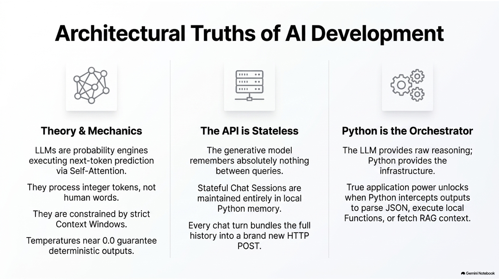

### 專題任務：終端機多功能 AI 助理代理人 (CLI Agent)

**專題說明**：我們將利用多輪對話歷史、環境變數安全防護與串流輸出，實作一個具備系統提示詞 (System Instruction) 的終端機互動 AI 代理人。它會被強行賦予一個身份——「Python 程式設計專業助教」，引導學生除錯。

```python
import os
import sys
import google.generativeai as genai

def run_cli_agent():
    api_key = os.environ.get("GEMINI_API_KEY")
    if not api_key:
        print("[錯誤] 請先設定 GEMINI_API_KEY 環境變數！")
        sys.exit(1)
        
    genai.configure(api_key=api_key)
    
    # 定義系統提示詞 (System Instruction)，強制規範模型的行為模式與語氣
    helper_instruction = """
    你是一位專業的 Python 程式設計課程助教。你的任務是協助資電學院的學生學習 Python。
    當學生提出程式問題或貼上錯誤代碼時：
    1. 不要直接給出完整的正確答案。
    2. 引導學生思考程式中的邏輯漏洞，並給出提示。
    3. 語氣必須親切、帶有鼓勵性，使用正體中文回答。
    """
    
    model = genai.GenerativeModel(
        model_name='gemini-1.5-flash',
        system_instruction=helper_instruction
    )
    
    # 建立對話 Session
    chat = model.start_chat(history=[])
    
    print("=" * 50)
    print("  FJU EE Python Course - CLI AI Agent 助教已上線")
    print("  輸入 'exit' 或 'quit' 可關閉系統")
    print("=" * 50)
    
    while True:
        try:
            user_input = input("\n[學生] >>> ").strip()
            if not user_input:
                continue
            if user_input.lower() in ['exit', 'quit']:
                print("\n[助教] 再見！寫程式加油！")
                break
                
            print("\n[助教] 回答中：", end="", flush=True)
            
            # 呼叫串流發送，展現打字效果
            response = chat.send_message(user_input, stream=True)
            for chunk in response:
                print(chunk.text, end="", flush=True)
            print()
            
        except KeyboardInterrupt:
            print("\n\n[助教] 系統強行結束，祝學習愉快！")
            break
        except Exception as e:
            print(f"\n[系統錯誤] 發生異常：{e}")
            break

if __name__ == '__main__':
    run_cli_agent()
```
