# Python 視窗遊戲設計 (Pygame)

### 第十一章：2D 遊戲引擎、精靈系統與物理碰撞實作

講師：Python 程式設計教學團隊

---

<!-- _class: full-image-slide -->

<div class="centered-image">
  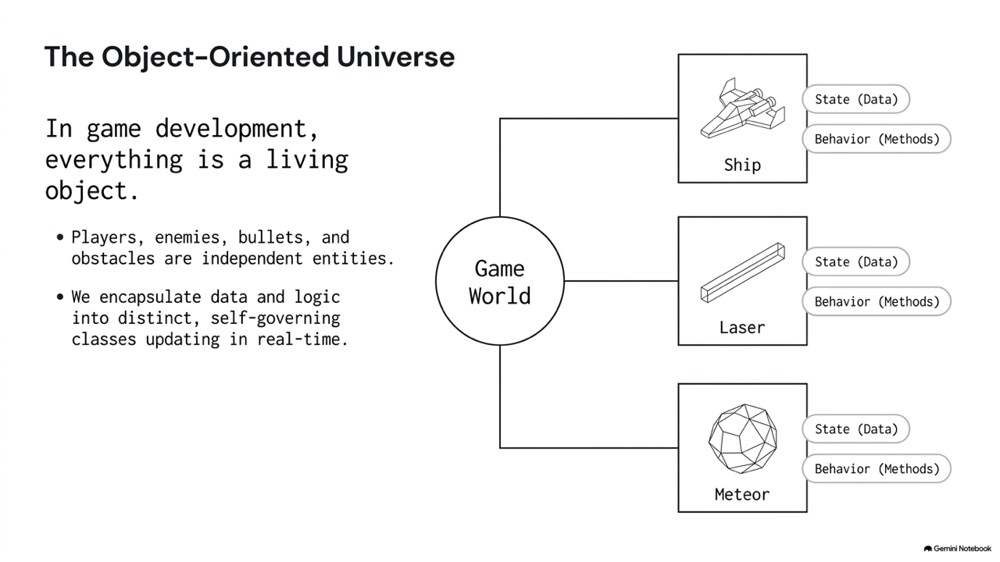
</div>

---

# 11.1 Pygame 與視窗遊戲基礎

* **2D 遊戲開發框架 (Pygame)**：
  - 整合圖形渲染、硬體加速、音訊控制與輸入裝置監聽。
* **螢幕座標系統**：
  - 原點 $(0, 0)$ 位於螢幕**左上角**。
  - 向右為 $+X$，向下為 $+Y$。
* **經典遊戲迴圈 (Game Loop)**：
  - 每秒數十次高速循環：**事件讀取 $\rightarrow$ 狀態更新 $\rightarrow$ 畫面渲染**。

---

<!-- _class: full-image-slide -->

<div class="centered-image">
  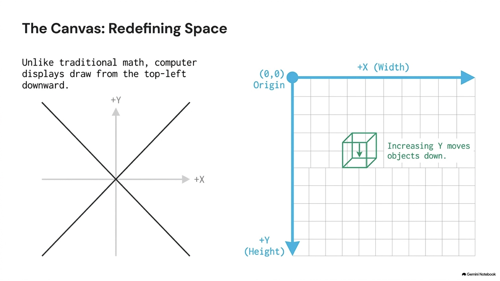
</div>

---

<!-- _class: full-image-slide -->

<div class="centered-image">
  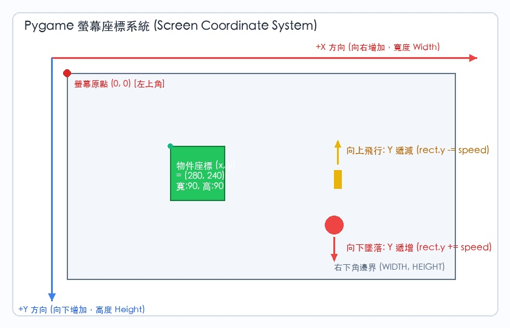
</div>

---

<!-- _class: full-image-slide -->

<div class="centered-image">
  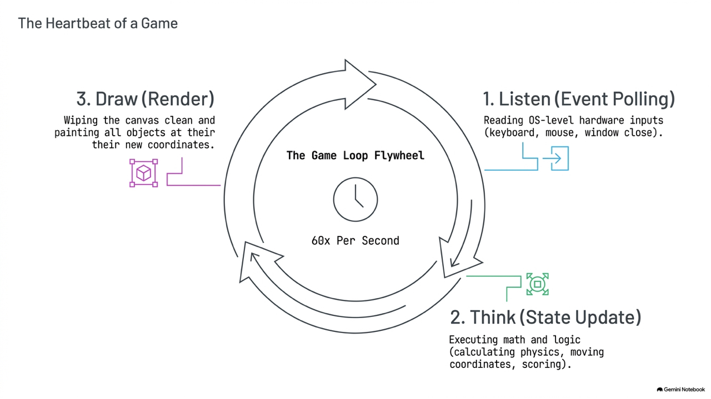
</div>

---

<!-- _class: full-image-slide -->

<div class="centered-image">
  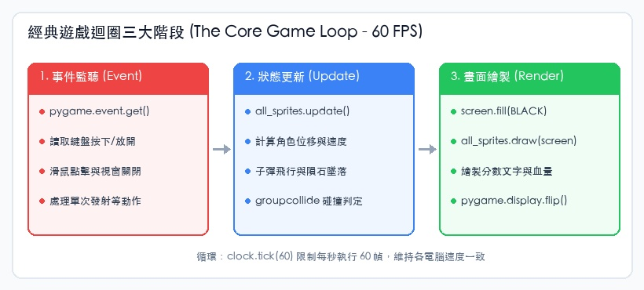
</div>

---

## 基礎視窗初始化與幾何繪圖

```python
import pygame, sys
pygame.init()

screen = pygame.display.set_mode((800, 600))
pygame.display.set_caption("My Pygame Window")
clock = pygame.time.Clock()

while True:
    clock.tick(60) # 限制 60 FPS
    for event in pygame.event.get():
        if event.type == pygame.QUIT:
            pygame.quit(); sys.exit()
            
    screen.fill((0, 0, 0)) # 黑色背景
    pygame.draw.rect(screen, (255, 0, 0), (350, 250, 100, 100)) # 紅色方塊
    pygame.draw.circle(screen, (0, 255, 0), (100, 100), 50)     # 綠色圓形
    pygame.display.flip() # 雙重緩衝區刷新
```

---

<!-- _class: full-image-slide -->

<div class="centered-image">
  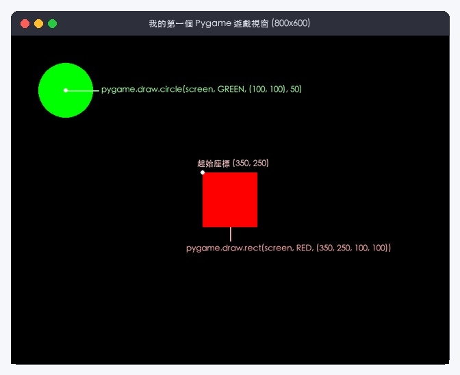
</div>

---

## Concept Check Question (CCQ 1)

<div class="ccq-columns">
  <div class="ccq-text">

**在 Pygame 遊戲設計中，關於螢幕座標系的描述，下列何者正確？**

* **A.** 原點 $(0, 0)$ 位於螢幕中心點，向上與向右為正數
* **B.** 原點 $(0, 0)$ 位於螢幕左上角，向右為 $+X$，向下為 $+Y$
* **C.** 原點 $(0, 0)$ 位於左下角，符合傳統數學幾何座標
* **D.** 當 $Y$ 座標增加時，物體會在畫面上向上移動

  </div>
  <div class="ccq-logo">
    
  </div>
</div>

---

## CCQ 1 - 答案與解析

<div class="ccq-columns">
  <div class="ccq-text">

### **正確答案：B. 原點在左上角，向右為 $+X$，向下為 $+Y$**

* **解析**：
  - 電腦顯示器硬體是由左至右、由上至下依序掃描成像的。
  - 因此 2D 視窗座標系的 $Y$ 軸正方向是「垂直向下」，增加 $Y$ 值會使物體向下移動，故選 B。

  </div>
  <div class="ccq-logo">
    
  </div>
</div>

---

## Concept Check Question (CCQ 2)

<div class="ccq-columns">
  <div class="ccq-text">

**在遊戲主迴圈中，`clock.tick(60)` 指令的核心用途為何？**

* **A.** 限制 CPU 最大時脈以減少耗電
* **B.** 強制等待 60 毫秒後再繼續
* **C.** 限制每秒最大幀數 (FPS) 為 60，使遊戲在不同性能電腦上速度一致
* **D.** 設定遊戲倒數計時器為 60 秒

  </div>
  <div class="ccq-logo">
    
  </div>
</div>

---

## CCQ 2 - 答案與解析

<div class="ccq-columns">
  <div class="ccq-text">

### **正確答案：C. 控制 FPS 幀率，確保跨硬體速度一致**

* **解析**：
  - 若未限制幀率，遊戲迴圈會在高效能 CPU 上以每秒數千次狂飆，導致物體瞬間移動且耗盡單核 CPU。
  - `clock.tick(60)` 能維持固定的時間步長，確保遊戲節奏在各平台均勻流暢，故選 C。

  </div>
  <div class="ccq-logo">
    
  </div>
</div>

---

# 11.2 事件處理與輸入系統

* **事件佇列 (Event Queue - `pygame.event.get()`)**：
  - 紀錄單次、瞬間的離散硬體觸發（如按下空白鍵射擊、點擊滑鼠、關閉視窗）。
* **按鍵狀態輪詢 (Key State Polling - `pygame.key.get_pressed()`)**：
  - 每個幀即時檢查按鍵是否「長按壓住」，適合平滑連續運動（如左右操控飛船）。
* **滑鼠控制**：
  - `pygame.mouse.get_pos()` 取得即時游標座標。

---

<!-- _class: full-image-slide -->

<div class="centered-image">
  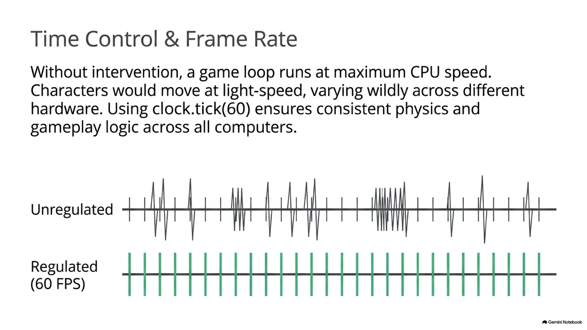
</div>

---

## 鍵盤連續移動與滑鼠點擊控制

```python
# 1. 處理單次事件 (滑鼠左鍵點擊生成圓形)
for event in pygame.event.get():
    if event.type == pygame.MOUSEBUTTONDOWN and event.button == 1:
        circles.append(event.pos)

# 2. 處理長按輪詢 (鍵盤平滑運動)
keys = pygame.key.get_pressed()
if keys[pygame.K_LEFT]:  block_x -= 5
if keys[pygame.K_RIGHT]: block_x += 5
if keys[pygame.K_UP]:    block_y -= 5
if keys[pygame.K_DOWN]:  block_y += 5

# 繪製畫面
screen.fill((30, 30, 30))
pygame.draw.rect(screen, (0, 255, 255), (block_x, block_y, 50, 50))
for pos in circles:
    pygame.draw.circle(screen, (255, 50, 50), pos, 15)
pygame.display.flip()
```

---

<!-- _class: full-image-slide -->

<div class="centered-image">
  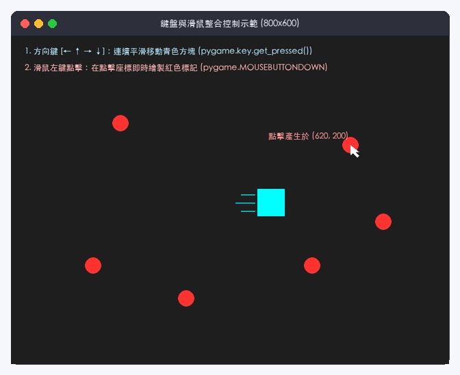
</div>

---

## Concept Check Question (CCQ 3)

<div class="ccq-columns">
  <div class="ccq-text">

**在遊戲每幀繪圖完成後呼叫 `pygame.display.flip()`，其底層「雙重緩衝區 (Double Buffering)」機制主要解決什麼問題？**

* **A.** 釋放顯示卡未使用的暫存記憶體
* **B.** 防止螢幕閃爍與撕裂，讓玩家看到完整繪製好的成品幀
* **C.** 自動計算精靈之間的碰撞
* **D.** 將 2D 向量自動渲染為 3D 視角

  </div>
  <div class="ccq-logo">
    
  </div>
</div>

---

## CCQ 3 - 答案與解析

<div class="ccq-columns">
  <div class="ccq-text">

### **正確答案：B. 防止螢幕閃爍與撕裂**

* **解析**：
  - 雙重緩衝區由「前台顯示畫布」與「後台繪製畫布」組成。
  - 所有 `draw` 操作都在後台默默進行，完成後透過 `flip()` 瞬間翻轉前台，避免玩家看到圖形逐一畫上的過程與殘影，故選 B。

  </div>
  <div class="ccq-logo">
    
  </div>
</div>

---

# 11.3 精靈與碰撞偵測 (Sprites & Collisions)

* **`pygame.sprite.Sprite` 類別**：
  - 物件導向遊戲實體基類，必須具備 `self.image` (Surface) 與 `self.rect` (Rect)。
* **`pygame.sprite.Group` 精靈群組**：
  - 一行指令 `group.update()` 批次更新所有成員。
  - 一行指令 `group.draw(screen)` 批次渲染所有實體。
* **AABB 矩形邊界碰撞偵測**：
  - `groupcollide(g1, g2, dokill1, dokill2)` 高效多對多檢測。

---

<!-- _class: full-image-slide -->

<div class="centered-image">
  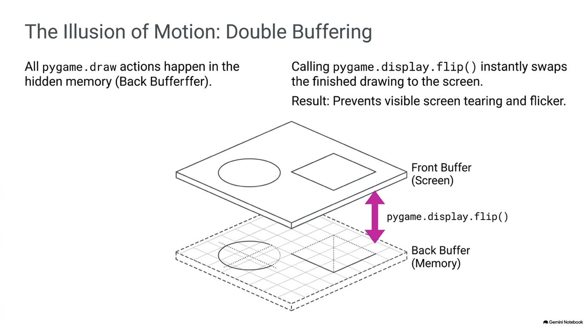
</div>

---

<!-- _class: full-image-slide -->

<div class="centered-image">
  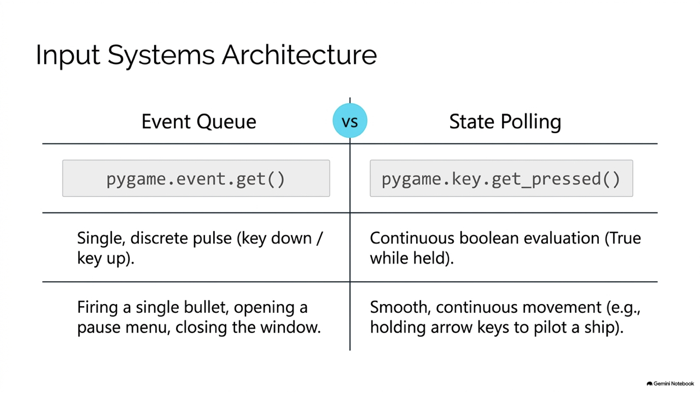
</div>

---

<!-- _class: full-image-slide -->

<div class="centered-image">
  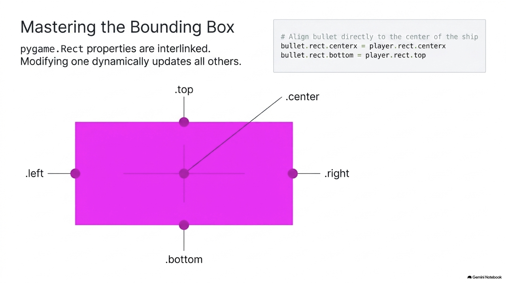
</div>

---

<!-- _class: full-image-slide -->

<div class="centered-image">
  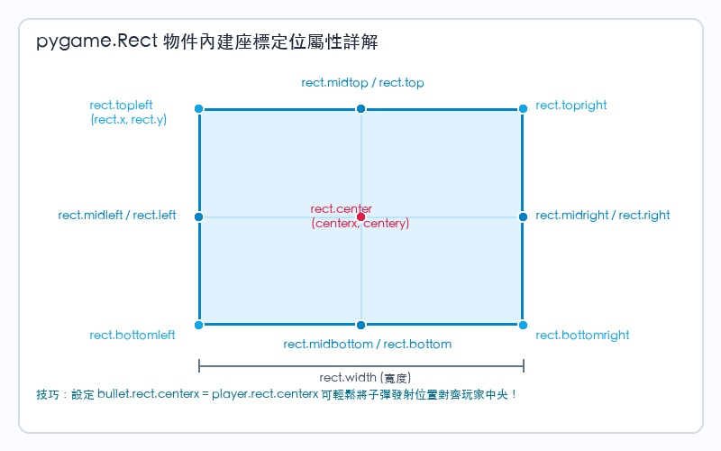
</div>

---

<!-- _class: full-image-slide -->

<div class="centered-image">
  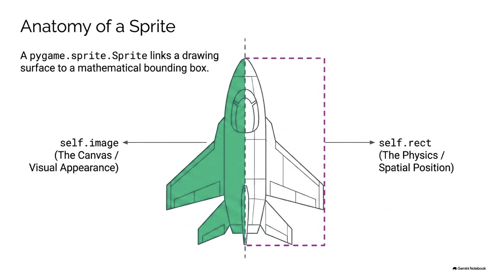
</div>

---

<!-- _class: full-image-slide -->

<div class="centered-image">
  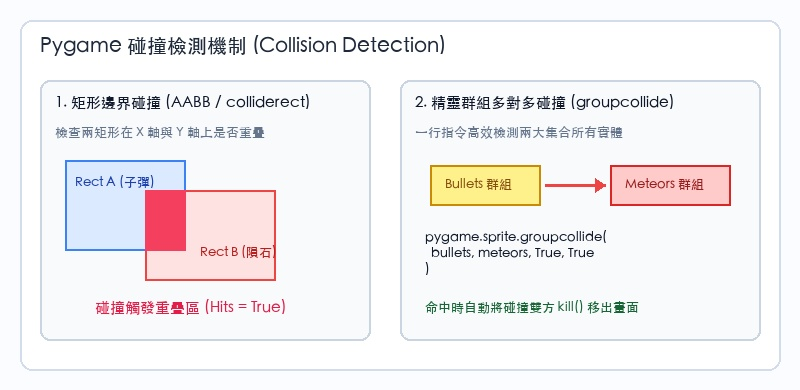
</div>

---

## Concept Check Question (CCQ 4)

<div class="ccq-columns">
  <div class="ccq-text">

**在 Pygame 中，一個繼承自 `pygame.sprite.Sprite` 的自訂類別，初始化時必須設定哪兩個變數屬性，才能被 Sprite Group 正確管理與繪製？**

* **A.** `self.x` 與 `self.y`
* **B.** `self.image` (Surface 外觀) 與 `self.rect` (Rect 座標邊框)
* **C.** `self.speed` 與 `self.direction`
* **D.** `self.width` 與 `self.height`

  </div>
  <div class="ccq-logo">
    
  </div>
</div>

---

## CCQ 4 - 答案與解析

<div class="ccq-columns">
  <div class="ccq-text">

### **正確答案：B. `self.image` 與 `self.rect`**

* **解析**：
  - `SpriteGroup.draw()` 在遍歷成員繪圖時，會讀取每個物件的 `image` 取得畫布，並讀取 `rect` 取得繪製位置。
  - 缺少任一屬性都會引發 AttributeError，故選 B。

  </div>
  <div class="ccq-logo">
    
  </div>
</div>

---

## Concept Check Question (CCQ 5)

<div class="ccq-columns">
  <div class="ccq-text">

**在太空射擊遊戲中，檢測「所有子彈群組」與「所有隕石群組」的碰撞並讓相撞兩者同時消滅，最佳指令為何？**

* **A.** `pygame.Rect.colliderect()`
* **B.** `pygame.sprite.spritecollide()`
* **C.** `pygame.sprite.groupcollide(bullets, meteors, True, True)`
* **D.** 撰寫雙重 for 迴圈計算每顆子彈與隕石的歐幾里得距離

  </div>
  <div class="ccq-logo">
    
  </div>
</div>

---

## CCQ 5 - 答案與解析

<div class="ccq-columns">
  <div class="ccq-text">

### **正確答案：C. `groupcollide(bullets, meteors, True, True)`**

* **解析**：
  - `groupcollide` 是專為群組對群組碰撞優化的高效函式。
  - 傳入 `True, True` 可在碰撞發生時自動調用雙方成員的 `kill()` 方法將其從群組移除，一行代碼替代複雜迴圈，故選 C。

  </div>
  <div class="ccq-logo">
    
  </div>
</div>

---

# 11.4 聲音與背景音樂整合 (Sound & Mixer)

* **`pygame.mixer.music` (背景音樂)**：
  - 適合長音訊 (mp3, ogg)。
  - **串流解碼播放**，節省記憶體，支援循環播放 (`play(-1)`)。
* **`pygame.mixer.Sound` (獨立音效)**：
  - 適合短促高頻聲音 (wav)。
  - **一次性載入記憶體**，超低延遲即時觸發 (如射擊、爆炸)。

---

<!-- _class: full-image-slide -->

<div class="centered-image">
  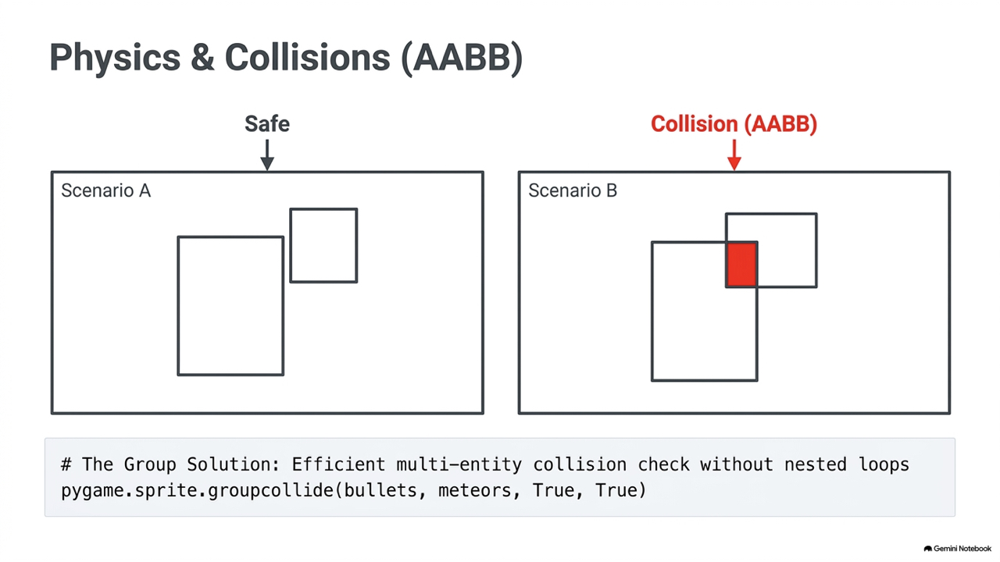
</div>

---

# 11.5 太空射擊遊戲專案開發 (Space Shooter)

* **三大核心實體設計**：
  - **Player**：受鍵盤左右控制，限制於螢幕邊界。
  - **Meteor**：由螢幕頂端隨機生成，隨機速度飄移墜落。
  - **Bullet**：按下空白鍵生成於玩家正上方，高速向上飛行。
* **遊戲生命週期與狀態機**：
  - 玩家生命值 (Lives)、計分板 (Score) 與 Game Over 重開機制。

---

<!-- _class: full-image-slide -->

<div class="centered-image">
  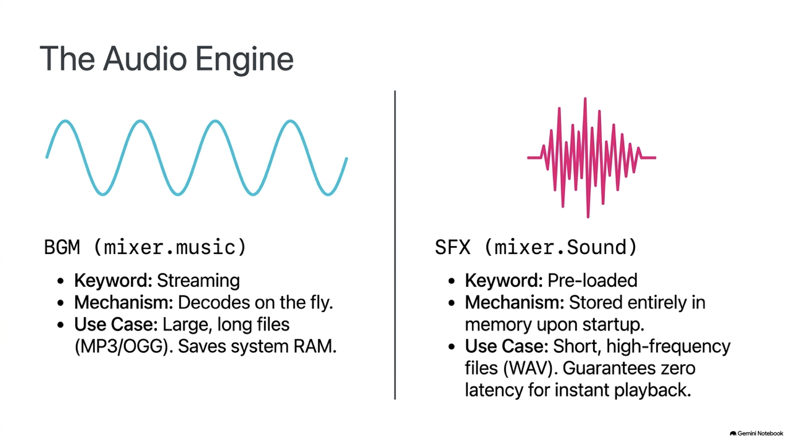
</div>

---

<!-- _class: full-image-slide -->

<div class="centered-image">
  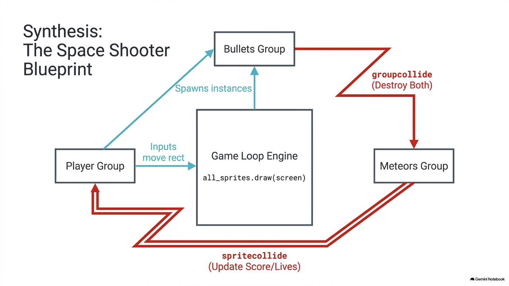
</div>

---

<!-- _class: full-image-slide -->

<div class="centered-image">
  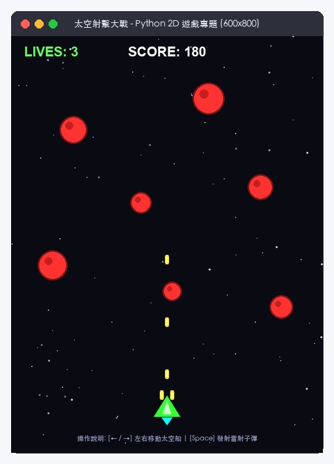
</div>

---

<!-- _class: full-image-slide -->

<div class="centered-image">
  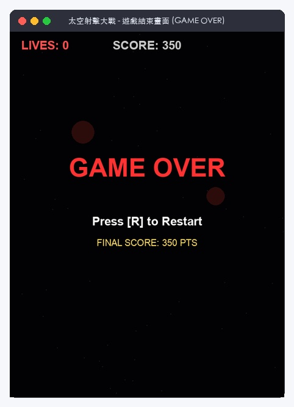
</div>

---

# 11.6 課後進階挑戰專題 (Particle FX)

* **粒子系統 (Particle System)**：
  - 擊中隕石時向四周迸發具備隨機初速度的小方塊粒子。
  - 粒子每幀衰減生命期 (`lifetime -= 1`)，結束時自動 `kill()`。
* **增添遊戲打擊感 (Visual Juice)**：
  - 賦予 2D 復古遊戲豐富的視覺反饋與震撼感。

---

<!-- _class: full-image-slide -->

<div class="centered-image">
  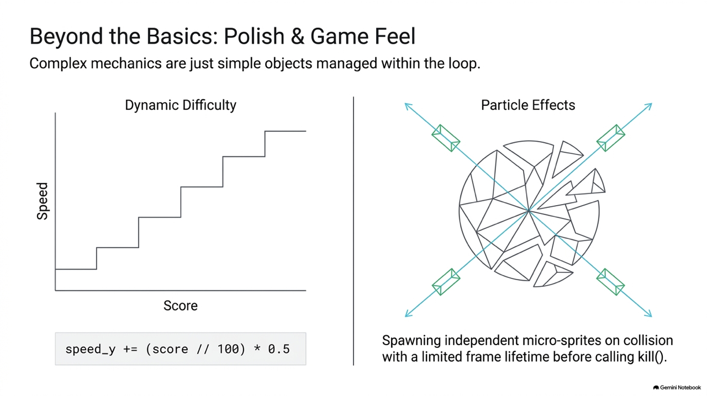
</div>

---

<!-- _class: full-image-slide -->

<div class="centered-image">
  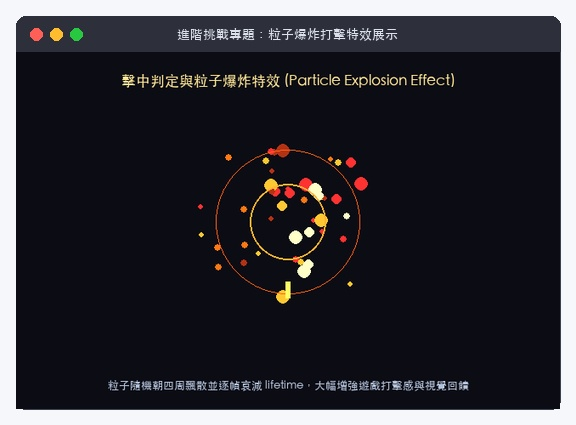
</div>
