Ch12 Web Development in Python
===

# Python Web 開發基礎 (Flask)

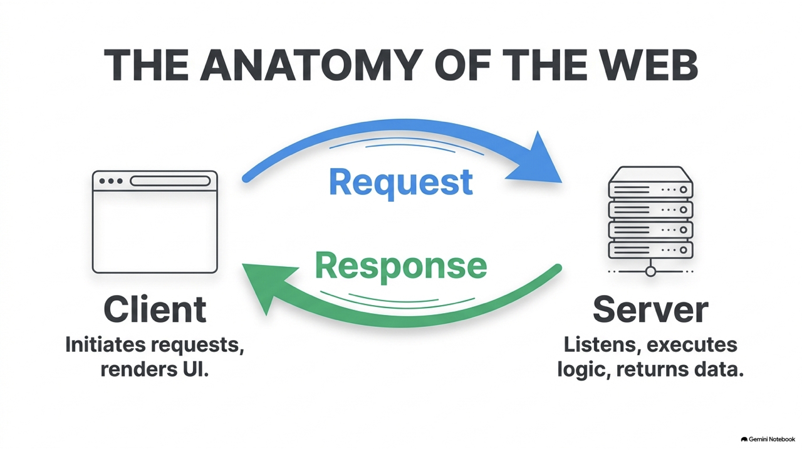

本章將帶領你探討如何使用 Python 開發簡單且實用的 Web 應用程式。在資訊與網路時代，將程式邏輯部署在網路上，讓使用者能透過瀏覽器進行操作，是極其普遍的軟體應用模式。我們將先建立基礎的網頁通訊與網路協定知識，接著學習如何使用 Python 最輕量流暢的微型框架 **Flask** 架設網頁伺服器。

本章包含以下核心單元：
* **12.1 網頁開發基礎知識**：學習 Client-Server 架構、HTTP 協定規格、常用狀態碼以及 GET 與 POST 請求的差異。
* **12.2 Flask 微型 Web 框架入門**：學習 Flask 的安裝、最簡伺服器建置、路由系統（Routing）與動態 URL 參數抓取。
* **12.3 動態模板渲染與表單處理**：認識 Jinja2 模板引擎的控制語法，並實作透過網頁表單接收使用者輸入數據。
* **12.4 綜合實作專案：學生學籍與成績查詢系統**：實作一個單一檔案即可運行的網頁系統，提供查看清單、關鍵字搜尋以及新增學籍功能。
* **12.5 本章綜合課後進階挑戰專題**。

---

## 12.1 網頁開發基礎知識

在寫任何網頁程式碼之前，我們必須先理解網際網路是如何傳遞資料的。

### 12.1.1 用戶端與伺服器端架構 (Client-Server Architecture)

網頁的運作本質上是一種**請求-回應 (Request-Response)** 的雙向機制：
* **用戶端 (Client)**：通常是指玩家或使用者電腦上的瀏覽器（如 Chrome, Safari）。它負責發起連線請求，並將收到的 HTML 程式碼繪製成視覺畫面。
* **伺服器端 (Server)**：一台持續在網路監聽連線的電腦。當它收到請求後，執行相對應的 Python 程式邏輯（如查詢資料庫），並將結果打包成網頁回傳給用戶端。


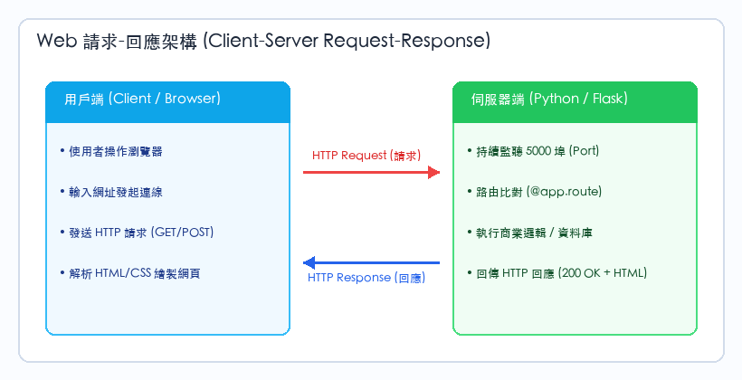

---

### 12.1.2 HTTP 協定與狀態碼 (HTTP Status Codes)

瀏覽器與伺服器通訊時，必須遵守相同的通訊協定——**HTTP (HyperText Transfer Protocol)**。伺服器在回傳回應時，會附帶一個三位數的**狀態碼**，用來簡潔告知用戶端此次請求的結果：
* **200 OK**：請求成功，伺服器已順利回傳網頁。
* **301 / 302 Redirect**：重新導向，要求瀏覽器自動跳轉到另一個新網址。
* **400 Bad Request**：用戶端傳送的資料有誤。
* **404 Not Found**：伺服器上找不到用戶所請求的網頁路徑。
* **500 Internal Server Error**：伺服器端的程式碼（例如 Python 邏輯）執行時拋出未捕獲的異常（當機）。

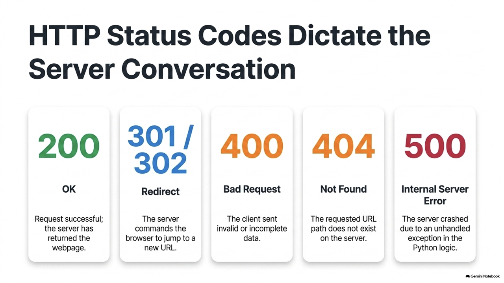

---

### 12.1.3 HTTP 請求方法：GET vs POST

當用戶端向伺服器傳送資料時，最常使用以下兩種 HTTP 方法 (HTTP Methods)：

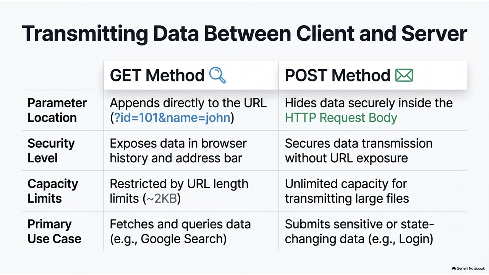

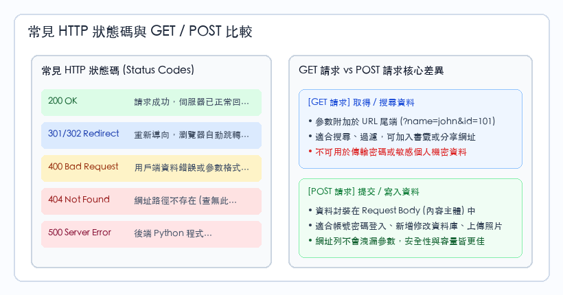

| 特性 | GET 請求 | POST 請求 |
| :--- | :--- | :--- |
| **參數位置** | 附加在網址（URL）後面，例如：`?id=101&name=john` | 包裹在 HTTP 請求的主體 (Request Body) 中 |
| **安全性** | 差（參數會直接顯示在瀏覽器網址列，且會留下歷史紀錄） | 較佳（不會在網址列外洩資料） |
| **資料長度** | 受 URL 長度限制（通常限制在 2KB 左右） | 無限制，可傳輸大檔案、照片 |
| **主要用途** | 取得資料、查詢資料（如：Google 搜尋） | 傳送、提交資料（如：帳號登入、新增學員資料） |

---

### **12.1.4 隨堂測驗 (CCQ 1)**

**問題**

當你在瀏覽器中登入網頁，輸入個人密碼並點擊提交時，網頁前端應該採用哪一種 HTTP 方法將資料傳送到後台 Python 伺服器，以符合資安實務？

A) GET 請求，因為 GET 能將密碼直接保存在網址中以便於書籤標記。
B) POST 請求，因為 POST 將資料封裝在 HTTP Body 中傳輸，密碼不會外洩在瀏覽器網址列與歷史紀錄中。
C) HEAD 請求，因為 HEAD 請求不需要回傳網頁內容。
D) DELETE 請求，因為登入後需要將密碼從網頁中銷毀。

<details>
<summary>點擊查看【隨堂測驗】答案與解析</summary>

**正確答案：B) POST 請求，因為 POST 將資料封裝在 HTTP Body 中傳輸，密碼不會外洩在瀏覽器網址列與歷史紀錄中。**

* **解析**：
  * GET 請求的參數會完全曝露在網址列中（例如：`http://example.com/login?pwd=12345`）。這在資安防護上是極大漏洞（密碼會存在於代理伺服器快取、瀏覽器歷史紀錄中）。
  * 涉及敏感資訊或變更伺服器狀態（寫入、更新）的動作，必須採用 POST 請求，故選 B。

</details>

---

### **12.1.5 隨堂測驗 (CCQ 2)**

**問題**

當你的 Python Flask 網頁伺服器在執行時，因為讀取了不存在的串列索引而導致程式崩潰當機，此時用戶端瀏覽器最有可能收到哪一個 HTTP 狀態碼？

A) 200 OK
B) 302 Redirect
C) 404 Not Found
D) 500 Internal Server Error

<details>
<summary>點擊查看【隨堂測驗】答案與解析</summary>

**正確答案：D) 500 Internal Server Error**

* **解析**：
  * **500 狀態碼**代表「伺服器內部錯誤」。這通常是由於後端程式（如 Python）在執行邏輯時發生 Exception 且未妥善處理所導致。
  * 404 代表請求的網址不存在；200 代表完全正常；302 代表網頁跳轉，故選 D。

</details>

---

## 12.2 Flask 微型 Web 框架入門

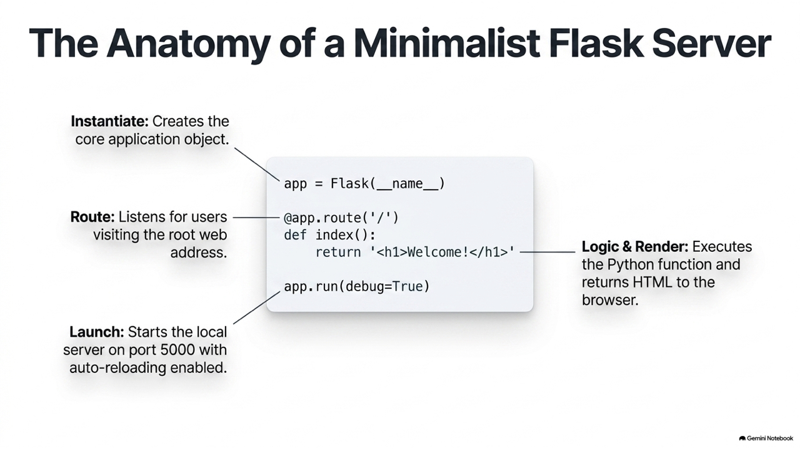

Python 有許多 Web 框架，其中以 **Django**（重量級、內建功能極多）與 **Flask**（輕量級、自由度極高）最著名。對於初學者，Flask 是學習 Web 原理的最佳起點。

### 12.2.1 建立最簡 Flask 伺服器

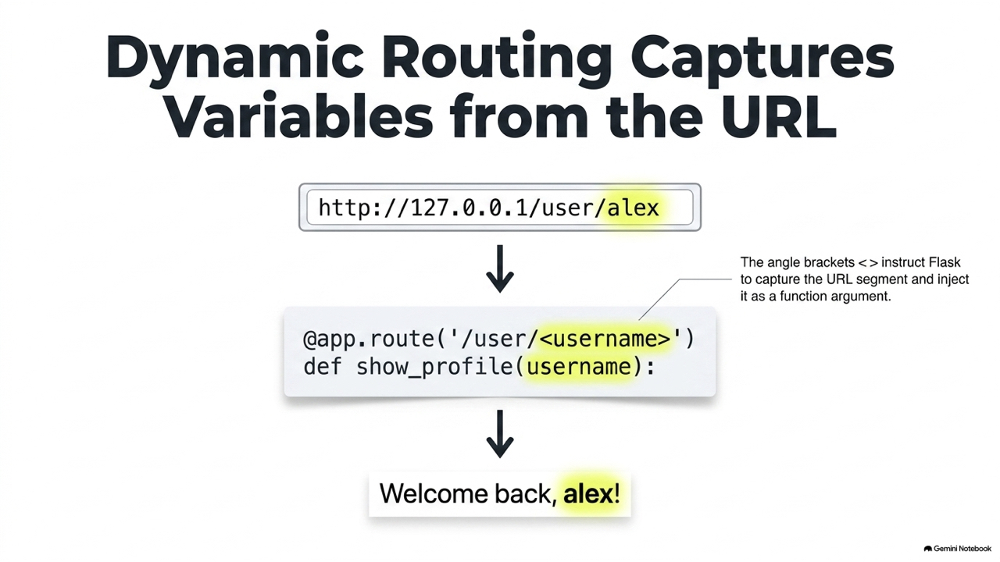

請在終端機安裝 Flask：
```bash
pip install Flask
```

編寫你的第一個 Web 程式：
```python
from flask import Flask

# 1. 建立 Flask 應用程式實例
app = Flask(__name__)

# 2. 定義路由 (Route)
# 當使用者訪問首頁 '/' 時，執行 index() 函式並將返回值顯示在瀏覽器上
@app.route('/')
def index():
    return "<h1>歡迎來到 Python Flask 網頁伺服器！</h1><p>這是你的第一個動態網頁。</p>"

# 3. 定義另一個路由路徑 '/about'
@app.route('/about')
def about():
    return "<h3>關於我們</h3><p>本系統使用 Python 3.12 與 Flask 微型框架建構。</p>"

# 4. 啟動伺服器
if __name__ == '__main__':
    # debug=True 會啟動「自動重載機制」，當你修改 Python 程式碼存檔後，伺服器會自動重啟
    # 預設會在 http://127.0.0.1:5000/ 運行
    app.run(debug=True)
```

#### 程式執行成果畫面

在終端機執行 `python app.py` 後，開啟瀏覽器造訪 `http://127.0.0.1:5000/`，即可看到伺服器動態渲染的首頁內容：

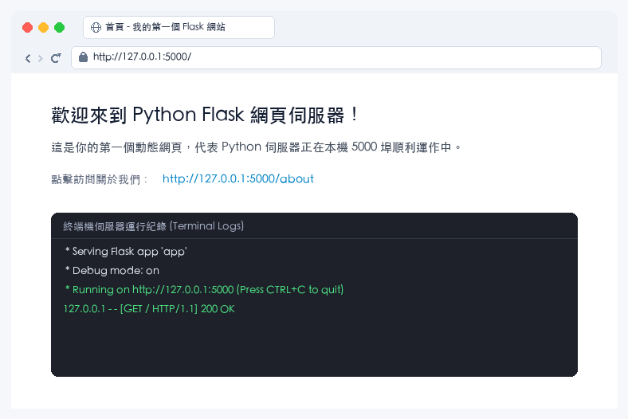

---

### 12.2.2 動態路由參數擷取


有時候，網址中會包含變數（例如使用者的名稱或 ID）。Flask 允許我們直接在裝飾器中宣告變數欄位：

```python
from flask import Flask

app = Flask(__name__)

# 動態路由：<username> 會被自動作為參數傳入函式中
@app.route('/user/<username>')
def show_user_profile(username):
    # 使用 f-string 動態組合 HTML 內容
    return f"<h2>會員專區</h2><p>歡迎回來，<strong>{username}</strong>！</p>"

# 限定參數型態為整數 <int:post_id>
@app.route('/post/<int:post_id>')
def show_post(post_id):
    return f"<h2>文章編號：{post_id}</h2><p>這是第 {post_id} 篇文章的內容...</p>"

if __name__ == '__main__':
    app.run(debug=True)
```

#### 動態路由執行成果畫面

當在瀏覽器網址列輸入 `http://127.0.0.1:5000/user/alex` 時，Flask 會自動捕獲變數 `alex` 並呈現專屬個人頁面：

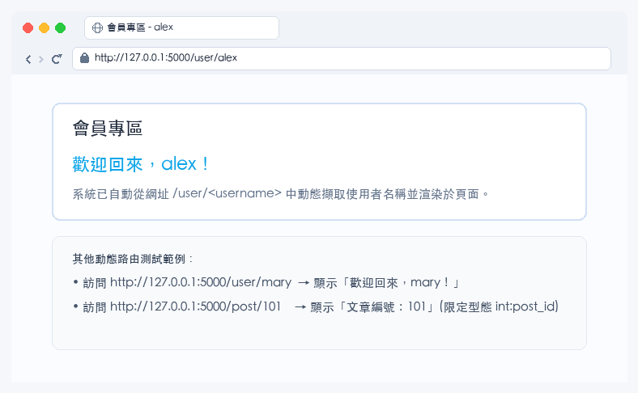

---

### **12.2.3 隨堂測驗 (CCQ 3)**

**問題**

在 Flask 中，指令 `@app.route('/user/<username>')` 的作用為何？

A) 將使用者自動導向到特定的資料庫查詢頁面。
B) 定義一個路由路徑，並將網址中 `/user/` 後方的文字動態擷取出來，作為引數傳遞給下方對應的視圖處理函式。
C) 用來下載特定使用者的所有個人相片檔案。
D) 限定只有名為 `username` 的使用者才能訪問該網址。

<details>
<summary>點擊查看【隨堂測驗】答案與解析</summary>

**正確答案：B) 定義一個路由路徑，並將網址中 `/user/` 後方的文字動態擷取出來，作為引數傳遞給下方對應的視圖處理函式。**

* **解析**：
  * 這是 Flask 著名的動態路由系統。角括號 `<variable_name>` 會捕獲該網址段落的值，並以同名參數傳入裝飾器下方的函式中，非常適合處理個人檔案頁面（如：`/user/john` 或 `/user/marry`），故選 B。

</details>

---

## 12.3 動態模板渲染與表單處理 (Templates & Forms)

直接在 Python 程式碼中寫死 HTML 字串（如 `"<h1>hello</h1>"`）非常不便，且違反了「邏輯與外觀分離」的軟體設計原則。我們會使用 **Jinja2 模板引擎** 來渲染動態網頁。

### 12.3.1 Jinja2 模板基礎語法

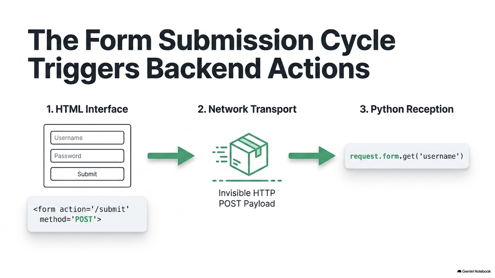

Jinja2 允許我們在 HTML 檔案中加入 Python 變數與控制結構：
* `{{ variable }}`：印出變數的數值。
* ``：條件判斷。
* ``：迴圈輸出。

### 12.3.2 GET/POST 請求與表單處理

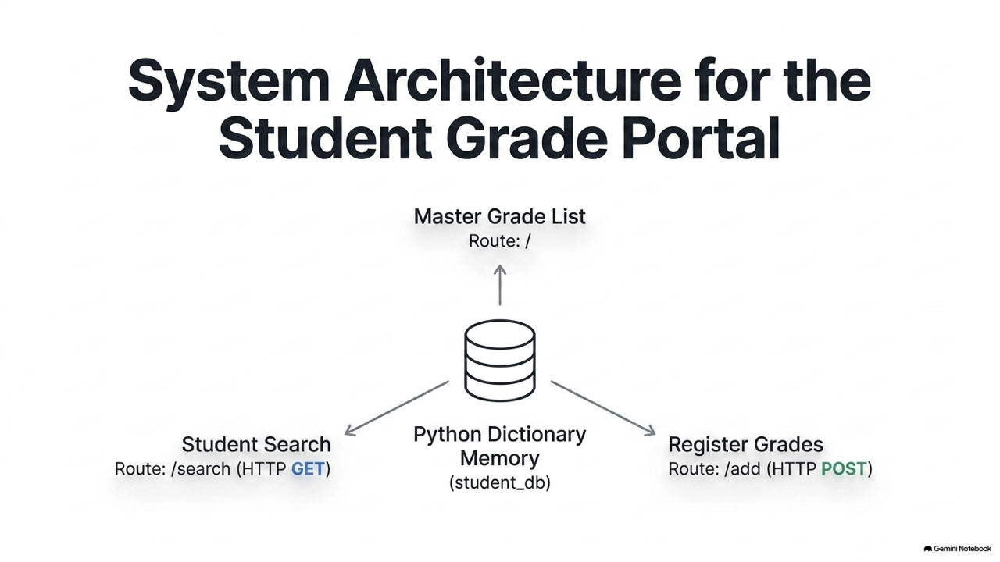

我們可以使用 `request` 物件來讀取用戶傳送進來的表單數據：
* **GET 參數**：使用 `request.args.get('key')` 讀取網址參數。
* **POST 參數**：使用 `request.form.get('key')` 讀取表單提交參數。

為了讓本章的範例具備「無須建立複雜資料夾結構即可執行」的特性，我們在程式碼中直接使用 Flask 內建的 `render_template_string`（字串模板渲染）。這與載入外部 `.html` 檔案的 `render_template` 效果完全相同。

```python
from flask import Flask, request, render_template_string

app = Flask(__name__)

# 定義 HTML 模板字串 (含有 Jinja2 語法)
HTML_TEMPLATE = """
<!DOCTYPE html>
<html>
<head>
    <title>Flask 表單處理</title>
</head>
<body>
    <h2>聯絡助教表單</h2>
    <!-- 表單使用 POST 方法提交至 /submit 路由 -->
    <form action="/submit" method="POST">
        <label for="student_name">學生姓名：</label>
        <input type="text" id="student_name" name="username" required><br><br>
        
        <label for="msg">問題內容：</label><br>
        <textarea id="msg" name="message" rows="4" cols="30" required></textarea><br><br>
        
        <input type="submit" value="送出問題">
    </form>
</body>
</html>
"""

@app.route('/')
def home():
    # 渲染 HTML 表單
    return render_template_string(HTML_TEMPLATE)

@app.route('/submit', methods=['POST'])
def handle_submit():
    # 使用 request.form.get 讀取 POST 請求中的表單資料
    name = request.form.get('username')
    message = request.form.get('message')
    
    # 渲染結果網頁
    result_html = f"""
    <h2>提交成功！</h2>
    <p>感謝學生 <strong>{name}</strong> 的留言。</p>
    <p>您留言的內容為：{message}</p>
    <p><a href="/">返回表單頁面</a></p>
    """
    return render_template_string(result_html)

if __name__ == '__main__':
    app.run(debug=True)
```

#### 表單提交執行流程與成果畫面

用戶在首頁表單填寫姓名與問題後點擊送出，後端 Python 經由 POST 請求接收資料並即時渲染感謝頁面：

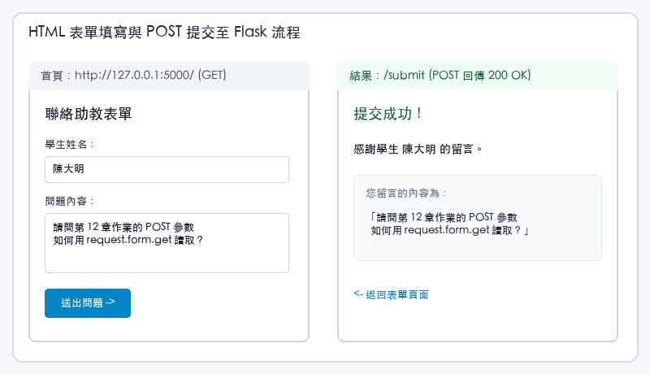

---

### **12.3.3 隨堂測驗 (CCQ 4)**

**問題**

在 HTML 表單的屬性中，`<form action="/query" method="GET">` 這段宣告的意義為何？

A) 當使用者提交表單時，瀏覽器會使用 POST 協定將資料隱密地送到 `/query`。
B) 表單欄位中的資料會被編碼並附加在網址列（URL）後端，並跳轉至伺服器的 `/query` 路徑進行 GET 請求。
C) 這會強行關閉後端的 Python 伺服器以進行資料庫防護。
D) 這是一個錯誤宣告，HTML 表單不支援 GET 方法。

<details>
<summary>點擊查看【隨堂測驗】答案與解析</summary>

**正確答案：B) 表單欄位中的資料會被編碼並附加在網址列（URL）後端，並跳轉至伺服器的 `/query` 路徑進行 GET 請求。**

* **解析**：
  * `action` 屬性定義了表單資料的目標接收路徑；`method="GET"` 代表將資料序列化後以 `?key=value` 的 Query String 形式掛載於 URL 尾端。
  * 這非常適合用在搜尋或篩選功能（因為不涉及隱私且可以將網址分享給他人），故選 B。

</details>

---

## 12.4 綜合實作專案：成績查詢與登記系統

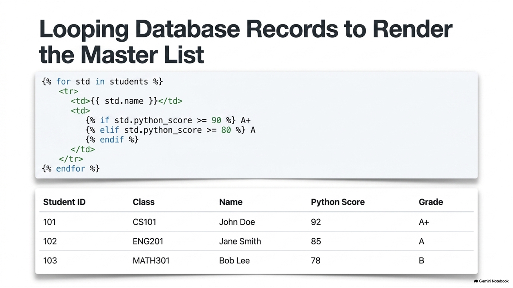

現在我們將學到的 Web 開發技術融入實務，建立一個完整的「學期成績登記與查詢系統」。

該系統包含以下三個功能網頁：
1. **學生成績列表（首頁）**：列出目前系統中所有學生的成績。
2. **學籍搜尋**：輸入學生姓名，即時過濾並顯示該學生的成績與 GPA。
3. **登記新學生成績**：透過 POST 表單將新學生的學籍資料新增至伺服器記憶體中。

```python
from flask import Flask, request, render_template_string, redirect, url_for

app = Flask(__name__)

# 模擬資料庫：儲存學生學籍與成績資料 (記憶體中)
student_db = [
    {"id": "101", "name": "張小明", "python_score": 92, "class": "電機一"},
    {"id": "102", "name": "李美華", "python_score": 85, "class": "資工二"},
    {"id": "103", "name": "王大同", "python_score": 78, "class": "自控三"}
]

# 定義首頁模板 (包含學生成績表格與新增學生表單)
INDEX_TEMPLATE = """
<!DOCTYPE html>
<html>
<head>
    <title>資電學院成績登記系統</title>
    <style>
        body { font-family: Arial, sans-serif; margin: 40px; background-color: #f4f6f9; }
        table { border-collapse: collapse; width: 60%; background-color: white; }
        th, td { padding: 12px; text-align: left; border-bottom: 1px solid #ddd; }
        th { background-color: #0056b3; color: white; }
        .card { background: white; padding: 20px; border-radius: 8px; box-shadow: 0 2px 4px rgba(0,0,0,0.1); margin-bottom: 20px; width: 57%; }
        input[type=text], input[type=number] { padding: 8px; width: 200px; margin-bottom: 10px; }
        input[type=submit] { background-color: #28a745; color: white; border: none; padding: 10px 20px; cursor: pointer; border-radius: 4px; }
        input[type=submit]:hover { background-color: #218838; }
    </style>
</head>
<body>
    <h2>Python 程式設計 - 成績登記查詢系統</h2>
    
    <!-- 搜尋區塊 -->
    <div class="card">
        <h3>快速查詢學生</h3>
        <form action="/search" method="GET">
            <input type="text" name="query_name" placeholder="輸入學生姓名..." required>
            <input type="submit" value="查詢" style="background-color: #007bff;">
        </form>
    </div>

    <!-- 學生列表展示 -->
    <div class="card">
        <h3>目前已登記學生列表</h3>
        <table>
            <tr>
                <th>學號</th>
                <th>班級</th>
                <th>姓名</th>
                <th>Python 成績</th>
                <th>評等</th>
            </tr>
            
            <tr>
                <td>{{ std.id }}</td>
                <td>{{ std.class }}</td>
                <td>{{ std.name }}</td>
                <td>{{ std.python_score }}</td>
                <td>
                     A+
                     A
                     B
                     C
                    
                </td>
            </tr>
            
        </table>
    </div>

    <!-- 新增學生資料表單 -->
    <div class="card">
        <h3>登記新學生成績</h3>
        <form action="/add" method="POST">
            <label>學號：</label><br>
            <input type="text" name="std_id" required><br>
            <label>班級：</label><br>
            <input type="text" name="std_class" required><br>
            <label>姓名：</label><br>
            <input type="text" name="std_name" required><br>
            <label>Python 成績：</label><br>
            <input type="number" name="std_score" min="0" max="100" required><br><br>
            <input type="submit" value="新增登記">
        </form>
    </div>
</body>
</html>
"""

# 1. 系統首頁路由
@app.route('/')
def home():
    # 將學生的 dictionary list 傳給 Jinja2 渲染
    return render_template_string(INDEX_TEMPLATE, students=student_db)

# 2. 新增學生路由 (只接收 POST)
@app.route('/add', methods=['POST'])
def add_student():
    # 讀取表單資料
    sid = request.form.get('std_id')
    sclass = request.form.get('std_class')
    sname = request.form.get('std_name')
    sscore = int(request.form.get('std_score'))

    # 建立新字典並附加到資料庫中
    new_student = {
        "id": sid,
        "class": sclass,
        "name": sname,
        "python_score": sscore
    }
    student_db.append(new_student)
    
    # 登記成功後，重新導向 (Redirect) 回首頁以更新表格列表
    return redirect('/')

# 3. 搜尋學生路由 (接收 GET 查詢參數)
@app.route('/search', methods=['GET'])
def search_student():
    query = request.args.get('query_name', '').strip()
    
    # 過濾出符合姓名的學生
    results = [std for std in student_db if query in std['name']]
    
    result_template = """
    <h2>查詢結果 (關鍵字：{{ query }})</h2>
    
        <ul>
        
            <li>[{{ std.class }}] 學號：{{ std.id }} - <strong>{{ std.name }}</strong>：Python 成績 = {{ std.python_score }} 分</li>
        
        </ul>
    
        <p style="color: red;">找不到符合該姓名的學生資料。</p>
    
    <p><a href="/">返回首頁列表</a></p>
    """
    return render_template_string(result_template, matched_list=results, query=query)

if __name__ == '__main__':
    app.run(debug=True)
```

#### PRG 模式與搜尋過濾架構

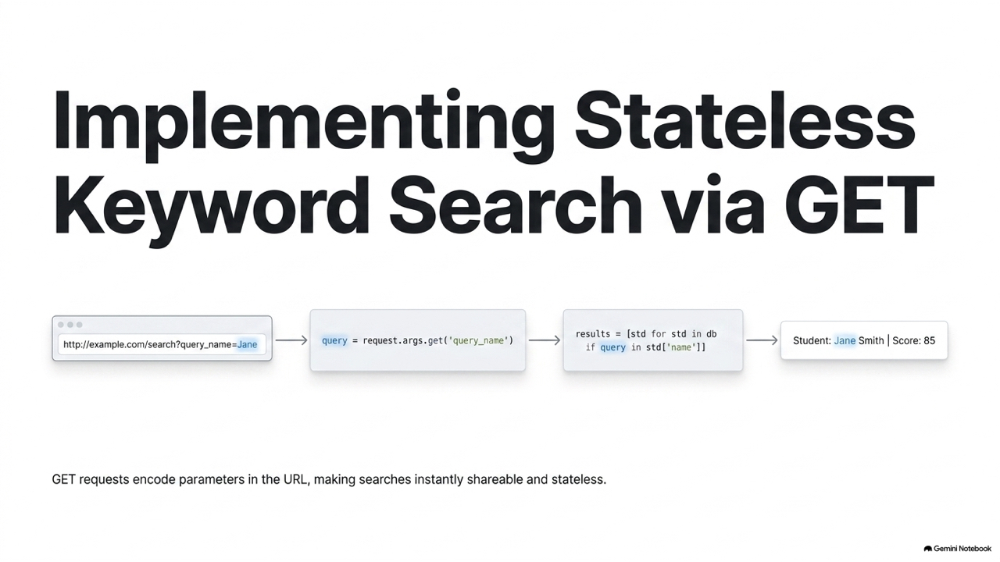

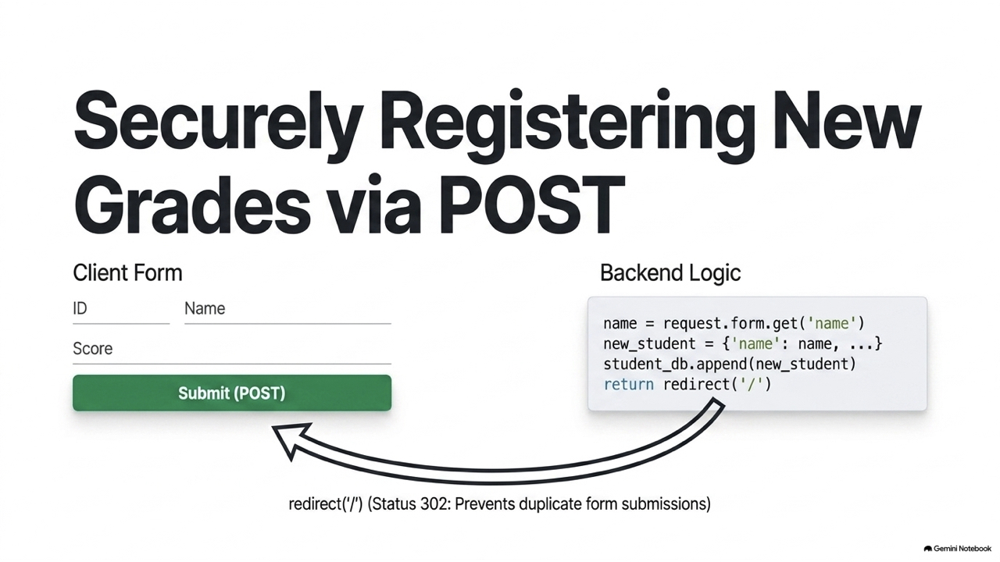

#### 完整成績系統實際執行成果畫面

系統首頁提供直觀的學生資料表、GPA 自動評等與即時新增表單；搜尋頁面則展示 GET 參數過濾結果：

| 系統首頁與成績管理列表 | 學生姓名搜尋結果頁面 |
| :---: | :---: |
| 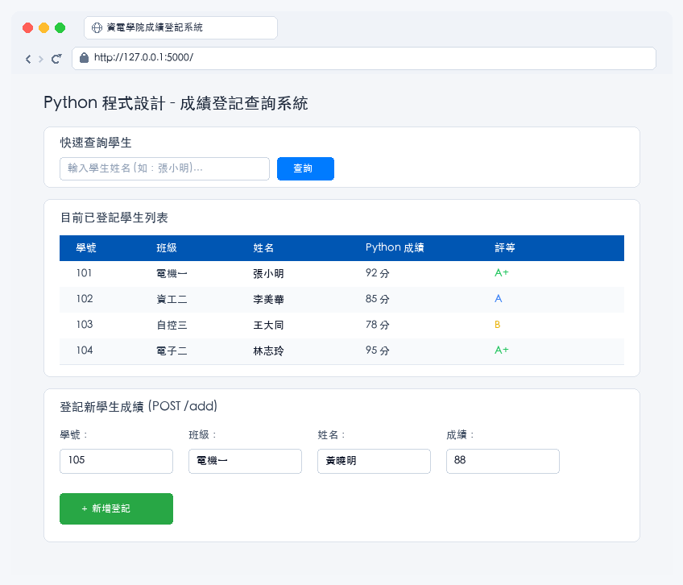 | 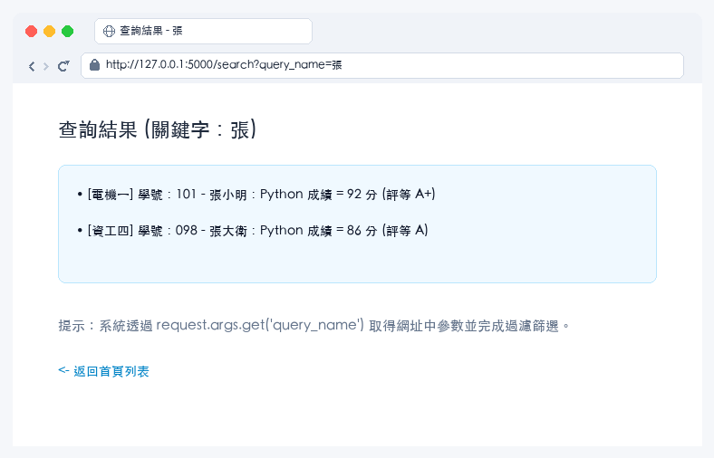 |

---

## 12.5 本章課後進階挑戰專題

為了加深你的 Web 後端開發實力，可以嘗試在現有的成績系統中擴充以下機制：

### 挑戰 1：提供 RESTful JSON API 端點
在現代 Web 開發中，後端常常只負責回傳資料，讓前端網頁或手機 App 進行串接。請實作一個 `/api/students` 的 API 路由，能將目前記憶體中的所有學生成績以 JSON 格式回傳：

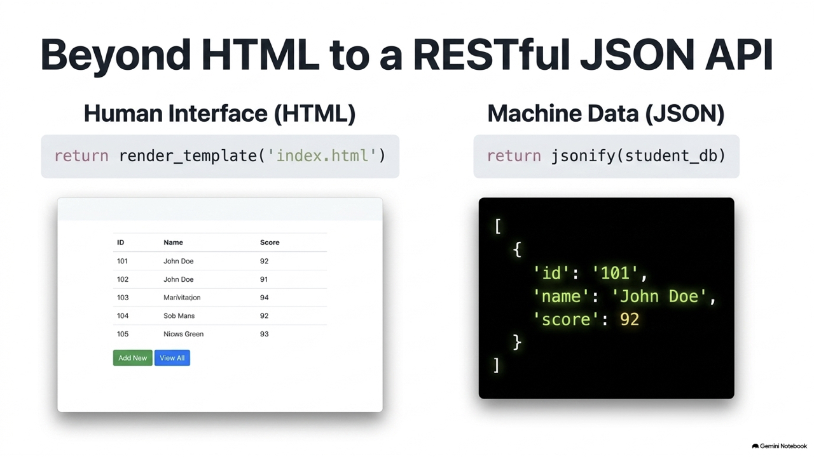

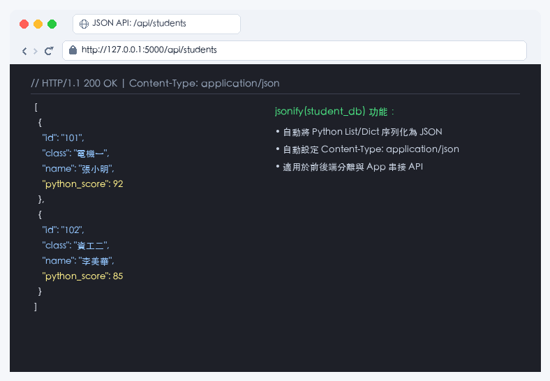

```python
from flask import jsonify

@app.route('/api/students')
def get_students_json():
    # jsonify 能夠自動將 Python 的 list/dict 轉換為 JSON 規格字串，並設定正確的 Content-Type 表頭
    return jsonify(student_db)
```

### 挑戰 2：防呆防空值驗證
修改 `/add` 的邏輯，在寫入資料庫前加入檢查機制。如果學號已經重複，或者成績不合常規，返回 HTTP 400 錯誤訊息，以確保資料的正確性。

---

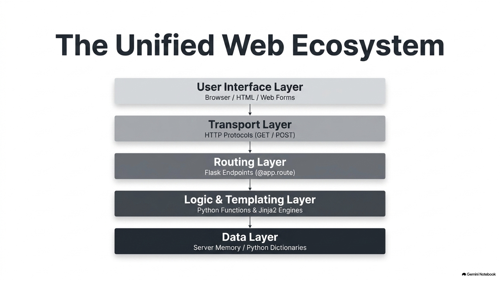
