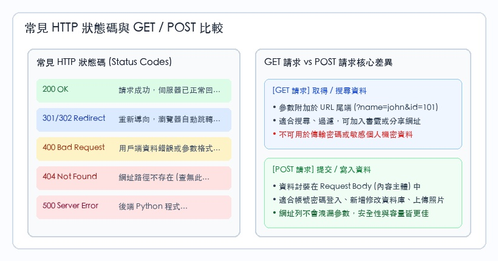
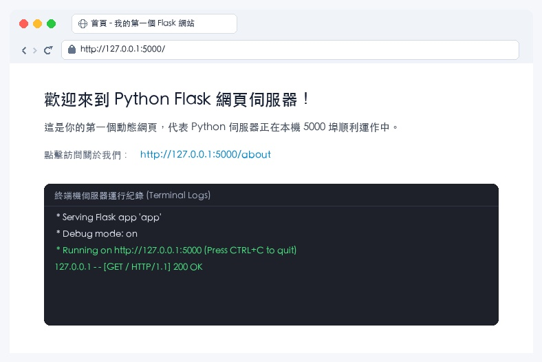
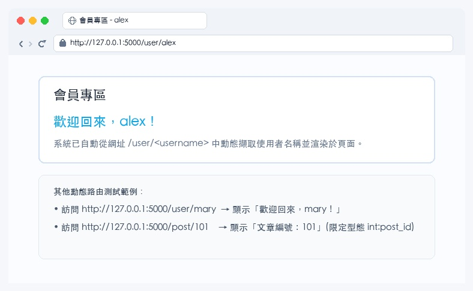
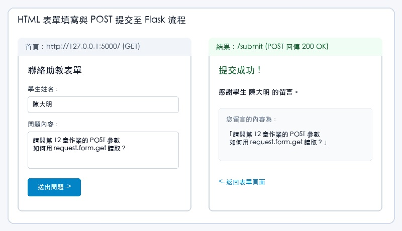
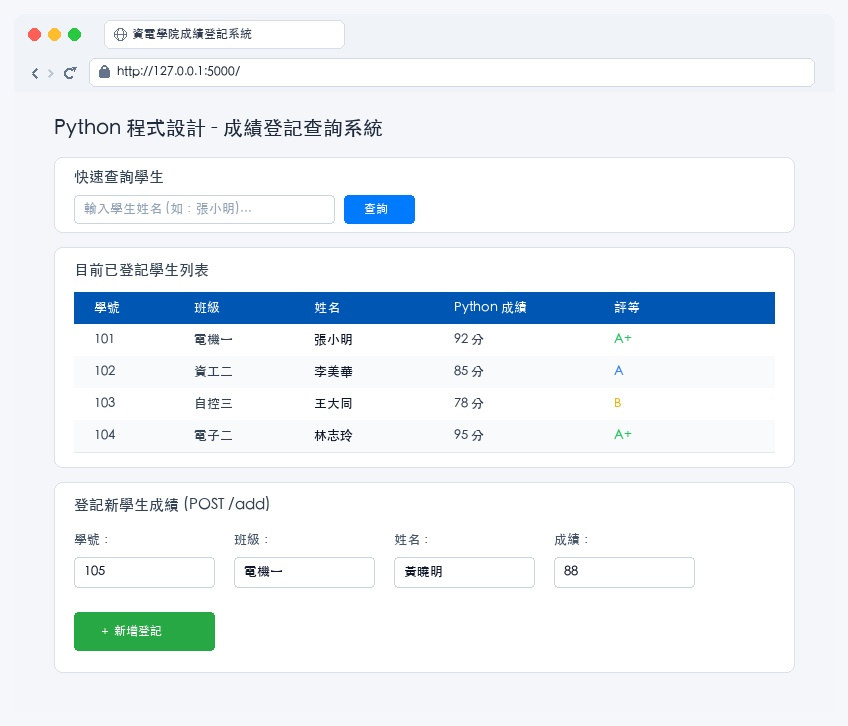
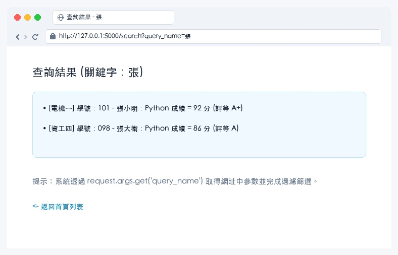
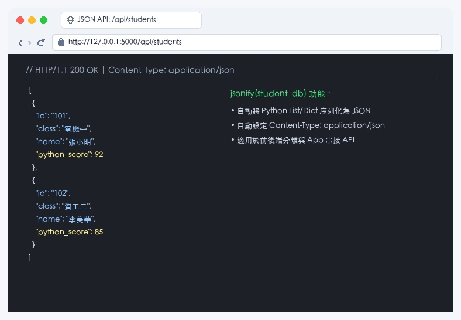

# Python Web 開發基礎 (Flask)

### 第十二章：微型網頁框架、動態路由與全端專案

講師：Python 程式設計教學團隊

---

<!-- _class: full-image-slide -->

<div class="centered-image">
  
</div>

---

# 12.1 網頁開發基礎知識

* **Client-Server 請求與回應機制**：
  - **Client (用戶端/瀏覽器)**：發起請求 (Request)，負責渲染 HTML 視覺介面。
  - **Server (伺服器端)**：監聽網路連線，執行 Python 業務邏輯並返回資料。
* **HTTP (HyperText Transfer Protocol)**：
  - 全球網際網路通用之應用層通訊標準協定。
* **狀態碼 (Status Codes)**：
  - 伺服器回傳三位數字，簡潔標明處理結果。

---

<!-- _class: full-image-slide -->

<div class="centered-image">
  
</div>

---

# HTTP 請求方法：GET vs POST

* **GET 請求**：
  - 參數掛載於網址列 (Query String, `?key=value`)。
  - 主要用於**讀取與查詢**資料，具備可快取、可加為書籤之特性。
* **POST 請求**：
  - 參數封裝於 HTTP 請求主體 (Request Body) 中。
  - 主要用於**新增、更新、提交敏感資料**（如帳號密碼），不洩露於網址列。

---

<!-- _class: full-image-slide -->

<div class="centered-image">
  
</div>

---

<!-- _class: full-image-slide -->

<div class="centered-image">
  
</div>

---

## Concept Check Question (CCQ 1)

<div class="ccq-columns">
  <div class="ccq-text">

**當你在瀏覽器中登入網頁，輸入個人密碼並點擊提交時，前端應該採用哪一種 HTTP 方法將資料傳送到後台 Python 伺服器？**

* **A.** GET 請求，方便將密碼直接保存在網址書籤中
* **B.** POST 請求，資料封裝在 Request Body 中傳輸避免外洩
* **C.** HEAD 請求，不回傳網頁本體以加速傳輸
* **D.** DELETE 請求，在登入後將密碼銷毀

  </div>
  <div class="ccq-logo">
    
  </div>
</div>

---

## CCQ 1 - 答案與解析

<div class="ccq-columns">
  <div class="ccq-text">

### **正確答案：B. POST 請求**

* **解析**：
  - GET 請求的參數會完全曝露在網址列中（例如 `login?pwd=123`），會被瀏覽器歷史紀錄與代理伺服器日誌保存，極易外洩。
  - 涉及敏感資訊或變更伺服器狀態時，必須使用 **POST 請求**，故選 B。

  </div>
  <div class="ccq-logo">
    
  </div>
</div>

---

## Concept Check Question (CCQ 2)

<div class="ccq-columns">
  <div class="ccq-text">

**當你的 Python Flask 伺服器在執行時，因為讀取了不存在的 List Index 導致拋出 Exception 當機，用戶端瀏覽器最可能收到哪一個 HTTP 狀態碼？**

* **A.** 200 OK
* **B.** 302 Redirect
* **C.** 404 Not Found
* **D.** 500 Internal Server Error

  </div>
  <div class="ccq-logo">
    
  </div>
</div>

---

## CCQ 2 - 答案與解析

<div class="ccq-columns">
  <div class="ccq-text">

### **正確答案：D. 500 Internal Server Error**

* **解析**：
  - **500 狀態碼**代表「伺服器內部錯誤」，通常代表後端 Python 程式碼拋出未捕獲的例外或異常崩潰。
  - 200 代表正常回應；302 代表轉址跳轉；404 代表請求之路徑不存在，故選 D。

  </div>
  <div class="ccq-logo">
    
  </div>
</div>

---

# 12.2 Flask 微型 Web 框架入門

* **輕量級與高自由度 (Microframework)**：
  - 核心精簡，無多餘套件束縛，專注於路由與請求處理。
* **WSGI 相容架構**：
  - 遵循 Python 標準 Web 伺服器網關介面規範。
* **路由裝飾器 (`@app.route`)**：
  - 將 URL 路徑精準綁定至 Python 處理函數 (View Function)。

---

<!-- _class: full-image-slide -->

<div class="centered-image">
  
</div>

---

<!-- _class: full-image-slide -->

<div class="centered-image">
  
</div>

---

## 最簡 Flask 伺服器程式碼

```python
from flask import Flask

app = Flask(__name__)

# 首頁路由
@app.route('/')
def index():
    return "<h1>歡迎來到 Python Flask 網頁伺服器！</h1>"

# 關於我們路由
@app.route('/about')
def about():
    return "<h3>關於我們：本系統使用 Flask 微型框架建構。</h3>"

if __name__ == '__main__':
    # 啟動開發伺服器 (預設運行於 http://127.0.0.1:5000/)
    app.run(debug=True)
```

---

<!-- _class: full-image-slide -->

<div class="centered-image">
  
</div>

---

<!-- _class: full-image-slide -->

<div class="centered-image">
  
</div>

---

## 動態路由參數擷取程式碼

```python
from flask import Flask

app = Flask(__name__)

# 字串參數動態路由: /user/alex
@app.route('/user/<username>')
def show_user(username):
    return f"<h2>會員專區</h2><p>歡迎回來，<strong>{username}</strong>！</p>"

# 整數型態轉換器: /post/101
@app.route('/post/<int:post_id>')
def show_post(post_id):
    return f"<h2>文章編號：{post_id}</h2><p>文章型態為整數...</p>"

if __name__ == '__main__':
    app.run(debug=True)
```

---

<!-- _class: full-image-slide -->

<div class="centered-image">
  
</div>

---

## Concept Check Question (CCQ 3)

<div class="ccq-columns">
  <div class="ccq-text">

**在 Flask 中，裝飾器指令 `@app.route('/user/<username>')` 的主要作用為何？**

* **A.** 限定只有使用者名稱為 "username" 的帳號才能連線
* **B.** 定義路由路徑，並將 `/user/` 後方的文字動態擷取，作為引數傳給下方視圖函數
* **C.** 強制重導向到系統登入畫面
* **D.** 自動下載該用戶的所有照片到伺服器端

  </div>
  <div class="ccq-logo">
    
  </div>
</div>

---

## CCQ 3 - 答案與解析

<div class="ccq-columns">
  <div class="ccq-text">

### **正確答案：B. 定義路由路徑並動態擷取引數**

* **解析**：
  - Flask 動態路由使用角括號 `<variable_name>` 宣告變數。
  - 當用戶訪問 `/user/alex` 或 `/user/bob` 時，Flask 會捕獲該段文字，並將其傳入下方同名參數 `username`，非常適合用於個人檔案或特定編號頁面，故選 B。

  </div>
  <div class="ccq-logo">
    
  </div>
</div>

---

# 12.3 動態模板渲染與表單處理

* **邏輯與介面分離 (Separation of Concerns)**：
  - 避免在 Python 字串中硬編碼 HTML。
* **Jinja2 模板語法**：
  - 變數插值：`{{ variable }}`
  - 控制流程：`...`、`...`
* **Request 物件資料擷取**：
  - GET Query 參數：`request.args.get('name')`
  - POST Form 參數：`request.form.get('name')`

---

<!-- _class: full-image-slide -->

<div class="centered-image">
  
</div>

---

<!-- _class: full-image-slide -->

<div class="centered-image">
  
</div>

---

## HTML 表單 POST 提交與後端處理

```python
from flask import Flask, request, render_template_string

app = Flask(__name__)

FORM_HTML = """
<form action="/submit" method="POST">
    姓名：<input type="text" name="username" required><br>
    問題：<textarea name="message" required></textarea><br>
    <input type="submit" value="送出問題">
</form>
"""

@app.route('/')
def home():
    return render_template_string(FORM_HTML)

@app.route('/submit', methods=['POST'])
def handle_submit():
    name = request.form.get('username')
    msg = request.form.get('message')
    return f"<h2>提交成功！感謝 {name}</h2><p>留言：{msg}</p>"
```

---

<!-- _class: full-image-slide -->

<div class="centered-image">
  
</div>

---

## Concept Check Question (CCQ 4)

<div class="ccq-columns">
  <div class="ccq-text">

**在 HTML 表單中，`<form action="/query" method="GET">` 的運作行為為何？**

* **A.** 表單提交時，以 POST 隱密將資料送至伺服器
* **B.** 表單欄位會編碼成 `?key=value` 附加在網址列尾端，向 `/query` 發出 GET 請求
* **C.** 會強行關閉後端 Python 伺服器
* **D.** HTML 規格不支援 GET 表單提交

  </div>
  <div class="ccq-logo">
    
  </div>
</div>

---

## CCQ 4 - 答案與解析

<div class="ccq-columns">
  <div class="ccq-text">

### **正確答案：B. 表單欄位會附加在網址列尾端並發送 GET 請求**

* **解析**：
  - `action` 定義表單資料的目標路由路徑。
  - `method="GET"` 代表將輸入欄位以 Query String 方式附加於網址（如 `/query?query_name=張小明`）。
  - 非常適合用於搜尋與過濾，且查詢結果 URL 可直接分享與保存，故選 B。

  </div>
  <div class="ccq-logo">
    
  </div>
</div>

---

# 12.4 綜合實作專案：成績登記與查詢系統

* **全端三核心功能**：
  - **1. 成績清單總覽**：使用 Jinja2 `` 動態渲染學生資料與自動評等。
  - **2. 關鍵字搜尋**：利用 GET 參數即時篩選學生姓名。
  - **3. 新增學生學籍**：透過 POST 表單寫入資料庫，並搭配 PRG 模式重導向回首頁。

---

<!-- _class: full-image-slide -->

<div class="centered-image">
  
</div>

---

<!-- _class: full-image-slide -->

<div class="centered-image">
  
</div>

---

<!-- _class: full-image-slide -->

<div class="centered-image">
  
</div>

---

<!-- _class: full-image-slide -->

<div class="centered-image">
  
</div>

---

<!-- _class: full-image-slide -->

<div class="centered-image">
  
</div>

---

# 12.5 課後進階挑戰專題 (RESTful API)

* **RESTful JSON API 設計理念**：
  - 後端不再直接回傳 HTML 網頁，而是回傳輕量、結構化的 **JSON 資料**。
  - 供前端 React/Vue 網頁或手機 App 跨平台非同步呼叫。
* **Flask `jsonify` 函式**：
  - 將 Python List/Dict 物件序列化為標準 JSON 字串，並自動設置 HTTP 表頭 `Content-Type: application/json`。

---

<!-- _class: full-image-slide -->

<div class="centered-image">
  
</div>

---

## JSON API 路由實作範例

```python
from flask import Flask, jsonify

app = Flask(__name__)

student_db = [
    {"id": "101", "name": "張小明", "python_score": 92, "class": "電機一"},
    {"id": "102", "name": "李美華", "python_score": 85, "class": "資工二"}
]

@app.route('/api/students')
def get_students_api():
    # 自動轉換為合法 JSON 陣列並返回 HTTP 200 OK
    return jsonify(student_db)

if __name__ == '__main__':
    app.run(debug=True)
```

---

<!-- _class: full-image-slide -->

<div class="centered-image">
  
</div>

---

<!-- _class: full-image-slide -->

<div class="centered-image">
  
</div>
